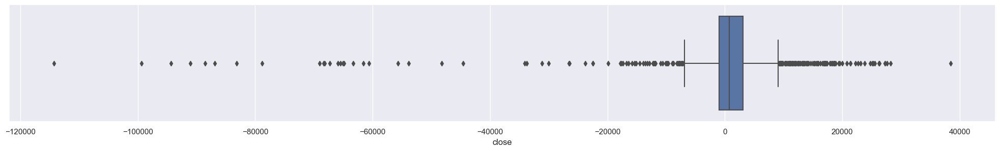
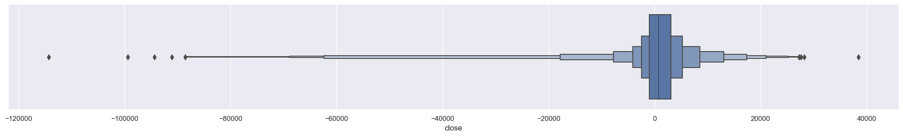
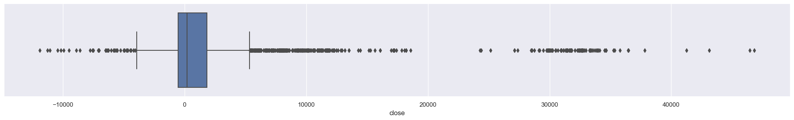
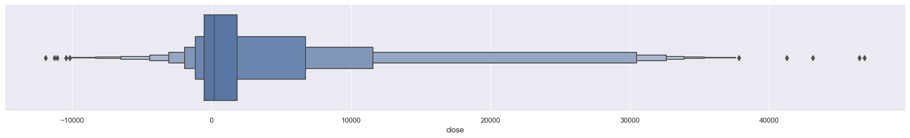

# Точка минимальных выплат по опционам. Машинное обучение. Предсказание цены фьючерса RTS используя Si. Отсечение выбросов по перцентилям.  

## Краткое описание идеи

Исследование основано на идее того, что в современной системе бирж массово используется система контроля рисков SPAN. Причем использование системы SPAN не ограничивается использованием только биржей, эту систему используют и маркетмейкеры и брокеры. Всем кто использует систему SPAN, она помогает контролировать риски. К примеру: положительная вариационная маржа розничного торговца, как правило является риском для маркетмейкера. Именно таких рисков маркетмейкер и стремиться избежать. Другими словами, маркетмейкеру выгодно, чтобы к моменту клиринга цена была около точки минимальных выплат по купленным опционам. В тоже время маркетмейкеру выгодно, чтобы за время торговой сессии цена достаточно отклонялась от точки минимальных выплат, для реализации дельта нейтральных стратегий ("доить" дельту).

## Загрузка данных по RTS.  

Определение цели прогнозирования.


```python
TARGET = 'close'
# TARGET = 'low'
# TARGET = 'high'
```

Загрузка файла с БД по опционам. Формат файла SQLite. При запуске из Colab.


```python
# !curl -o rts_nn.db -L 'https://drive.google.com/uc?export=download&confirm=yes&id=1ML9AKyQexvic_ut2aMstI_7DQ2b6vHrv'  # Закачка файла БД, для Colab
```

Загрузка данных из БД в DF.


```python
import pandas as pd
from typing import Any
import numpy as np
import sqlite3
import matplotlib.pyplot as plt


# connection = sqlite3.connect('rts_nn.db', check_same_thread=True)  # Создание соединения с БД для Colab
connection = sqlite3.connect(r'c:\Users\Alkor\gd\data_quote_db\RTS_nn.db', check_same_thread=True)  # Создание соединения с БД для Local
with connection:
  df_all_rts = pd.read_sql('SELECT * FROM `All_opt`', connection)  # Загрузка данных из БД

print(df_all_rts.to_string(max_rows=6, max_cols=16))  # Проверка того, что загрузилось
```

           TRADEDATE    -22500    -20000    -17500    -15000    -12500    -10000     -7500  ...     15000     17500     20000  22500  zero_strike   close     low    high
    0     2015-01-05  0.728363  0.605605  0.600028  0.456538  0.454987  0.258267  0.345876  ...  0.458944  0.909248  0.768367    1.0        72500  2100.0   -30.0  6480.0
    1     2015-01-06  0.676081  0.560392  0.555003  0.416899  0.415333  0.229272  0.311330  ...  0.484260  0.916784  0.780905    1.0        72500   980.0 -1300.0  2110.0
    2     2015-01-08  0.548794  0.450866  0.446081  0.330494  0.329217  0.181043  0.258321  ...  0.469379  0.870850  0.757173    1.0        72500  7480.0 -1500.0  8880.0
    ...          ...       ...       ...       ...       ...       ...       ...       ...  ...       ...       ...       ...    ...          ...     ...     ...     ...
    2119  2023-07-12  0.580414  0.567905  0.526193  0.515090  0.461374  0.435599  0.319260  ...  0.909628  0.948299  0.993931    1.0       100000  2260.0  1580.0  2720.0
    2120  2023-07-13  0.860716  0.809704  0.799626  0.723745  0.706550  0.562192  0.554230  ...  0.878065  0.950565  0.960354    1.0       102500   300.0  -720.0   770.0
    2121  2023-07-14  0.970310  0.926102  0.914992  0.844986  0.824101  0.673307  0.653712  ...  0.873843  0.939863  0.948464    1.0       102500   410.0  -490.0   460.0
    

## Очистка данных RTS.

Создание DF из колонок с фичами и целевой колонки. Проверка полученного DF на наличие ячеек с NaN.  


```python
features = '-22500 -20000 -17500 -15000 -12500 -10000 -7500 -5000 -2500 0 2500 5000 7500 10000 12500 15000 17500 20000 22500'.split()  # Создание списка признаков
df_rts = df_all_rts[['TRADEDATE'] + features + [TARGET]]
# print(df_rts.isnull().sum())  # Проверка на NaN
# print(f'\nВсего значений NaN: {df_rts.isnull().sum().sum()}')  # Всего NaN
```

Видно, что ячейки с NaN находятся рядом с нормированным к "0" страйком, значит значения NaN можно заменить на ноль.


```python
df_rts = df_rts.fillna(0)  # Замена NaN на "0"
print(f'Всего значений NaN: {df_rts.isnull().sum().sum()}')  # Всего NaN
```

    Всего значений NaN: 0
    

Данные которые анализируются, являются биржевыми, и среди значений присутствуют выбросы. Для качественного обучения, нужно исключить из обучающей выборки данные с выбросами.  
Проверка данных на выбросы графическим способом.


```python
# Box Plot
import seaborn as sns


sns.set(rc={'figure.figsize':(25,3)})
sns.boxplot(x=df_rts[TARGET])
```


    <matplotlib.axes._subplots.AxesSubplot at 0x2925c8c8a90>


    

    


```python
sns.set(rc={'figure.figsize':(25,3)})
sns.boxenplot(x=df_rts[TARGET])
```


    <matplotlib.axes._subplots.AxesSubplot at 0x2925a66af10>


    

    


Посмотрим числовые значения перцентилей:


```python
a = df_rts[TARGET]
percentile_min = int(np.percentile(a, 25) - (np.percentile(a, 75) - np.percentile(a, 25)) * 1.5)
print(f'Перцентиле min:\t{percentile_min:,}')

percentile_25 = int(np.percentile(a, 25))
print(f'Перцентиле 25:\t{percentile_25:,}')

percentile_median = int(np.median(a))
print(f'Медиана:\t{percentile_median:,}')

percentile_75 = int(np.percentile(a, 75))
print(f'Перцентиле 75:\t{percentile_75:,}')

percentile_max = int(np.percentile(a, 75) + (np.percentile(a, 75) - np.percentile(a, 25)) * 1.5)
print(f'Перцентиле max:\t{percentile_max:,}')
```

    Перцентиле min:	-6,998
    Перцентиле 25:	-957
    Медиана:	760
    Перцентиле 75:	3,070
    Перцентиле max:	9,111
    

Значения ниже ```'Перцентиле min'``` и выше ```'Перцентиле max'``` будем считать экстремальными. В такие моменты на рынке происходят неординарные события и в это время лучше не торговать. Т.к. тоговать при экстримальных значениях не буду, то и прогнозы для таких значений строить не имеет смысла. Удалю из выборки все экстримальные значения.  
Создание массивов индексов с экстремальными значениями.

Удаляем из DF строки с выбросами


```python
old_shape = df_rts.shape
print("Old Shape: ", old_shape)

df_rts = df_rts[(df_rts[TARGET] > percentile_min) & (df_rts[TARGET] < percentile_max)]  # Осекаем все строки где TARGET ниже Перцентиле min и выше Перцентиле max

new_shape = df_rts.shape
print("New Shape: ", new_shape)
print(f'Всего удалено строк: {old_shape[0]-new_shape[0]} это {100-(new_shape[0]*100/old_shape[0]):.2f}%')

```

    Old Shape:  (2122, 21)
    New Shape:  (1929, 21)
    Всего удалено строк: 193 это 9.10%
    


```python
df_rts = df_rts.set_index('TRADEDATE').sort_index(ascending=True)
df_rts
```


<div>
<style scoped>
    .dataframe tbody tr th:only-of-type {
        vertical-align: middle;
    }

    .dataframe tbody tr th {
        vertical-align: top;
    }

    .dataframe thead th {
        text-align: right;
    }
</style>
<table border="1" class="dataframe">
  <thead>
    <tr style="text-align: right;">
      <th></th>
      <th>-22500</th>
      <th>-20000</th>
      <th>-17500</th>
      <th>-15000</th>
      <th>-12500</th>
      <th>-10000</th>
      <th>-7500</th>
      <th>-5000</th>
      <th>-2500</th>
      <th>0</th>
      <th>2500</th>
      <th>5000</th>
      <th>7500</th>
      <th>10000</th>
      <th>12500</th>
      <th>15000</th>
      <th>17500</th>
      <th>20000</th>
      <th>22500</th>
      <th>close</th>
    </tr>
    <tr>
      <th>TRADEDATE</th>
      <th></th>
      <th></th>
      <th></th>
      <th></th>
      <th></th>
      <th></th>
      <th></th>
      <th></th>
      <th></th>
      <th></th>
      <th></th>
      <th></th>
      <th></th>
      <th></th>
      <th></th>
      <th></th>
      <th></th>
      <th></th>
      <th></th>
      <th></th>
    </tr>
  </thead>
  <tbody>
    <tr>
      <th>2015-01-05</th>
      <td>0.728363</td>
      <td>0.605605</td>
      <td>0.600028</td>
      <td>0.456538</td>
      <td>0.454987</td>
      <td>0.258267</td>
      <td>0.345876</td>
      <td>0.183768</td>
      <td>0.262591</td>
      <td>0.0</td>
      <td>0.284517</td>
      <td>0.170603</td>
      <td>0.359587</td>
      <td>0.260492</td>
      <td>0.504470</td>
      <td>0.458944</td>
      <td>0.909248</td>
      <td>0.768367</td>
      <td>1.0</td>
      <td>2100.0</td>
    </tr>
    <tr>
      <th>2015-01-06</th>
      <td>0.676081</td>
      <td>0.560392</td>
      <td>0.555003</td>
      <td>0.416899</td>
      <td>0.415333</td>
      <td>0.229272</td>
      <td>0.311330</td>
      <td>0.161136</td>
      <td>0.233857</td>
      <td>0.0</td>
      <td>0.289971</td>
      <td>0.189553</td>
      <td>0.379894</td>
      <td>0.285059</td>
      <td>0.530621</td>
      <td>0.484260</td>
      <td>0.916784</td>
      <td>0.780905</td>
      <td>1.0</td>
      <td>980.0</td>
    </tr>
    <tr>
      <th>2015-01-08</th>
      <td>0.548794</td>
      <td>0.450866</td>
      <td>0.446081</td>
      <td>0.330494</td>
      <td>0.329217</td>
      <td>0.181043</td>
      <td>0.258321</td>
      <td>0.138457</td>
      <td>0.202241</td>
      <td>0.0</td>
      <td>0.265168</td>
      <td>0.160529</td>
      <td>0.330973</td>
      <td>0.258061</td>
      <td>0.506760</td>
      <td>0.469379</td>
      <td>0.870850</td>
      <td>0.757173</td>
      <td>1.0</td>
      <td>7480.0</td>
    </tr>
    <tr>
      <th>2015-01-09</th>
      <td>0.559924</td>
      <td>0.466296</td>
      <td>0.461580</td>
      <td>0.354638</td>
      <td>0.353160</td>
      <td>0.208631</td>
      <td>0.279128</td>
      <td>0.164433</td>
      <td>0.219659</td>
      <td>0.0</td>
      <td>0.260765</td>
      <td>0.168380</td>
      <td>0.359579</td>
      <td>0.273218</td>
      <td>0.526385</td>
      <td>0.489670</td>
      <td>0.873389</td>
      <td>0.773063</td>
      <td>1.0</td>
      <td>5150.0</td>
    </tr>
    <tr>
      <th>2015-01-12</th>
      <td>0.610150</td>
      <td>0.516013</td>
      <td>0.511173</td>
      <td>0.397643</td>
      <td>0.395831</td>
      <td>0.251979</td>
      <td>0.318691</td>
      <td>0.172907</td>
      <td>0.224839</td>
      <td>0.0</td>
      <td>0.265984</td>
      <td>0.160885</td>
      <td>0.373722</td>
      <td>0.293259</td>
      <td>0.550495</td>
      <td>0.513607</td>
      <td>0.884952</td>
      <td>0.783246</td>
      <td>1.0</td>
      <td>1400.0</td>
    </tr>
    <tr>
      <th>...</th>
      <td>...</td>
      <td>...</td>
      <td>...</td>
      <td>...</td>
      <td>...</td>
      <td>...</td>
      <td>...</td>
      <td>...</td>
      <td>...</td>
      <td>...</td>
      <td>...</td>
      <td>...</td>
      <td>...</td>
      <td>...</td>
      <td>...</td>
      <td>...</td>
      <td>...</td>
      <td>...</td>
      <td>...</td>
      <td>...</td>
    </tr>
    <tr>
      <th>2023-07-10</th>
      <td>0.738204</td>
      <td>0.723008</td>
      <td>0.672965</td>
      <td>0.660035</td>
      <td>0.593724</td>
      <td>0.564622</td>
      <td>0.429413</td>
      <td>0.382132</td>
      <td>0.189022</td>
      <td>0.0</td>
      <td>0.089815</td>
      <td>0.415011</td>
      <td>0.538023</td>
      <td>0.668195</td>
      <td>0.793384</td>
      <td>0.895511</td>
      <td>0.941337</td>
      <td>0.993217</td>
      <td>1.0</td>
      <td>1740.0</td>
    </tr>
    <tr>
      <th>2023-07-11</th>
      <td>0.676385</td>
      <td>0.662688</td>
      <td>0.617089</td>
      <td>0.604936</td>
      <td>0.546074</td>
      <td>0.518087</td>
      <td>0.394795</td>
      <td>0.349051</td>
      <td>0.180389</td>
      <td>0.0</td>
      <td>0.122052</td>
      <td>0.419141</td>
      <td>0.566909</td>
      <td>0.688593</td>
      <td>0.804194</td>
      <td>0.903165</td>
      <td>0.945332</td>
      <td>0.993383</td>
      <td>1.0</td>
      <td>2150.0</td>
    </tr>
    <tr>
      <th>2023-07-12</th>
      <td>0.580414</td>
      <td>0.567905</td>
      <td>0.526193</td>
      <td>0.515090</td>
      <td>0.461374</td>
      <td>0.435599</td>
      <td>0.319260</td>
      <td>0.270602</td>
      <td>0.135210</td>
      <td>0.0</td>
      <td>0.207737</td>
      <td>0.461458</td>
      <td>0.605795</td>
      <td>0.712212</td>
      <td>0.819196</td>
      <td>0.909628</td>
      <td>0.948299</td>
      <td>0.993931</td>
      <td>1.0</td>
      <td>2260.0</td>
    </tr>
    <tr>
      <th>2023-07-13</th>
      <td>0.860716</td>
      <td>0.809704</td>
      <td>0.799626</td>
      <td>0.723745</td>
      <td>0.706550</td>
      <td>0.562192</td>
      <td>0.554230</td>
      <td>0.394555</td>
      <td>0.052744</td>
      <td>0.0</td>
      <td>0.134775</td>
      <td>0.390874</td>
      <td>0.507342</td>
      <td>0.672822</td>
      <td>0.815383</td>
      <td>0.878065</td>
      <td>0.950565</td>
      <td>0.960354</td>
      <td>1.0</td>
      <td>300.0</td>
    </tr>
    <tr>
      <th>2023-07-14</th>
      <td>0.970310</td>
      <td>0.926102</td>
      <td>0.914992</td>
      <td>0.844986</td>
      <td>0.824101</td>
      <td>0.673307</td>
      <td>0.653712</td>
      <td>0.499357</td>
      <td>0.160255</td>
      <td>0.0</td>
      <td>0.143395</td>
      <td>0.426763</td>
      <td>0.542343</td>
      <td>0.703333</td>
      <td>0.820731</td>
      <td>0.873843</td>
      <td>0.939863</td>
      <td>0.948464</td>
      <td>1.0</td>
      <td>410.0</td>
    </tr>
  </tbody>
</table>
<p>1929 rows × 20 columns</p>
</div>


## Загрузка данных по Si.  


```python
connection = sqlite3.connect(r'c:\Users\Alkor\gd\data_quote_db\Si_nn.db', check_same_thread=True)  # Создание соединения с БД для Local
with connection:
  df_all_si = pd.read_sql('SELECT * FROM `All_opt`', connection)  # Загрузка данных из БД

print(df_all_si.to_string(max_rows=6, max_cols=16))  # Проверка того, что загрузилось
```

           TRADEDATE     -2250     -2000     -1750     -1500     -1250     -1000      -750  ...      1500      1750      2000      2250  zero_strike    close      low     high
    0     2015-01-05  0.006252  0.006252  0.006252  0.006252  0.000000  0.000000  0.000000  ...  0.717323  0.708655  0.708655  0.708655        34000  27101.0  22424.0  27483.0
    1     2015-01-06  0.005575  0.005575  0.005575  0.005575  0.000000  0.000000  0.000000  ...  0.712768  0.705039  0.705039  0.705039        34000  30464.0  27076.0  31850.0
    2     2015-01-08  0.006267  0.006267  0.006267  0.006267  0.000000  0.000000  0.000000  ...  0.716860  0.708279  0.708279  0.708279        34000  27380.0  27000.0  31708.0
    ...          ...       ...       ...       ...       ...       ...       ...       ...  ...       ...       ...       ...       ...          ...      ...      ...      ...
    2138  2023-07-12  0.167686  0.167686  0.168931  0.168931  0.114803  0.114803  0.129515  ...  0.759456  0.759456  0.780904  0.780904        80500   9253.0   7857.0   9540.0
    2139  2023-07-13  0.193517  0.193517  0.194689  0.194689  0.138798  0.138798  0.153122  ...  0.760069  0.760069  0.781567  0.781567        80500   8325.0   7950.0   9770.0
    2140  2023-07-14  0.193897  0.193897  0.195134  0.195134  0.139221  0.139221  0.153968  ...  0.771301  0.771301  0.792994  0.792994        80500   8880.0   8088.0   9176.0
    

## Очистка данных Si.

Создание DF из колонок с фичами и целевой колонки. Проверка полученного DF на наличие ячеек с NaN.  


```python
features = '-2250 -2000 -1750 -1500 -1250 -1000 -750 -500 -250 0 250 500 750 1000 1250 1500 1750 2000 2250'.split()  # Создание списка признаков
df_si = df_all_si[['TRADEDATE'] + features + [TARGET]]
# print(df_rts.isnull().sum())  # Проверка на NaN
# print(f'\nВсего значений NaN: {df_rts.isnull().sum().sum()}')  # Всего NaN

df_si = df_si.fillna(0)  # Замена NaN на "0"
print(f'Всего значений NaN: {df_si.isnull().sum().sum()}')  # Всего NaN
```

    Всего значений NaN: 0
    

Данные которые анализируются, являются биржевыми, и среди значений присутствуют выбросы. Для качественного обучения, нужно исключить из обучающей выборки данные с выбросами.  
Проверка данных на выбросы графическим способом.


```python
sns.set(rc={'figure.figsize':(25,3)})
sns.boxplot(x=df_si[TARGET])
```


    <matplotlib.axes._subplots.AxesSubplot at 0x2925a366610>


    

    


```python
sns.set(rc={'figure.figsize':(25,3)})
sns.boxenplot(x=df_si[TARGET])
```


    <matplotlib.axes._subplots.AxesSubplot at 0x2925d65afa0>


    

    


```python
a = df_si[TARGET]
percentile_min = int(np.percentile(a, 25) - (np.percentile(a, 75) - np.percentile(a, 25)) * 1.5)
print(f'Перцентиле min:\t{percentile_min:,}')

percentile_25 = int(np.percentile(a, 25))
print(f'Перцентиле 25:\t{percentile_25:,}')

percentile_median = int(np.median(a))
print(f'Медиана:\t{percentile_median:,}')

percentile_75 = int(np.percentile(a, 75))
print(f'Перцентиле 75:\t{percentile_75:,}')

percentile_max = int(np.percentile(a, 75) + (np.percentile(a, 75) - np.percentile(a, 25)) * 1.5)
print(f'Перцентиле max:\t{percentile_max:,}')
```

    Перцентиле min:	-4,031
    Перцентиле 25:	-517
    Медиана:	201
    Перцентиле 75:	1,826
    Перцентиле max:	5,340
    

Удаляем из DF строки с выбросами 


```python
old_shape = df_si.shape
print("Old Shape: ", old_shape)

df_si = df_si[(df_si[TARGET] > percentile_min) & (df_si[TARGET] < percentile_max)]  # Осекаем все строки где TARGET ниже Перцентиле min и выше Перцентиле max

new_shape = df_si.shape
print("New Shape: ", new_shape)
print(f'Всего удалено строк: {old_shape[0]-new_shape[0]} это {100-(new_shape[0]*100/old_shape[0]):.2f}%')
```

    Old Shape:  (2141, 21)
    New Shape:  (1781, 21)
    Всего удалено строк: 360 это 16.81%
    


```python
df_si = df_si.set_index('TRADEDATE').sort_index(ascending=True)  # TRADEDATE в индекс
df_si['close'] = df_si.apply(lambda x: (x['close'] - (percentile_min)) / (percentile_max - (percentile_min)), axis=1)  # Нормализация close
df_si
```


<div>
<style scoped>
    .dataframe tbody tr th:only-of-type {
        vertical-align: middle;
    }

    .dataframe tbody tr th {
        vertical-align: top;
    }

    .dataframe thead th {
        text-align: right;
    }
</style>
<table border="1" class="dataframe">
  <thead>
    <tr style="text-align: right;">
      <th></th>
      <th>-2250</th>
      <th>-2000</th>
      <th>-1750</th>
      <th>-1500</th>
      <th>-1250</th>
      <th>-1000</th>
      <th>-750</th>
      <th>-500</th>
      <th>-250</th>
      <th>0</th>
      <th>250</th>
      <th>500</th>
      <th>750</th>
      <th>1000</th>
      <th>1250</th>
      <th>1500</th>
      <th>1750</th>
      <th>2000</th>
      <th>2250</th>
      <th>close</th>
    </tr>
    <tr>
      <th>TRADEDATE</th>
      <th></th>
      <th></th>
      <th></th>
      <th></th>
      <th></th>
      <th></th>
      <th></th>
      <th></th>
      <th></th>
      <th></th>
      <th></th>
      <th></th>
      <th></th>
      <th></th>
      <th></th>
      <th></th>
      <th></th>
      <th></th>
      <th></th>
      <th></th>
    </tr>
  </thead>
  <tbody>
    <tr>
      <th>2015-03-16</th>
      <td>0.603576</td>
      <td>0.381278</td>
      <td>0.476056</td>
      <td>0.330553</td>
      <td>0.330683</td>
      <td>0.126419</td>
      <td>0.345037</td>
      <td>0.166701</td>
      <td>0.446073</td>
      <td>0.0</td>
      <td>0.348355</td>
      <td>0.110739</td>
      <td>0.505375</td>
      <td>0.069088</td>
      <td>1.000000</td>
      <td>0.065738</td>
      <td>0.180944</td>
      <td>0.111498</td>
      <td>0.457071</td>
      <td>0.524170</td>
    </tr>
    <tr>
      <th>2015-03-17</th>
      <td>0.746421</td>
      <td>0.434423</td>
      <td>0.536031</td>
      <td>0.372069</td>
      <td>0.372200</td>
      <td>0.149309</td>
      <td>0.375065</td>
      <td>0.193380</td>
      <td>0.474789</td>
      <td>0.0</td>
      <td>0.375718</td>
      <td>0.054796</td>
      <td>0.519556</td>
      <td>0.024040</td>
      <td>1.000000</td>
      <td>0.016313</td>
      <td>0.152803</td>
      <td>0.079169</td>
      <td>0.442136</td>
      <td>0.449792</td>
    </tr>
    <tr>
      <th>2015-03-18</th>
      <td>0.888630</td>
      <td>0.718180</td>
      <td>0.711229</td>
      <td>0.383300</td>
      <td>0.466807</td>
      <td>0.268389</td>
      <td>0.268396</td>
      <td>0.058375</td>
      <td>0.242837</td>
      <td>0.0</td>
      <td>0.437042</td>
      <td>0.036333</td>
      <td>0.590882</td>
      <td>0.219544</td>
      <td>0.566882</td>
      <td>0.149613</td>
      <td>1.000000</td>
      <td>0.168578</td>
      <td>0.317898</td>
      <td>0.443282</td>
    </tr>
    <tr>
      <th>2015-03-19</th>
      <td>0.441605</td>
      <td>0.229017</td>
      <td>0.432453</td>
      <td>0.089367</td>
      <td>0.462344</td>
      <td>0.042082</td>
      <td>0.541531</td>
      <td>0.166294</td>
      <td>0.459622</td>
      <td>0.0</td>
      <td>1.000000</td>
      <td>0.081546</td>
      <td>0.257976</td>
      <td>0.185699</td>
      <td>0.518393</td>
      <td>0.486210</td>
      <td>0.640150</td>
      <td>0.638890</td>
      <td>0.909511</td>
      <td>0.120585</td>
    </tr>
    <tr>
      <th>2015-03-20</th>
      <td>1.000000</td>
      <td>0.622939</td>
      <td>0.770527</td>
      <td>0.323420</td>
      <td>0.395847</td>
      <td>0.169087</td>
      <td>0.399756</td>
      <td>0.057280</td>
      <td>0.419164</td>
      <td>0.0</td>
      <td>0.548970</td>
      <td>0.184017</td>
      <td>0.468042</td>
      <td>0.009406</td>
      <td>0.849567</td>
      <td>0.110044</td>
      <td>0.280697</td>
      <td>0.208325</td>
      <td>0.556469</td>
      <td>0.185573</td>
    </tr>
    <tr>
      <th>...</th>
      <td>...</td>
      <td>...</td>
      <td>...</td>
      <td>...</td>
      <td>...</td>
      <td>...</td>
      <td>...</td>
      <td>...</td>
      <td>...</td>
      <td>...</td>
      <td>...</td>
      <td>...</td>
      <td>...</td>
      <td>...</td>
      <td>...</td>
      <td>...</td>
      <td>...</td>
      <td>...</td>
      <td>...</td>
      <td>...</td>
    </tr>
    <tr>
      <th>2023-06-22</th>
      <td>0.055606</td>
      <td>0.055606</td>
      <td>0.058304</td>
      <td>0.058304</td>
      <td>0.041994</td>
      <td>0.041994</td>
      <td>0.077093</td>
      <td>0.077093</td>
      <td>0.000000</td>
      <td>0.0</td>
      <td>0.000000</td>
      <td>0.046353</td>
      <td>0.046353</td>
      <td>0.804791</td>
      <td>0.804791</td>
      <td>0.879942</td>
      <td>0.879942</td>
      <td>0.856868</td>
      <td>0.856868</td>
      <td>0.730658</td>
    </tr>
    <tr>
      <th>2023-06-23</th>
      <td>0.074581</td>
      <td>0.074581</td>
      <td>0.077198</td>
      <td>0.077198</td>
      <td>0.046317</td>
      <td>0.046317</td>
      <td>0.080507</td>
      <td>0.080507</td>
      <td>0.000000</td>
      <td>0.0</td>
      <td>0.000000</td>
      <td>0.040745</td>
      <td>0.040745</td>
      <td>0.760039</td>
      <td>0.760039</td>
      <td>0.818093</td>
      <td>0.818093</td>
      <td>0.767826</td>
      <td>0.767826</td>
      <td>0.789030</td>
    </tr>
    <tr>
      <th>2023-06-26</th>
      <td>0.083154</td>
      <td>0.083154</td>
      <td>0.086671</td>
      <td>0.086671</td>
      <td>0.052870</td>
      <td>0.052870</td>
      <td>0.089614</td>
      <td>0.089614</td>
      <td>0.000000</td>
      <td>0.0</td>
      <td>0.000000</td>
      <td>0.043538</td>
      <td>0.043538</td>
      <td>0.798173</td>
      <td>0.798173</td>
      <td>0.859885</td>
      <td>0.859885</td>
      <td>0.781879</td>
      <td>0.781879</td>
      <td>0.806531</td>
    </tr>
    <tr>
      <th>2023-06-27</th>
      <td>0.088771</td>
      <td>0.088771</td>
      <td>0.091934</td>
      <td>0.091934</td>
      <td>0.055309</td>
      <td>0.055309</td>
      <td>0.091602</td>
      <td>0.091602</td>
      <td>0.000000</td>
      <td>0.0</td>
      <td>0.000000</td>
      <td>0.042056</td>
      <td>0.042056</td>
      <td>0.773383</td>
      <td>0.773383</td>
      <td>0.832356</td>
      <td>0.832356</td>
      <td>0.748962</td>
      <td>0.748962</td>
      <td>0.842600</td>
    </tr>
    <tr>
      <th>2023-06-28</th>
      <td>0.101594</td>
      <td>0.101594</td>
      <td>0.104561</td>
      <td>0.104561</td>
      <td>0.069266</td>
      <td>0.069266</td>
      <td>0.106160</td>
      <td>0.106160</td>
      <td>0.000000</td>
      <td>0.0</td>
      <td>0.000000</td>
      <td>0.040740</td>
      <td>0.040740</td>
      <td>0.777102</td>
      <td>0.777102</td>
      <td>0.840451</td>
      <td>0.840451</td>
      <td>0.748270</td>
      <td>0.748270</td>
      <td>0.993170</td>
    </tr>
  </tbody>
</table>
<p>1781 rows × 20 columns</p>
</div>


## Обработка (слияние) RTS и Si.  


```python
df = pd.merge(df_si, df_rts, left_index=True, right_index=True)
df
```


<div>
<style scoped>
    .dataframe tbody tr th:only-of-type {
        vertical-align: middle;
    }

    .dataframe tbody tr th {
        vertical-align: top;
    }

    .dataframe thead th {
        text-align: right;
    }
</style>
<table border="1" class="dataframe">
  <thead>
    <tr style="text-align: right;">
      <th></th>
      <th>-2250</th>
      <th>-2000</th>
      <th>-1750</th>
      <th>-1500</th>
      <th>-1250</th>
      <th>-1000</th>
      <th>-750</th>
      <th>-500</th>
      <th>-250</th>
      <th>0_x</th>
      <th>...</th>
      <th>2500</th>
      <th>5000</th>
      <th>7500</th>
      <th>10000</th>
      <th>12500</th>
      <th>15000</th>
      <th>17500</th>
      <th>20000</th>
      <th>22500</th>
      <th>close_y</th>
    </tr>
    <tr>
      <th>TRADEDATE</th>
      <th></th>
      <th></th>
      <th></th>
      <th></th>
      <th></th>
      <th></th>
      <th></th>
      <th></th>
      <th></th>
      <th></th>
      <th></th>
      <th></th>
      <th></th>
      <th></th>
      <th></th>
      <th></th>
      <th></th>
      <th></th>
      <th></th>
      <th></th>
      <th></th>
    </tr>
  </thead>
  <tbody>
    <tr>
      <th>2015-03-16</th>
      <td>0.603576</td>
      <td>0.381278</td>
      <td>0.476056</td>
      <td>0.330553</td>
      <td>0.330683</td>
      <td>0.126419</td>
      <td>0.345037</td>
      <td>0.166701</td>
      <td>0.446073</td>
      <td>0.0</td>
      <td>...</td>
      <td>0.100503</td>
      <td>0.057867</td>
      <td>0.348518</td>
      <td>0.319443</td>
      <td>0.585120</td>
      <td>0.601947</td>
      <td>0.903402</td>
      <td>0.903402</td>
      <td>0.943478</td>
      <td>-2740.0</td>
    </tr>
    <tr>
      <th>2015-03-17</th>
      <td>0.746421</td>
      <td>0.434423</td>
      <td>0.536031</td>
      <td>0.372069</td>
      <td>0.372200</td>
      <td>0.149309</td>
      <td>0.375065</td>
      <td>0.193380</td>
      <td>0.474789</td>
      <td>0.0</td>
      <td>...</td>
      <td>0.166883</td>
      <td>0.169175</td>
      <td>0.418729</td>
      <td>0.408041</td>
      <td>0.659352</td>
      <td>0.670472</td>
      <td>0.910694</td>
      <td>0.910694</td>
      <td>0.947628</td>
      <td>-1680.0</td>
    </tr>
    <tr>
      <th>2015-03-18</th>
      <td>0.888630</td>
      <td>0.718180</td>
      <td>0.711229</td>
      <td>0.383300</td>
      <td>0.466807</td>
      <td>0.268389</td>
      <td>0.268396</td>
      <td>0.058375</td>
      <td>0.242837</td>
      <td>0.0</td>
      <td>...</td>
      <td>0.173836</td>
      <td>0.177210</td>
      <td>0.435027</td>
      <td>0.441385</td>
      <td>0.668314</td>
      <td>0.682677</td>
      <td>0.920911</td>
      <td>0.920911</td>
      <td>0.954471</td>
      <td>-170.0</td>
    </tr>
    <tr>
      <th>2015-03-19</th>
      <td>0.441605</td>
      <td>0.229017</td>
      <td>0.432453</td>
      <td>0.089367</td>
      <td>0.462344</td>
      <td>0.042082</td>
      <td>0.541531</td>
      <td>0.166294</td>
      <td>0.459622</td>
      <td>0.0</td>
      <td>...</td>
      <td>0.170623</td>
      <td>0.172659</td>
      <td>0.427855</td>
      <td>0.456101</td>
      <td>0.663900</td>
      <td>0.686913</td>
      <td>0.903048</td>
      <td>0.903048</td>
      <td>0.947121</td>
      <td>760.0</td>
    </tr>
    <tr>
      <th>2015-03-20</th>
      <td>1.000000</td>
      <td>0.622939</td>
      <td>0.770527</td>
      <td>0.323420</td>
      <td>0.395847</td>
      <td>0.169087</td>
      <td>0.399756</td>
      <td>0.057280</td>
      <td>0.419164</td>
      <td>0.0</td>
      <td>...</td>
      <td>0.191426</td>
      <td>0.193364</td>
      <td>0.448338</td>
      <td>0.478178</td>
      <td>0.689061</td>
      <td>0.711612</td>
      <td>0.955930</td>
      <td>0.948780</td>
      <td>1.000000</td>
      <td>2430.0</td>
    </tr>
    <tr>
      <th>...</th>
      <td>...</td>
      <td>...</td>
      <td>...</td>
      <td>...</td>
      <td>...</td>
      <td>...</td>
      <td>...</td>
      <td>...</td>
      <td>...</td>
      <td>...</td>
      <td>...</td>
      <td>...</td>
      <td>...</td>
      <td>...</td>
      <td>...</td>
      <td>...</td>
      <td>...</td>
      <td>...</td>
      <td>...</td>
      <td>...</td>
      <td>...</td>
    </tr>
    <tr>
      <th>2023-06-22</th>
      <td>0.055606</td>
      <td>0.055606</td>
      <td>0.058304</td>
      <td>0.058304</td>
      <td>0.041994</td>
      <td>0.041994</td>
      <td>0.077093</td>
      <td>0.077093</td>
      <td>0.000000</td>
      <td>0.0</td>
      <td>...</td>
      <td>0.260300</td>
      <td>0.519695</td>
      <td>0.751918</td>
      <td>0.817163</td>
      <td>0.899213</td>
      <td>0.910892</td>
      <td>0.957201</td>
      <td>0.968574</td>
      <td>1.000000</td>
      <td>-1460.0</td>
    </tr>
    <tr>
      <th>2023-06-23</th>
      <td>0.074581</td>
      <td>0.074581</td>
      <td>0.077198</td>
      <td>0.077198</td>
      <td>0.046317</td>
      <td>0.046317</td>
      <td>0.080507</td>
      <td>0.080507</td>
      <td>0.000000</td>
      <td>0.0</td>
      <td>...</td>
      <td>0.282572</td>
      <td>0.500337</td>
      <td>0.660830</td>
      <td>0.711762</td>
      <td>0.773996</td>
      <td>0.782792</td>
      <td>0.814064</td>
      <td>0.823054</td>
      <td>0.852298</td>
      <td>-2580.0</td>
    </tr>
    <tr>
      <th>2023-06-26</th>
      <td>0.083154</td>
      <td>0.083154</td>
      <td>0.086671</td>
      <td>0.086671</td>
      <td>0.052870</td>
      <td>0.052870</td>
      <td>0.089614</td>
      <td>0.089614</td>
      <td>0.000000</td>
      <td>0.0</td>
      <td>...</td>
      <td>0.303369</td>
      <td>0.536289</td>
      <td>0.676632</td>
      <td>0.727244</td>
      <td>0.795756</td>
      <td>0.803919</td>
      <td>0.829871</td>
      <td>0.838259</td>
      <td>0.866203</td>
      <td>-4460.0</td>
    </tr>
    <tr>
      <th>2023-06-27</th>
      <td>0.088771</td>
      <td>0.088771</td>
      <td>0.091934</td>
      <td>0.091934</td>
      <td>0.055309</td>
      <td>0.055309</td>
      <td>0.091602</td>
      <td>0.091602</td>
      <td>0.000000</td>
      <td>0.0</td>
      <td>...</td>
      <td>0.384387</td>
      <td>0.096507</td>
      <td>0.391119</td>
      <td>0.653349</td>
      <td>0.813754</td>
      <td>0.869757</td>
      <td>0.944651</td>
      <td>0.953480</td>
      <td>0.983220</td>
      <td>560.0</td>
    </tr>
    <tr>
      <th>2023-06-28</th>
      <td>0.101594</td>
      <td>0.101594</td>
      <td>0.104561</td>
      <td>0.104561</td>
      <td>0.069266</td>
      <td>0.069266</td>
      <td>0.106160</td>
      <td>0.106160</td>
      <td>0.000000</td>
      <td>0.0</td>
      <td>...</td>
      <td>0.051839</td>
      <td>0.497827</td>
      <td>0.217549</td>
      <td>0.468535</td>
      <td>0.705887</td>
      <td>0.853364</td>
      <td>0.907915</td>
      <td>0.986511</td>
      <td>1.000000</td>
      <td>1970.0</td>
    </tr>
  </tbody>
</table>
<p>1634 rows × 40 columns</p>
</div>


```python
print(df.shape)
```

    (1634, 40)
    

## Разделение данных на обучающую и тестовую выборку.

Просмотр текущего Dataframe


```python
print(df.to_string(max_rows=6, max_cols=16))  # Просмотр DF
```

                   -2250     -2000     -1750     -1500     -1250     -1000      -750      -500  ...      7500     10000     12500     15000     17500     20000     22500  close_y
    TRADEDATE                                                                                   ...                                                                               
    2015-03-16  0.603576  0.381278  0.476056  0.330553  0.330683  0.126419  0.345037  0.166701  ...  0.348518  0.319443  0.585120  0.601947  0.903402  0.903402  0.943478  -2740.0
    2015-03-17  0.746421  0.434423  0.536031  0.372069  0.372200  0.149309  0.375065  0.193380  ...  0.418729  0.408041  0.659352  0.670472  0.910694  0.910694  0.947628  -1680.0
    2015-03-18  0.888630  0.718180  0.711229  0.383300  0.466807  0.268389  0.268396  0.058375  ...  0.435027  0.441385  0.668314  0.682677  0.920911  0.920911  0.954471   -170.0
    ...              ...       ...       ...       ...       ...       ...       ...       ...  ...       ...       ...       ...       ...       ...       ...       ...      ...
    2023-06-26  0.083154  0.083154  0.086671  0.086671  0.052870  0.052870  0.089614  0.089614  ...  0.676632  0.727244  0.795756  0.803919  0.829871  0.838259  0.866203  -4460.0
    2023-06-27  0.088771  0.088771  0.091934  0.091934  0.055309  0.055309  0.091602  0.091602  ...  0.391119  0.653349  0.813754  0.869757  0.944651  0.953480  0.983220    560.0
    2023-06-28  0.101594  0.101594  0.104561  0.104561  0.069266  0.069266  0.106160  0.106160  ...  0.217549  0.468535  0.705887  0.853364  0.907915  0.986511  1.000000   1970.0
    

Датафрейм преобразуем в массив. Массивы - это формат данных, который может обрабатывать Keras.


```python
dataset = df.values  # Datframe преобразуем в Dataset
dataset = dataset.astype(np.float32)  # Смена типа для корректой работы Keras
```


```python
X = dataset[:,0:39]  # Все, что стоит перед запятой, относится к строкам массива, а все, что стоит после запятой, относится к столбцам массивов.
X
```


    array([[0.6035759 , 0.38127804, 0.47605562, ..., 0.9034021 , 0.9034021 ,
            0.94347805],
           [0.74642074, 0.434423  , 0.53603137, ..., 0.91069365, 0.91069365,
            0.9476278 ],
           [0.88863033, 0.7181805 , 0.71122926, ..., 0.92091084, 0.92091084,
            0.9544705 ],
           ...,
           [0.08315402, 0.08315402, 0.08667053, ..., 0.82987106, 0.8382591 ,
            0.86620307],
           [0.08877122, 0.08877122, 0.0919335 , ..., 0.94465095, 0.9534799 ,
            0.9832198 ],
           [0.10159366, 0.10159366, 0.10456058, ..., 0.90791476, 0.98651105,
            1.        ]], dtype=float32)


```python
y = dataset[:,39]
y
```


    array([-2740., -1680.,  -170., ..., -4460.,   560.,  1970.], dtype=float32)


Теперь мы перешли к последнему этапу обработки данных, который заключается в разделении нашего набора данных на обучающий набор, набор проверки и набор тестов.  
Мы будем использовать код из scikit-learn под названием "train_test_split", который, как следует из названия, разбивает наш набор данных на обучающий и тестовый наборы. Сначала мы импортируем необходимый нам код:


```python
from sklearn.model_selection import train_test_split
```

Затем разделите свой набор данных следующим образом:  
Это говорит scikit-learn, что ваш размер test будет составлять 20% от общего набора данных. Код сохранит разделенные данные в первые четыре переменные слева от знака равенства, как следует из имен переменных.


```python
X_train, X_test, y_train, y_test = train_test_split(X, y, test_size=0.2, random_state=3, shuffle=True)
```


```python
# Для метрик
from sklearn.metrics import mean_absolute_error
from sklearn.metrics import r2_score
```

## Линейная регрессия  


```python
from sklearn.linear_model import LinearRegression  # https://scikit-learn.org/stable/modules/classes.html

lr_model = LinearRegression()
lr_model.fit(X_train, y_train)
prediction = lr_model.predict(X_test)

lr_mae = mean_absolute_error(prediction, y_test)  # Средняя абсолютная ошибка для данных
lr_r2 = r2_score(y_test, prediction)  # Коэффициент детерминации
print(f'Средняя абсолютная ошибка {lr_mae=:.3f} R2_score = {lr_r2:.3f}.\n')
```

    Средняя абсолютная ошибка lr_mae=1683.577 R2_score = 0.357.
    
    


```python
# Определение важности колонок
# imp = pd.Series(list(lr_model.coef_), name='importances')
# cols = pd.Series(features, name='columns')
# df = pd.DataFrame(cols)
# df['imp'] = imp
# df
```

## Случайный лес


```python
from sklearn.ensemble import RandomForestRegressor

rf_model = RandomForestRegressor(n_estimators=200, max_depth=10)
rf_model.fit(X_train, y_train)
prediction = rf_model.predict(X_test)

rf_mae = mean_absolute_error(prediction, y_test)  # Средняя абсолютная ошибка для данных
rf_r2 = r2_score(y_test, prediction)  # Коэффициент детерминации
print(f'Случайный лес. Средняя абсолютная ошибка {rf_mae=:.3f} R2_score = {rf_r2:.3f}.\n')

```

    Случайный лес. Средняя абсолютная ошибка rf_mae=1333.865 R2_score = 0.548.
    
    

## Нейронная сеть


```python
from sklearn.neural_network import MLPRegressor

mlp_model = MLPRegressor(max_iter=5000, hidden_layer_sizes=(512, 512, 512, 512, 512))
mlp_model.fit(X_train, y_train)
prediction = mlp_model.predict(X_test)

mlp_mae = mean_absolute_error(prediction, y_test)  # Средняя абсолютная ошибка для данных
mlp_r2 = r2_score(y_test, prediction)  # Коэффициент детерминации
print(f'Нейронная сеть. Средняя абсолютная ошибка {mlp_mae=:.3f} R2_score = {mlp_r2:.3f}.\n')
```

    Нейронная сеть. Средняя абсолютная ошибка mlp_mae=1199.576 R2_score = 0.629.
    
    

## K-ближайших соседей


```python
from sklearn.neighbors import KNeighborsRegressor

# К соседних точек
knn_model = KNeighborsRegressor(n_neighbors=3)
knn_model.fit(X_train, y_train)
prediction = knn_model.predict(X_test)

knn_mae = mean_absolute_error(prediction, y_test)  # Средняя абсолютная ошибка для данных
knn_r2 = r2_score(y_test, prediction)  # Коэффициент детерминации
print(f'K-ближайших соседей. Средняя абсолютная ошибка {knn_mae=:.3f} R2_score = {knn_r2:.3f}.\n')
```

    K-ближайших соседей. Средняя абсолютная ошибка knn_mae=1458.665 R2_score = 0.458.
    
    

## Градиентный бустинг  


```python
from sklearn.ensemble import GradientBoostingRegressor

# GradientBoostingRegressor
gb_model = GradientBoostingRegressor(n_estimators=1000)
gb_model.fit(X_train, y_train)
prediction = gb_model.predict(X_test)

gb_mae = mean_absolute_error(prediction, y_test)  # Средняя абсолютная ошибка для данных
gb_r2 = r2_score(y_test, prediction)  # Коэффициент детерминации
print(f'Градиентный бустинг. Средняя абсолютная ошибка {gb_mae=:.3f} R2_score = {gb_r2:.3f}.\n')
```

    Градиентный бустинг. Средняя абсолютная ошибка gb_mae=1288.384 R2_score = 0.573.
    
    

## CatBoost


```python
# !pip install catboost  # Для Colab
```


```python
from catboost import CatBoostRegressor

cat = CatBoostRegressor()
cat.fit(X_train,
        y_train,
        verbose=False,
        plot=False)
prediction = cat.predict(X_test)

cb_mae = mean_absolute_error(prediction, y_test)  # Средняя абсолютная ошибка для данных
cb_r2 = r2_score(y_test, prediction)  # Коэффициент детерминации
print(f'CatBoost. Средняя абсолютная ошибка {cb_mae=:.3f} R2_score = {cb_r2:.3f}.\n')
```

    CatBoost. Средняя абсолютная ошибка cb_mae=1197.770 R2_score = 0.649.
    
    

Сводные результаты


```python
print(f'Средняя абсолютная ошибка = {lr_mae:.3f} R2_score = {lr_r2:.3f} Линейная регрессия. ')
print(f'Средняя абсолютная ошибка = {rf_mae:.3f} R2_score = {rf_r2:.3f} Случайный лес. ')
print(f'Средняя абсолютная ошибка = {mlp_mae:.3f} R2_score = {mlp_r2:.3f} Нейронная сеть. ')
print(f'Средняя абсолютная ошибка = {knn_mae:.3f} R2_score = {knn_r2:.3f} K-ближайших соседей. ')
print(f'Средняя абсолютная ошибка = {gb_mae:.3f} R2_score = {gb_r2:.3f} Градиентный бустинг. ')
print(f'Средняя абсолютная ошибка = {cb_mae:.3f} R2_score = {cb_r2:.3f} CatBoost. ')
```

    Средняя абсолютная ошибка = 1683.577 R2_score = 0.357 Линейная регрессия. 
    Средняя абсолютная ошибка = 1333.865 R2_score = 0.548 Случайный лес. 
    Средняя абсолютная ошибка = 1199.576 R2_score = 0.629 Нейронная сеть. 
    Средняя абсолютная ошибка = 1458.665 R2_score = 0.458 K-ближайших соседей. 
    Средняя абсолютная ошибка = 1288.384 R2_score = 0.573 Градиентный бустинг. 
    Средняя абсолютная ошибка = 1197.770 R2_score = 0.649 CatBoost. 
    
