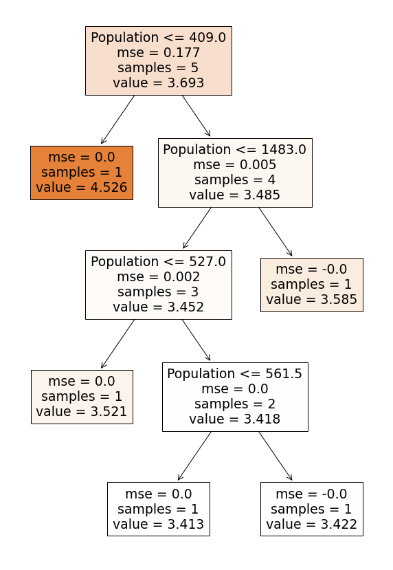

# Как обучается дерево решений для регрессии. Decision Tree Regressor.

NB из видео Как обучается `дерево решений` для регрессии. Decision `Tree Regressor`.  
https://www.youtube.com/watch?v=0mMeaC3gjNI


## Установка нужных версий библиотек


```python
!wget 'https://drive.google.com/uc?export=download&id=1oSFOP0j25OZAuhD8YXxyQXNTdr2lUdtn' -O requirements.txt
```

    --2021-07-14 13:30:42--  https://drive.google.com/uc?export=download&id=1oSFOP0j25OZAuhD8YXxyQXNTdr2lUdtn
    Resolving drive.google.com (drive.google.com)... 74.125.137.139, 74.125.137.100, 74.125.137.102, ...
    Connecting to drive.google.com (drive.google.com)|74.125.137.139|:443... connected.
    HTTP request sent, awaiting response... 302 Moved Temporarily
    Location: https://doc-0g-c0-docs.googleusercontent.com/docs/securesc/ha0ro937gcuc7l7deffksulhg5h7mbp1/vvnnn7pai054ebt8ane24n664e80mboq/1626269400000/14904333240138417226/*/1oSFOP0j25OZAuhD8YXxyQXNTdr2lUdtn?e=download [following]
    Warning: wildcards not supported in HTTP.
    --2021-07-14 13:30:43--  https://doc-0g-c0-docs.googleusercontent.com/docs/securesc/ha0ro937gcuc7l7deffksulhg5h7mbp1/vvnnn7pai054ebt8ane24n664e80mboq/1626269400000/14904333240138417226/*/1oSFOP0j25OZAuhD8YXxyQXNTdr2lUdtn?e=download
    Resolving doc-0g-c0-docs.googleusercontent.com (doc-0g-c0-docs.googleusercontent.com)... 142.251.2.132, 2607:f8b0:4023:c0d::84
    Connecting to doc-0g-c0-docs.googleusercontent.com (doc-0g-c0-docs.googleusercontent.com)|142.251.2.132|:443... connected.
    HTTP request sent, awaiting response... 200 OK
    Length: 74 [text/plain]
    Saving to: ‘requirements.txt’
    
    requirements.txt    100%[===================>]      74  --.-KB/s    in 0s      
    
    2021-07-14 13:30:43 (4.77 MB/s) - ‘requirements.txt’ saved [74/74]
    
    


```python
!pip install -r requirements.txt
```

    Requirement already satisfied: scikit-learn==0.22.2.post1 in /usr/local/lib/python3.7/dist-packages (from -r requirements.txt (line 1)) (0.22.2.post1)
    Requirement already satisfied: pandas==1.1.5 in /usr/local/lib/python3.7/dist-packages (from -r requirements.txt (line 2)) (1.1.5)
    Requirement already satisfied: matplotlib==3.2.2 in /usr/local/lib/python3.7/dist-packages (from -r requirements.txt (line 3)) (3.2.2)
    Requirement already satisfied: numpy==1.19.5 in /usr/local/lib/python3.7/dist-packages (from -r requirements.txt (line 4)) (1.19.5)
    Requirement already satisfied: joblib>=0.11 in /usr/local/lib/python3.7/dist-packages (from scikit-learn==0.22.2.post1->-r requirements.txt (line 1)) (1.0.1)
    Requirement already satisfied: scipy>=0.17.0 in /usr/local/lib/python3.7/dist-packages (from scikit-learn==0.22.2.post1->-r requirements.txt (line 1)) (1.4.1)
    Requirement already satisfied: pytz>=2017.2 in /usr/local/lib/python3.7/dist-packages (from pandas==1.1.5->-r requirements.txt (line 2)) (2018.9)
    Requirement already satisfied: python-dateutil>=2.7.3 in /usr/local/lib/python3.7/dist-packages (from pandas==1.1.5->-r requirements.txt (line 2)) (2.8.1)
    Requirement already satisfied: pyparsing!=2.0.4,!=2.1.2,!=2.1.6,>=2.0.1 in /usr/local/lib/python3.7/dist-packages (from matplotlib==3.2.2->-r requirements.txt (line 3)) (2.4.7)
    Requirement already satisfied: kiwisolver>=1.0.1 in /usr/local/lib/python3.7/dist-packages (from matplotlib==3.2.2->-r requirements.txt (line 3)) (1.3.1)
    Requirement already satisfied: cycler>=0.10 in /usr/local/lib/python3.7/dist-packages (from matplotlib==3.2.2->-r requirements.txt (line 3)) (0.10.0)
    Requirement already satisfied: six>=1.5 in /usr/local/lib/python3.7/dist-packages (from python-dateutil>=2.7.3->pandas==1.1.5->-r requirements.txt (line 2)) (1.15.0)
    


```python
from sklearn.tree import DecisionTreeRegressor, plot_tree
import pandas as pd
import matplotlib.pyplot as plt
```

## Получение данных

Будем работать с набором данных для задачи регрессии (целевая переменная - стоимость дома) `california_housing`, который можно получить из стандартных датасетов в `sklearn'e`.

После `fetch_california_housing()` возвращается словарь с данными (`data`), целевой переменной (`target`), названиями характеристик в данных (`feature_names`) и описанием данных (`DESCR`).


```python
from sklearn.datasets import fetch_california_housing

data = fetch_california_housing()
data
```

    Downloading Cal. housing from https://ndownloader.figshare.com/files/5976036 to /root/scikit_learn_data
    


    {'DESCR': '.. _california_housing_dataset:\n\nCalifornia Housing dataset\n--------------------------\n\n**Data Set Characteristics:**\n\n    :Number of Instances: 20640\n\n    :Number of Attributes: 8 numeric, predictive attributes and the target\n\n    :Attribute Information:\n        - MedInc        median income in block\n        - HouseAge      median house age in block\n        - AveRooms      average number of rooms\n        - AveBedrms     average number of bedrooms\n        - Population    block population\n        - AveOccup      average house occupancy\n        - Latitude      house block latitude\n        - Longitude     house block longitude\n\n    :Missing Attribute Values: None\n\nThis dataset was obtained from the StatLib repository.\nhttp://lib.stat.cmu.edu/datasets/\n\nThe target variable is the median house value for California districts.\n\nThis dataset was derived from the 1990 U.S. census, using one row per census\nblock group. A block group is the smallest geographical unit for which the U.S.\nCensus Bureau publishes sample data (a block group typically has a population\nof 600 to 3,000 people).\n\nIt can be downloaded/loaded using the\n:func:`sklearn.datasets.fetch_california_housing` function.\n\n.. topic:: References\n\n    - Pace, R. Kelley and Ronald Barry, Sparse Spatial Autoregressions,\n      Statistics and Probability Letters, 33 (1997) 291-297\n',
     'data': array([[   8.3252    ,   41.        ,    6.98412698, ...,    2.55555556,
               37.88      , -122.23      ],
            [   8.3014    ,   21.        ,    6.23813708, ...,    2.10984183,
               37.86      , -122.22      ],
            [   7.2574    ,   52.        ,    8.28813559, ...,    2.80225989,
               37.85      , -122.24      ],
            ...,
            [   1.7       ,   17.        ,    5.20554273, ...,    2.3256351 ,
               39.43      , -121.22      ],
            [   1.8672    ,   18.        ,    5.32951289, ...,    2.12320917,
               39.43      , -121.32      ],
            [   2.3886    ,   16.        ,    5.25471698, ...,    2.61698113,
               39.37      , -121.24      ]]),
     'feature_names': ['MedInc',
      'HouseAge',
      'AveRooms',
      'AveBedrms',
      'Population',
      'AveOccup',
      'Latitude',
      'Longitude'],
     'target': array([4.526, 3.585, 3.521, ..., 0.923, 0.847, 0.894])}


```python
data.keys()
```


    dict_keys(['data', 'target', 'feature_names', 'DESCR'])


```python
print(data.DESCR)
```

    .. _california_housing_dataset:
    
    California Housing dataset
    --------------------------
    
    **Data Set Characteristics:**
    
        :Number of Instances: 20640
    
        :Number of Attributes: 8 numeric, predictive attributes and the target
    
        :Attribute Information:
            - MedInc        median income in block
            - HouseAge      median house age in block
            - AveRooms      average number of rooms
            - AveBedrms     average number of bedrooms
            - Population    block population
            - AveOccup      average house occupancy
            - Latitude      house block latitude
            - Longitude     house block longitude
    
        :Missing Attribute Values: None
    
    This dataset was obtained from the StatLib repository.
    http://lib.stat.cmu.edu/datasets/
    
    The target variable is the median house value for California districts.
    
    This dataset was derived from the 1990 U.S. census, using one row per census
    block group. A block group is the smallest geographical unit for which the U.S.
    Census Bureau publishes sample data (a block group typically has a population
    of 600 to 3,000 people).
    
    It can be downloaded/loaded using the
    :func:`sklearn.datasets.fetch_california_housing` function.
    
    .. topic:: References
    
        - Pace, R. Kelley and Ronald Barry, Sparse Spatial Autoregressions,
          Statistics and Probability Letters, 33 (1997) 291-297
    
    


```python
X = data.data
features = data.feature_names
y = data.target
```

Из признаков (характеристик данных) и целевой переменной сформируем датафрейм, в качестве названий колонок возьмем названия признаков.


```python
df = pd.DataFrame(X, columns=features)
df['target'] = y

df.head()
```


<div>
<style scoped>
    .dataframe tbody tr th:only-of-type {
        vertical-align: middle;
    }

    .dataframe tbody tr th {
        vertical-align: top;
    }

    .dataframe thead th {
        text-align: right;
    }
</style>
<table border="1" class="dataframe">
  <thead>
    <tr style="text-align: right;">
      <th></th>
      <th>MedInc</th>
      <th>HouseAge</th>
      <th>AveRooms</th>
      <th>AveBedrms</th>
      <th>Population</th>
      <th>AveOccup</th>
      <th>Latitude</th>
      <th>Longitude</th>
      <th>target</th>
    </tr>
  </thead>
  <tbody>
    <tr>
      <th>0</th>
      <td>8.3252</td>
      <td>41.0</td>
      <td>6.984127</td>
      <td>1.023810</td>
      <td>322.0</td>
      <td>2.555556</td>
      <td>37.88</td>
      <td>-122.23</td>
      <td>4.526</td>
    </tr>
    <tr>
      <th>1</th>
      <td>8.3014</td>
      <td>21.0</td>
      <td>6.238137</td>
      <td>0.971880</td>
      <td>2401.0</td>
      <td>2.109842</td>
      <td>37.86</td>
      <td>-122.22</td>
      <td>3.585</td>
    </tr>
    <tr>
      <th>2</th>
      <td>7.2574</td>
      <td>52.0</td>
      <td>8.288136</td>
      <td>1.073446</td>
      <td>496.0</td>
      <td>2.802260</td>
      <td>37.85</td>
      <td>-122.24</td>
      <td>3.521</td>
    </tr>
    <tr>
      <th>3</th>
      <td>5.6431</td>
      <td>52.0</td>
      <td>5.817352</td>
      <td>1.073059</td>
      <td>558.0</td>
      <td>2.547945</td>
      <td>37.85</td>
      <td>-122.25</td>
      <td>3.413</td>
    </tr>
    <tr>
      <th>4</th>
      <td>3.8462</td>
      <td>52.0</td>
      <td>6.281853</td>
      <td>1.081081</td>
      <td>565.0</td>
      <td>2.181467</td>
      <td>37.85</td>
      <td>-122.25</td>
      <td>3.422</td>
    </tr>
  </tbody>
</table>
</div>


Чтобы более наглядно смотреть, как обучается дерево решений возьмем только 5 объектов.


```python
features = ['HouseAge', 'Population']
```


```python
df = df[features + ['target']]
df = df.head(5)
df
```


<div>
<style scoped>
    .dataframe tbody tr th:only-of-type {
        vertical-align: middle;
    }

    .dataframe tbody tr th {
        vertical-align: top;
    }

    .dataframe thead th {
        text-align: right;
    }
</style>
<table border="1" class="dataframe">
  <thead>
    <tr style="text-align: right;">
      <th></th>
      <th>HouseAge</th>
      <th>Population</th>
      <th>target</th>
    </tr>
  </thead>
  <tbody>
    <tr>
      <th>0</th>
      <td>41.0</td>
      <td>322.0</td>
      <td>4.526</td>
    </tr>
    <tr>
      <th>1</th>
      <td>21.0</td>
      <td>2401.0</td>
      <td>3.585</td>
    </tr>
    <tr>
      <th>2</th>
      <td>52.0</td>
      <td>496.0</td>
      <td>3.521</td>
    </tr>
    <tr>
      <th>3</th>
      <td>52.0</td>
      <td>558.0</td>
      <td>3.413</td>
    </tr>
    <tr>
      <th>4</th>
      <td>52.0</td>
      <td>565.0</td>
      <td>3.422</td>
    </tr>
  </tbody>
</table>
</div>


```python
X = df[features]
y = df['target']
```

## Обучение дерева решений

Инициализируем дерево решений для задачи регрессии и обучим на признаках (`X`) и целевой переменной (`y`). По признакам модель будет запоминать закономерности, которые ведут к изменению стоимости дома.


```python
from sklearn.tree import DecisionTreeRegressor


tree = DecisionTreeRegressor(random_state=1)
tree.fit(X, y)
```


    DecisionTreeRegressor(ccp_alpha=0.0, criterion='mse', max_depth=None,
                          max_features=None, max_leaf_nodes=None,
                          min_impurity_decrease=0.0, min_impurity_split=None,
                          min_samples_leaf=1, min_samples_split=2,
                          min_weight_fraction_leaf=0.0, presort='deprecated',
                          random_state=1, splitter='best')


Теперь визуализируем наше обученное дерево решений. Узлы (ноды), где находится вопрос - называются вершинами, а где вопросов больше нет - это лист. В каждом узле хранятся объекты и предсказания, которые строятся как среднее по всем объектам, которые попали в этот узел.


```python
from sklearn.tree import plot_tree


plt.figure(figsize=(10, 15))
plot_tree(tree, feature_names=features, filled=True);
```


    

    


Как же оно обучилось?

Чтобы наилучшим образом предсказывать стоимость дома, надо ввести функцию потерь - ошибка, которую мы будем стараться минимизировать. Ведь хочется, чтобы предсказанная стоимость дома совпадала с истинным значением.


```python
y
```


    0    4.526
    1    3.585
    2    3.521
    3    3.413
    4    3.422
    Name: target, dtype: float64


### Средне-квадратичная ошибка

 Возьмем среднеквадратичную ошибку (mean squared error).

 $MSE = \frac{1}{n}\sum_i^n{(y_{true} - y_{pred})^2}$


```python
import numpy as np


def mse(true, pred):
    return np.mean(np.square(true - pred))
```

### Population <= 409

Наше обученное дерево решило, что самый лучший первый вопрос к нашим данным - это Population <= 409. В этом случае происходит разбиение на две выборки:   


```python
plt.figure(figsize=(13, 12))
plot_tree(tree, feature_names=features, filled = True, max_depth=1);
```


    

    


```python
df
```


<div>
<style scoped>
    .dataframe tbody tr th:only-of-type {
        vertical-align: middle;
    }

    .dataframe tbody tr th {
        vertical-align: top;
    }

    .dataframe thead th {
        text-align: right;
    }
</style>
<table border="1" class="dataframe">
  <thead>
    <tr style="text-align: right;">
      <th></th>
      <th>HouseAge</th>
      <th>Population</th>
      <th>target</th>
    </tr>
  </thead>
  <tbody>
    <tr>
      <th>0</th>
      <td>41.0</td>
      <td>322.0</td>
      <td>4.526</td>
    </tr>
    <tr>
      <th>1</th>
      <td>21.0</td>
      <td>2401.0</td>
      <td>3.585</td>
    </tr>
    <tr>
      <th>2</th>
      <td>52.0</td>
      <td>496.0</td>
      <td>3.521</td>
    </tr>
    <tr>
      <th>3</th>
      <td>52.0</td>
      <td>558.0</td>
      <td>3.413</td>
    </tr>
    <tr>
      <th>4</th>
      <td>52.0</td>
      <td>565.0</td>
      <td>3.422</td>
    </tr>
  </tbody>
</table>
</div>


В одной 1 объект, который удовлетворяет этому условию.


```python
df[df.Population <= 409]
```


<div>
<style scoped>
    .dataframe tbody tr th:only-of-type {
        vertical-align: middle;
    }

    .dataframe tbody tr th {
        vertical-align: top;
    }

    .dataframe thead th {
        text-align: right;
    }
</style>
<table border="1" class="dataframe">
  <thead>
    <tr style="text-align: right;">
      <th></th>
      <th>HouseAge</th>
      <th>Population</th>
      <th>target</th>
    </tr>
  </thead>
  <tbody>
    <tr>
      <th>0</th>
      <td>41.0</td>
      <td>322.0</td>
      <td>4.526</td>
    </tr>
  </tbody>
</table>
</div>


Во второй 4 объекта, которые не следует этому условию.


```python
df[~(df.Population <= 409)]
```


<div>
<style scoped>
    .dataframe tbody tr th:only-of-type {
        vertical-align: middle;
    }

    .dataframe tbody tr th {
        vertical-align: top;
    }

    .dataframe thead th {
        text-align: right;
    }
</style>
<table border="1" class="dataframe">
  <thead>
    <tr style="text-align: right;">
      <th></th>
      <th>HouseAge</th>
      <th>Population</th>
      <th>target</th>
    </tr>
  </thead>
  <tbody>
    <tr>
      <th>1</th>
      <td>21.0</td>
      <td>2401.0</td>
      <td>3.585</td>
    </tr>
    <tr>
      <th>2</th>
      <td>52.0</td>
      <td>496.0</td>
      <td>3.521</td>
    </tr>
    <tr>
      <th>3</th>
      <td>52.0</td>
      <td>558.0</td>
      <td>3.413</td>
    </tr>
    <tr>
      <th>4</th>
      <td>52.0</td>
      <td>565.0</td>
      <td>3.422</td>
    </tr>
  </tbody>
</table>
</div>


#### Корневой узел

Теперь можем посчитать среднеквадратичную ошибку в корневом узле, где находятся все 5 объектов. Считаем, что предсказание стоимости дома в этом узле - это среднее всех целевых переменных объектов, которые в узле находятся.

$$pred = \frac{4.526 + 3.585 + 3.521 + 3.413 + 3.422}{5} = 3.6934$$


```python
print(f"Среднее предсказание в корневом узле равно {df['target'].mean()}")
```

    Среднее предсказание в корневом узле равно 3.6934000000000005
    

$$MSE = \frac{(4.526 - 3.6934)^2 + (3.585- 3.6934)^2 + (3.521-3.6934)^2 + (3.413-3.6934)^2 + (3.422-3.6934)^2}{5} = 0.17739$$


```python
mse_root = mse(df['target'], df['target'].mean())
print(f"Среднеквадратичная ошибка в корневом узле равна {mse_root}")
```

    Среднеквадратичная ошибка в корневом узле равна 0.17739543999999993
    

И ошибка, и среднее значение целевой переменной совпали с теми, что визуализировались на дереве решений в самом перевом узле.

Посмотрим, насколько уменьшается ошибка, если данным задать вопрос Population <= 409.


```python
df_left = df[df.Population <= 409]
df_left
```


<div>
<style scoped>
    .dataframe tbody tr th:only-of-type {
        vertical-align: middle;
    }

    .dataframe tbody tr th {
        vertical-align: top;
    }

    .dataframe thead th {
        text-align: right;
    }
</style>
<table border="1" class="dataframe">
  <thead>
    <tr style="text-align: right;">
      <th></th>
      <th>HouseAge</th>
      <th>Population</th>
      <th>target</th>
    </tr>
  </thead>
  <tbody>
    <tr>
      <th>0</th>
      <td>41.0</td>
      <td>322.0</td>
      <td>4.526</td>
    </tr>
  </tbody>
</table>
</div>


#### Левая выборка

В первой выборке 1 объект и его среднеквадратичная ошибка равна:


$$pred = \frac{4.526}{1} = 4.526$$


$$MSE = \frac{(4.526 - 4.526)^2}{1} = 0$$


```python
print(f"Среднее предсказание в левой подвыборке после вопроса Population <= 409 равно {df_left['target'].mean()}")

mse_left = mse(df_left['target'], df_left['target'].mean())
print(f"Среднеквадратичная ошибка в левой подвыборке после вопроса Population <= 409 равна {mse_left}")
```

    Среднее предсказание в левой подвыборке после вопроса Population <= 409 равно 4.526
    Среднеквадратичная ошибка в левой подвыборке после вопроса Population <= 409 равна 0.0
    

#### Правая выборка

Во второй правой выборке 4 объекта и их среднеквадратичная ошибка равна:

$$pred = \frac{3.585 + 3.521 + 3.413 + 3.422}{4} = 3.4852$$


$$MSE = \frac{(3.585- 3.4852)^2 + (3.521-3.4852)^2 + (3.413-3.4852)^2 + (3.422-3.4852)^2}{4} = 0.00511$$


```python
df_right = df[~(df.Population <= 409)]
df_right
```


<div>
<style scoped>
    .dataframe tbody tr th:only-of-type {
        vertical-align: middle;
    }

    .dataframe tbody tr th {
        vertical-align: top;
    }

    .dataframe thead th {
        text-align: right;
    }
</style>
<table border="1" class="dataframe">
  <thead>
    <tr style="text-align: right;">
      <th></th>
      <th>HouseAge</th>
      <th>Population</th>
      <th>target</th>
    </tr>
  </thead>
  <tbody>
    <tr>
      <th>1</th>
      <td>21.0</td>
      <td>2401.0</td>
      <td>3.585</td>
    </tr>
    <tr>
      <th>2</th>
      <td>52.0</td>
      <td>496.0</td>
      <td>3.521</td>
    </tr>
    <tr>
      <th>3</th>
      <td>52.0</td>
      <td>558.0</td>
      <td>3.413</td>
    </tr>
    <tr>
      <th>4</th>
      <td>52.0</td>
      <td>565.0</td>
      <td>3.422</td>
    </tr>
  </tbody>
</table>
</div>


```python
print(f"Среднее предсказание в левой подвыборке после вопроса Population <= 409 равно {df_right['target'].mean()}")

mse_right = mse(df_right['target'], df_right['target'].mean())
print(f"Среднеквадратичная ошибка в левой подвыборке после вопроса Population <= 409 равна {mse_right}")
```

    Среднее предсказание в левой подвыборке после вопроса Population <= 409 равно 3.48525
    Среднеквадратичная ошибка в левой подвыборке после вопроса Population <= 409 равна 0.005112187499999999
    

#### Прирост информации

Теперь хочется в целом понять, насколько данное разбиение помогает нам уменьшить ошибку, для этого нужно ввести понятие "прирост информации" (information gain). Он считается, как

$$IG = MSE_{root} - (\frac{n_{left}}{n}MSE_{left} + \frac{n_{right}}{n}MSE_{right})$$
где $n_{left}$ - это количество объектов в левой ветке, $n_{right}$ - это количество объектов в правой ветке, а $n$ - количество объектов в корневом узле.


$$IG = 0.17739 - (\frac{1}{5} * 0 + \frac{4}{5} * 0.00511) = 0.1733$$


```python
n_left = df_left.shape[0]
n_right = df_right.shape[0]
n = df.shape[0]

ig = mse_root - ((n_left / n) * mse_left + (n_right / n) * mse_right)
ig
```


    0.17330568999999993


### HouseAge <= 50

А теперь попробуем другой вопрос, не тот, который выбрался самым лучшим по мнению этого дерева решений. К примеру, возьмем вопрос HouseAge <= 50.

В левой ветке 1 объект, который удовлетворяет этому условию.


```python
df[df.HouseAge <= 50]
```


<div>
<style scoped>
    .dataframe tbody tr th:only-of-type {
        vertical-align: middle;
    }

    .dataframe tbody tr th {
        vertical-align: top;
    }

    .dataframe thead th {
        text-align: right;
    }
</style>
<table border="1" class="dataframe">
  <thead>
    <tr style="text-align: right;">
      <th></th>
      <th>HouseAge</th>
      <th>Population</th>
      <th>target</th>
    </tr>
  </thead>
  <tbody>
    <tr>
      <th>0</th>
      <td>41.0</td>
      <td>322.0</td>
      <td>4.526</td>
    </tr>
    <tr>
      <th>1</th>
      <td>21.0</td>
      <td>2401.0</td>
      <td>3.585</td>
    </tr>
  </tbody>
</table>
</div>


В правой ветке 3 объекта, которые не следует этому условию.


```python
df[~(df.HouseAge <= 50)]
```


<div>
<style scoped>
    .dataframe tbody tr th:only-of-type {
        vertical-align: middle;
    }

    .dataframe tbody tr th {
        vertical-align: top;
    }

    .dataframe thead th {
        text-align: right;
    }
</style>
<table border="1" class="dataframe">
  <thead>
    <tr style="text-align: right;">
      <th></th>
      <th>HouseAge</th>
      <th>Population</th>
      <th>target</th>
    </tr>
  </thead>
  <tbody>
    <tr>
      <th>2</th>
      <td>52.0</td>
      <td>496.0</td>
      <td>3.521</td>
    </tr>
    <tr>
      <th>3</th>
      <td>52.0</td>
      <td>558.0</td>
      <td>3.413</td>
    </tr>
    <tr>
      <th>4</th>
      <td>52.0</td>
      <td>565.0</td>
      <td>3.422</td>
    </tr>
  </tbody>
</table>
</div>


#### Корневой узел

Считаем среднеквадратичную ошибку в корневом узле, где находятся все 5 объектов, она будет такой же, как мы получали выше, потому что объекты в корне никак не меняются.

$$pred = \frac{4.526 + 3.585 + 3.521 + 3.413 + 3.422}{5} = 3.6934$$


$$MSE = \frac{(4.526 - 3.6934)^2 + (3.585- 3.6934)^2 + (3.521-3.6934)^2 + (3.413-3.6934)^2 + (3.422-3.6934)^2}{5} = 0.17739$$


```python
print(f"Среднее предсказание в корневом узле равно {df['target'].mean()}")
```

    Среднее предсказание в корневом узле равно 3.6934000000000005
    


```python
mse_root = mse(df['target'], df['target'].mean())
print(f"Среднеквадратичная ошибка в корневом узле равна {mse_root}")
```

    Среднеквадратичная ошибка в корневом узле равна 0.17739543999999993
    

#### Левая выборка

Глянем на то, насколько уменьшается ошибка, если задаем вопрос HouseAge <= 50.


```python
df_left = df[df.HouseAge <= 50]
df_left
```


<div>
<style scoped>
    .dataframe tbody tr th:only-of-type {
        vertical-align: middle;
    }

    .dataframe tbody tr th {
        vertical-align: top;
    }

    .dataframe thead th {
        text-align: right;
    }
</style>
<table border="1" class="dataframe">
  <thead>
    <tr style="text-align: right;">
      <th></th>
      <th>HouseAge</th>
      <th>Population</th>
      <th>target</th>
    </tr>
  </thead>
  <tbody>
    <tr>
      <th>0</th>
      <td>41.0</td>
      <td>322.0</td>
      <td>4.526</td>
    </tr>
    <tr>
      <th>1</th>
      <td>21.0</td>
      <td>2401.0</td>
      <td>3.585</td>
    </tr>
  </tbody>
</table>
</div>


$$pred = \frac{4.526 + 3.585}{2} = 4.0555$$


$$MSE = \frac{(3.585- 4.0555)^2 + (3.521-4.0555)^2}{2} = 0.2213$$


```python
print(f"Среднее предсказание в левой подвыборке после вопроса HouseAge <= 50 равно {df_left['target'].mean()}")

mse_left = mse(df_left['target'], df_left['target'].mean())
print(f"Среднеквадратичная ошибка в левой подвыборке после вопроса HouseAge <= 50 равна {mse_left}")
```

    Среднее предсказание в левой подвыборке после вопроса HouseAge <= 50 равно 4.0555
    Среднеквадратичная ошибка в левой подвыборке после вопроса HouseAge <= 50 равна 0.22137024999999994
    

#### Правая выборка


```python
df_right = df[~(df.HouseAge <= 50)]
df_right
```


<div>
<style scoped>
    .dataframe tbody tr th:only-of-type {
        vertical-align: middle;
    }

    .dataframe tbody tr th {
        vertical-align: top;
    }

    .dataframe thead th {
        text-align: right;
    }
</style>
<table border="1" class="dataframe">
  <thead>
    <tr style="text-align: right;">
      <th></th>
      <th>HouseAge</th>
      <th>Population</th>
      <th>target</th>
    </tr>
  </thead>
  <tbody>
    <tr>
      <th>2</th>
      <td>52.0</td>
      <td>496.0</td>
      <td>3.521</td>
    </tr>
    <tr>
      <th>3</th>
      <td>52.0</td>
      <td>558.0</td>
      <td>3.413</td>
    </tr>
    <tr>
      <th>4</th>
      <td>52.0</td>
      <td>565.0</td>
      <td>3.422</td>
    </tr>
  </tbody>
</table>
</div>


$$pred = \frac{3.521 + 3.413 + 3.422}{3} = 3.452$$


$$MSE = \frac{(3.521-3.4852)^2 + (3.413-3.4852)^2 + (3.422-3.4852)^2}{3} = 0.00239$$


```python
print(f"Среднее предсказание в правой подвыборке после вопроса HouseAge <= 50 равно {df_right['target'].mean()}")

mse_right = mse(df_right['target'], df_right['target'].mean())
print(f"Среднеквадратичная ошибка в правой подвыборке после вопроса HouseAge <= 50 равна {mse_right}")
```

    Среднее предсказание в правой подвыборке после вопроса HouseAge <= 50 равно 3.452
    Среднеквадратичная ошибка в правой подвыборке после вопроса HouseAge <= 50 равна 0.0023939999999999977
    

#### Прирост информации

И считаем прирост информации, чтобы объединить 3 значения среднеквадратичной ошибки в одно общее.


$$IG = 0.17739 - (\frac{2}{5} * 0.2213 + \frac{3}{5} * 0.00239) = 0.08743$$


```python
n_left = df_left.shape[0]
n_right = df_right.shape[0]
n = df.shape[0]

ig = mse_root - ((n_left / n) * mse_left + (n_right / n) * mse_right)
ig
```


    0.08741093999999995


$$IG_{\text{population}} = 0.1733$$
$$IG_{\text{house_age}} = 0.08743$$
$$IG_{\text{population}} > IG_{\text{house_age}}$$

Прирост информации при вопросе HouseAge <= 50 получился меньше, чем при вопросе Population <= 409, значет выгодней задавать вопрос, связанный с населением.   


## Процесс построения дерева

Продемонстрируем процесс обучения дерева решения.

Дерево, чтобы получить самый полезный вопрос, проходится по всем признакам и по всем уникальным значениям в нём (либо по среднем между значениями) и выбирает тот вопрос, у которого прирост информации получился выше.


```python
df
```


<div>
<style scoped>
    .dataframe tbody tr th:only-of-type {
        vertical-align: middle;
    }

    .dataframe tbody tr th {
        vertical-align: top;
    }

    .dataframe thead th {
        text-align: right;
    }
</style>
<table border="1" class="dataframe">
  <thead>
    <tr style="text-align: right;">
      <th></th>
      <th>HouseAge</th>
      <th>Population</th>
      <th>target</th>
    </tr>
  </thead>
  <tbody>
    <tr>
      <th>0</th>
      <td>41.0</td>
      <td>322.0</td>
      <td>4.526</td>
    </tr>
    <tr>
      <th>1</th>
      <td>21.0</td>
      <td>2401.0</td>
      <td>3.585</td>
    </tr>
    <tr>
      <th>2</th>
      <td>52.0</td>
      <td>496.0</td>
      <td>3.521</td>
    </tr>
    <tr>
      <th>3</th>
      <td>52.0</td>
      <td>558.0</td>
      <td>3.413</td>
    </tr>
    <tr>
      <th>4</th>
      <td>52.0</td>
      <td>565.0</td>
      <td>3.422</td>
    </tr>
  </tbody>
</table>
</div>


Сначала проход будет сделан по признаку HouseAge, найдутся все значения, при которых получаются уникальные разбиения.


```python
split_values = sorted(df.HouseAge.unique())
split_values
```


    [21.0, 41.0, 52.0]


Можем сделать два уникальных разбиения:
1. с вопросом HouseAge <= 21


```python
display(df[(df['HouseAge'] <= 21)], df[~(df['HouseAge'] <= 21)])
```


<div>
<style scoped>
    .dataframe tbody tr th:only-of-type {
        vertical-align: middle;
    }

    .dataframe tbody tr th {
        vertical-align: top;
    }

    .dataframe thead th {
        text-align: right;
    }
</style>
<table border="1" class="dataframe">
  <thead>
    <tr style="text-align: right;">
      <th></th>
      <th>HouseAge</th>
      <th>Population</th>
      <th>target</th>
    </tr>
  </thead>
  <tbody>
    <tr>
      <th>1</th>
      <td>21.0</td>
      <td>2401.0</td>
      <td>3.585</td>
    </tr>
  </tbody>
</table>
</div>


<div>
<style scoped>
    .dataframe tbody tr th:only-of-type {
        vertical-align: middle;
    }

    .dataframe tbody tr th {
        vertical-align: top;
    }

    .dataframe thead th {
        text-align: right;
    }
</style>
<table border="1" class="dataframe">
  <thead>
    <tr style="text-align: right;">
      <th></th>
      <th>HouseAge</th>
      <th>Population</th>
      <th>target</th>
    </tr>
  </thead>
  <tbody>
    <tr>
      <th>0</th>
      <td>41.0</td>
      <td>322.0</td>
      <td>4.526</td>
    </tr>
    <tr>
      <th>2</th>
      <td>52.0</td>
      <td>496.0</td>
      <td>3.521</td>
    </tr>
    <tr>
      <th>3</th>
      <td>52.0</td>
      <td>558.0</td>
      <td>3.413</td>
    </tr>
    <tr>
      <th>4</th>
      <td>52.0</td>
      <td>565.0</td>
      <td>3.422</td>
    </tr>
  </tbody>
</table>
</div>


2. с вопросом HouseAge <= 41


```python
display(df[(df['HouseAge'] <= 41)], df[~(df['HouseAge'] <= 41)])
```


<div>
<style scoped>
    .dataframe tbody tr th:only-of-type {
        vertical-align: middle;
    }

    .dataframe tbody tr th {
        vertical-align: top;
    }

    .dataframe thead th {
        text-align: right;
    }
</style>
<table border="1" class="dataframe">
  <thead>
    <tr style="text-align: right;">
      <th></th>
      <th>HouseAge</th>
      <th>Population</th>
      <th>target</th>
    </tr>
  </thead>
  <tbody>
    <tr>
      <th>0</th>
      <td>41.0</td>
      <td>322.0</td>
      <td>4.526</td>
    </tr>
    <tr>
      <th>1</th>
      <td>21.0</td>
      <td>2401.0</td>
      <td>3.585</td>
    </tr>
  </tbody>
</table>
</div>


<div>
<style scoped>
    .dataframe tbody tr th:only-of-type {
        vertical-align: middle;
    }

    .dataframe tbody tr th {
        vertical-align: top;
    }

    .dataframe thead th {
        text-align: right;
    }
</style>
<table border="1" class="dataframe">
  <thead>
    <tr style="text-align: right;">
      <th></th>
      <th>HouseAge</th>
      <th>Population</th>
      <th>target</th>
    </tr>
  </thead>
  <tbody>
    <tr>
      <th>2</th>
      <td>52.0</td>
      <td>496.0</td>
      <td>3.521</td>
    </tr>
    <tr>
      <th>3</th>
      <td>52.0</td>
      <td>558.0</td>
      <td>3.413</td>
    </tr>
    <tr>
      <th>4</th>
      <td>52.0</td>
      <td>565.0</td>
      <td>3.422</td>
    </tr>
  </tbody>
</table>
</div>


Вопрос HouseAge <= 52 не имеет смысла, т.к. все объекты оказываются в левой ветке.


```python
display(df[(df['HouseAge'] <= 52)], df[~(df['HouseAge'] <= 52)])
```


<div>
<style scoped>
    .dataframe tbody tr th:only-of-type {
        vertical-align: middle;
    }

    .dataframe tbody tr th {
        vertical-align: top;
    }

    .dataframe thead th {
        text-align: right;
    }
</style>
<table border="1" class="dataframe">
  <thead>
    <tr style="text-align: right;">
      <th></th>
      <th>HouseAge</th>
      <th>Population</th>
      <th>target</th>
    </tr>
  </thead>
  <tbody>
    <tr>
      <th>0</th>
      <td>41.0</td>
      <td>322.0</td>
      <td>4.526</td>
    </tr>
    <tr>
      <th>1</th>
      <td>21.0</td>
      <td>2401.0</td>
      <td>3.585</td>
    </tr>
    <tr>
      <th>2</th>
      <td>52.0</td>
      <td>496.0</td>
      <td>3.521</td>
    </tr>
    <tr>
      <th>3</th>
      <td>52.0</td>
      <td>558.0</td>
      <td>3.413</td>
    </tr>
    <tr>
      <th>4</th>
      <td>52.0</td>
      <td>565.0</td>
      <td>3.422</td>
    </tr>
  </tbody>
</table>
</div>


<div>
<style scoped>
    .dataframe tbody tr th:only-of-type {
        vertical-align: middle;
    }

    .dataframe tbody tr th {
        vertical-align: top;
    }

    .dataframe thead th {
        text-align: right;
    }
</style>
<table border="1" class="dataframe">
  <thead>
    <tr style="text-align: right;">
      <th></th>
      <th>HouseAge</th>
      <th>Population</th>
      <th>target</th>
    </tr>
  </thead>
  <tbody>
  </tbody>
</table>
</div>


```python
def get_information_gain(df, feature, split):
    df_left, df_right = df[(df[feature] <= split)], df[~(df[feature] <= split)]

    n_left = df_left.shape[0]
    n_right = df_right.shape[0]
    n = df.shape[0]

    mse_root = mse(df['target'], df['target'].mean())
    mse_left = mse(df_left['target'], df_left['target'].mean())
    mse_right = mse(df_right['target'], df_right['target'].mean())

    ig = mse_root - ((n_left / n) * mse_left + (n_right / n) * mse_right)
    print(f'Прирост информации при вопросе {feature} <= {split} равен {ig}')
    return ig
```


```python
information_gains = {}
```


```python
feature = 'HouseAge'
for split in split_values[:-1]:
    information_gains[f'{feature} <= {split}'] = get_information_gain(df, feature, split)
```

    Прирост информации при вопросе HouseAge <= 21.0 равен 0.0029376399999999636
    Прирост информации при вопросе HouseAge <= 41.0 равен 0.08741093999999995
    


```python
split_values = sorted(df.Population.unique())
split_values
```


    [322.0, 496.0, 558.0, 565.0, 2401.0]


```python
feature = 'Population'
for split in split_values[:-1]:
    information_gains[f'{feature} <= {split}'] = get_information_gain(df, feature, split)
```

    Прирост информации при вопросе Population <= 322.0 равен 0.17330568999999993
    Прирост информации при вопросе Population <= 496.0 равен 0.07264400666666662
    Прирост информации при вопросе Population <= 558.0 равен 0.024041339999999994
    Прирост информации при вопросе Population <= 565.0 равен 0.0029376399999999636
    

Теперь найдем максимальный прирост информации для нашего первого вопроса.


```python
max(information_gains, key=information_gains.get)
```


    'Population <= 322.0'


Получилось, что самый полезный вопрос - Population <= 322.

По поводу того, что наш вопрос не совпал с вопросом из дерева с sklearn:   
Мы брали уникальные значения признака, как пороговые значения, а в sklearn'e берутся средние арифметические двух значений, как раз вопрос Population <= 409 получился от значений 322 и 496 (т.к. $\frac{322 + 496}{2} = 409$), но при этом разбиения получаются одинаковые:


```python
display(df[(df['Population'] <= 409)], df[~(df['Population'] <= 409)])
```


<div>
<style scoped>
    .dataframe tbody tr th:only-of-type {
        vertical-align: middle;
    }

    .dataframe tbody tr th {
        vertical-align: top;
    }

    .dataframe thead th {
        text-align: right;
    }
</style>
<table border="1" class="dataframe">
  <thead>
    <tr style="text-align: right;">
      <th></th>
      <th>HouseAge</th>
      <th>Population</th>
      <th>target</th>
    </tr>
  </thead>
  <tbody>
    <tr>
      <th>0</th>
      <td>41.0</td>
      <td>322.0</td>
      <td>4.526</td>
    </tr>
  </tbody>
</table>
</div>


<div>
<style scoped>
    .dataframe tbody tr th:only-of-type {
        vertical-align: middle;
    }

    .dataframe tbody tr th {
        vertical-align: top;
    }

    .dataframe thead th {
        text-align: right;
    }
</style>
<table border="1" class="dataframe">
  <thead>
    <tr style="text-align: right;">
      <th></th>
      <th>HouseAge</th>
      <th>Population</th>
      <th>target</th>
    </tr>
  </thead>
  <tbody>
    <tr>
      <th>1</th>
      <td>21.0</td>
      <td>2401.0</td>
      <td>3.585</td>
    </tr>
    <tr>
      <th>2</th>
      <td>52.0</td>
      <td>496.0</td>
      <td>3.521</td>
    </tr>
    <tr>
      <th>3</th>
      <td>52.0</td>
      <td>558.0</td>
      <td>3.413</td>
    </tr>
    <tr>
      <th>4</th>
      <td>52.0</td>
      <td>565.0</td>
      <td>3.422</td>
    </tr>
  </tbody>
</table>
</div>


```python
display(df[(df['Population'] <= 322)], df[~(df['Population'] <= 322)])
```


<div>
<style scoped>
    .dataframe tbody tr th:only-of-type {
        vertical-align: middle;
    }

    .dataframe tbody tr th {
        vertical-align: top;
    }

    .dataframe thead th {
        text-align: right;
    }
</style>
<table border="1" class="dataframe">
  <thead>
    <tr style="text-align: right;">
      <th></th>
      <th>HouseAge</th>
      <th>Population</th>
      <th>target</th>
    </tr>
  </thead>
  <tbody>
    <tr>
      <th>0</th>
      <td>41.0</td>
      <td>322.0</td>
      <td>4.526</td>
    </tr>
  </tbody>
</table>
</div>


<div>
<style scoped>
    .dataframe tbody tr th:only-of-type {
        vertical-align: middle;
    }

    .dataframe tbody tr th {
        vertical-align: top;
    }

    .dataframe thead th {
        text-align: right;
    }
</style>
<table border="1" class="dataframe">
  <thead>
    <tr style="text-align: right;">
      <th></th>
      <th>HouseAge</th>
      <th>Population</th>
      <th>target</th>
    </tr>
  </thead>
  <tbody>
    <tr>
      <th>1</th>
      <td>21.0</td>
      <td>2401.0</td>
      <td>3.585</td>
    </tr>
    <tr>
      <th>2</th>
      <td>52.0</td>
      <td>496.0</td>
      <td>3.521</td>
    </tr>
    <tr>
      <th>3</th>
      <td>52.0</td>
      <td>558.0</td>
      <td>3.413</td>
    </tr>
    <tr>
      <th>4</th>
      <td>52.0</td>
      <td>565.0</td>
      <td>3.422</td>
    </tr>
  </tbody>
</table>
</div>


```python

```
