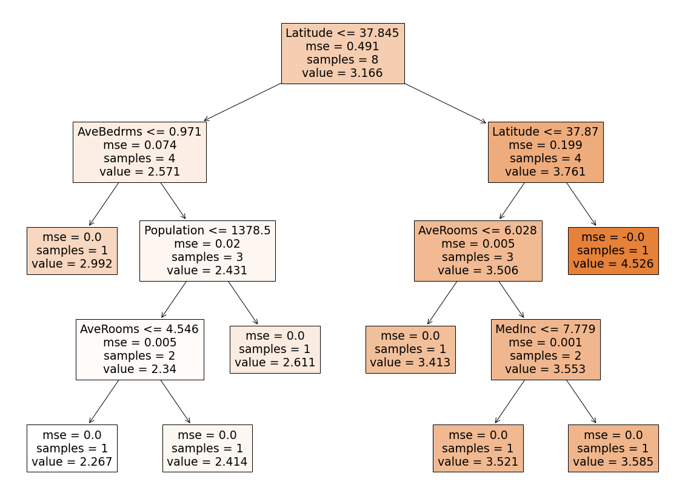
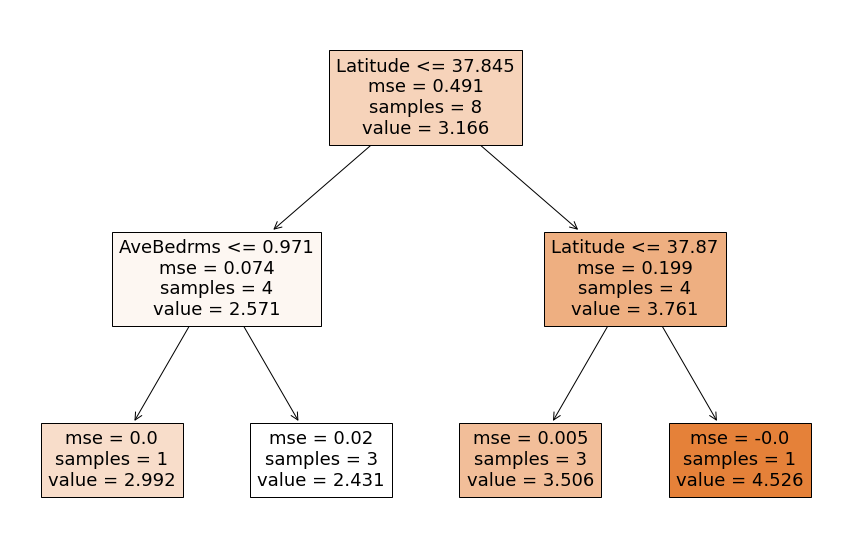
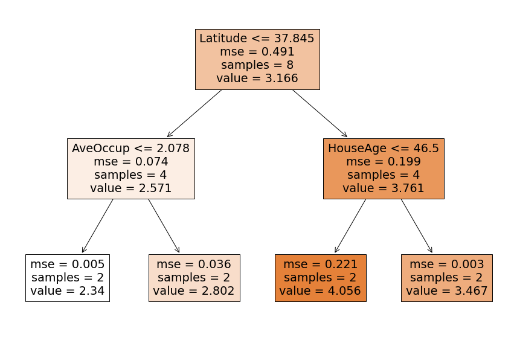
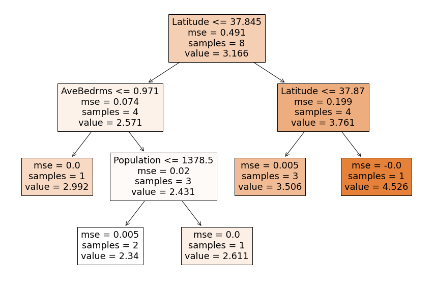

# КАК НЕ ПЕРЕОБУЧИТЬ ДЕРЕВО РЕШЕНИЙ Decision Tree | MAX DEPTH, MIN SAMPLES LEAF, MAX LEAF NODES

NB из видео КАК НЕ ПЕРЕОБУЧИТЬ `ДЕРЕВО РЕШЕНИЙ` Decision Tree | MAX DEPTH, MIN SAMPLES LEAF, MAX LEAF NODES.  
https://www.youtube.com/watch?v=aWEdaXAZ01M  


## Установка нужных версий библиотек


```python
!wget 'https://drive.google.com/uc?export=download&id=1oSFOP0j25OZAuhD8YXxyQXNTdr2lUdtn' -O requirements.txt
```

    --2022-03-14 07:40:49--  https://drive.google.com/uc?export=download&id=1oSFOP0j25OZAuhD8YXxyQXNTdr2lUdtn
    Resolving drive.google.com (drive.google.com)... 172.217.204.101, 172.217.204.113, 172.217.204.100, ...
    Connecting to drive.google.com (drive.google.com)|172.217.204.101|:443... connected.
    HTTP request sent, awaiting response... 303 See Other
    Location: https://doc-0g-c0-docs.googleusercontent.com/docs/securesc/ha0ro937gcuc7l7deffksulhg5h7mbp1/ui5f22nreavf9i44035cjktjk4i0e9m2/1647243600000/14904333240138417226/*/1oSFOP0j25OZAuhD8YXxyQXNTdr2lUdtn?e=download [following]
    Warning: wildcards not supported in HTTP.
    --2022-03-14 07:40:50--  https://doc-0g-c0-docs.googleusercontent.com/docs/securesc/ha0ro937gcuc7l7deffksulhg5h7mbp1/ui5f22nreavf9i44035cjktjk4i0e9m2/1647243600000/14904333240138417226/*/1oSFOP0j25OZAuhD8YXxyQXNTdr2lUdtn?e=download
    Resolving doc-0g-c0-docs.googleusercontent.com (doc-0g-c0-docs.googleusercontent.com)... 173.194.212.132, 2607:f8b0:400c:c11::84
    Connecting to doc-0g-c0-docs.googleusercontent.com (doc-0g-c0-docs.googleusercontent.com)|173.194.212.132|:443... connected.
    HTTP request sent, awaiting response... 200 OK
    Length: 74 [text/plain]
    Saving to: ‘requirements.txt’
    
    requirements.txt    100%[===================>]      74  --.-KB/s    in 0s      
    
    2022-03-14 07:40:50 (5.30 MB/s) - ‘requirements.txt’ saved [74/74]
    
    


```python
!pip install -r requirements.txt
```

    Collecting scikit-learn==0.22.2.post1
      Downloading scikit_learn-0.22.2.post1-cp37-cp37m-manylinux1_x86_64.whl (7.1 MB)
         |████████████████████████████████| 7.1 MB 3.1 MB/s 
    [?25hCollecting pandas==1.1.5
      Downloading pandas-1.1.5-cp37-cp37m-manylinux1_x86_64.whl (9.5 MB)
         |████████████████████████████████| 9.5 MB 38.3 MB/s 
    [?25hRequirement already satisfied: matplotlib==3.2.2 in /usr/local/lib/python3.7/dist-packages (from -r requirements.txt (line 3)) (3.2.2)
    Collecting numpy==1.19.5
      Downloading numpy-1.19.5-cp37-cp37m-manylinux2010_x86_64.whl (14.8 MB)
         |████████████████████████████████| 14.8 MB 46.8 MB/s 
    [?25hRequirement already satisfied: joblib>=0.11 in /usr/local/lib/python3.7/dist-packages (from scikit-learn==0.22.2.post1->-r requirements.txt (line 1)) (1.1.0)
    Requirement already satisfied: scipy>=0.17.0 in /usr/local/lib/python3.7/dist-packages (from scikit-learn==0.22.2.post1->-r requirements.txt (line 1)) (1.4.1)
    Requirement already satisfied: pytz>=2017.2 in /usr/local/lib/python3.7/dist-packages (from pandas==1.1.5->-r requirements.txt (line 2)) (2018.9)
    Requirement already satisfied: python-dateutil>=2.7.3 in /usr/local/lib/python3.7/dist-packages (from pandas==1.1.5->-r requirements.txt (line 2)) (2.8.2)
    Requirement already satisfied: cycler>=0.10 in /usr/local/lib/python3.7/dist-packages (from matplotlib==3.2.2->-r requirements.txt (line 3)) (0.11.0)
    Requirement already satisfied: kiwisolver>=1.0.1 in /usr/local/lib/python3.7/dist-packages (from matplotlib==3.2.2->-r requirements.txt (line 3)) (1.3.2)
    Requirement already satisfied: pyparsing!=2.0.4,!=2.1.2,!=2.1.6,>=2.0.1 in /usr/local/lib/python3.7/dist-packages (from matplotlib==3.2.2->-r requirements.txt (line 3)) (3.0.7)
    Requirement already satisfied: six>=1.5 in /usr/local/lib/python3.7/dist-packages (from python-dateutil>=2.7.3->pandas==1.1.5->-r requirements.txt (line 2)) (1.15.0)
    Installing collected packages: numpy, scikit-learn, pandas
      Attempting uninstall: numpy
        Found existing installation: numpy 1.21.5
        Uninstalling numpy-1.21.5:
          Successfully uninstalled numpy-1.21.5
      Attempting uninstall: scikit-learn
        Found existing installation: scikit-learn 1.0.2
        Uninstalling scikit-learn-1.0.2:
          Successfully uninstalled scikit-learn-1.0.2
      Attempting uninstall: pandas
        Found existing installation: pandas 1.3.5
        Uninstalling pandas-1.3.5:
          Successfully uninstalled pandas-1.3.5
    ERROR: pip's dependency resolver does not currently take into account all the packages that are installed. This behaviour is the source of the following dependency conflicts.
    tensorflow 2.8.0 requires tf-estimator-nightly==2.8.0.dev2021122109, which is not installed.
    yellowbrick 1.4 requires scikit-learn>=1.0.0, but you have scikit-learn 0.22.2.post1 which is incompatible.
    tensorflow 2.8.0 requires numpy>=1.20, but you have numpy 1.19.5 which is incompatible.
    imbalanced-learn 0.8.1 requires scikit-learn>=0.24, but you have scikit-learn 0.22.2.post1 which is incompatible.
    datascience 0.10.6 requires folium==0.2.1, but you have folium 0.8.3 which is incompatible.
    albumentations 0.1.12 requires imgaug<0.2.7,>=0.2.5, but you have imgaug 0.2.9 which is incompatible.
    Successfully installed numpy-1.19.5 pandas-1.1.5 scikit-learn-0.22.2.post1
    


```python
from sklearn.tree import DecisionTreeRegressor, plot_tree
import pandas as pd
import matplotlib.pyplot as plt
```

## Критерии останова или как не переобучить дерево решений


## План

- Вводная часть
    - получение данных
    - обучение модели
- Зачем это нужно?
- Какие есть подходы?
- Как ими пользоваться?

## Вводная часть

### Получение данных

Будем работать с набором данных для задачи регрессии (целевая переменная - стоимость дома) `california_housing`, который можно получить из стандартных датасетов в `sklearn'e`.

После `fetch_california_housing()` возвращается словарь с данными (`data`), целевой переменной (`target`), названиями характеристик в данных (`feature_names`) и описанием данных (`DESCR`).


```python
from sklearn.datasets import fetch_california_housing

data = fetch_california_housing()
data
```

    Downloading Cal. housing from https://ndownloader.figshare.com/files/5976036 to /root/scikit_learn_data
    


    {'DESCR': '.. _california_housing_dataset:\n\nCalifornia Housing dataset\n--------------------------\n\n**Data Set Characteristics:**\n\n    :Number of Instances: 20640\n\n    :Number of Attributes: 8 numeric, predictive attributes and the target\n\n    :Attribute Information:\n        - MedInc        median income in block\n        - HouseAge      median house age in block\n        - AveRooms      average number of rooms\n        - AveBedrms     average number of bedrooms\n        - Population    block population\n        - AveOccup      average house occupancy\n        - Latitude      house block latitude\n        - Longitude     house block longitude\n\n    :Missing Attribute Values: None\n\nThis dataset was obtained from the StatLib repository.\nhttp://lib.stat.cmu.edu/datasets/\n\nThe target variable is the median house value for California districts.\n\nThis dataset was derived from the 1990 U.S. census, using one row per census\nblock group. A block group is the smallest geographical unit for which the U.S.\nCensus Bureau publishes sample data (a block group typically has a population\nof 600 to 3,000 people).\n\nIt can be downloaded/loaded using the\n:func:`sklearn.datasets.fetch_california_housing` function.\n\n.. topic:: References\n\n    - Pace, R. Kelley and Ronald Barry, Sparse Spatial Autoregressions,\n      Statistics and Probability Letters, 33 (1997) 291-297\n',
     'data': array([[   8.3252    ,   41.        ,    6.98412698, ...,    2.55555556,
               37.88      , -122.23      ],
            [   8.3014    ,   21.        ,    6.23813708, ...,    2.10984183,
               37.86      , -122.22      ],
            [   7.2574    ,   52.        ,    8.28813559, ...,    2.80225989,
               37.85      , -122.24      ],
            ...,
            [   1.7       ,   17.        ,    5.20554273, ...,    2.3256351 ,
               39.43      , -121.22      ],
            [   1.8672    ,   18.        ,    5.32951289, ...,    2.12320917,
               39.43      , -121.32      ],
            [   2.3886    ,   16.        ,    5.25471698, ...,    2.61698113,
               39.37      , -121.24      ]]),
     'feature_names': ['MedInc',
      'HouseAge',
      'AveRooms',
      'AveBedrms',
      'Population',
      'AveOccup',
      'Latitude',
      'Longitude'],
     'target': array([4.526, 3.585, 3.521, ..., 0.923, 0.847, 0.894])}


```python
X = data.data
features = data.feature_names
y = data.target
```

Из признаков (характеристик данных) и целевой переменной сформируем датафрейм, в качестве названий колонок возьмем названия признаков.


```python
df_full = pd.DataFrame(X, columns=features)
df_full['target'] = y

print(df_full.to_string(max_rows=6, max_cols=20))  # Просмотр DF
```


  <div id="df-dbb44b64-3247-4f19-aa49-910cf7f393e9">
    <div class="colab-df-container">
      <div>
<style scoped>
    .dataframe tbody tr th:only-of-type {
        vertical-align: middle;
    }

    .dataframe tbody tr th {
        vertical-align: top;
    }

    .dataframe thead th {
        text-align: right;
    }
</style>
<table border="1" class="dataframe">
  <thead>
    <tr style="text-align: right;">
      <th></th>
      <th>MedInc</th>
      <th>HouseAge</th>
      <th>AveRooms</th>
      <th>AveBedrms</th>
      <th>Population</th>
      <th>AveOccup</th>
      <th>Latitude</th>
      <th>Longitude</th>
      <th>target</th>
    </tr>
  </thead>
  <tbody>
    <tr>
      <th>0</th>
      <td>8.3252</td>
      <td>41.0</td>
      <td>6.984127</td>
      <td>1.023810</td>
      <td>322.0</td>
      <td>2.555556</td>
      <td>37.88</td>
      <td>-122.23</td>
      <td>4.526</td>
    </tr>
    <tr>
      <th>1</th>
      <td>8.3014</td>
      <td>21.0</td>
      <td>6.238137</td>
      <td>0.971880</td>
      <td>2401.0</td>
      <td>2.109842</td>
      <td>37.86</td>
      <td>-122.22</td>
      <td>3.585</td>
    </tr>
    <tr>
      <th>2</th>
      <td>7.2574</td>
      <td>52.0</td>
      <td>8.288136</td>
      <td>1.073446</td>
      <td>496.0</td>
      <td>2.802260</td>
      <td>37.85</td>
      <td>-122.24</td>
      <td>3.521</td>
    </tr>
    <tr>
      <th>3</th>
      <td>5.6431</td>
      <td>52.0</td>
      <td>5.817352</td>
      <td>1.073059</td>
      <td>558.0</td>
      <td>2.547945</td>
      <td>37.85</td>
      <td>-122.25</td>
      <td>3.413</td>
    </tr>
    <tr>
      <th>4</th>
      <td>3.8462</td>
      <td>52.0</td>
      <td>6.281853</td>
      <td>1.081081</td>
      <td>565.0</td>
      <td>2.181467</td>
      <td>37.85</td>
      <td>-122.25</td>
      <td>3.422</td>
    </tr>
  </tbody>
</table>
</div>
      <button class="colab-df-convert" onclick="convertToInteractive('df-dbb44b64-3247-4f19-aa49-910cf7f393e9')"
              title="Convert this dataframe to an interactive table."
              style="display:none;">

  <svg xmlns="http://www.w3.org/2000/svg" height="24px"viewBox="0 0 24 24"
       width="24px">
    <path d="M0 0h24v24H0V0z" fill="none"/>
    <path d="M18.56 5.44l.94 2.06.94-2.06 2.06-.94-2.06-.94-.94-2.06-.94 2.06-2.06.94zm-11 1L8.5 8.5l.94-2.06 2.06-.94-2.06-.94L8.5 2.5l-.94 2.06-2.06.94zm10 10l.94 2.06.94-2.06 2.06-.94-2.06-.94-.94-2.06-.94 2.06-2.06.94z"/><path d="M17.41 7.96l-1.37-1.37c-.4-.4-.92-.59-1.43-.59-.52 0-1.04.2-1.43.59L10.3 9.45l-7.72 7.72c-.78.78-.78 2.05 0 2.83L4 21.41c.39.39.9.59 1.41.59.51 0 1.02-.2 1.41-.59l7.78-7.78 2.81-2.81c.8-.78.8-2.07 0-2.86zM5.41 20L4 18.59l7.72-7.72 1.47 1.35L5.41 20z"/>
  </svg>
      </button>

  <style>
    .colab-df-container {
      display:flex;
      flex-wrap:wrap;
      gap: 12px;
    }

    .colab-df-convert {
      background-color: #E8F0FE;
      border: none;
      border-radius: 50%;
      cursor: pointer;
      display: none;
      fill: #1967D2;
      height: 32px;
      padding: 0 0 0 0;
      width: 32px;
    }

    .colab-df-convert:hover {
      background-color: #E2EBFA;
      box-shadow: 0px 1px 2px rgba(60, 64, 67, 0.3), 0px 1px 3px 1px rgba(60, 64, 67, 0.15);
      fill: #174EA6;
    }

    [theme=dark] .colab-df-convert {
      background-color: #3B4455;
      fill: #D2E3FC;
    }

    [theme=dark] .colab-df-convert:hover {
      background-color: #434B5C;
      box-shadow: 0px 1px 3px 1px rgba(0, 0, 0, 0.15);
      filter: drop-shadow(0px 1px 2px rgba(0, 0, 0, 0.3));
      fill: #FFFFFF;
    }
  </style>

      <script>
        const buttonEl =
          document.querySelector('#df-dbb44b64-3247-4f19-aa49-910cf7f393e9 button.colab-df-convert');
        buttonEl.style.display =
          google.colab.kernel.accessAllowed ? 'block' : 'none';

        async function convertToInteractive(key) {
          const element = document.querySelector('#df-dbb44b64-3247-4f19-aa49-910cf7f393e9');
          const dataTable =
            await google.colab.kernel.invokeFunction('convertToInteractive',
                                                     [key], {});
          if (!dataTable) return;

          const docLinkHtml = 'Like what you see? Visit the ' +
            '<a target="_blank" href=https://colab.research.google.com/notebooks/data_table.ipynb>data table notebook</a>'
            + ' to learn more about interactive tables.';
          element.innerHTML = '';
          dataTable['output_type'] = 'display_data';
          await google.colab.output.renderOutput(dataTable, element);
          const docLink = document.createElement('div');
          docLink.innerHTML = docLinkHtml;
          element.appendChild(docLink);
        }
      </script>
    </div>
  </div>


Для простоты понимания ограничимся десятью объектами из выборки.


```python
df = df_full.iloc[:10]
print(df.to_string(max_rows=6, max_cols=20))  # Просмотр DF
```


  <div id="df-f382f04f-3fda-4832-a442-008a27f46e01">
    <div class="colab-df-container">
      <div>
<style scoped>
    .dataframe tbody tr th:only-of-type {
        vertical-align: middle;
    }

    .dataframe tbody tr th {
        vertical-align: top;
    }

    .dataframe thead th {
        text-align: right;
    }
</style>
<table border="1" class="dataframe">
  <thead>
    <tr style="text-align: right;">
      <th></th>
      <th>MedInc</th>
      <th>HouseAge</th>
      <th>AveRooms</th>
      <th>AveBedrms</th>
      <th>Population</th>
      <th>AveOccup</th>
      <th>Latitude</th>
      <th>Longitude</th>
      <th>target</th>
    </tr>
  </thead>
  <tbody>
    <tr>
      <th>0</th>
      <td>8.3252</td>
      <td>41.0</td>
      <td>6.984127</td>
      <td>1.023810</td>
      <td>322.0</td>
      <td>2.555556</td>
      <td>37.88</td>
      <td>-122.23</td>
      <td>4.526</td>
    </tr>
    <tr>
      <th>1</th>
      <td>8.3014</td>
      <td>21.0</td>
      <td>6.238137</td>
      <td>0.971880</td>
      <td>2401.0</td>
      <td>2.109842</td>
      <td>37.86</td>
      <td>-122.22</td>
      <td>3.585</td>
    </tr>
    <tr>
      <th>2</th>
      <td>7.2574</td>
      <td>52.0</td>
      <td>8.288136</td>
      <td>1.073446</td>
      <td>496.0</td>
      <td>2.802260</td>
      <td>37.85</td>
      <td>-122.24</td>
      <td>3.521</td>
    </tr>
    <tr>
      <th>3</th>
      <td>5.6431</td>
      <td>52.0</td>
      <td>5.817352</td>
      <td>1.073059</td>
      <td>558.0</td>
      <td>2.547945</td>
      <td>37.85</td>
      <td>-122.25</td>
      <td>3.413</td>
    </tr>
    <tr>
      <th>4</th>
      <td>3.8462</td>
      <td>52.0</td>
      <td>6.281853</td>
      <td>1.081081</td>
      <td>565.0</td>
      <td>2.181467</td>
      <td>37.85</td>
      <td>-122.25</td>
      <td>3.422</td>
    </tr>
    <tr>
      <th>5</th>
      <td>4.0368</td>
      <td>52.0</td>
      <td>4.761658</td>
      <td>1.103627</td>
      <td>413.0</td>
      <td>2.139896</td>
      <td>37.85</td>
      <td>-122.25</td>
      <td>2.697</td>
    </tr>
    <tr>
      <th>6</th>
      <td>3.6591</td>
      <td>52.0</td>
      <td>4.931907</td>
      <td>0.951362</td>
      <td>1094.0</td>
      <td>2.128405</td>
      <td>37.84</td>
      <td>-122.25</td>
      <td>2.992</td>
    </tr>
    <tr>
      <th>7</th>
      <td>3.1200</td>
      <td>52.0</td>
      <td>4.797527</td>
      <td>1.061824</td>
      <td>1157.0</td>
      <td>1.788253</td>
      <td>37.84</td>
      <td>-122.25</td>
      <td>2.414</td>
    </tr>
    <tr>
      <th>8</th>
      <td>2.0804</td>
      <td>42.0</td>
      <td>4.294118</td>
      <td>1.117647</td>
      <td>1206.0</td>
      <td>2.026891</td>
      <td>37.84</td>
      <td>-122.26</td>
      <td>2.267</td>
    </tr>
    <tr>
      <th>9</th>
      <td>3.6912</td>
      <td>52.0</td>
      <td>4.970588</td>
      <td>0.990196</td>
      <td>1551.0</td>
      <td>2.172269</td>
      <td>37.84</td>
      <td>-122.25</td>
      <td>2.611</td>
    </tr>
  </tbody>
</table>
</div>
      <button class="colab-df-convert" onclick="convertToInteractive('df-f382f04f-3fda-4832-a442-008a27f46e01')"
              title="Convert this dataframe to an interactive table."
              style="display:none;">

  <svg xmlns="http://www.w3.org/2000/svg" height="24px"viewBox="0 0 24 24"
       width="24px">
    <path d="M0 0h24v24H0V0z" fill="none"/>
    <path d="M18.56 5.44l.94 2.06.94-2.06 2.06-.94-2.06-.94-.94-2.06-.94 2.06-2.06.94zm-11 1L8.5 8.5l.94-2.06 2.06-.94-2.06-.94L8.5 2.5l-.94 2.06-2.06.94zm10 10l.94 2.06.94-2.06 2.06-.94-2.06-.94-.94-2.06-.94 2.06-2.06.94z"/><path d="M17.41 7.96l-1.37-1.37c-.4-.4-.92-.59-1.43-.59-.52 0-1.04.2-1.43.59L10.3 9.45l-7.72 7.72c-.78.78-.78 2.05 0 2.83L4 21.41c.39.39.9.59 1.41.59.51 0 1.02-.2 1.41-.59l7.78-7.78 2.81-2.81c.8-.78.8-2.07 0-2.86zM5.41 20L4 18.59l7.72-7.72 1.47 1.35L5.41 20z"/>
  </svg>
      </button>

  <style>
    .colab-df-container {
      display:flex;
      flex-wrap:wrap;
      gap: 12px;
    }

    .colab-df-convert {
      background-color: #E8F0FE;
      border: none;
      border-radius: 50%;
      cursor: pointer;
      display: none;
      fill: #1967D2;
      height: 32px;
      padding: 0 0 0 0;
      width: 32px;
    }

    .colab-df-convert:hover {
      background-color: #E2EBFA;
      box-shadow: 0px 1px 2px rgba(60, 64, 67, 0.3), 0px 1px 3px 1px rgba(60, 64, 67, 0.15);
      fill: #174EA6;
    }

    [theme=dark] .colab-df-convert {
      background-color: #3B4455;
      fill: #D2E3FC;
    }

    [theme=dark] .colab-df-convert:hover {
      background-color: #434B5C;
      box-shadow: 0px 1px 3px 1px rgba(0, 0, 0, 0.15);
      filter: drop-shadow(0px 1px 2px rgba(0, 0, 0, 0.3));
      fill: #FFFFFF;
    }
  </style>

      <script>
        const buttonEl =
          document.querySelector('#df-f382f04f-3fda-4832-a442-008a27f46e01 button.colab-df-convert');
        buttonEl.style.display =
          google.colab.kernel.accessAllowed ? 'block' : 'none';

        async function convertToInteractive(key) {
          const element = document.querySelector('#df-f382f04f-3fda-4832-a442-008a27f46e01');
          const dataTable =
            await google.colab.kernel.invokeFunction('convertToInteractive',
                                                     [key], {});
          if (!dataTable) return;

          const docLinkHtml = 'Like what you see? Visit the ' +
            '<a target="_blank" href=https://colab.research.google.com/notebooks/data_table.ipynb>data table notebook</a>'
            + ' to learn more about interactive tables.';
          element.innerHTML = '';
          dataTable['output_type'] = 'display_data';
          await google.colab.output.renderOutput(dataTable, element);
          const docLink = document.createElement('div');
          docLink.innerHTML = docLinkHtml;
          element.appendChild(docLink);
        }
      </script>
    </div>
  </div>


Разобьем выборку на две: обучающую и тестовую.


```python
from sklearn.model_selection import train_test_split

X_train, X_test, y_train, y_test = train_test_split(
    df[features],
    df['target'],
    test_size=0.2,
    shuffle=True,
    random_state=3
)

X_train.shape, y_train.shape, X_test.shape, y_test.shape
```


    ((8, 8), (8,), (2, 8), (2,))


### Обучение дерева решений

Инициализируем дерево решений для задачи регрессии и обучим на обучающей выборке (`X_train`) и целевой переменной для обучающих объектов (`y_train`).


```python
from sklearn.tree import DecisionTreeRegressor


tree = DecisionTreeRegressor(random_state=1)
tree.fit(X_train, y_train)
```


    DecisionTreeRegressor(ccp_alpha=0.0, criterion='mse', max_depth=None,
                          max_features=None, max_leaf_nodes=None,
                          min_impurity_decrease=0.0, min_impurity_split=None,
                          min_samples_leaf=1, min_samples_split=2,
                          min_weight_fraction_leaf=0.0, presort='deprecated',
                          random_state=1, splitter='best')


Теперь визуализируем наше обученное дерево решений. Оно получилось не очень большим. Получилось 7 узлов с вопросами и 8 листов с предсказаниями, кстати именно столько объектов и было в обучающей выборке.


```python
from sklearn.tree import plot_tree


plt.figure(figsize=(20, 15))
plot_tree(tree, feature_names=features, filled=True);
```


    

    


Узнаем, насколько дерево решений обучилось хорошо, для этого сделаем предсказания моделью для обучающей выборке и для тестовой, а затем посчитаем метрику качества средне-квадратичную ошибку.


```python
from sklearn.metrics import mean_squared_error

pred_train = tree.predict(X_train)
pred_test = tree.predict(X_test)

mse_train = mean_squared_error(y_train, pred_train)
mse_test = mean_squared_error(y_test, pred_test)

print(f'MSE на обучении {mse_train:.2f}')
print(f'MSE на тесте {mse_test:.2f}')
```

    MSE на обучении 0.00
    MSE на тесте 0.26
    

Метрика на обучении получилась очень маленькая, равная нулю, это говорит нам о том, что во все истинные значения наша модель идеально попала.   
Все значения целевого признака из обучения полностью совпадают с предсказанными значениями:


```python
pd.DataFrame({
    'true': y_train,
    'pred': pred_train
})
```


  <div id="df-97fdf48c-f9e8-4734-9faf-d584029c8b04">
    <div class="colab-df-container">
      <div>
<style scoped>
    .dataframe tbody tr th:only-of-type {
        vertical-align: middle;
    }

    .dataframe tbody tr th {
        vertical-align: top;
    }

    .dataframe thead th {
        text-align: right;
    }
</style>
<table border="1" class="dataframe">
  <thead>
    <tr style="text-align: right;">
      <th></th>
      <th>true</th>
      <th>pred</th>
    </tr>
  </thead>
  <tbody>
    <tr>
      <th>1</th>
      <td>3.585</td>
      <td>3.585</td>
    </tr>
    <tr>
      <th>2</th>
      <td>3.521</td>
      <td>3.521</td>
    </tr>
    <tr>
      <th>9</th>
      <td>2.611</td>
      <td>2.611</td>
    </tr>
    <tr>
      <th>6</th>
      <td>2.992</td>
      <td>2.992</td>
    </tr>
    <tr>
      <th>7</th>
      <td>2.414</td>
      <td>2.414</td>
    </tr>
    <tr>
      <th>0</th>
      <td>4.526</td>
      <td>4.526</td>
    </tr>
    <tr>
      <th>3</th>
      <td>3.413</td>
      <td>3.413</td>
    </tr>
    <tr>
      <th>8</th>
      <td>2.267</td>
      <td>2.267</td>
    </tr>
  </tbody>
</table>
</div>
      <button class="colab-df-convert" onclick="convertToInteractive('df-97fdf48c-f9e8-4734-9faf-d584029c8b04')"
              title="Convert this dataframe to an interactive table."
              style="display:none;">

  <svg xmlns="http://www.w3.org/2000/svg" height="24px"viewBox="0 0 24 24"
       width="24px">
    <path d="M0 0h24v24H0V0z" fill="none"/>
    <path d="M18.56 5.44l.94 2.06.94-2.06 2.06-.94-2.06-.94-.94-2.06-.94 2.06-2.06.94zm-11 1L8.5 8.5l.94-2.06 2.06-.94-2.06-.94L8.5 2.5l-.94 2.06-2.06.94zm10 10l.94 2.06.94-2.06 2.06-.94-2.06-.94-.94-2.06-.94 2.06-2.06.94z"/><path d="M17.41 7.96l-1.37-1.37c-.4-.4-.92-.59-1.43-.59-.52 0-1.04.2-1.43.59L10.3 9.45l-7.72 7.72c-.78.78-.78 2.05 0 2.83L4 21.41c.39.39.9.59 1.41.59.51 0 1.02-.2 1.41-.59l7.78-7.78 2.81-2.81c.8-.78.8-2.07 0-2.86zM5.41 20L4 18.59l7.72-7.72 1.47 1.35L5.41 20z"/>
  </svg>
      </button>

  <style>
    .colab-df-container {
      display:flex;
      flex-wrap:wrap;
      gap: 12px;
    }

    .colab-df-convert {
      background-color: #E8F0FE;
      border: none;
      border-radius: 50%;
      cursor: pointer;
      display: none;
      fill: #1967D2;
      height: 32px;
      padding: 0 0 0 0;
      width: 32px;
    }

    .colab-df-convert:hover {
      background-color: #E2EBFA;
      box-shadow: 0px 1px 2px rgba(60, 64, 67, 0.3), 0px 1px 3px 1px rgba(60, 64, 67, 0.15);
      fill: #174EA6;
    }

    [theme=dark] .colab-df-convert {
      background-color: #3B4455;
      fill: #D2E3FC;
    }

    [theme=dark] .colab-df-convert:hover {
      background-color: #434B5C;
      box-shadow: 0px 1px 3px 1px rgba(0, 0, 0, 0.15);
      filter: drop-shadow(0px 1px 2px rgba(0, 0, 0, 0.3));
      fill: #FFFFFF;
    }
  </style>

      <script>
        const buttonEl =
          document.querySelector('#df-97fdf48c-f9e8-4734-9faf-d584029c8b04 button.colab-df-convert');
        buttonEl.style.display =
          google.colab.kernel.accessAllowed ? 'block' : 'none';

        async function convertToInteractive(key) {
          const element = document.querySelector('#df-97fdf48c-f9e8-4734-9faf-d584029c8b04');
          const dataTable =
            await google.colab.kernel.invokeFunction('convertToInteractive',
                                                     [key], {});
          if (!dataTable) return;

          const docLinkHtml = 'Like what you see? Visit the ' +
            '<a target="_blank" href=https://colab.research.google.com/notebooks/data_table.ipynb>data table notebook</a>'
            + ' to learn more about interactive tables.';
          element.innerHTML = '';
          dataTable['output_type'] = 'display_data';
          await google.colab.output.renderOutput(dataTable, element);
          const docLink = document.createElement('div');
          docLink.innerHTML = docLinkHtml;
          element.appendChild(docLink);
        }
      </script>
    </div>
  </div>


На тестовой выборке картина далеко не такая идеальная:


```python
pd.DataFrame({
    'true': y_test,
    'pred': pred_test
})
```


  <div id="df-231cf7c5-3394-4579-bf19-6ba8188cb214">
    <div class="colab-df-container">
      <div>
<style scoped>
    .dataframe tbody tr th:only-of-type {
        vertical-align: middle;
    }

    .dataframe tbody tr th {
        vertical-align: top;
    }

    .dataframe thead th {
        text-align: right;
    }
</style>
<table border="1" class="dataframe">
  <thead>
    <tr style="text-align: right;">
      <th></th>
      <th>true</th>
      <th>pred</th>
    </tr>
  </thead>
  <tbody>
    <tr>
      <th>5</th>
      <td>2.697</td>
      <td>3.413</td>
    </tr>
    <tr>
      <th>4</th>
      <td>3.422</td>
      <td>3.521</td>
    </tr>
  </tbody>
</table>
</div>
      <button class="colab-df-convert" onclick="convertToInteractive('df-231cf7c5-3394-4579-bf19-6ba8188cb214')"
              title="Convert this dataframe to an interactive table."
              style="display:none;">

  <svg xmlns="http://www.w3.org/2000/svg" height="24px"viewBox="0 0 24 24"
       width="24px">
    <path d="M0 0h24v24H0V0z" fill="none"/>
    <path d="M18.56 5.44l.94 2.06.94-2.06 2.06-.94-2.06-.94-.94-2.06-.94 2.06-2.06.94zm-11 1L8.5 8.5l.94-2.06 2.06-.94-2.06-.94L8.5 2.5l-.94 2.06-2.06.94zm10 10l.94 2.06.94-2.06 2.06-.94-2.06-.94-.94-2.06-.94 2.06-2.06.94z"/><path d="M17.41 7.96l-1.37-1.37c-.4-.4-.92-.59-1.43-.59-.52 0-1.04.2-1.43.59L10.3 9.45l-7.72 7.72c-.78.78-.78 2.05 0 2.83L4 21.41c.39.39.9.59 1.41.59.51 0 1.02-.2 1.41-.59l7.78-7.78 2.81-2.81c.8-.78.8-2.07 0-2.86zM5.41 20L4 18.59l7.72-7.72 1.47 1.35L5.41 20z"/>
  </svg>
      </button>

  <style>
    .colab-df-container {
      display:flex;
      flex-wrap:wrap;
      gap: 12px;
    }

    .colab-df-convert {
      background-color: #E8F0FE;
      border: none;
      border-radius: 50%;
      cursor: pointer;
      display: none;
      fill: #1967D2;
      height: 32px;
      padding: 0 0 0 0;
      width: 32px;
    }

    .colab-df-convert:hover {
      background-color: #E2EBFA;
      box-shadow: 0px 1px 2px rgba(60, 64, 67, 0.3), 0px 1px 3px 1px rgba(60, 64, 67, 0.15);
      fill: #174EA6;
    }

    [theme=dark] .colab-df-convert {
      background-color: #3B4455;
      fill: #D2E3FC;
    }

    [theme=dark] .colab-df-convert:hover {
      background-color: #434B5C;
      box-shadow: 0px 1px 3px 1px rgba(0, 0, 0, 0.15);
      filter: drop-shadow(0px 1px 2px rgba(0, 0, 0, 0.3));
      fill: #FFFFFF;
    }
  </style>

      <script>
        const buttonEl =
          document.querySelector('#df-231cf7c5-3394-4579-bf19-6ba8188cb214 button.colab-df-convert');
        buttonEl.style.display =
          google.colab.kernel.accessAllowed ? 'block' : 'none';

        async function convertToInteractive(key) {
          const element = document.querySelector('#df-231cf7c5-3394-4579-bf19-6ba8188cb214');
          const dataTable =
            await google.colab.kernel.invokeFunction('convertToInteractive',
                                                     [key], {});
          if (!dataTable) return;

          const docLinkHtml = 'Like what you see? Visit the ' +
            '<a target="_blank" href=https://colab.research.google.com/notebooks/data_table.ipynb>data table notebook</a>'
            + ' to learn more about interactive tables.';
          element.innerHTML = '';
          dataTable['output_type'] = 'display_data';
          await google.colab.output.renderOutput(dataTable, element);
          const docLink = document.createElement('div');
          docLink.innerHTML = docLinkHtml;
          element.appendChild(docLink);
        }
      </script>
    </div>
  </div>


На тесте отклонения истинных значений от предсказанных больше - это и отображается в метрике MSE на тестовых данных.

## Зачем нужны критерии останова?

А вот мы плавно и подошли к тому, зачем же нужны критерии останова. Чтобы бороться с переобучением, но давайте для начала вспомним, что же это за зверь.

Когда есть разница между метриками качества на обучении и тесте, это говорит о **переобучении** - явление, когда построенная модель хорошо объясняет примеры из обучающей выборки, но относительно плохо работает на примерах, не участвовавших в обучении (на примерах из тестовой выборки).

Переобучение визуально показано на картинке ниже, в этом случае модель слишком хорошо запомнила обучающую выборку, подогналась под примеры и не стала изучать общую закономерность в данных. 


Как раз деревья решений страдают от переобучения чаще, модель засчет большого количества вопросов может повторять довольно сложные закономерности, иногда настолько хорошо, что попросту запоминает всё, что видела в обучающем наборе данных.

Более подробно про переобучение и недообучение можно посмотреть в [видео](https://youtu.be/m7P7bnLxIc4) и почитать в [ноутбуке](https://colab.research.google.com/drive/1MNpLMZGJCBwdNjY_PgJIKHtll6zvUEyU).

## Какие есть критерии останова у дерева решений?

Чтобы посмотреть, какие критерии останова есть у модели, можно посмотреть на её инициализацию и вывести список аргументов.


```python
?DecisionTreeRegressor()
```

Здесь есть как аргументы, относящиеся к особенностям построения дерева, к примеру `criterion` - функция потерь, с помощью которой ищется самое лучшее разбиение или же `random_state`, который отвечает за фиксацию псевдорандома.

Так и есть более интересующие нас аргументы, которые и помогают бороться с переобучением. Из основных:
- `max_depth`
- `min_samples_leaf`
- `max_leaf_nodes`

Остальные критерии останова можете поизучать сами, или если интересно послушать моё объяснение, то можете написать об этом в комментариях.

### max_depth
Посмотрим на эти критерии по очереди. Первый `max_depth`. 

Наши деревья решений очень любят задавать вопросы к данным и они настолько сильно этим увлекаются, что порой перебарщивают и по итогу становятся очень сложными и ветвистыми, критерий останова по максимальной глубине дерева призван помочь с этим, засчет ограничения уровней с вопросами.

Когда мы обучили дерево решений первый раз, то не писали агрумент max_depth, в этом случае глубина может быть сколь угодно большой. В этом случае глубина вышла 4. При этом max_depth отвечает именно за уровни с вопросами, а не их количество. 


```python
plt.figure(figsize=(20, 15))
plot_tree(tree, feature_names=features, filled=True);
```


    

    


Давайте попытаемся снизить переобучение с помощью max_depth, поставим ему значение поменьше, тем самым запретим дереву быть слишком сложным.

Поставим к примеру значение равное 2. Теперь видим, что есть только два уровня с вопросами, вопросов 3 штуки, а листев с предсказаниями 4.


```python
tree = DecisionTreeRegressor(random_state=1, max_depth=2)
tree.fit(X_train, y_train)

plt.figure(figsize=(15, 10))
plot_tree(tree, feature_names=features, filled=True);
```


    

    


### min_samples_leaf

Едем дальше и сейчас смотрим на критерий останова `min_samples_leaf` - минимальное количество объектов в одном листе.

С чем нам поможет данный критерий? Снова вспомним, что наши деревья решений любители допрашивать данные и они очень любят определенность, по этому они могут докапаться до истины посредством отделения каждого объекта в индивидуальный лист, критерий останова по минимальному количеству объектов в одном листе помогает не допускать ужасного сценария переобучения.

По умолчанию `min_samples_leaf` равен 1, а значит мы позволяем дереву строить листья с одним объектом в листе, из-за этого получаем идеальную подгонку обучающей выборки и далеко неидеальную картину на тесте.

Изменим аргумент на значение 2, чтобы дерево пыталось строить более обобщенную модель.

Видим, что теперь samples в каждом конечном узле равно два, значит там находится по два объекта, как мы и просили у дерева.


```python
tree = DecisionTreeRegressor(random_state=1, min_samples_leaf=2)
tree.fit(X_train, y_train)

plt.figure(figsize=(15, 10))
plot_tree(tree, feature_names=features, filled=True);
```


    

    


### max_leaf_nodes

И остается у нас на сегодня критерий останова `max_leaf_nodes` - максимальное количество листьев.

Чем больше листьев, тем больше переобучение, потому что модель более сложная.

По умолчанию `max_leaf_nodes` равен None, а значит ничем не ограничен и дерево будет строиться пока есть силы для подгонки.


В самом первом, самом переобученном дереве было 8 листьев, ровно столько же, сколько у нас есть объектов в обучении, сделаем количество листьев поменьше, чтобы и переобучения было поменьше.

И видим, что теперь количество листьев действительно равно 5.


```python
tree = DecisionTreeRegressor(random_state=1, max_leaf_nodes=5)
tree.fit(X_train, y_train)

plt.figure(figsize=(15, 10))
plot_tree(tree, feature_names=features, filled=True);
```


    

    


## Как этим пользоваться?

Данные критерии конечно же можем использовать вместе для более высокого качества работы модели, да и по факту они все связаны между собой: чем меньше уровней с вопросами (`max_depth`), тем меньше вопросов и меньше листьев (`max_leaf_nodes`), тем больше количество объектов в одном листе (`min_samples_leaf`).

Давайте возьмем весь датасет и попытаемся подобрать самые лучшие параметры дерева решений.


```python
X_train, X_test, y_train, y_test = train_test_split(
    df_full[features],
    df_full['target'],
    test_size=0.2,
    shuffle=True,
    random_state=3
)

X_train.shape, y_train.shape, X_test.shape, y_test.shape
```


    ((16512, 8), (16512,), (4128, 8), (4128,))


Пока обучимся на параметрах по умолчанию:
- `max_depth=None`
- `min_samples_leaf=1`
- `max_leaf_nodes=None`


```python
tree = DecisionTreeRegressor(random_state=1)
tree.fit(X_train, y_train)
```


    DecisionTreeRegressor(ccp_alpha=0.0, criterion='mse', max_depth=None,
                          max_features=None, max_leaf_nodes=None,
                          min_impurity_decrease=0.0, min_impurity_split=None,
                          min_samples_leaf=1, min_samples_split=2,
                          min_weight_fraction_leaf=0.0, presort='deprecated',
                          random_state=1, splitter='best')


И естественно видим переобучение, метрика на обучении идеальная, мы каждый объект предсказали правильно, а вот на тесте совсем не симпатично. Будем исправлять.


```python
pred_train = tree.predict(X_train)
pred_test = tree.predict(X_test)

mse_train = mean_squared_error(y_train, pred_train)
mse_test = mean_squared_error(y_test, pred_test)

print(f'MSE на обучении {mse_train:.2f}')
print(f'MSE на тесте {mse_test:.2f}')
```

    MSE на обучении 0.00
    MSE на тесте 0.52
    

Т.к. пока вообще не знаем откуда стартовать, то давайте пойдем по порядку и поизменяем максимальную глубину, возьмем случайное число из головы и поставим.

Разница в метриках стала меньше, а значит переобучение тоже уменьшилось, плюс наша метрика на тесте стала лучше.


```python
tree = DecisionTreeRegressor(random_state=1,
                             max_depth=15,
                             min_samples_leaf=1,
                             max_leaf_nodes=None)
tree.fit(X_train, y_train)

pred_train = tree.predict(X_train)
pred_test = tree.predict(X_test)

mse_train = mean_squared_error(y_train, pred_train)
mse_test = mean_squared_error(y_test, pred_test)

print(f'MSE на обучении {mse_train:.2f}')
print(f'MSE на тесте {mse_test:.2f}')
```

    MSE на обучении 0.04
    MSE на тесте 0.49
    

Давайте поиграемся с максимальным количеством листьев, поставим число 500, может повезет.


```python
tree = DecisionTreeRegressor(random_state=1,
                             max_depth=15,
                             min_samples_leaf=1,
                             max_leaf_nodes=500)
tree.fit(X_train, y_train)

pred_train = tree.predict(X_train)
pred_test = tree.predict(X_test)

mse_train = mean_squared_error(y_train, pred_train)
mse_test = mean_squared_error(y_test, pred_test)

print(f'MSE на обучении {mse_train:.2f}')
print(f'MSE на тесте {mse_test:.2f}')
```

    MSE на обучении 0.19
    MSE на тесте 0.40
    

Вроде как повезло, тенденция отличная, переобучения меньше, а метрика на тесте всё улучшается.

Действуем дальше и можем изменить минимальное количество объектов в одном листе, сделаем его больше.


```python
tree = DecisionTreeRegressor(random_state=1,
                             max_depth=15,
                             min_samples_leaf=10,
                             max_leaf_nodes=500)
tree.fit(X_train, y_train)

pred_train = tree.predict(X_train)
pred_test = tree.predict(X_test)

mse_train = mean_squared_error(y_train, pred_train)
mse_test = mean_squared_error(y_test, pred_test)

print(f'MSE на обучении {mse_train:.2f}')
print(f'MSE на тесте {mse_test:.2f}')
```

    MSE на обучении 0.22
    MSE на тесте 0.35
    

Пока мы делаем всё отлично. Остается дальше нащупывать дорогу и двигаться по ней.


```python
tree = DecisionTreeRegressor(random_state=1,
                             max_depth=13,
                             min_samples_leaf=10,
                             max_leaf_nodes=500)
tree.fit(X_train, y_train)

pred_train = tree.predict(X_train)
pred_test = tree.predict(X_test)

mse_train = mean_squared_error(y_train, pred_train)
mse_test = mean_squared_error(y_test, pred_test)

print(f'MSE на обучении {mse_train:.2f}')
print(f'MSE на тесте {mse_test:.2f}')
```

    MSE на обучении 0.23
    MSE на тесте 0.36
    


Уменьшив max_depth с 15 до 13 мы потеряли более хорошую метрику на тесте, не есть хорошо, так что пробуем другое.


```python
tree = DecisionTreeRegressor(random_state=1,
                             max_depth=14,
                             min_samples_leaf=10,
                             max_leaf_nodes=500)
tree.fit(X_train, y_train)

pred_train = tree.predict(X_train)
pred_test = tree.predict(X_test)

mse_train = mean_squared_error(y_train, pred_train)
mse_test = mean_squared_error(y_test, pred_test)

print(f'MSE на обучении {mse_train:.2f}')
print(f'MSE на тесте {mse_test:.2f}')
```

    MSE на обучении 0.23
    MSE на тесте 0.35
    

С `max_depth=14` вышло лучше.

И так можно делать очень долго, пока вы не будете довольны своей моделью. В целом, немного поизменяв параметры, я осталась довольна этими метриками.


```python
tree = DecisionTreeRegressor(random_state=1,
                             max_depth=14,
                             min_samples_leaf=24,
                             max_leaf_nodes=400)
tree.fit(X_train, y_train)

pred_train = tree.predict(X_train)
pred_test = tree.predict(X_test)

mse_train = mean_squared_error(y_train, pred_train)
mse_test = mean_squared_error(y_test, pred_test)

print(f'MSE на обучении {mse_train:.2f}')
print(f'MSE на тесте {mse_test:.2f}')
```

    MSE на обучении 0.28
    MSE на тесте 0.34
    

Советую изменять только один параметр за раз и мониторить, что произошло, что поменялось:
- если стало хуже, нужно откатиться
- если стало лучше, вы сделали всё верно.

Нужно нащупывать границы в параметрах, когда модель начинает вести себя лучше и не переобучаться.

Наверняка может показаться, что как будто что-то не то, как будто есть запах рутины, мы руками очень много и долго ищем параметры. И правильно кажется, естественно есть инструменты, позволяющие это автоматизировать. Про них можем пообщаться в следующих роликах.

## Summary

Пришла пора подвести итоги сегодняшнего занятия. Посмотрели на основные критерии останова в модели дерево решений. Они помогают снизить сложность модели, а значит снизить переобучение, а значит увеличить качество модели.

<table>

<tr>
<td>
Критерий останова
</td>

<td>
Смысл
</td>

<td>
Что делать, что бы<br> уменьшить переобучение
</td>


</tr>

<tr>
<td>
max_depth
</td>

<td>
<b>максимальное кол-во уровней с вопросами</b><br>
чем глубже дерево, тем оно сложнее
</td>

<td>
▼ уменьшать
</td>

</tr>

<tr>
<td>
min_samples_leaf

</td>

<td>
<b>минимальное кол-во объектов в одном листе</b><br>
если в листе один объект - это скорее всего<br> сложная модель с низким уровнем обощения
</td>

<td>
▲ увеличивать
</td>

</tr>

<tr>
<td>
max_leaf_nodes

</td>

<td>
<b>максимальное вол-во листьев</b><br>
чем больше листьев, тем больше вероятность<br> сделать индивидуальный лист для объекта
</td>

<td>
▼ уменьшать
</td>

</tr>


</table>

## Практика
Практика доступна на платформе boosty:
https://boosty.to/machine_learrrning/posts/be254e2a-4780-4e2c-ad35-7806b17daa2b

Доступна
1. по подписке уровня light+ и выше
2. разовая оплата


Муррр ♥
