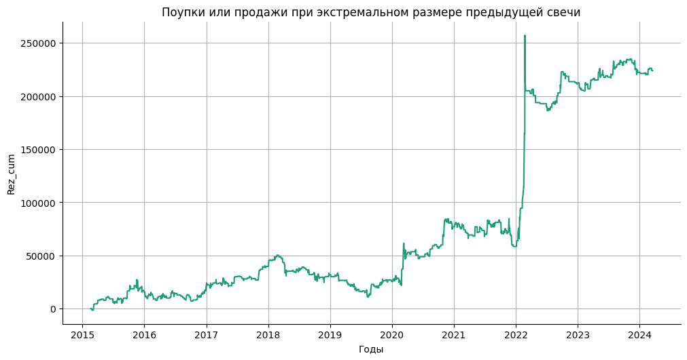
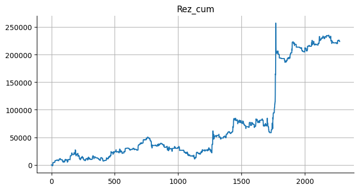
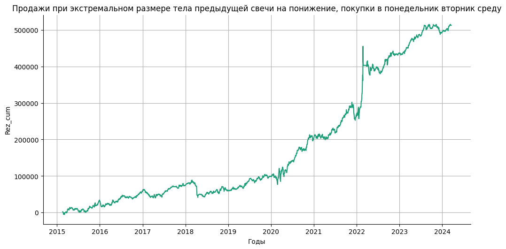
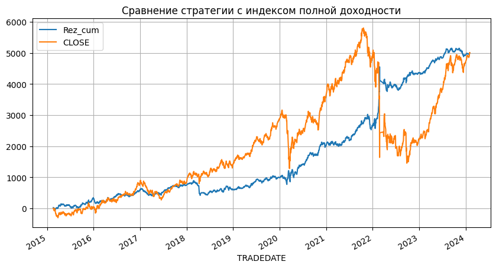

# Статистика по индексу MIX на основе размера тела свечи.

Статистика по направлениям после свечи с аномальным (превышающим 75 перцентиль за `PERIOD` свечей) телом свечи.  
Проверка гипотезы, что после свечи с аномальным превышением размера тела, следует свеча в том же направлении.


```python
PERIOD = 30
```

Подключение гугл диска


```python
from google.colab import drive
drive.mount('/content/drive', force_remount=True)
```

    Mounted at /content/drive
    

Подключение к БД.


```python
import pandas as pd
import numpy as np
import sqlite3
```


```python
connection = sqlite3.connect(r'/content/drive/MyDrive/data_quote_db/MIX_futures_day.db', check_same_thread=True)  # Создание соединения с БД
```

Загрузка данных в таблицу pandas.


```python
with connection:
  df = pd.read_sql('SELECT * FROM Day', connection)  # Загрузка данных из БД

print(df.to_string(max_rows=6, max_cols=25))  # Проверка того, что загрузилось
```

           TRADEDATE      SECID      OPEN       LOW      HIGH     CLOSE  VOLUME  OPENPOSITION SHORTNAME    LSTTRADE
    0     2015-01-05  MXH5_2015  142000.0  138525.0  145950.0  145150.0    2587         12938  MIX-3.15  2015-03-16
    1     2015-01-06  MXH5_2015  144750.0  144350.0  149900.0  149900.0    2953         12760  MIX-3.15  2015-03-16
    2     2015-01-08  MXH5_2015  149500.0  148200.0  158200.0  156025.0    5567         15098  MIX-3.15  2015-03-16
    ...          ...        ...       ...       ...       ...       ...     ...           ...       ...         ...
    2303  2024-03-14       MXH4  332925.0  329275.0  332975.0  330650.0   60896         94590  MIX-3.24  2024-03-21
    2304  2024-03-15       MXH4  330600.0  329850.0  332325.0  331250.0   32069         84632  MIX-3.24  2024-03-21
    2305  2024-03-18       MXH4  330900.0  329775.0  333150.0  330525.0   36079         66916  MIX-3.24  2024-03-21
    

Конвертация типа дат и сортировка по дате.


```python
df = df.drop(['SECID', 'VOLUME', 'OPENPOSITION', 'SHORTNAME', 'LSTTRADE'], axis=1)  # Очистка от неиспользуемых полей
df['TRADEDATE'] = pd.to_datetime(df['TRADEDATE'])
# df['LSTTRADE'] = pd.to_datetime(df['LSTTRADE'])
df = df.dropna().reset_index(drop=True)
df = df.sort_values (by='TRADEDATE', ascending=True)
```

Добавление колонки направления бара.  
0 - понижающийся бар  
1 - повышающийся бар


```python
df['Up/Down'] = df.apply(lambda x: 'Up' if (x['OPEN'] < x['CLOSE']) else 'Down', axis=1)
print(df.to_string(max_rows=6, max_cols=25))  # Проверка
print('\n', df.value_counts("Up/Down"))  # Подсчет количества баров на повышение и понижение
```

          TRADEDATE      OPEN       LOW      HIGH     CLOSE Up/Down
    0    2015-01-05  142000.0  138525.0  145950.0  145150.0      Up
    1    2015-01-06  144750.0  144350.0  149900.0  149900.0      Up
    2    2015-01-08  149500.0  148200.0  158200.0  156025.0      Up
    ...         ...       ...       ...       ...       ...     ...
    2303 2024-03-14  332925.0  329275.0  332975.0  330650.0    Down
    2304 2024-03-15  330600.0  329850.0  332325.0  331250.0      Up
    2305 2024-03-18  330900.0  329775.0  333150.0  330525.0    Down
    
     Up/Down
    Up      1203
    Down    1103
    Name: count, dtype: int64
    

Размер тела свечи.  
Создание колонки с размером тела свечи (Body). Размер тела свечи записан по модулю.


```python
df['Body'] = df.apply(lambda x: abs(x['OPEN'] - x['CLOSE']), axis=1)
print(df.to_string(max_rows=6, max_cols=25))  # Проверка
```

          TRADEDATE      OPEN       LOW      HIGH     CLOSE Up/Down    Body
    0    2015-01-05  142000.0  138525.0  145950.0  145150.0      Up  3150.0
    1    2015-01-06  144750.0  144350.0  149900.0  149900.0      Up  5150.0
    2    2015-01-08  149500.0  148200.0  158200.0  156025.0      Up  6525.0
    ...         ...       ...       ...       ...       ...     ...     ...
    2303 2024-03-14  332925.0  329275.0  332975.0  330650.0    Down  2275.0
    2304 2024-03-15  330600.0  329850.0  332325.0  331250.0      Up   650.0
    2305 2024-03-18  330900.0  329775.0  333150.0  330525.0    Down   375.0
    

Создание колонок с предыдущими размерами свечей для вычисления перцентилей.  
Количество дней для вычисления перцентилей берется с переменной PERIOD.


```python
for i in range(1, PERIOD + 1):
  df[f'Body_{i}'] = df['Body'].shift(i)
print(df.to_string(max_rows=6, max_cols=25))  # Проверка
```

          TRADEDATE      OPEN       LOW      HIGH     CLOSE Up/Down    Body  Body_1  Body_2  Body_3  Body_4  Body_5  ...  Body_19  Body_20  Body_21  Body_22  Body_23  Body_24  Body_25  Body_26  Body_27  Body_28  Body_29  Body_30
    0    2015-01-05  142000.0  138525.0  145950.0  145150.0      Up  3150.0     NaN     NaN     NaN     NaN     NaN  ...      NaN      NaN      NaN      NaN      NaN      NaN      NaN      NaN      NaN      NaN      NaN      NaN
    1    2015-01-06  144750.0  144350.0  149900.0  149900.0      Up  5150.0  3150.0     NaN     NaN     NaN     NaN  ...      NaN      NaN      NaN      NaN      NaN      NaN      NaN      NaN      NaN      NaN      NaN      NaN
    2    2015-01-08  149500.0  148200.0  158200.0  156025.0      Up  6525.0  5150.0  3150.0     NaN     NaN     NaN  ...      NaN      NaN      NaN      NaN      NaN      NaN      NaN      NaN      NaN      NaN      NaN      NaN
    ...         ...       ...       ...       ...       ...     ...     ...     ...     ...     ...     ...     ...  ...      ...      ...      ...      ...      ...      ...      ...      ...      ...      ...      ...      ...
    2303 2024-03-14  332925.0  329275.0  332975.0  330650.0    Down  2275.0  1700.0  2250.0   825.0   225.0   950.0  ...     25.0    525.0    550.0    875.0   1775.0   1650.0   1125.0    475.0    800.0    475.0   2000.0   1100.0
    2304 2024-03-15  330600.0  329850.0  332325.0  331250.0      Up   650.0  2275.0  1700.0  2250.0   825.0   225.0  ...   1325.0     25.0    525.0    550.0    875.0   1775.0   1650.0   1125.0    475.0    800.0    475.0   2000.0
    2305 2024-03-18  330900.0  329775.0  333150.0  330525.0    Down   375.0   650.0  2275.0  1700.0  2250.0   825.0  ...   3375.0   1325.0     25.0    525.0    550.0    875.0   1775.0   1650.0   1125.0    475.0    800.0    475.0
    

Очистка DF от NaN.  


```python
df = df.dropna().reset_index(drop=True)
print(df.to_string(max_rows=6, max_cols=25))  # Проверка
```

          TRADEDATE      OPEN       LOW      HIGH     CLOSE Up/Down    Body  Body_1  Body_2  Body_3  Body_4  Body_5  ...  Body_19  Body_20  Body_21  Body_22  Body_23  Body_24  Body_25  Body_26  Body_27  Body_28  Body_29  Body_30
    0    2015-02-17  181100.0  179075.0  185850.0  179875.0    Down  1225.0  3350.0  2975.0  3100.0  2250.0   975.0  ...   5000.0   1325.0   2175.0   3400.0    125.0   1150.0   2850.0   1900.0    600.0   6525.0   5150.0   3150.0
    1    2015-02-18  179850.0  179750.0  185000.0  181925.0      Up  2075.0  1225.0  3350.0  2975.0  3100.0  2250.0  ...   5825.0   5000.0   1325.0   2175.0   3400.0    125.0   1150.0   2850.0   1900.0    600.0   6525.0   5150.0
    2    2015-02-19  182250.0  176750.0  183475.0  180700.0    Down  1550.0  2075.0  1225.0  3350.0  2975.0  3100.0  ...     50.0   5825.0   5000.0   1325.0   2175.0   3400.0    125.0   1150.0   2850.0   1900.0    600.0   6525.0
    ...         ...       ...       ...       ...       ...     ...     ...     ...     ...     ...     ...     ...  ...      ...      ...      ...      ...      ...      ...      ...      ...      ...      ...      ...      ...
    2273 2024-03-14  332925.0  329275.0  332975.0  330650.0    Down  2275.0  1700.0  2250.0   825.0   225.0   950.0  ...     25.0    525.0    550.0    875.0   1775.0   1650.0   1125.0    475.0    800.0    475.0   2000.0   1100.0
    2274 2024-03-15  330600.0  329850.0  332325.0  331250.0      Up   650.0  2275.0  1700.0  2250.0   825.0   225.0  ...   1325.0     25.0    525.0    550.0    875.0   1775.0   1650.0   1125.0    475.0    800.0    475.0   2000.0
    2275 2024-03-18  330900.0  329775.0  333150.0  330525.0    Down   375.0   650.0  2275.0  1700.0  2250.0   825.0  ...   3375.0   1325.0     25.0    525.0    550.0    875.0   1775.0   1650.0   1125.0    475.0    800.0    475.0
    

Создание колонки с расчетом 75 перцентиля (per75) и удаление колонок с предыдущими значениями тел свечей.


```python
df['per75'] = df.apply(lambda x: np.percentile([x[f'Body_{i}'] for i in range(1, PERIOD + 1)], 75), axis=1)
df['per100'] = df.apply(lambda x: np.percentile([x[f'Body_{i}'] for i in range(1, PERIOD + 1)], 100), axis=1)
drop_column_lst = [f'Body_{i}' for i in range(1, PERIOD + 1)]
df = df.drop(drop_column_lst, axis=1)
print(df.to_string(max_rows=6, max_cols=25))  # Проверка
```

          TRADEDATE      OPEN       LOW      HIGH     CLOSE Up/Down    Body    per75  per100
    0    2015-02-17  181100.0  179075.0  185850.0  179875.0    Down  1225.0  3387.50  6525.0
    1    2015-02-18  179850.0  179750.0  185000.0  181925.0      Up  2075.0  3387.50  6525.0
    2    2015-02-19  182250.0  176750.0  183475.0  180700.0    Down  1550.0  3306.25  6525.0
    ...         ...       ...       ...       ...       ...     ...     ...      ...     ...
    2273 2024-03-14  332925.0  329275.0  332975.0  330650.0    Down  2275.0  1943.75  6025.0
    2274 2024-03-15  330600.0  329850.0  332325.0  331250.0      Up   650.0  2187.50  6025.0
    2275 2024-03-18  330900.0  329775.0  333150.0  330525.0    Down   375.0  2131.25  6025.0
    

Создание колонки с маркерами выбросов больше 75 перцентиля (Over_per75).  
0 - нет превышения 75 перцентиля по размеру тела свечи.  
1 - есть превышение 75 перцентиля по размеру тела свечи.


```python
df['Over_per75'] = df.apply(lambda x: True if (x['Body'] > x['per75']) else False, axis=1)
print(df.to_string(max_rows=6, max_cols=25))  # Проверка
```

          TRADEDATE      OPEN       LOW      HIGH     CLOSE Up/Down    Body    per75  per100  Over_per75
    0    2015-02-17  181100.0  179075.0  185850.0  179875.0    Down  1225.0  3387.50  6525.0       False
    1    2015-02-18  179850.0  179750.0  185000.0  181925.0      Up  2075.0  3387.50  6525.0       False
    2    2015-02-19  182250.0  176750.0  183475.0  180700.0    Down  1550.0  3306.25  6525.0       False
    ...         ...       ...       ...       ...       ...     ...     ...      ...     ...         ...
    2273 2024-03-14  332925.0  329275.0  332975.0  330650.0    Down  2275.0  1943.75  6025.0        True
    2274 2024-03-15  330600.0  329850.0  332325.0  331250.0      Up   650.0  2187.50  6025.0       False
    2275 2024-03-18  330900.0  329775.0  333150.0  330525.0    Down   375.0  2131.25  6025.0       False
    

Создание колонки с маркерами выбросов больше 75 пецентиля для предыдущего бара (prev_Over_per75).  
Создание колонки с направлением предыдущнго бара (prev_Up/Down).


```python
df['prev_Up/Down'] = df['Up/Down'].shift(1)
df['prev_Over_per75'] = df['Over_per75'].shift(1)
print(df.to_string(max_rows=6, max_cols=25))  # Проверка
```

          TRADEDATE      OPEN       LOW      HIGH     CLOSE Up/Down    Body    per75  per100  Over_per75 prev_Up/Down prev_Over_per75
    0    2015-02-17  181100.0  179075.0  185850.0  179875.0    Down  1225.0  3387.50  6525.0       False         None             NaN
    1    2015-02-18  179850.0  179750.0  185000.0  181925.0      Up  2075.0  3387.50  6525.0       False         Down           False
    2    2015-02-19  182250.0  176750.0  183475.0  180700.0    Down  1550.0  3306.25  6525.0       False           Up           False
    ...         ...       ...       ...       ...       ...     ...     ...      ...     ...         ...          ...             ...
    2273 2024-03-14  332925.0  329275.0  332975.0  330650.0    Down  2275.0  1943.75  6025.0        True         Down           False
    2274 2024-03-15  330600.0  329850.0  332325.0  331250.0      Up   650.0  2187.50  6025.0       False         Down            True
    2275 2024-03-18  330900.0  329775.0  333150.0  330525.0    Down   375.0  2131.25  6025.0       False           Up           False
    

Очитка от NaN и смена типа на int


```python
df = df.dropna().reset_index(drop=True)
# df[['prev_Up/Down', 'prev_Over_per75']] = df[['prev_Up/Down', 'prev_Over_per75']].astype(int)
print(df.to_string(max_rows=6, max_cols=25))  # Проверка
```

          TRADEDATE      OPEN       LOW      HIGH     CLOSE Up/Down    Body    per75  per100  Over_per75 prev_Up/Down prev_Over_per75
    0    2015-02-18  179850.0  179750.0  185000.0  181925.0      Up  2075.0  3387.50  6525.0       False         Down           False
    1    2015-02-19  182250.0  176750.0  183475.0  180700.0    Down  1550.0  3306.25  6525.0       False           Up           False
    2    2015-02-20  180525.0  178925.0  183200.0  180575.0      Up    50.0  3156.25  6325.0       False         Down           False
    ...         ...       ...       ...       ...       ...     ...     ...      ...     ...         ...          ...             ...
    2272 2024-03-14  332925.0  329275.0  332975.0  330650.0    Down  2275.0  1943.75  6025.0        True         Down           False
    2273 2024-03-15  330600.0  329850.0  332325.0  331250.0      Up   650.0  2187.50  6025.0       False         Down            True
    2274 2024-03-18  330900.0  329775.0  333150.0  330525.0    Down   375.0  2131.25  6025.0       False           Up           False
    

Проверка гипотезы, что после свечи с аномальным превышением размера тела, следует свеча в том же направлении.  
-1 - гипотеза не подтверждается.  
0 - Без проверки гипотезы на этой свече (нет условия анамального размера тела предыдущей свечи).  
1 - Гипотеза подтверждается.  


```python
def rez(up_down, prev_up_down, prev_over_per75):
    if (up_down == prev_up_down) and (prev_over_per75 == 1):
        return 1
    elif (up_down != prev_up_down) and (prev_over_per75 == 1):
        return -1
    else:
        return 0

df['Rez'] = df.apply(lambda x: rez(x['Up/Down'], x['prev_Up/Down'], x['prev_Over_per75']), axis=1)
print(df.to_string(max_rows=6, max_cols=25))  # Проверка
print('\n', df.value_counts("Rez"))
```

          TRADEDATE      OPEN       LOW      HIGH     CLOSE Up/Down    Body    per75  per100  Over_per75 prev_Up/Down prev_Over_per75  Rez
    0    2015-02-18  179850.0  179750.0  185000.0  181925.0      Up  2075.0  3387.50  6525.0       False         Down           False    0
    1    2015-02-19  182250.0  176750.0  183475.0  180700.0    Down  1550.0  3306.25  6525.0       False           Up           False    0
    2    2015-02-20  180525.0  178925.0  183200.0  180575.0      Up    50.0  3156.25  6325.0       False         Down           False    0
    ...         ...       ...       ...       ...       ...     ...     ...      ...     ...         ...          ...             ...  ...
    2272 2024-03-14  332925.0  329275.0  332975.0  330650.0    Down  2275.0  1943.75  6025.0        True         Down           False    0
    2273 2024-03-15  330600.0  329850.0  332325.0  331250.0      Up   650.0  2187.50  6025.0       False         Down            True   -1
    2274 2024-03-18  330900.0  329775.0  333150.0  330525.0    Down   375.0  2131.25  6025.0       False           Up           False    0
    
     Rez
     0    1664
     1     312
    -1     299
    Name: count, dtype: int64
    

По результату видно, что количественная оценка не подтверждает гипотезу, что после свечи с аномальным превышением размера тела, следует свеча в том же направлении.  

---

Количественная оценка не может быть показателем для применения на практике т.к. аномальные размеры тела свечи в периоды спокойного рынка и в периоды высокой волатильности, очень сильно различаются.  
Подсчитаем сумму размеров тел свечей идущих следом за свечами с аномальным размером тела. С учетом направления. Своего рода симуляция торговли. Результат получен положительный.  


```python
def rez_value(body, rez):
    if rez == 1:
        return body
    elif rez == -1:
        return -body
    else:
        return 0

df_body = df.copy(deep=True)  # Создание копии
df_body['Rez_value'] = df_body.apply(lambda x: rez_value(x['Body'], x['Rez']), axis=1)
df_body["Rez_cum"] = df_body["Rez_value"].cumsum()
print(df_body.to_string(max_rows=6, max_cols=25))  # Проверка
print('\n', df_body[['Rez_value']].sum())  # Сумма всех элементов в колонке
```

          TRADEDATE      OPEN       LOW      HIGH     CLOSE Up/Down    Body    per75  per100  Over_per75 prev_Up/Down prev_Over_per75  Rez  Rez_value   Rez_cum
    0    2015-02-18  179850.0  179750.0  185000.0  181925.0      Up  2075.0  3387.50  6525.0       False         Down           False    0        0.0       0.0
    1    2015-02-19  182250.0  176750.0  183475.0  180700.0    Down  1550.0  3306.25  6525.0       False           Up           False    0        0.0       0.0
    2    2015-02-20  180525.0  178925.0  183200.0  180575.0      Up    50.0  3156.25  6325.0       False         Down           False    0        0.0       0.0
    ...         ...       ...       ...       ...       ...     ...     ...      ...     ...         ...          ...             ...  ...        ...       ...
    2272 2024-03-14  332925.0  329275.0  332975.0  330650.0    Down  2275.0  1943.75  6025.0        True         Down           False    0        0.0  224500.0
    2273 2024-03-15  330600.0  329850.0  332325.0  331250.0      Up   650.0  2187.50  6025.0       False         Down            True   -1     -650.0  223850.0
    2274 2024-03-18  330900.0  329775.0  333150.0  330525.0    Down   375.0  2131.25  6025.0       False           Up           False    0        0.0  223850.0
    
     Rez_value    223850.0
    dtype: float64
    

Строим график симуляции торговли по гипотезе.


```python
from matplotlib import pyplot as plt
import seaborn as sns
def _plot_series(series, series_name, series_index=0):
  from matplotlib import pyplot as plt
  import seaborn as sns
  palette = list(sns.palettes.mpl_palette('Dark2'))
  xs = series['TRADEDATE']
  ys = series['Rez_cum']

  plt.plot(xs, ys, label=series_name, color=palette[series_index % len(palette)])

fig, ax = plt.subplots(figsize=(10, 5.2), layout='constrained')
df_sorted = df_body.sort_values('TRADEDATE', ascending=True)
_plot_series(df_sorted, '')
sns.despine(fig=fig, ax=ax)
plt.xlabel('Годы')
plt.title('Поупки или продажи при экстремальном размере предыдущей свечи')
plt.grid()
_ = plt.ylabel('Rez_cum')
```


    

    


График не по годам, а по количеству сделок


```python
from matplotlib import pyplot as plt
df_body['Rez_cum'].plot(kind='line', figsize=(8, 4), title='Rez_cum')
plt.gca().spines[['top', 'right']].set_visible(False)
plt.grid()
```


    

    


## Выводы:  
1. Гипотеза: после свечи с аномальным превышением размера тела, следует свеча в том же направлении, не подтвердилась в количественном выражении.  
2. Симуляция торговли с использованием гипотезы дала положительный результат.  
3. Если рассматривать график результатов симуляции торговли, то можно сделать вывод, что положительный результат торговли достигается в периоды повышенной волатильности рынка (COVID-19, СВО).

---

## Добавление симуляции торговли по дням недели


Создание и заполнение колонки с торговым днем недели (Work_day).  
0 - Понедельник  
1 - Вторник  
и т.д.


```python
df['Work_day'] = df['TRADEDATE'].dt.weekday

df[['Work_day']] = df[['Work_day']].astype(int)
df = df.sort_values(by='TRADEDATE', ascending=True)  # Сортировка по возрастанию
print(df.to_string(max_rows=6, max_cols=25))  # Проверка
```

          TRADEDATE      OPEN       LOW      HIGH     CLOSE Up/Down    Body    per75  per100  Over_per75 prev_Up/Down prev_Over_per75  Rez  Work_day
    0    2015-02-18  179850.0  179750.0  185000.0  181925.0      Up  2075.0  3387.50  6525.0       False         Down           False    0         2
    1    2015-02-19  182250.0  176750.0  183475.0  180700.0    Down  1550.0  3306.25  6525.0       False           Up           False    0         3
    2    2015-02-20  180525.0  178925.0  183200.0  180575.0      Up    50.0  3156.25  6325.0       False         Down           False    0         4
    ...         ...       ...       ...       ...       ...     ...     ...      ...     ...         ...          ...             ...  ...       ...
    2272 2024-03-14  332925.0  329275.0  332975.0  330650.0    Down  2275.0  1943.75  6025.0        True         Down           False    0         3
    2273 2024-03-15  330600.0  329850.0  332325.0  331250.0      Up   650.0  2187.50  6025.0       False         Down            True   -1         4
    2274 2024-03-18  330900.0  329775.0  333150.0  330525.0    Down   375.0  2131.25  6025.0       False           Up           False    0         0
    

Создание колонки с результатом при продажах при экстремальном размере тела предыдущей свечи на понижение и покупки в понедельник вторник среду.


```python
def rez_value(prev_Over_per75, prev_Up_Down, Up_Down, Work_day, body):
    if (prev_Over_per75 == True) and (prev_Up_Down == 'Down') and (Up_Down == 'Down'):
      return body
    elif (prev_Over_per75 == True) and (prev_Up_Down == 'Down') and (Up_Down == 'Up'):
      return -body
    elif (Work_day < 3) and (Up_Down == 'Up'):
      return body
    elif (Work_day < 3) and (Up_Down == 'Down'):
      return -body
    else:
      return 0

df['Rez_value'] = df.apply(lambda x: rez_value(x['prev_Over_per75'],
                                               x['prev_Up/Down'],
                                               x['Up/Down'],
                                               x['Work_day'],
                                               x['Body'], ), axis=1)
df["Rez_cum"] = df["Rez_value"].cumsum()
print(df.to_string(max_rows=20, max_cols=25))  # Проверка
print('\n', df[['Rez_value']].sum())  # Сумма всех элементов в колонке
```

          TRADEDATE      OPEN       LOW      HIGH     CLOSE Up/Down    Body    per75  per100  Over_per75 prev_Up/Down prev_Over_per75  Rez  Work_day  Rez_value   Rez_cum
    0    2015-02-18  179850.0  179750.0  185000.0  181925.0      Up  2075.0  3387.50  6525.0       False         Down           False    0         2     2075.0    2075.0
    1    2015-02-19  182250.0  176750.0  183475.0  180700.0    Down  1550.0  3306.25  6525.0       False           Up           False    0         3        0.0    2075.0
    2    2015-02-20  180525.0  178925.0  183200.0  180575.0      Up    50.0  3156.25  6325.0       False         Down           False    0         4        0.0    2075.0
    3    2015-02-24  180300.0  176500.0  181800.0  178250.0    Down  2050.0  3156.25  6325.0       False           Up           False    0         1    -2050.0      25.0
    4    2015-02-25  178200.0  173450.0  179100.0  174750.0    Down  3450.0  3156.25  6325.0        True         Down           False    0         2    -3450.0   -3425.0
    5    2015-02-26  175000.0  174075.0  177925.0  176400.0      Up  1400.0  3306.25  6325.0       False         Down            True   -1         3    -1400.0   -4825.0
    6    2015-02-27  176350.0  174050.0  177925.0  177450.0      Up  1100.0  3306.25  6325.0       False           Up           False    0         4        0.0   -4825.0
    7    2015-03-02  177500.0  177175.0  180075.0  178500.0      Up  1000.0  3306.25  6325.0       False           Up           False    0         0     1000.0   -3825.0
    8    2015-03-03  178600.0  177450.0  183525.0  181450.0      Up  2850.0  3156.25  6325.0       False           Up           False    0         1     2850.0    -975.0
    9    2015-03-04  181250.0  176175.0  182675.0  176900.0    Down  4350.0  3156.25  6325.0        True           Up           False    0         2    -4350.0   -5325.0
    ...         ...       ...       ...       ...       ...     ...     ...      ...     ...         ...          ...             ...  ...       ...        ...       ...
    2265 2024-03-04  329200.0  329025.0  331900.0  331650.0      Up  2450.0  1606.25  6025.0        True           Up           False    0         0     2450.0  512725.0
    2266 2024-03-05  331625.0  330400.0  333225.0  331725.0      Up   100.0  1743.75  6025.0       False           Up            True    1         1      100.0  512825.0
    2267 2024-03-06  331725.0  330775.0  333475.0  332675.0      Up   950.0  1743.75  6025.0       False           Up           False    0         2      950.0  513775.0
    2268 2024-03-07  332750.0  331750.0  333100.0  332975.0      Up   225.0  1743.75  6025.0       False           Up           False    0         3        0.0  513775.0
    2269 2024-03-11  332950.0  332100.0  334800.0  332125.0    Down   825.0  1743.75  6025.0       False           Up           False    0         0     -825.0  512950.0
    2270 2024-03-12  332150.0  330625.0  334475.0  334400.0      Up  2250.0  1743.75  6025.0        True         Down           False    0         1     2250.0  515200.0
    2271 2024-03-13  334500.0  332650.0  335125.0  332800.0    Down  1700.0  1943.75  6025.0       False           Up            True   -1         2    -1700.0  513500.0
    2272 2024-03-14  332925.0  329275.0  332975.0  330650.0    Down  2275.0  1943.75  6025.0        True         Down           False    0         3        0.0  513500.0
    2273 2024-03-15  330600.0  329850.0  332325.0  331250.0      Up   650.0  2187.50  6025.0       False         Down            True   -1         4     -650.0  512850.0
    2274 2024-03-18  330900.0  329775.0  333150.0  330525.0    Down   375.0  2131.25  6025.0       False           Up           False    0         0     -375.0  512475.0
    
     Rez_value    512475.0
    dtype: float64
    

Строим график симуляции торговли по гипотезе.


```python
from matplotlib import pyplot as plt
import seaborn as sns
def _plot_series(series, series_name, series_index=0):
  palette = list(sns.palettes.mpl_palette('Dark2'))
  xs = series['TRADEDATE']
  ys = series['Rez_cum']

  plt.plot(xs, ys, label=series_name, color=palette[series_index % len(palette)])

fig, ax = plt.subplots(figsize=(10, 5.2), layout='constrained')
df_sorted = df.sort_values('TRADEDATE', ascending=True)
_plot_series(df_sorted, '')
sns.despine(fig=fig, ax=ax)
plt.xlabel('Годы')
plt.title('Продажи при экстремальном размере тела предыдущей свечи на понижение, покупки в понедельник вторник среду')
plt.grid()
_ = plt.ylabel('Rez_cum')
```


    

    


---

### Сравнение доходности стратегии с индексом полной доходности MCFTR.


```python
pip install apimoex  # Инсталяция библиотеки для запросов к серверу MOEX
```

    Collecting apimoex
      Downloading apimoex-1.4.0-py3-none-any.whl (11 kB)
    Requirement already satisfied: requests>=2.31.0 in /usr/local/lib/python3.10/dist-packages (from apimoex) (2.31.0)
    Requirement already satisfied: charset-normalizer<4,>=2 in /usr/local/lib/python3.10/dist-packages (from requests>=2.31.0->apimoex) (3.3.2)
    Requirement already satisfied: idna<4,>=2.5 in /usr/local/lib/python3.10/dist-packages (from requests>=2.31.0->apimoex) (3.6)
    Requirement already satisfied: urllib3<3,>=1.21.1 in /usr/local/lib/python3.10/dist-packages (from requests>=2.31.0->apimoex) (2.0.7)
    Requirement already satisfied: certifi>=2017.4.17 in /usr/local/lib/python3.10/dist-packages (from requests>=2.31.0->apimoex) (2024.2.2)
    Installing collected packages: apimoex
    Successfully installed apimoex-1.4.0
    


```python
import apimoex
import requests
from datetime import datetime, timedelta, date
```


```python
start_date = '2015-01-01'
end_date = (datetime.now().date() - timedelta(days=1)).strftime("%Y-%m-%d")  #

with requests.Session() as session:
    data = apimoex.get_market_candles(
        session=session,
        security="mcftr",
        market="index",
        engine="stock",
        interval=24,
        start = start_date,
        end = end_date,
        columns = ('begin', 'open', 'close', 'high', 'low',),
    )
    df_idx = pd.DataFrame(data)

print(df_idx)
```

                        begin     open    close     high      low
    0     2016-11-18 00:00:00  2856.55  2856.55  2856.55  2856.55
    1     2016-11-21 00:00:00  2885.25  2885.25  2885.25  2885.25
    2     2016-11-22 00:00:00  2895.63  2895.63  2895.63  2895.63
    3     2016-11-23 00:00:00  2923.06  2923.06  2923.06  2923.06
    4     2016-11-24 00:00:00  2947.19  2947.19  2947.19  2947.19
    ...                   ...      ...      ...      ...      ...
    1849  2024-04-10 00:00:00  7824.71  7824.71  7824.71  7824.71
    1850  2024-04-11 00:00:00  7825.67  7825.67  7825.67  7825.67
    1851  2024-04-12 00:00:00  7863.69  7863.69  7863.69  7863.69
    1852  2024-04-15 00:00:00  7899.98  7899.98  7899.98  7899.98
    1853  2024-04-16 00:00:00  7878.93  7878.93  7878.93  7878.93
    
    [1854 rows x 5 columns]
    

Данные загрузились с конца 2016, поэтому загрузим из БД.


```python
connection_idx = sqlite3.connect(r'/content/drive/MyDrive/data_quote_db/MCFTR_index_day.db', check_same_thread=True)  # Создание соединения с БД
with connection:
  df_idx = pd.read_sql('SELECT * FROM Day', connection_idx)  # Загрузка данных из БД

print(df_idx.to_string(max_rows=6, max_cols=25))  # Проверка того, что загрузилось
```

           TRADEDATE  SECID     OPEN      LOW     HIGH    CLOSE
    0     2015-01-05  MCFTR  1843.75  1843.75  1843.75  1843.75
    1     2015-01-06  MCFTR  1901.63  1901.63  1901.63  1901.63
    2     2015-01-08  MCFTR  1987.24  1987.24  1987.24  1987.24
    ...          ...    ...      ...      ...      ...      ...
    2271  2024-01-31  MCFTR  7302.35  7302.35  7302.35  7302.35
    2272  2024-02-01  MCFTR  7338.02  7338.02  7338.02  7338.02
    2273  2024-02-02  MCFTR  7329.98  7329.98  7329.98  7329.98
    


```python
df = df.set_index('TRADEDATE')
df = df[['Rez_cum']]
df['Rez_cum'] = df['Rez_cum'] / 100
df.index = pd.to_datetime(df.index)
print(df.to_string(max_rows=6, max_cols=25))
```

                Rez_cum
    TRADEDATE          
    2015-02-18    20.75
    2015-02-19    20.75
    2015-02-20    20.75
    ...             ...
    2024-03-14  5135.00
    2024-03-15  5128.50
    2024-03-18  5124.75
    


```python
df_idx = df_idx.set_index('TRADEDATE')
df_idx.index = pd.to_datetime(df_idx.index)
df_idx = df_idx[['CLOSE']]
df_idx['CLOSE'] = df_idx['CLOSE'] - 2324.27
print(df_idx.to_string(max_rows=6, max_cols=25))
```

                  CLOSE
    TRADEDATE          
    2015-01-05  -480.52
    2015-01-06  -422.64
    2015-01-08  -337.03
    ...             ...
    2024-01-31  4978.08
    2024-02-01  5013.75
    2024-02-02  5005.71
    


```python
df = pd.merge(df, df_idx, how='inner', left_index=True, right_index=True)  # suffixes=('_x', '_y') по умолчанию
print(df.to_string(max_rows=6, max_cols=25))
# df
```

                Rez_cum    CLOSE
    TRADEDATE                   
    2015-02-18    20.75     0.00
    2015-02-19    20.75   -15.15
    2015-02-20    20.75   -21.79
    ...             ...      ...
    2024-01-31  4999.50  4978.08
    2024-02-01  4999.50  5013.75
    2024-02-02  4999.50  5005.71
    


```python
plt.figure();
plot = df.plot(title="Сравнение стратегии с индексом полной доходности",
               grid=True,
               figsize=(10, 5.2),
               layout='constrained')
```


    <Figure size 640x480 with 0 Axes>


    

    

