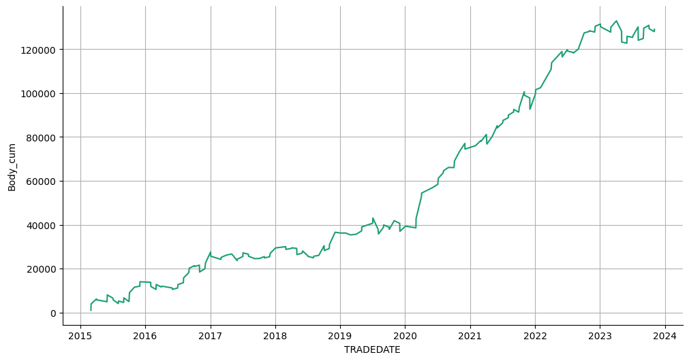

# Статистика по индексу MIX на основе дней в месяце.

Статистика по направлениям свечей в зависимости от дня в месяце.

Подключение гугл диска


```python
from google.colab import drive
drive.mount('/content/drive')
```

    Drive already mounted at /content/drive; to attempt to forcibly remount, call drive.mount("/content/drive", force_remount=True).
    

Подключение к БД.


```python
import pandas as pd
import numpy as np
import sqlite3
import datetime
```


```python
connection = sqlite3.connect(r'/content/drive/MyDrive/data_quote_db/MIX_futures_day.db', check_same_thread=True)  # Создание соединения с БД
```

Загрузка данных в таблицу pandas.


```python
with connection:
  df = pd.read_sql('SELECT * FROM Day', connection)  # Загрузка данных из БД

print(df.to_string(max_rows=6, max_cols=25))  # Проверка того, что загрузилось
```

           TRADEDATE      SECID      OPEN       LOW      HIGH     CLOSE  VOLUME  OPENPOSITION  SHORTNAME    LSTTRADE
    0     2015-01-05  MXH5_2015  142000.0  138525.0  145950.0  145150.0    2587         12938   MIX-3.15  2015-03-16
    1     2015-01-06  MXH5_2015  144750.0  144350.0  149900.0  149900.0    2953         12760   MIX-3.15  2015-03-16
    2     2015-01-08  MXH5_2015  149500.0  148200.0  158200.0  156025.0    5567         15098   MIX-3.15  2015-03-16
    ...          ...        ...       ...       ...       ...       ...     ...           ...        ...         ...
    2232  2023-11-30       MXZ3  317150.0  314350.0  319400.0  316375.0   54579        121210  MIX-12.23  2023-12-21
    2233  2023-12-01       MXZ3  316025.0  313500.0  316850.0  314100.0   34534        121160  MIX-12.23  2023-12-21
    2234  2023-12-04       MXZ3  313950.0  310775.0  314100.0  311125.0   42154        121720  MIX-12.23  2023-12-21
    

Подготовка DF


```python
df = df.drop(['SECID', 'OPENPOSITION', 'SHORTNAME', 'LSTTRADE'], axis=1)
df['TRADEDATE'] = pd.to_datetime(df['TRADEDATE'])  # Смена типа
df = df.dropna().reset_index(drop=True)  # Удаление NaN
df = df.sort_values(by='TRADEDATE', ascending=False)  # Сортировка по убыванию
```

Создание и заполнение колонки с торговым днем месяца по убыванию.


```python
df['Work_day'] = np.nan  # Создание колонки и заполнение NaN
month_cur = 0
n = 1
for i in range(0, len(df)):
  if i == 0:
    month_prev = df.iloc[0, 0].month
  month_cur = df.iloc[i, 0].month
  if month_cur != month_prev:
    n = 1

  df.iloc[i, df.columns.get_loc('Work_day')] = n
  n += 1
  month_prev = month_cur

df[['Work_day']] = df[['Work_day']].astype(int)
df = df.sort_values(by='TRADEDATE', ascending=True)  # Сортировка по возрастанию
print(df.to_string(max_rows=6, max_cols=25))  # Проверка
```

          TRADEDATE      OPEN       LOW      HIGH     CLOSE  VOLUME  Work_day
    0    2015-01-05  142000.0  138525.0  145950.0  145150.0    2587        19
    1    2015-01-06  144750.0  144350.0  149900.0  149900.0    2953        18
    2    2015-01-08  149500.0  148200.0  158200.0  156025.0    5567        17
    ...         ...       ...       ...       ...       ...     ...       ...
    2232 2023-11-30  317150.0  314350.0  319400.0  316375.0   54579         1
    2233 2023-12-01  316025.0  313500.0  316850.0  314100.0   34534         2
    2234 2023-12-04  313950.0  310775.0  314100.0  311125.0   42154         1
    

Отбрасываем последний (неполный) месяц.


```python
year = df.iloc[-1, 0].year
month = df.iloc[-1, 0].month
end_date = datetime.datetime(year, month, 1)
df = df[df['TRADEDATE'] < end_date]
print(f'{year}-{month} отбрасываем этот месяц.')
print(df.to_string(max_rows=6, max_cols=25))  # Проверка
```

    2023-12 отбрасываем этот месяц.
          TRADEDATE      OPEN       LOW      HIGH     CLOSE  VOLUME  Work_day
    0    2015-01-05  142000.0  138525.0  145950.0  145150.0    2587        19
    1    2015-01-06  144750.0  144350.0  149900.0  149900.0    2953        18
    2    2015-01-08  149500.0  148200.0  158200.0  156025.0    5567        17
    ...         ...       ...       ...       ...       ...     ...       ...
    2230 2023-11-28  318000.0  315525.0  320000.0  319300.0   35236         3
    2231 2023-11-29  319300.0  316550.0  319975.0  317350.0   31695         2
    2232 2023-11-30  317150.0  314350.0  319400.0  316375.0   54579         1
    

Добавление колонки направления бара.


```python
# df['Up/Down'] = df.apply(lambda x: 1 if (x['OPEN'] < x['CLOSE']) else 0, axis=1)
df['Up'] = df.apply(lambda x: 1 if (x['OPEN'] < x['CLOSE']) else np.nan, axis=1)
df['Down'] = df.apply(lambda x: 1 if (x['OPEN'] >= x['CLOSE']) else np.nan, axis=1)
df['Body'] = df.apply(lambda x: -x['OPEN'] + x['CLOSE'], axis=1)
print(df.to_string(max_rows=6, max_cols=25))  # Проверка
# print('\n', df.value_counts("Up/Down"))
```

          TRADEDATE      OPEN       LOW      HIGH     CLOSE  VOLUME  Work_day   Up  Down    Body
    0    2015-01-05  142000.0  138525.0  145950.0  145150.0    2587        19  1.0   NaN  3150.0
    1    2015-01-06  144750.0  144350.0  149900.0  149900.0    2953        18  1.0   NaN  5150.0
    2    2015-01-08  149500.0  148200.0  158200.0  156025.0    5567        17  1.0   NaN  6525.0
    ...         ...       ...       ...       ...       ...     ...       ...  ...   ...     ...
    2230 2023-11-28  318000.0  315525.0  320000.0  319300.0   35236         3  1.0   NaN  1300.0
    2231 2023-11-29  319300.0  316550.0  319975.0  317350.0   31695         2  NaN   1.0 -1950.0
    2232 2023-11-30  317150.0  314350.0  319400.0  316375.0   54579         1  NaN   1.0  -775.0
    

Агрегация данных: подсчет количества баров на повышение и понижение по рабочену дню в месяце, суммирование размера тела свечи.


```python
agg_func_count = {'Up': ['count'],
                  'Down': ['count'],
                  'Body': ['sum']}
df_count = df.groupby(['Work_day']).agg(agg_func_count)  # статистика по Up / Down
df_count
```


  <div id="df-99eca312-af7e-40cd-ad67-4f072d0b54b3" class="colab-df-container">
    <div>
<style scoped>
    .dataframe tbody tr th:only-of-type {
        vertical-align: middle;
    }

    .dataframe tbody tr th {
        vertical-align: top;
    }

    .dataframe thead tr th {
        text-align: left;
    }

    .dataframe thead tr:last-of-type th {
        text-align: right;
    }
</style>
<table border="1" class="dataframe">
  <thead>
    <tr>
      <th></th>
      <th>Up</th>
      <th>Down</th>
      <th>Body</th>
    </tr>
    <tr>
      <th></th>
      <th>count</th>
      <th>count</th>
      <th>sum</th>
    </tr>
    <tr>
      <th>Work_day</th>
      <th></th>
      <th></th>
      <th></th>
    </tr>
  </thead>
  <tbody>
    <tr>
      <th>1</th>
      <td>57</td>
      <td>50</td>
      <td>-5375.0</td>
    </tr>
    <tr>
      <th>2</th>
      <td>60</td>
      <td>47</td>
      <td>65850.0</td>
    </tr>
    <tr>
      <th>3</th>
      <td>61</td>
      <td>46</td>
      <td>-37525.0</td>
    </tr>
    <tr>
      <th>4</th>
      <td>57</td>
      <td>50</td>
      <td>26325.0</td>
    </tr>
    <tr>
      <th>5</th>
      <td>58</td>
      <td>49</td>
      <td>-8450.0</td>
    </tr>
    <tr>
      <th>6</th>
      <td>62</td>
      <td>45</td>
      <td>-14500.0</td>
    </tr>
    <tr>
      <th>7</th>
      <td>58</td>
      <td>48</td>
      <td>-24900.0</td>
    </tr>
    <tr>
      <th>8</th>
      <td>49</td>
      <td>57</td>
      <td>-34950.0</td>
    </tr>
    <tr>
      <th>9</th>
      <td>48</td>
      <td>58</td>
      <td>-44775.0</td>
    </tr>
    <tr>
      <th>10</th>
      <td>51</td>
      <td>55</td>
      <td>6950.0</td>
    </tr>
    <tr>
      <th>11</th>
      <td>54</td>
      <td>52</td>
      <td>31650.0</td>
    </tr>
    <tr>
      <th>12</th>
      <td>52</td>
      <td>54</td>
      <td>-49000.0</td>
    </tr>
    <tr>
      <th>13</th>
      <td>46</td>
      <td>60</td>
      <td>-42175.0</td>
    </tr>
    <tr>
      <th>14</th>
      <td>48</td>
      <td>58</td>
      <td>-29850.0</td>
    </tr>
    <tr>
      <th>15</th>
      <td>58</td>
      <td>48</td>
      <td>51125.0</td>
    </tr>
    <tr>
      <th>16</th>
      <td>55</td>
      <td>51</td>
      <td>6300.0</td>
    </tr>
    <tr>
      <th>17</th>
      <td>54</td>
      <td>52</td>
      <td>4625.0</td>
    </tr>
    <tr>
      <th>18</th>
      <td>51</td>
      <td>55</td>
      <td>-4275.0</td>
    </tr>
    <tr>
      <th>19</th>
      <td>54</td>
      <td>49</td>
      <td>37050.0</td>
    </tr>
    <tr>
      <th>20</th>
      <td>59</td>
      <td>34</td>
      <td>51250.0</td>
    </tr>
    <tr>
      <th>21</th>
      <td>46</td>
      <td>30</td>
      <td>77800.0</td>
    </tr>
    <tr>
      <th>22</th>
      <td>21</td>
      <td>17</td>
      <td>28225.0</td>
    </tr>
    <tr>
      <th>23</th>
      <td>4</td>
      <td>5</td>
      <td>2950.0</td>
    </tr>
  </tbody>
</table>
</div>
    <div class="colab-df-buttons">

  <div class="colab-df-container">
    <button class="colab-df-convert" onclick="convertToInteractive('df-99eca312-af7e-40cd-ad67-4f072d0b54b3')"
            title="Convert this dataframe to an interactive table."
            style="display:none;">

  <svg xmlns="http://www.w3.org/2000/svg" height="24px" viewBox="0 -960 960 960">
    <path d="M120-120v-720h720v720H120Zm60-500h600v-160H180v160Zm220 220h160v-160H400v160Zm0 220h160v-160H400v160ZM180-400h160v-160H180v160Zm440 0h160v-160H620v160ZM180-180h160v-160H180v160Zm440 0h160v-160H620v160Z"/>
  </svg>
    </button>

  <style>
    .colab-df-container {
      display:flex;
      gap: 12px;
    }

    .colab-df-convert {
      background-color: #E8F0FE;
      border: none;
      border-radius: 50%;
      cursor: pointer;
      display: none;
      fill: #1967D2;
      height: 32px;
      padding: 0 0 0 0;
      width: 32px;
    }

    .colab-df-convert:hover {
      background-color: #E2EBFA;
      box-shadow: 0px 1px 2px rgba(60, 64, 67, 0.3), 0px 1px 3px 1px rgba(60, 64, 67, 0.15);
      fill: #174EA6;
    }

    .colab-df-buttons div {
      margin-bottom: 4px;
    }

    [theme=dark] .colab-df-convert {
      background-color: #3B4455;
      fill: #D2E3FC;
    }

    [theme=dark] .colab-df-convert:hover {
      background-color: #434B5C;
      box-shadow: 0px 1px 3px 1px rgba(0, 0, 0, 0.15);
      filter: drop-shadow(0px 1px 2px rgba(0, 0, 0, 0.3));
      fill: #FFFFFF;
    }
  </style>

    <script>
      const buttonEl =
        document.querySelector('#df-99eca312-af7e-40cd-ad67-4f072d0b54b3 button.colab-df-convert');
      buttonEl.style.display =
        google.colab.kernel.accessAllowed ? 'block' : 'none';

      async function convertToInteractive(key) {
        const element = document.querySelector('#df-99eca312-af7e-40cd-ad67-4f072d0b54b3');
        const dataTable =
          await google.colab.kernel.invokeFunction('convertToInteractive',
                                                    [key], {});
        if (!dataTable) return;

        const docLinkHtml = 'Like what you see? Visit the ' +
          '<a target="_blank" href=https://colab.research.google.com/notebooks/data_table.ipynb>data table notebook</a>'
          + ' to learn more about interactive tables.';
        element.innerHTML = '';
        dataTable['output_type'] = 'display_data';
        await google.colab.output.renderOutput(dataTable, element);
        const docLink = document.createElement('div');
        docLink.innerHTML = docLinkHtml;
        element.appendChild(docLink);
      }
    </script>
  </div>


<div id="df-797621b8-7538-434a-a7ef-a7e831a4f4a3">
  <button class="colab-df-quickchart" onclick="quickchart('df-797621b8-7538-434a-a7ef-a7e831a4f4a3')"
            title="Suggest charts"
            style="display:none;">

<svg xmlns="http://www.w3.org/2000/svg" height="24px"viewBox="0 0 24 24"
     width="24px">
    <g>
        <path d="M19 3H5c-1.1 0-2 .9-2 2v14c0 1.1.9 2 2 2h14c1.1 0 2-.9 2-2V5c0-1.1-.9-2-2-2zM9 17H7v-7h2v7zm4 0h-2V7h2v10zm4 0h-2v-4h2v4z"/>
    </g>
</svg>
  </button>

<style>
  .colab-df-quickchart {
      --bg-color: #E8F0FE;
      --fill-color: #1967D2;
      --hover-bg-color: #E2EBFA;
      --hover-fill-color: #174EA6;
      --disabled-fill-color: #AAA;
      --disabled-bg-color: #DDD;
  }

  [theme=dark] .colab-df-quickchart {
      --bg-color: #3B4455;
      --fill-color: #D2E3FC;
      --hover-bg-color: #434B5C;
      --hover-fill-color: #FFFFFF;
      --disabled-bg-color: #3B4455;
      --disabled-fill-color: #666;
  }

  .colab-df-quickchart {
    background-color: var(--bg-color);
    border: none;
    border-radius: 50%;
    cursor: pointer;
    display: none;
    fill: var(--fill-color);
    height: 32px;
    padding: 0;
    width: 32px;
  }

  .colab-df-quickchart:hover {
    background-color: var(--hover-bg-color);
    box-shadow: 0 1px 2px rgba(60, 64, 67, 0.3), 0 1px 3px 1px rgba(60, 64, 67, 0.15);
    fill: var(--button-hover-fill-color);
  }

  .colab-df-quickchart-complete:disabled,
  .colab-df-quickchart-complete:disabled:hover {
    background-color: var(--disabled-bg-color);
    fill: var(--disabled-fill-color);
    box-shadow: none;
  }

  .colab-df-spinner {
    border: 2px solid var(--fill-color);
    border-color: transparent;
    border-bottom-color: var(--fill-color);
    animation:
      spin 1s steps(1) infinite;
  }

  @keyframes spin {
    0% {
      border-color: transparent;
      border-bottom-color: var(--fill-color);
      border-left-color: var(--fill-color);
    }
    20% {
      border-color: transparent;
      border-left-color: var(--fill-color);
      border-top-color: var(--fill-color);
    }
    30% {
      border-color: transparent;
      border-left-color: var(--fill-color);
      border-top-color: var(--fill-color);
      border-right-color: var(--fill-color);
    }
    40% {
      border-color: transparent;
      border-right-color: var(--fill-color);
      border-top-color: var(--fill-color);
    }
    60% {
      border-color: transparent;
      border-right-color: var(--fill-color);
    }
    80% {
      border-color: transparent;
      border-right-color: var(--fill-color);
      border-bottom-color: var(--fill-color);
    }
    90% {
      border-color: transparent;
      border-bottom-color: var(--fill-color);
    }
  }
</style>

  <script>
    async function quickchart(key) {
      const quickchartButtonEl =
        document.querySelector('#' + key + ' button');
      quickchartButtonEl.disabled = true;  // To prevent multiple clicks.
      quickchartButtonEl.classList.add('colab-df-spinner');
      try {
        const charts = await google.colab.kernel.invokeFunction(
            'suggestCharts', [key], {});
      } catch (error) {
        console.error('Error during call to suggestCharts:', error);
      }
      quickchartButtonEl.classList.remove('colab-df-spinner');
      quickchartButtonEl.classList.add('colab-df-quickchart-complete');
    }
    (() => {
      let quickchartButtonEl =
        document.querySelector('#df-797621b8-7538-434a-a7ef-a7e831a4f4a3 button');
      quickchartButtonEl.style.display =
        google.colab.kernel.accessAllowed ? 'block' : 'none';
    })();
  </script>
</div>
    </div>
  </div>


Создание колонки соотношения повышающихся и понижающихся баров.


```python
df_count['Up-Down'] = df_count.apply(lambda x: x['Up'] - x['Down'], axis=1)
df_count[['Up-Down']] = df_count[['Up-Down']].astype(int)
df_count
```


  <div id="df-c0ebc9b7-862e-439c-b06f-c0440b993500" class="colab-df-container">
    <div>
<style scoped>
    .dataframe tbody tr th:only-of-type {
        vertical-align: middle;
    }

    .dataframe tbody tr th {
        vertical-align: top;
    }

    .dataframe thead tr th {
        text-align: left;
    }

    .dataframe thead tr:last-of-type th {
        text-align: right;
    }
</style>
<table border="1" class="dataframe">
  <thead>
    <tr>
      <th></th>
      <th>Up</th>
      <th>Down</th>
      <th>Body</th>
      <th>Up-Down</th>
    </tr>
    <tr>
      <th></th>
      <th>count</th>
      <th>count</th>
      <th>sum</th>
      <th></th>
    </tr>
    <tr>
      <th>Work_day</th>
      <th></th>
      <th></th>
      <th></th>
      <th></th>
    </tr>
  </thead>
  <tbody>
    <tr>
      <th>1</th>
      <td>57</td>
      <td>50</td>
      <td>-5375.0</td>
      <td>7</td>
    </tr>
    <tr>
      <th>2</th>
      <td>60</td>
      <td>47</td>
      <td>65850.0</td>
      <td>13</td>
    </tr>
    <tr>
      <th>3</th>
      <td>61</td>
      <td>46</td>
      <td>-37525.0</td>
      <td>15</td>
    </tr>
    <tr>
      <th>4</th>
      <td>57</td>
      <td>50</td>
      <td>26325.0</td>
      <td>7</td>
    </tr>
    <tr>
      <th>5</th>
      <td>58</td>
      <td>49</td>
      <td>-8450.0</td>
      <td>9</td>
    </tr>
    <tr>
      <th>6</th>
      <td>62</td>
      <td>45</td>
      <td>-14500.0</td>
      <td>17</td>
    </tr>
    <tr>
      <th>7</th>
      <td>58</td>
      <td>48</td>
      <td>-24900.0</td>
      <td>10</td>
    </tr>
    <tr>
      <th>8</th>
      <td>49</td>
      <td>57</td>
      <td>-34950.0</td>
      <td>-8</td>
    </tr>
    <tr>
      <th>9</th>
      <td>48</td>
      <td>58</td>
      <td>-44775.0</td>
      <td>-10</td>
    </tr>
    <tr>
      <th>10</th>
      <td>51</td>
      <td>55</td>
      <td>6950.0</td>
      <td>-4</td>
    </tr>
    <tr>
      <th>11</th>
      <td>54</td>
      <td>52</td>
      <td>31650.0</td>
      <td>2</td>
    </tr>
    <tr>
      <th>12</th>
      <td>52</td>
      <td>54</td>
      <td>-49000.0</td>
      <td>-2</td>
    </tr>
    <tr>
      <th>13</th>
      <td>46</td>
      <td>60</td>
      <td>-42175.0</td>
      <td>-14</td>
    </tr>
    <tr>
      <th>14</th>
      <td>48</td>
      <td>58</td>
      <td>-29850.0</td>
      <td>-10</td>
    </tr>
    <tr>
      <th>15</th>
      <td>58</td>
      <td>48</td>
      <td>51125.0</td>
      <td>10</td>
    </tr>
    <tr>
      <th>16</th>
      <td>55</td>
      <td>51</td>
      <td>6300.0</td>
      <td>4</td>
    </tr>
    <tr>
      <th>17</th>
      <td>54</td>
      <td>52</td>
      <td>4625.0</td>
      <td>2</td>
    </tr>
    <tr>
      <th>18</th>
      <td>51</td>
      <td>55</td>
      <td>-4275.0</td>
      <td>-4</td>
    </tr>
    <tr>
      <th>19</th>
      <td>54</td>
      <td>49</td>
      <td>37050.0</td>
      <td>5</td>
    </tr>
    <tr>
      <th>20</th>
      <td>59</td>
      <td>34</td>
      <td>51250.0</td>
      <td>25</td>
    </tr>
    <tr>
      <th>21</th>
      <td>46</td>
      <td>30</td>
      <td>77800.0</td>
      <td>16</td>
    </tr>
    <tr>
      <th>22</th>
      <td>21</td>
      <td>17</td>
      <td>28225.0</td>
      <td>4</td>
    </tr>
    <tr>
      <th>23</th>
      <td>4</td>
      <td>5</td>
      <td>2950.0</td>
      <td>-1</td>
    </tr>
  </tbody>
</table>
</div>
    <div class="colab-df-buttons">

  <div class="colab-df-container">
    <button class="colab-df-convert" onclick="convertToInteractive('df-c0ebc9b7-862e-439c-b06f-c0440b993500')"
            title="Convert this dataframe to an interactive table."
            style="display:none;">

  <svg xmlns="http://www.w3.org/2000/svg" height="24px" viewBox="0 -960 960 960">
    <path d="M120-120v-720h720v720H120Zm60-500h600v-160H180v160Zm220 220h160v-160H400v160Zm0 220h160v-160H400v160ZM180-400h160v-160H180v160Zm440 0h160v-160H620v160ZM180-180h160v-160H180v160Zm440 0h160v-160H620v160Z"/>
  </svg>
    </button>

  <style>
    .colab-df-container {
      display:flex;
      gap: 12px;
    }

    .colab-df-convert {
      background-color: #E8F0FE;
      border: none;
      border-radius: 50%;
      cursor: pointer;
      display: none;
      fill: #1967D2;
      height: 32px;
      padding: 0 0 0 0;
      width: 32px;
    }

    .colab-df-convert:hover {
      background-color: #E2EBFA;
      box-shadow: 0px 1px 2px rgba(60, 64, 67, 0.3), 0px 1px 3px 1px rgba(60, 64, 67, 0.15);
      fill: #174EA6;
    }

    .colab-df-buttons div {
      margin-bottom: 4px;
    }

    [theme=dark] .colab-df-convert {
      background-color: #3B4455;
      fill: #D2E3FC;
    }

    [theme=dark] .colab-df-convert:hover {
      background-color: #434B5C;
      box-shadow: 0px 1px 3px 1px rgba(0, 0, 0, 0.15);
      filter: drop-shadow(0px 1px 2px rgba(0, 0, 0, 0.3));
      fill: #FFFFFF;
    }
  </style>

    <script>
      const buttonEl =
        document.querySelector('#df-c0ebc9b7-862e-439c-b06f-c0440b993500 button.colab-df-convert');
      buttonEl.style.display =
        google.colab.kernel.accessAllowed ? 'block' : 'none';

      async function convertToInteractive(key) {
        const element = document.querySelector('#df-c0ebc9b7-862e-439c-b06f-c0440b993500');
        const dataTable =
          await google.colab.kernel.invokeFunction('convertToInteractive',
                                                    [key], {});
        if (!dataTable) return;

        const docLinkHtml = 'Like what you see? Visit the ' +
          '<a target="_blank" href=https://colab.research.google.com/notebooks/data_table.ipynb>data table notebook</a>'
          + ' to learn more about interactive tables.';
        element.innerHTML = '';
        dataTable['output_type'] = 'display_data';
        await google.colab.output.renderOutput(dataTable, element);
        const docLink = document.createElement('div');
        docLink.innerHTML = docLinkHtml;
        element.appendChild(docLink);
      }
    </script>
  </div>


<div id="df-1d647da2-6f8c-4fb8-b7bc-08d10c96bb50">
  <button class="colab-df-quickchart" onclick="quickchart('df-1d647da2-6f8c-4fb8-b7bc-08d10c96bb50')"
            title="Suggest charts"
            style="display:none;">

<svg xmlns="http://www.w3.org/2000/svg" height="24px"viewBox="0 0 24 24"
     width="24px">
    <g>
        <path d="M19 3H5c-1.1 0-2 .9-2 2v14c0 1.1.9 2 2 2h14c1.1 0 2-.9 2-2V5c0-1.1-.9-2-2-2zM9 17H7v-7h2v7zm4 0h-2V7h2v10zm4 0h-2v-4h2v4z"/>
    </g>
</svg>
  </button>

<style>
  .colab-df-quickchart {
      --bg-color: #E8F0FE;
      --fill-color: #1967D2;
      --hover-bg-color: #E2EBFA;
      --hover-fill-color: #174EA6;
      --disabled-fill-color: #AAA;
      --disabled-bg-color: #DDD;
  }

  [theme=dark] .colab-df-quickchart {
      --bg-color: #3B4455;
      --fill-color: #D2E3FC;
      --hover-bg-color: #434B5C;
      --hover-fill-color: #FFFFFF;
      --disabled-bg-color: #3B4455;
      --disabled-fill-color: #666;
  }

  .colab-df-quickchart {
    background-color: var(--bg-color);
    border: none;
    border-radius: 50%;
    cursor: pointer;
    display: none;
    fill: var(--fill-color);
    height: 32px;
    padding: 0;
    width: 32px;
  }

  .colab-df-quickchart:hover {
    background-color: var(--hover-bg-color);
    box-shadow: 0 1px 2px rgba(60, 64, 67, 0.3), 0 1px 3px 1px rgba(60, 64, 67, 0.15);
    fill: var(--button-hover-fill-color);
  }

  .colab-df-quickchart-complete:disabled,
  .colab-df-quickchart-complete:disabled:hover {
    background-color: var(--disabled-bg-color);
    fill: var(--disabled-fill-color);
    box-shadow: none;
  }

  .colab-df-spinner {
    border: 2px solid var(--fill-color);
    border-color: transparent;
    border-bottom-color: var(--fill-color);
    animation:
      spin 1s steps(1) infinite;
  }

  @keyframes spin {
    0% {
      border-color: transparent;
      border-bottom-color: var(--fill-color);
      border-left-color: var(--fill-color);
    }
    20% {
      border-color: transparent;
      border-left-color: var(--fill-color);
      border-top-color: var(--fill-color);
    }
    30% {
      border-color: transparent;
      border-left-color: var(--fill-color);
      border-top-color: var(--fill-color);
      border-right-color: var(--fill-color);
    }
    40% {
      border-color: transparent;
      border-right-color: var(--fill-color);
      border-top-color: var(--fill-color);
    }
    60% {
      border-color: transparent;
      border-right-color: var(--fill-color);
    }
    80% {
      border-color: transparent;
      border-right-color: var(--fill-color);
      border-bottom-color: var(--fill-color);
    }
    90% {
      border-color: transparent;
      border-bottom-color: var(--fill-color);
    }
  }
</style>

  <script>
    async function quickchart(key) {
      const quickchartButtonEl =
        document.querySelector('#' + key + ' button');
      quickchartButtonEl.disabled = true;  // To prevent multiple clicks.
      quickchartButtonEl.classList.add('colab-df-spinner');
      try {
        const charts = await google.colab.kernel.invokeFunction(
            'suggestCharts', [key], {});
      } catch (error) {
        console.error('Error during call to suggestCharts:', error);
      }
      quickchartButtonEl.classList.remove('colab-df-spinner');
      quickchartButtonEl.classList.add('colab-df-quickchart-complete');
    }
    (() => {
      let quickchartButtonEl =
        document.querySelector('#df-1d647da2-6f8c-4fb8-b7bc-08d10c96bb50 button');
      quickchartButtonEl.style.display =
        google.colab.kernel.accessAllowed ? 'block' : 'none';
    })();
  </script>
</div>
    </div>
  </div>


Расчет 75 перцентиля для определения выбросов вверх по сумме.  
Создание списка рабочих дней, когда произошли выбросы по сумме


```python
perc75 = np.percentile(df_count['Body', 'sum'], 75)
print(perc75)
df_count = df_count.loc[df_count['Body', 'sum'] > perc75]
day_lst = list(df_count.index)
print(day_lst)
df_count
```

    29937.5
    [2, 11, 15, 19, 20, 21]
    


  <div id="df-b813b3a2-3304-43a2-8493-71f06b1b3cab" class="colab-df-container">
    <div>
<style scoped>
    .dataframe tbody tr th:only-of-type {
        vertical-align: middle;
    }

    .dataframe tbody tr th {
        vertical-align: top;
    }

    .dataframe thead tr th {
        text-align: left;
    }

    .dataframe thead tr:last-of-type th {
        text-align: right;
    }
</style>
<table border="1" class="dataframe">
  <thead>
    <tr>
      <th></th>
      <th>Up</th>
      <th>Down</th>
      <th>Body</th>
      <th>Up-Down</th>
    </tr>
    <tr>
      <th></th>
      <th>count</th>
      <th>count</th>
      <th>sum</th>
      <th></th>
    </tr>
    <tr>
      <th>Work_day</th>
      <th></th>
      <th></th>
      <th></th>
      <th></th>
    </tr>
  </thead>
  <tbody>
    <tr>
      <th>2</th>
      <td>60</td>
      <td>47</td>
      <td>65850.0</td>
      <td>13</td>
    </tr>
    <tr>
      <th>11</th>
      <td>54</td>
      <td>52</td>
      <td>31650.0</td>
      <td>2</td>
    </tr>
    <tr>
      <th>15</th>
      <td>58</td>
      <td>48</td>
      <td>51125.0</td>
      <td>10</td>
    </tr>
    <tr>
      <th>19</th>
      <td>54</td>
      <td>49</td>
      <td>37050.0</td>
      <td>5</td>
    </tr>
    <tr>
      <th>20</th>
      <td>59</td>
      <td>34</td>
      <td>51250.0</td>
      <td>25</td>
    </tr>
    <tr>
      <th>21</th>
      <td>46</td>
      <td>30</td>
      <td>77800.0</td>
      <td>16</td>
    </tr>
  </tbody>
</table>
</div>
    <div class="colab-df-buttons">

  <div class="colab-df-container">
    <button class="colab-df-convert" onclick="convertToInteractive('df-b813b3a2-3304-43a2-8493-71f06b1b3cab')"
            title="Convert this dataframe to an interactive table."
            style="display:none;">

  <svg xmlns="http://www.w3.org/2000/svg" height="24px" viewBox="0 -960 960 960">
    <path d="M120-120v-720h720v720H120Zm60-500h600v-160H180v160Zm220 220h160v-160H400v160Zm0 220h160v-160H400v160ZM180-400h160v-160H180v160Zm440 0h160v-160H620v160ZM180-180h160v-160H180v160Zm440 0h160v-160H620v160Z"/>
  </svg>
    </button>

  <style>
    .colab-df-container {
      display:flex;
      gap: 12px;
    }

    .colab-df-convert {
      background-color: #E8F0FE;
      border: none;
      border-radius: 50%;
      cursor: pointer;
      display: none;
      fill: #1967D2;
      height: 32px;
      padding: 0 0 0 0;
      width: 32px;
    }

    .colab-df-convert:hover {
      background-color: #E2EBFA;
      box-shadow: 0px 1px 2px rgba(60, 64, 67, 0.3), 0px 1px 3px 1px rgba(60, 64, 67, 0.15);
      fill: #174EA6;
    }

    .colab-df-buttons div {
      margin-bottom: 4px;
    }

    [theme=dark] .colab-df-convert {
      background-color: #3B4455;
      fill: #D2E3FC;
    }

    [theme=dark] .colab-df-convert:hover {
      background-color: #434B5C;
      box-shadow: 0px 1px 3px 1px rgba(0, 0, 0, 0.15);
      filter: drop-shadow(0px 1px 2px rgba(0, 0, 0, 0.3));
      fill: #FFFFFF;
    }
  </style>

    <script>
      const buttonEl =
        document.querySelector('#df-b813b3a2-3304-43a2-8493-71f06b1b3cab button.colab-df-convert');
      buttonEl.style.display =
        google.colab.kernel.accessAllowed ? 'block' : 'none';

      async function convertToInteractive(key) {
        const element = document.querySelector('#df-b813b3a2-3304-43a2-8493-71f06b1b3cab');
        const dataTable =
          await google.colab.kernel.invokeFunction('convertToInteractive',
                                                    [key], {});
        if (!dataTable) return;

        const docLinkHtml = 'Like what you see? Visit the ' +
          '<a target="_blank" href=https://colab.research.google.com/notebooks/data_table.ipynb>data table notebook</a>'
          + ' to learn more about interactive tables.';
        element.innerHTML = '';
        dataTable['output_type'] = 'display_data';
        await google.colab.output.renderOutput(dataTable, element);
        const docLink = document.createElement('div');
        docLink.innerHTML = docLinkHtml;
        element.appendChild(docLink);
      }
    </script>
  </div>


<div id="df-e982c3f6-0981-4246-9f74-7795906f99df">
  <button class="colab-df-quickchart" onclick="quickchart('df-e982c3f6-0981-4246-9f74-7795906f99df')"
            title="Suggest charts"
            style="display:none;">

<svg xmlns="http://www.w3.org/2000/svg" height="24px"viewBox="0 0 24 24"
     width="24px">
    <g>
        <path d="M19 3H5c-1.1 0-2 .9-2 2v14c0 1.1.9 2 2 2h14c1.1 0 2-.9 2-2V5c0-1.1-.9-2-2-2zM9 17H7v-7h2v7zm4 0h-2V7h2v10zm4 0h-2v-4h2v4z"/>
    </g>
</svg>
  </button>

<style>
  .colab-df-quickchart {
      --bg-color: #E8F0FE;
      --fill-color: #1967D2;
      --hover-bg-color: #E2EBFA;
      --hover-fill-color: #174EA6;
      --disabled-fill-color: #AAA;
      --disabled-bg-color: #DDD;
  }

  [theme=dark] .colab-df-quickchart {
      --bg-color: #3B4455;
      --fill-color: #D2E3FC;
      --hover-bg-color: #434B5C;
      --hover-fill-color: #FFFFFF;
      --disabled-bg-color: #3B4455;
      --disabled-fill-color: #666;
  }

  .colab-df-quickchart {
    background-color: var(--bg-color);
    border: none;
    border-radius: 50%;
    cursor: pointer;
    display: none;
    fill: var(--fill-color);
    height: 32px;
    padding: 0;
    width: 32px;
  }

  .colab-df-quickchart:hover {
    background-color: var(--hover-bg-color);
    box-shadow: 0 1px 2px rgba(60, 64, 67, 0.3), 0 1px 3px 1px rgba(60, 64, 67, 0.15);
    fill: var(--button-hover-fill-color);
  }

  .colab-df-quickchart-complete:disabled,
  .colab-df-quickchart-complete:disabled:hover {
    background-color: var(--disabled-bg-color);
    fill: var(--disabled-fill-color);
    box-shadow: none;
  }

  .colab-df-spinner {
    border: 2px solid var(--fill-color);
    border-color: transparent;
    border-bottom-color: var(--fill-color);
    animation:
      spin 1s steps(1) infinite;
  }

  @keyframes spin {
    0% {
      border-color: transparent;
      border-bottom-color: var(--fill-color);
      border-left-color: var(--fill-color);
    }
    20% {
      border-color: transparent;
      border-left-color: var(--fill-color);
      border-top-color: var(--fill-color);
    }
    30% {
      border-color: transparent;
      border-left-color: var(--fill-color);
      border-top-color: var(--fill-color);
      border-right-color: var(--fill-color);
    }
    40% {
      border-color: transparent;
      border-right-color: var(--fill-color);
      border-top-color: var(--fill-color);
    }
    60% {
      border-color: transparent;
      border-right-color: var(--fill-color);
    }
    80% {
      border-color: transparent;
      border-right-color: var(--fill-color);
      border-bottom-color: var(--fill-color);
    }
    90% {
      border-color: transparent;
      border-bottom-color: var(--fill-color);
    }
  }
</style>

  <script>
    async function quickchart(key) {
      const quickchartButtonEl =
        document.querySelector('#' + key + ' button');
      quickchartButtonEl.disabled = true;  // To prevent multiple clicks.
      quickchartButtonEl.classList.add('colab-df-spinner');
      try {
        const charts = await google.colab.kernel.invokeFunction(
            'suggestCharts', [key], {});
      } catch (error) {
        console.error('Error during call to suggestCharts:', error);
      }
      quickchartButtonEl.classList.remove('colab-df-spinner');
      quickchartButtonEl.classList.add('colab-df-quickchart-complete');
    }
    (() => {
      let quickchartButtonEl =
        document.querySelector('#df-e982c3f6-0981-4246-9f74-7795906f99df button');
      quickchartButtonEl.style.display =
        google.colab.kernel.accessAllowed ? 'block' : 'none';
    })();
  </script>
</div>
    </div>
  </div>


```python
# df = df.loc[(df['Work_day'] >= 14) | (df['Work_day'] == 2)]  # Выборка по
# df = df.loc[df['Work_day'] >= 14]
# df = df.loc[df['Work_day'] == 2]
# df = df.loc[df['Work_day'].isin(day_lst)]
# df = df.loc[df['Work_day'] == 21]
df = df.loc[(df['Work_day'] == 20) | (df['Work_day'] == 21)]  # Выборка по

df["Body_cum"] = df["Body"].cumsum()
df
```

    <ipython-input-64-86583c8e5e52>:8: SettingWithCopyWarning: 
    A value is trying to be set on a copy of a slice from a DataFrame.
    Try using .loc[row_indexer,col_indexer] = value instead
    
    See the caveats in the documentation: https://pandas.pydata.org/pandas-docs/stable/user_guide/indexing.html#returning-a-view-versus-a-copy
      df["Body_cum"] = df["Body"].cumsum()
    


  <div id="df-3f4d631e-ab18-408f-8055-5543c5d7c994" class="colab-df-container">
    <div>
<style scoped>
    .dataframe tbody tr th:only-of-type {
        vertical-align: middle;
    }

    .dataframe tbody tr th {
        vertical-align: top;
    }

    .dataframe thead th {
        text-align: right;
    }
</style>
<table border="1" class="dataframe">
  <thead>
    <tr style="text-align: right;">
      <th></th>
      <th>TRADEDATE</th>
      <th>OPEN</th>
      <th>LOW</th>
      <th>HIGH</th>
      <th>CLOSE</th>
      <th>VOLUME</th>
      <th>Work_day</th>
      <th>Up</th>
      <th>Down</th>
      <th>Body</th>
      <th>Body_cum</th>
    </tr>
  </thead>
  <tbody>
    <tr>
      <th>38</th>
      <td>2015-03-02</td>
      <td>177500.0</td>
      <td>177175.0</td>
      <td>180075.0</td>
      <td>178500.0</td>
      <td>9086</td>
      <td>21</td>
      <td>1.0</td>
      <td>NaN</td>
      <td>1000.0</td>
      <td>1000.0</td>
    </tr>
    <tr>
      <th>39</th>
      <td>2015-03-03</td>
      <td>178600.0</td>
      <td>177450.0</td>
      <td>183525.0</td>
      <td>181450.0</td>
      <td>13729</td>
      <td>20</td>
      <td>1.0</td>
      <td>NaN</td>
      <td>2850.0</td>
      <td>3850.0</td>
    </tr>
    <tr>
      <th>60</th>
      <td>2015-04-02</td>
      <td>168425.0</td>
      <td>167425.0</td>
      <td>170750.0</td>
      <td>170750.0</td>
      <td>15092</td>
      <td>21</td>
      <td>1.0</td>
      <td>NaN</td>
      <td>2325.0</td>
      <td>6175.0</td>
    </tr>
    <tr>
      <th>61</th>
      <td>2015-04-03</td>
      <td>170700.0</td>
      <td>169725.0</td>
      <td>171750.0</td>
      <td>170300.0</td>
      <td>10394</td>
      <td>20</td>
      <td>NaN</td>
      <td>1.0</td>
      <td>-400.0</td>
      <td>5775.0</td>
    </tr>
    <tr>
      <th>99</th>
      <td>2015-06-01</td>
      <td>163500.0</td>
      <td>162075.0</td>
      <td>164575.0</td>
      <td>162625.0</td>
      <td>16759</td>
      <td>21</td>
      <td>NaN</td>
      <td>1.0</td>
      <td>-875.0</td>
      <td>4900.0</td>
    </tr>
    <tr>
      <th>...</th>
      <td>...</td>
      <td>...</td>
      <td>...</td>
      <td>...</td>
      <td>...</td>
      <td>...</td>
      <td>...</td>
      <td>...</td>
      <td>...</td>
      <td>...</td>
      <td>...</td>
    </tr>
    <tr>
      <th>2169</th>
      <td>2023-09-04</td>
      <td>324750.0</td>
      <td>324525.0</td>
      <td>329650.0</td>
      <td>329475.0</td>
      <td>41148</td>
      <td>20</td>
      <td>1.0</td>
      <td>NaN</td>
      <td>4725.0</td>
      <td>129600.0</td>
    </tr>
    <tr>
      <th>2190</th>
      <td>2023-10-03</td>
      <td>317400.0</td>
      <td>314500.0</td>
      <td>318775.0</td>
      <td>318675.0</td>
      <td>54309</td>
      <td>21</td>
      <td>1.0</td>
      <td>NaN</td>
      <td>1275.0</td>
      <td>130875.0</td>
    </tr>
    <tr>
      <th>2191</th>
      <td>2023-10-04</td>
      <td>318500.0</td>
      <td>316525.0</td>
      <td>319750.0</td>
      <td>316950.0</td>
      <td>41656</td>
      <td>20</td>
      <td>NaN</td>
      <td>1.0</td>
      <td>-1550.0</td>
      <td>129325.0</td>
    </tr>
    <tr>
      <th>2212</th>
      <td>2023-11-02</td>
      <td>321525.0</td>
      <td>319475.0</td>
      <td>323250.0</td>
      <td>320225.0</td>
      <td>39705</td>
      <td>21</td>
      <td>NaN</td>
      <td>1.0</td>
      <td>-1300.0</td>
      <td>128025.0</td>
    </tr>
    <tr>
      <th>2213</th>
      <td>2023-11-03</td>
      <td>320150.0</td>
      <td>317600.0</td>
      <td>321575.0</td>
      <td>321175.0</td>
      <td>37191</td>
      <td>20</td>
      <td>1.0</td>
      <td>NaN</td>
      <td>1025.0</td>
      <td>129050.0</td>
    </tr>
  </tbody>
</table>
<p>169 rows × 11 columns</p>
</div>
    <div class="colab-df-buttons">

  <div class="colab-df-container">
    <button class="colab-df-convert" onclick="convertToInteractive('df-3f4d631e-ab18-408f-8055-5543c5d7c994')"
            title="Convert this dataframe to an interactive table."
            style="display:none;">

  <svg xmlns="http://www.w3.org/2000/svg" height="24px" viewBox="0 -960 960 960">
    <path d="M120-120v-720h720v720H120Zm60-500h600v-160H180v160Zm220 220h160v-160H400v160Zm0 220h160v-160H400v160ZM180-400h160v-160H180v160Zm440 0h160v-160H620v160ZM180-180h160v-160H180v160Zm440 0h160v-160H620v160Z"/>
  </svg>
    </button>

  <style>
    .colab-df-container {
      display:flex;
      gap: 12px;
    }

    .colab-df-convert {
      background-color: #E8F0FE;
      border: none;
      border-radius: 50%;
      cursor: pointer;
      display: none;
      fill: #1967D2;
      height: 32px;
      padding: 0 0 0 0;
      width: 32px;
    }

    .colab-df-convert:hover {
      background-color: #E2EBFA;
      box-shadow: 0px 1px 2px rgba(60, 64, 67, 0.3), 0px 1px 3px 1px rgba(60, 64, 67, 0.15);
      fill: #174EA6;
    }

    .colab-df-buttons div {
      margin-bottom: 4px;
    }

    [theme=dark] .colab-df-convert {
      background-color: #3B4455;
      fill: #D2E3FC;
    }

    [theme=dark] .colab-df-convert:hover {
      background-color: #434B5C;
      box-shadow: 0px 1px 3px 1px rgba(0, 0, 0, 0.15);
      filter: drop-shadow(0px 1px 2px rgba(0, 0, 0, 0.3));
      fill: #FFFFFF;
    }
  </style>

    <script>
      const buttonEl =
        document.querySelector('#df-3f4d631e-ab18-408f-8055-5543c5d7c994 button.colab-df-convert');
      buttonEl.style.display =
        google.colab.kernel.accessAllowed ? 'block' : 'none';

      async function convertToInteractive(key) {
        const element = document.querySelector('#df-3f4d631e-ab18-408f-8055-5543c5d7c994');
        const dataTable =
          await google.colab.kernel.invokeFunction('convertToInteractive',
                                                    [key], {});
        if (!dataTable) return;

        const docLinkHtml = 'Like what you see? Visit the ' +
          '<a target="_blank" href=https://colab.research.google.com/notebooks/data_table.ipynb>data table notebook</a>'
          + ' to learn more about interactive tables.';
        element.innerHTML = '';
        dataTable['output_type'] = 'display_data';
        await google.colab.output.renderOutput(dataTable, element);
        const docLink = document.createElement('div');
        docLink.innerHTML = docLinkHtml;
        element.appendChild(docLink);
      }
    </script>
  </div>


<div id="df-e365aee6-7d19-4d54-b221-160e47c446c0">
  <button class="colab-df-quickchart" onclick="quickchart('df-e365aee6-7d19-4d54-b221-160e47c446c0')"
            title="Suggest charts"
            style="display:none;">

<svg xmlns="http://www.w3.org/2000/svg" height="24px"viewBox="0 0 24 24"
     width="24px">
    <g>
        <path d="M19 3H5c-1.1 0-2 .9-2 2v14c0 1.1.9 2 2 2h14c1.1 0 2-.9 2-2V5c0-1.1-.9-2-2-2zM9 17H7v-7h2v7zm4 0h-2V7h2v10zm4 0h-2v-4h2v4z"/>
    </g>
</svg>
  </button>

<style>
  .colab-df-quickchart {
      --bg-color: #E8F0FE;
      --fill-color: #1967D2;
      --hover-bg-color: #E2EBFA;
      --hover-fill-color: #174EA6;
      --disabled-fill-color: #AAA;
      --disabled-bg-color: #DDD;
  }

  [theme=dark] .colab-df-quickchart {
      --bg-color: #3B4455;
      --fill-color: #D2E3FC;
      --hover-bg-color: #434B5C;
      --hover-fill-color: #FFFFFF;
      --disabled-bg-color: #3B4455;
      --disabled-fill-color: #666;
  }

  .colab-df-quickchart {
    background-color: var(--bg-color);
    border: none;
    border-radius: 50%;
    cursor: pointer;
    display: none;
    fill: var(--fill-color);
    height: 32px;
    padding: 0;
    width: 32px;
  }

  .colab-df-quickchart:hover {
    background-color: var(--hover-bg-color);
    box-shadow: 0 1px 2px rgba(60, 64, 67, 0.3), 0 1px 3px 1px rgba(60, 64, 67, 0.15);
    fill: var(--button-hover-fill-color);
  }

  .colab-df-quickchart-complete:disabled,
  .colab-df-quickchart-complete:disabled:hover {
    background-color: var(--disabled-bg-color);
    fill: var(--disabled-fill-color);
    box-shadow: none;
  }

  .colab-df-spinner {
    border: 2px solid var(--fill-color);
    border-color: transparent;
    border-bottom-color: var(--fill-color);
    animation:
      spin 1s steps(1) infinite;
  }

  @keyframes spin {
    0% {
      border-color: transparent;
      border-bottom-color: var(--fill-color);
      border-left-color: var(--fill-color);
    }
    20% {
      border-color: transparent;
      border-left-color: var(--fill-color);
      border-top-color: var(--fill-color);
    }
    30% {
      border-color: transparent;
      border-left-color: var(--fill-color);
      border-top-color: var(--fill-color);
      border-right-color: var(--fill-color);
    }
    40% {
      border-color: transparent;
      border-right-color: var(--fill-color);
      border-top-color: var(--fill-color);
    }
    60% {
      border-color: transparent;
      border-right-color: var(--fill-color);
    }
    80% {
      border-color: transparent;
      border-right-color: var(--fill-color);
      border-bottom-color: var(--fill-color);
    }
    90% {
      border-color: transparent;
      border-bottom-color: var(--fill-color);
    }
  }
</style>

  <script>
    async function quickchart(key) {
      const quickchartButtonEl =
        document.querySelector('#' + key + ' button');
      quickchartButtonEl.disabled = true;  // To prevent multiple clicks.
      quickchartButtonEl.classList.add('colab-df-spinner');
      try {
        const charts = await google.colab.kernel.invokeFunction(
            'suggestCharts', [key], {});
      } catch (error) {
        console.error('Error during call to suggestCharts:', error);
      }
      quickchartButtonEl.classList.remove('colab-df-spinner');
      quickchartButtonEl.classList.add('colab-df-quickchart-complete');
    }
    (() => {
      let quickchartButtonEl =
        document.querySelector('#df-e365aee6-7d19-4d54-b221-160e47c446c0 button');
      quickchartButtonEl.style.display =
        google.colab.kernel.accessAllowed ? 'block' : 'none';
    })();
  </script>
</div>
    </div>
  </div>


```python
from matplotlib import pyplot as plt
import seaborn as sns
def _plot_series(series, series_name, series_index=0):
  from matplotlib import pyplot as plt
  import seaborn as sns
  palette = list(sns.palettes.mpl_palette('Dark2'))
  xs = series['TRADEDATE']
  ys = series['Body_cum']

  plt.plot(xs, ys, label=series_name, color=palette[series_index % len(palette)])

fig, ax = plt.subplots(figsize=(10, 5.2), layout='constrained')
df_sorted = df.sort_values('TRADEDATE', ascending=True)
_plot_series(df_sorted, '')
sns.despine(fig=fig, ax=ax)
plt.xlabel('TRADEDATE')
# plt.grid(axis='x')  # , color='0.95'
plt.grid()
_ = plt.ylabel('Body_cum')
```


    

    

