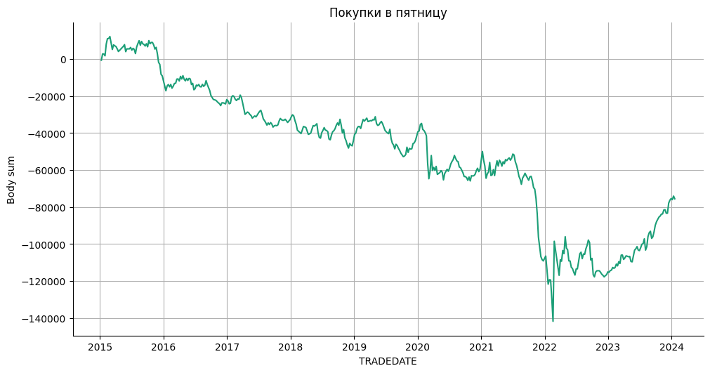

# Статистика по индексу MIX(индекс мосбиржи) на основе дней в неделе.

Статистика по направлениям свечей в зависимости от дня недели.  
Проверка гипотезы на торговлю в определенные дни недели.

### Об используемых в исследовании данных  
В настоящем исследовании используются дневные котировки на фьючерс индекса Московской биржи, скаченные с сервера МБ через ISS API, с 2015 года.  
Цена открытия каждого бара соответствует времени начала вечерней дополнительной торговой сесии предыдущего торгового дня (19:05).  
В базе данных котировки храняться на разные контракты, переход на новый котракт происходить по истечении предыдущего. Т.к. новый контракт по отношению к истекающему обычно находится положении контанго, переход с контракта на контракт сопровождается гэпом. В исследовании применяется расчет только тела свечи, поэтому гэпы не влияют на статистический результат. Междневные гэпы (не межконтрактрые) минимальны в силу того что между закрытием одной свечи и открытием другой проходит всего 15 минут (с 18:50 до 19:05). Информацию по гэпам стоит иметь ввиду при реальной торговле.


## Статистическое исследование.

Подключение гугл диска


```python
from google.colab import drive
drive.mount('/content/drive', force_remount=True)
```

    Mounted at /content/drive
    

Подключение к БД.


```python
import pandas as pd
import numpy as np
import sqlite3
import datetime
```


```python
connection = sqlite3.connect(r'/content/drive/MyDrive/data_quote_db/MIX_futures_day.db', check_same_thread=True)  # Создание соединения с БД
```

Загрузка данных в таблицу pandas.


```python
with connection:
  df = pd.read_sql('SELECT * FROM Day', connection)  # Загрузка данных из БД

print(df.to_string(max_rows=6, max_cols=25))  # Проверка того, что загрузилось
```

           TRADEDATE      SECID      OPEN       LOW      HIGH     CLOSE  VOLUME  OPENPOSITION SHORTNAME    LSTTRADE
    0     2015-01-05  MXH5_2015  142000.0  138525.0  145950.0  145150.0    2587         12938  MIX-3.15  2015-03-16
    1     2015-01-06  MXH5_2015  144750.0  144350.0  149900.0  149900.0    2953         12760  MIX-3.15  2015-03-16
    2     2015-01-08  MXH5_2015  149500.0  148200.0  158200.0  156025.0    5567         15098  MIX-3.15  2015-03-16
    ...          ...        ...       ...       ...       ...       ...     ...           ...       ...         ...
    2265  2024-01-18       MXH4  326775.0  326025.0  327675.0  326050.0   13969         90338  MIX-3.24  2024-03-21
    2266  2024-01-19       MXH4  326650.0  323400.0  327150.0  325175.0   20906         91028  MIX-3.24  2024-03-21
    2267  2024-01-22       MXH4  325150.0  323925.0  326300.0  325825.0   16332         90764  MIX-3.24  2024-03-21
    

Подготовка DF


```python
df = df.drop(['SECID', 'OPENPOSITION', 'SHORTNAME', 'LSTTRADE'], axis=1)
df['TRADEDATE'] = pd.to_datetime(df['TRADEDATE'])  # Смена типа
df = df.dropna().reset_index(drop=True)  # Удаление NaN
```

Создание и заполнение колонки с торговым днем недели (Work_day).  
0 - Понедельник  
1 - Вторник  
и т.д.


```python
df['Work_day'] = df['TRADEDATE'].dt.weekday

df[['Work_day']] = df[['Work_day']].astype(int)
df = df.sort_values(by='TRADEDATE', ascending=True)  # Сортировка по возрастанию
print(df.to_string(max_rows=6, max_cols=25))  # Проверка
```

          TRADEDATE      OPEN       LOW      HIGH     CLOSE  VOLUME  Work_day
    0    2015-01-05  142000.0  138525.0  145950.0  145150.0    2587         0
    1    2015-01-06  144750.0  144350.0  149900.0  149900.0    2953         1
    2    2015-01-08  149500.0  148200.0  158200.0  156025.0    5567         3
    ...         ...       ...       ...       ...       ...     ...       ...
    2265 2024-01-18  326775.0  326025.0  327675.0  326050.0   13969         3
    2266 2024-01-19  326650.0  323400.0  327150.0  325175.0   20906         4
    2267 2024-01-22  325150.0  323925.0  326300.0  325825.0   16332         0
    

Добавление колонок: направления бара и размера тела свечи.  
Если бар понижающийся то размер тела бара отрицательный.


```python
df['Up'] = df.apply(lambda x: 1 if (x['OPEN'] < x['CLOSE']) else np.nan, axis=1)
df['Down'] = df.apply(lambda x: 1 if (x['OPEN'] >= x['CLOSE']) else np.nan, axis=1)
df['Body'] = df.apply(lambda x: -x['OPEN'] + x['CLOSE'], axis=1)
print(df.to_string(max_rows=6, max_cols=25))  # Проверка
```

          TRADEDATE      OPEN       LOW      HIGH     CLOSE  VOLUME  Work_day   Up  Down    Body
    0    2015-01-05  142000.0  138525.0  145950.0  145150.0    2587         0  1.0   NaN  3150.0
    1    2015-01-06  144750.0  144350.0  149900.0  149900.0    2953         1  1.0   NaN  5150.0
    2    2015-01-08  149500.0  148200.0  158200.0  156025.0    5567         3  1.0   NaN  6525.0
    ...         ...       ...       ...       ...       ...     ...       ...  ...   ...     ...
    2265 2024-01-18  326775.0  326025.0  327675.0  326050.0   13969         3  NaN   1.0  -725.0
    2266 2024-01-19  326650.0  323400.0  327150.0  325175.0   20906         4  NaN   1.0 -1475.0
    2267 2024-01-22  325150.0  323925.0  326300.0  325825.0   16332         0  1.0   NaN   675.0
    

Агрегация данных.


```python
agg_func_count = {'Up': ['count'],
                  'Down': ['count'],
                  'Body': ['sum']}
df_count = df.groupby(['Work_day']).agg(agg_func_count)  # статистика по Up / Down
df_count.columns = ['_'.join(col).rstrip('_') for col in df_count.columns.values]  # Объединение названий колонок
df_count
```


  <div id="df-d8905923-2fab-4421-b06c-5fec4a8ad4d9" class="colab-df-container">
    <div>
<style scoped>
    .dataframe tbody tr th:only-of-type {
        vertical-align: middle;
    }

    .dataframe tbody tr th {
        vertical-align: top;
    }

    .dataframe thead th {
        text-align: right;
    }
</style>
<table border="1" class="dataframe">
  <thead>
    <tr style="text-align: right;">
      <th></th>
      <th>Up_count</th>
      <th>Down_count</th>
      <th>Body_sum</th>
    </tr>
    <tr>
      <th>Work_day</th>
      <th></th>
      <th></th>
      <th></th>
    </tr>
  </thead>
  <tbody>
    <tr>
      <th>0</th>
      <td>252</td>
      <td>187</td>
      <td>57500.0</td>
    </tr>
    <tr>
      <th>1</th>
      <td>240</td>
      <td>213</td>
      <td>172750.0</td>
    </tr>
    <tr>
      <th>2</th>
      <td>244</td>
      <td>212</td>
      <td>84150.0</td>
    </tr>
    <tr>
      <th>3</th>
      <td>221</td>
      <td>238</td>
      <td>-151300.0</td>
    </tr>
    <tr>
      <th>4</th>
      <td>220</td>
      <td>236</td>
      <td>-75525.0</td>
    </tr>
    <tr>
      <th>5</th>
      <td>4</td>
      <td>1</td>
      <td>1875.0</td>
    </tr>
  </tbody>
</table>
</div>
    <div class="colab-df-buttons">

  <div class="colab-df-container">
    <button class="colab-df-convert" onclick="convertToInteractive('df-d8905923-2fab-4421-b06c-5fec4a8ad4d9')"
            title="Convert this dataframe to an interactive table."
            style="display:none;">

  <svg xmlns="http://www.w3.org/2000/svg" height="24px" viewBox="0 -960 960 960">
    <path d="M120-120v-720h720v720H120Zm60-500h600v-160H180v160Zm220 220h160v-160H400v160Zm0 220h160v-160H400v160ZM180-400h160v-160H180v160Zm440 0h160v-160H620v160ZM180-180h160v-160H180v160Zm440 0h160v-160H620v160Z"/>
  </svg>
    </button>

  <style>
    .colab-df-container {
      display:flex;
      gap: 12px;
    }

    .colab-df-convert {
      background-color: #E8F0FE;
      border: none;
      border-radius: 50%;
      cursor: pointer;
      display: none;
      fill: #1967D2;
      height: 32px;
      padding: 0 0 0 0;
      width: 32px;
    }

    .colab-df-convert:hover {
      background-color: #E2EBFA;
      box-shadow: 0px 1px 2px rgba(60, 64, 67, 0.3), 0px 1px 3px 1px rgba(60, 64, 67, 0.15);
      fill: #174EA6;
    }

    .colab-df-buttons div {
      margin-bottom: 4px;
    }

    [theme=dark] .colab-df-convert {
      background-color: #3B4455;
      fill: #D2E3FC;
    }

    [theme=dark] .colab-df-convert:hover {
      background-color: #434B5C;
      box-shadow: 0px 1px 3px 1px rgba(0, 0, 0, 0.15);
      filter: drop-shadow(0px 1px 2px rgba(0, 0, 0, 0.3));
      fill: #FFFFFF;
    }
  </style>

    <script>
      const buttonEl =
        document.querySelector('#df-d8905923-2fab-4421-b06c-5fec4a8ad4d9 button.colab-df-convert');
      buttonEl.style.display =
        google.colab.kernel.accessAllowed ? 'block' : 'none';

      async function convertToInteractive(key) {
        const element = document.querySelector('#df-d8905923-2fab-4421-b06c-5fec4a8ad4d9');
        const dataTable =
          await google.colab.kernel.invokeFunction('convertToInteractive',
                                                    [key], {});
        if (!dataTable) return;

        const docLinkHtml = 'Like what you see? Visit the ' +
          '<a target="_blank" href=https://colab.research.google.com/notebooks/data_table.ipynb>data table notebook</a>'
          + ' to learn more about interactive tables.';
        element.innerHTML = '';
        dataTable['output_type'] = 'display_data';
        await google.colab.output.renderOutput(dataTable, element);
        const docLink = document.createElement('div');
        docLink.innerHTML = docLinkHtml;
        element.appendChild(docLink);
      }
    </script>
  </div>


<div id="df-dcbe7654-60cc-4aab-953b-5010760cbfc4">
  <button class="colab-df-quickchart" onclick="quickchart('df-dcbe7654-60cc-4aab-953b-5010760cbfc4')"
            title="Suggest charts"
            style="display:none;">

<svg xmlns="http://www.w3.org/2000/svg" height="24px"viewBox="0 0 24 24"
     width="24px">
    <g>
        <path d="M19 3H5c-1.1 0-2 .9-2 2v14c0 1.1.9 2 2 2h14c1.1 0 2-.9 2-2V5c0-1.1-.9-2-2-2zM9 17H7v-7h2v7zm4 0h-2V7h2v10zm4 0h-2v-4h2v4z"/>
    </g>
</svg>
  </button>

<style>
  .colab-df-quickchart {
      --bg-color: #E8F0FE;
      --fill-color: #1967D2;
      --hover-bg-color: #E2EBFA;
      --hover-fill-color: #174EA6;
      --disabled-fill-color: #AAA;
      --disabled-bg-color: #DDD;
  }

  [theme=dark] .colab-df-quickchart {
      --bg-color: #3B4455;
      --fill-color: #D2E3FC;
      --hover-bg-color: #434B5C;
      --hover-fill-color: #FFFFFF;
      --disabled-bg-color: #3B4455;
      --disabled-fill-color: #666;
  }

  .colab-df-quickchart {
    background-color: var(--bg-color);
    border: none;
    border-radius: 50%;
    cursor: pointer;
    display: none;
    fill: var(--fill-color);
    height: 32px;
    padding: 0;
    width: 32px;
  }

  .colab-df-quickchart:hover {
    background-color: var(--hover-bg-color);
    box-shadow: 0 1px 2px rgba(60, 64, 67, 0.3), 0 1px 3px 1px rgba(60, 64, 67, 0.15);
    fill: var(--button-hover-fill-color);
  }

  .colab-df-quickchart-complete:disabled,
  .colab-df-quickchart-complete:disabled:hover {
    background-color: var(--disabled-bg-color);
    fill: var(--disabled-fill-color);
    box-shadow: none;
  }

  .colab-df-spinner {
    border: 2px solid var(--fill-color);
    border-color: transparent;
    border-bottom-color: var(--fill-color);
    animation:
      spin 1s steps(1) infinite;
  }

  @keyframes spin {
    0% {
      border-color: transparent;
      border-bottom-color: var(--fill-color);
      border-left-color: var(--fill-color);
    }
    20% {
      border-color: transparent;
      border-left-color: var(--fill-color);
      border-top-color: var(--fill-color);
    }
    30% {
      border-color: transparent;
      border-left-color: var(--fill-color);
      border-top-color: var(--fill-color);
      border-right-color: var(--fill-color);
    }
    40% {
      border-color: transparent;
      border-right-color: var(--fill-color);
      border-top-color: var(--fill-color);
    }
    60% {
      border-color: transparent;
      border-right-color: var(--fill-color);
    }
    80% {
      border-color: transparent;
      border-right-color: var(--fill-color);
      border-bottom-color: var(--fill-color);
    }
    90% {
      border-color: transparent;
      border-bottom-color: var(--fill-color);
    }
  }
</style>

  <script>
    async function quickchart(key) {
      const quickchartButtonEl =
        document.querySelector('#' + key + ' button');
      quickchartButtonEl.disabled = true;  // To prevent multiple clicks.
      quickchartButtonEl.classList.add('colab-df-spinner');
      try {
        const charts = await google.colab.kernel.invokeFunction(
            'suggestCharts', [key], {});
      } catch (error) {
        console.error('Error during call to suggestCharts:', error);
      }
      quickchartButtonEl.classList.remove('colab-df-spinner');
      quickchartButtonEl.classList.add('colab-df-quickchart-complete');
    }
    (() => {
      let quickchartButtonEl =
        document.querySelector('#df-dcbe7654-60cc-4aab-953b-5010760cbfc4 button');
      quickchartButtonEl.style.display =
        google.colab.kernel.accessAllowed ? 'block' : 'none';
    })();
  </script>
</div>
    </div>
  </div>


Добавление колоки разницы между Up и Down (Up-Down) по количеству.


```python
df_count['Up-Down'] = df_count.apply(lambda x: x['Up_count'] - x['Down_count'], axis=1)
df_count[['Up-Down']] = df_count[['Up-Down']].astype(int)
df_count
```


  <div id="df-0dc1bf9d-5550-4fcd-a15d-8346099e3eb0" class="colab-df-container">
    <div>
<style scoped>
    .dataframe tbody tr th:only-of-type {
        vertical-align: middle;
    }

    .dataframe tbody tr th {
        vertical-align: top;
    }

    .dataframe thead th {
        text-align: right;
    }
</style>
<table border="1" class="dataframe">
  <thead>
    <tr style="text-align: right;">
      <th></th>
      <th>Up_count</th>
      <th>Down_count</th>
      <th>Body_sum</th>
      <th>Up-Down</th>
    </tr>
    <tr>
      <th>Work_day</th>
      <th></th>
      <th></th>
      <th></th>
      <th></th>
    </tr>
  </thead>
  <tbody>
    <tr>
      <th>0</th>
      <td>252</td>
      <td>187</td>
      <td>57500.0</td>
      <td>65</td>
    </tr>
    <tr>
      <th>1</th>
      <td>240</td>
      <td>213</td>
      <td>172750.0</td>
      <td>27</td>
    </tr>
    <tr>
      <th>2</th>
      <td>244</td>
      <td>212</td>
      <td>84150.0</td>
      <td>32</td>
    </tr>
    <tr>
      <th>3</th>
      <td>221</td>
      <td>238</td>
      <td>-151300.0</td>
      <td>-17</td>
    </tr>
    <tr>
      <th>4</th>
      <td>220</td>
      <td>236</td>
      <td>-75525.0</td>
      <td>-16</td>
    </tr>
    <tr>
      <th>5</th>
      <td>4</td>
      <td>1</td>
      <td>1875.0</td>
      <td>3</td>
    </tr>
  </tbody>
</table>
</div>
    <div class="colab-df-buttons">

  <div class="colab-df-container">
    <button class="colab-df-convert" onclick="convertToInteractive('df-0dc1bf9d-5550-4fcd-a15d-8346099e3eb0')"
            title="Convert this dataframe to an interactive table."
            style="display:none;">

  <svg xmlns="http://www.w3.org/2000/svg" height="24px" viewBox="0 -960 960 960">
    <path d="M120-120v-720h720v720H120Zm60-500h600v-160H180v160Zm220 220h160v-160H400v160Zm0 220h160v-160H400v160ZM180-400h160v-160H180v160Zm440 0h160v-160H620v160ZM180-180h160v-160H180v160Zm440 0h160v-160H620v160Z"/>
  </svg>
    </button>

  <style>
    .colab-df-container {
      display:flex;
      gap: 12px;
    }

    .colab-df-convert {
      background-color: #E8F0FE;
      border: none;
      border-radius: 50%;
      cursor: pointer;
      display: none;
      fill: #1967D2;
      height: 32px;
      padding: 0 0 0 0;
      width: 32px;
    }

    .colab-df-convert:hover {
      background-color: #E2EBFA;
      box-shadow: 0px 1px 2px rgba(60, 64, 67, 0.3), 0px 1px 3px 1px rgba(60, 64, 67, 0.15);
      fill: #174EA6;
    }

    .colab-df-buttons div {
      margin-bottom: 4px;
    }

    [theme=dark] .colab-df-convert {
      background-color: #3B4455;
      fill: #D2E3FC;
    }

    [theme=dark] .colab-df-convert:hover {
      background-color: #434B5C;
      box-shadow: 0px 1px 3px 1px rgba(0, 0, 0, 0.15);
      filter: drop-shadow(0px 1px 2px rgba(0, 0, 0, 0.3));
      fill: #FFFFFF;
    }
  </style>

    <script>
      const buttonEl =
        document.querySelector('#df-0dc1bf9d-5550-4fcd-a15d-8346099e3eb0 button.colab-df-convert');
      buttonEl.style.display =
        google.colab.kernel.accessAllowed ? 'block' : 'none';

      async function convertToInteractive(key) {
        const element = document.querySelector('#df-0dc1bf9d-5550-4fcd-a15d-8346099e3eb0');
        const dataTable =
          await google.colab.kernel.invokeFunction('convertToInteractive',
                                                    [key], {});
        if (!dataTable) return;

        const docLinkHtml = 'Like what you see? Visit the ' +
          '<a target="_blank" href=https://colab.research.google.com/notebooks/data_table.ipynb>data table notebook</a>'
          + ' to learn more about interactive tables.';
        element.innerHTML = '';
        dataTable['output_type'] = 'display_data';
        await google.colab.output.renderOutput(dataTable, element);
        const docLink = document.createElement('div');
        docLink.innerHTML = docLinkHtml;
        element.appendChild(docLink);
      }
    </script>
  </div>


<div id="df-8dbcdbaf-6fa7-41ab-84e7-9f1afba719ba">
  <button class="colab-df-quickchart" onclick="quickchart('df-8dbcdbaf-6fa7-41ab-84e7-9f1afba719ba')"
            title="Suggest charts"
            style="display:none;">

<svg xmlns="http://www.w3.org/2000/svg" height="24px"viewBox="0 0 24 24"
     width="24px">
    <g>
        <path d="M19 3H5c-1.1 0-2 .9-2 2v14c0 1.1.9 2 2 2h14c1.1 0 2-.9 2-2V5c0-1.1-.9-2-2-2zM9 17H7v-7h2v7zm4 0h-2V7h2v10zm4 0h-2v-4h2v4z"/>
    </g>
</svg>
  </button>

<style>
  .colab-df-quickchart {
      --bg-color: #E8F0FE;
      --fill-color: #1967D2;
      --hover-bg-color: #E2EBFA;
      --hover-fill-color: #174EA6;
      --disabled-fill-color: #AAA;
      --disabled-bg-color: #DDD;
  }

  [theme=dark] .colab-df-quickchart {
      --bg-color: #3B4455;
      --fill-color: #D2E3FC;
      --hover-bg-color: #434B5C;
      --hover-fill-color: #FFFFFF;
      --disabled-bg-color: #3B4455;
      --disabled-fill-color: #666;
  }

  .colab-df-quickchart {
    background-color: var(--bg-color);
    border: none;
    border-radius: 50%;
    cursor: pointer;
    display: none;
    fill: var(--fill-color);
    height: 32px;
    padding: 0;
    width: 32px;
  }

  .colab-df-quickchart:hover {
    background-color: var(--hover-bg-color);
    box-shadow: 0 1px 2px rgba(60, 64, 67, 0.3), 0 1px 3px 1px rgba(60, 64, 67, 0.15);
    fill: var(--button-hover-fill-color);
  }

  .colab-df-quickchart-complete:disabled,
  .colab-df-quickchart-complete:disabled:hover {
    background-color: var(--disabled-bg-color);
    fill: var(--disabled-fill-color);
    box-shadow: none;
  }

  .colab-df-spinner {
    border: 2px solid var(--fill-color);
    border-color: transparent;
    border-bottom-color: var(--fill-color);
    animation:
      spin 1s steps(1) infinite;
  }

  @keyframes spin {
    0% {
      border-color: transparent;
      border-bottom-color: var(--fill-color);
      border-left-color: var(--fill-color);
    }
    20% {
      border-color: transparent;
      border-left-color: var(--fill-color);
      border-top-color: var(--fill-color);
    }
    30% {
      border-color: transparent;
      border-left-color: var(--fill-color);
      border-top-color: var(--fill-color);
      border-right-color: var(--fill-color);
    }
    40% {
      border-color: transparent;
      border-right-color: var(--fill-color);
      border-top-color: var(--fill-color);
    }
    60% {
      border-color: transparent;
      border-right-color: var(--fill-color);
    }
    80% {
      border-color: transparent;
      border-right-color: var(--fill-color);
      border-bottom-color: var(--fill-color);
    }
    90% {
      border-color: transparent;
      border-bottom-color: var(--fill-color);
    }
  }
</style>

  <script>
    async function quickchart(key) {
      const quickchartButtonEl =
        document.querySelector('#' + key + ' button');
      quickchartButtonEl.disabled = true;  // To prevent multiple clicks.
      quickchartButtonEl.classList.add('colab-df-spinner');
      try {
        const charts = await google.colab.kernel.invokeFunction(
            'suggestCharts', [key], {});
      } catch (error) {
        console.error('Error during call to suggestCharts:', error);
      }
      quickchartButtonEl.classList.remove('colab-df-spinner');
      quickchartButtonEl.classList.add('colab-df-quickchart-complete');
    }
    (() => {
      let quickchartButtonEl =
        document.querySelector('#df-8dbcdbaf-6fa7-41ab-84e7-9f1afba719ba button');
      quickchartButtonEl.style.display =
        google.colab.kernel.accessAllowed ? 'block' : 'none';
    })();
  </script>
</div>
    </div>
  </div>


По результатам статистики видно, что покупки по понедельникам, вторникам и средам дают положительный результат в симуляционной оценке торговли по телу свечи.

## Проверка гипотезы торговли по дням недели.  
Из статистики видно, что покупки в понедельник, вторник и среду дают прибыль. А в четверг и пятницу прибыль дают продажи.  
Для наглядности построим графики кривых доходности по дням и по совокупностям дней, чтобы видуально оценить результат.

## Графики результатов при покупках и продажах по дням недели.

Строим графики результатов при покупках в понедельник, вторник, среду и при продажах в четверг, пятницу.

Построение графика результата при покупке по понедельникам.  


```python
df_monday = df.copy(deep=True)  # Создание копии
df_monday = df_monday.loc[df_monday['Work_day'] == 0]  # Выборка по понедельникам
df_monday["Body_cum"] = df_monday["Body"].cumsum()
from matplotlib import pyplot as plt
import seaborn as sns
def _plot_series(series, series_name, series_index=0):
  palette = list(sns.palettes.mpl_palette('Dark2'))
  xs = series['TRADEDATE']
  ys = series['Body_cum']

  plt.plot(xs, ys, label=series_name, color=palette[series_index % len(palette)])

fig, ax = plt.subplots(figsize=(10, 5.2), layout='constrained')
df_sorted = df_monday.sort_values('TRADEDATE', ascending=True)
_plot_series(df_sorted, '')
sns.despine(fig=fig, ax=ax)
plt.xlabel('TRADEDATE')
plt.title('Покупка в понедельник')
plt.grid()
_ = plt.ylabel('Body sum')
```


    

    


Очень большая просадка на СВО.

---

Построение графика результата при покупке по вторникам.  


```python
df_tuesday = df.copy(deep=True)  # Создание копии
df_tuesday = df_tuesday.loc[df_tuesday['Work_day'] == 1]  # Выборка по вторникам
df_tuesday["Body_cum"] = df_tuesday["Body"].cumsum()
from matplotlib import pyplot as plt
import seaborn as sns
def _plot_series(series, series_name, series_index=0):
  from matplotlib import pyplot as plt
  import seaborn as sns
  palette = list(sns.palettes.mpl_palette('Dark2'))
  xs = series['TRADEDATE']
  ys = series['Body_cum']

  plt.plot(xs, ys, label=series_name, color=palette[series_index % len(palette)])

fig, ax = plt.subplots(figsize=(10, 5.2), layout='constrained')
df_sorted = df_tuesday.sort_values('TRADEDATE', ascending=True)
_plot_series(df_sorted, '')
sns.despine(fig=fig, ax=ax)
plt.xlabel('TRADEDATE')
plt.title('Покупка во вторник')
plt.grid()
_ = plt.ylabel('Body sum')
```


    

    


Заметная просадка на КОВИД.

---

Построение графика результата при покупке по средам.


```python
df_wednesday = df.copy(deep=True)  # Создание копии
df_wednesday = df_wednesday.loc[df_wednesday['Work_day'] == 2]  # Выборка по средам
df_wednesday["Body_cum"] = df_wednesday["Body"].cumsum()
from matplotlib import pyplot as plt
import seaborn as sns
def _plot_series(series, series_name, series_index=0):
  palette = list(sns.palettes.mpl_palette('Dark2'))
  xs = series['TRADEDATE']
  ys = series['Body_cum']

  plt.plot(xs, ys, label=series_name, color=palette[series_index % len(palette)])

fig, ax = plt.subplots(figsize=(10, 5.2), layout='constrained')
df_sorted = df_wednesday.sort_values('TRADEDATE', ascending=True)
_plot_series(df_sorted, '')
sns.despine(fig=fig, ax=ax)
plt.xlabel('TRADEDATE')
plt.title('Покупки в среду')
plt.grid()
_ = plt.ylabel('Body sum')
```


    

    


Не однозначный результат, есть продолжительные периоды без роста.

---

Построение графика результата при покупке по четвергам.


```python
df_thursday = df.copy(deep=True)  # Создание копии
df_thursday = df_thursday.loc[df_thursday['Work_day'] == 3]  # Выборка по четвергам
df_thursday["Body_cum"] = df_thursday["Body"].cumsum()
from matplotlib import pyplot as plt
import seaborn as sns
def _plot_series(series, series_name, series_index=0):
  palette = list(sns.palettes.mpl_palette('Dark2'))
  xs = series['TRADEDATE']
  ys = series['Body_cum']

  plt.plot(xs, ys, label=series_name, color=palette[series_index % len(palette)])

fig, ax = plt.subplots(figsize=(10, 5.2), layout='constrained')
df_sorted = df_thursday.sort_values('TRADEDATE', ascending=True)
_plot_series(df_sorted, '')
sns.despine(fig=fig, ax=ax)
plt.xlabel('TRADEDATE')
plt.title('Покупки в четверг')
plt.grid()
_ = plt.ylabel('Body sum')
```


    

    


---

Построение графика результата при покупке по пятницам.


```python
df_friday = df.copy(deep=True)  # Создание копии
df_friday = df_friday.loc[df_friday['Work_day'] == 4]  # Выборка по пятницам
df_friday["Body_cum"] = df_friday["Body"].cumsum()
from matplotlib import pyplot as plt
import seaborn as sns
def _plot_series(series, series_name, series_index=0):
  palette = list(sns.palettes.mpl_palette('Dark2'))
  xs = series['TRADEDATE']
  ys = series['Body_cum']

  plt.plot(xs, ys, label=series_name, color=palette[series_index % len(palette)])

fig, ax = plt.subplots(figsize=(10, 5.2), layout='constrained')
df_sorted = df_friday.sort_values('TRADEDATE', ascending=True)
_plot_series(df_sorted, '')
sns.despine(fig=fig, ax=ax)
plt.xlabel('TRADEDATE')
plt.title('Покупки в пятницу')
plt.grid()
_ = plt.ylabel('Body sum')
```


    

    


---

Построение графика результата при покупке по понедельникам, вторникам и средам.  


```python
df_3d = df.copy(deep=True)  # Создание копии
df_3d = df_3d.loc[df_3d['Work_day'] < 3]  # Выборка по понедельникам, вторникам и средам
df_3d["Body_cum"] = df_3d["Body"].cumsum()
from matplotlib import pyplot as plt
import seaborn as sns
def _plot_series(series, series_name, series_index=0):
  from matplotlib import pyplot as plt
  import seaborn as sns
  palette = list(sns.palettes.mpl_palette('Dark2'))
  xs = series['TRADEDATE']
  ys = series['Body_cum']

  plt.plot(xs, ys, label=series_name, color=palette[series_index % len(palette)])

fig, ax = plt.subplots(figsize=(10, 5.2), layout='constrained')
df_sorted = df_3d.sort_values('TRADEDATE', ascending=True)
_plot_series(df_sorted, '')
sns.despine(fig=fig, ax=ax)
plt.xlabel('TRADEDATE')
plt.title('Покупки в понедельник, вторник, среду')
plt.grid()
_ = plt.ylabel('Body sum')
```


    

    


По графику заметны просадки на СВО и КОВИД.

---

Построение графика результата при продажах по четвергам.


```python
df_thursday = df.copy(deep=True)  # Создание копии
df_thursday = df_thursday.loc[df_thursday['Work_day'] == 3]  # Выборка по четвергам
df_thursday['Body'] = df_thursday['Body'] * (-1)
df_thursday["Body_cum"] = df_thursday["Body"].cumsum()
# print(df_thursday.to_string(max_rows=6, max_cols=25))  # Проверка
from matplotlib import pyplot as plt
import seaborn as sns
def _plot_series(series, series_name, series_index=0):
  palette = list(sns.palettes.mpl_palette('Dark2'))
  xs = series['TRADEDATE']
  ys = series['Body_cum']

  plt.plot(xs, ys, label=series_name, color=palette[series_index % len(palette)])

fig, ax = plt.subplots(figsize=(10, 5.2), layout='constrained')
df_sorted = df_thursday.sort_values('TRADEDATE', ascending=True)
_plot_series(df_sorted, '')
sns.despine(fig=fig, ax=ax)
plt.xlabel('TRADEDATE')
plt.title('Продажи по четвергам')
plt.grid()
_ = plt.ylabel('Body sum')
```


    

    


Продажи по четвергам дают хорошую прибыль во время массовых паник СВО и КОВИД

---

Построение графика результата при продажах по пятницам.


```python
df_friday = df.copy(deep=True)  # Создание копии
df_friday = df_friday.loc[df_friday['Work_day'] == 4]  # Выборка по четвергам
df_friday['Body'] = df_friday['Body'] * (-1)
df_friday["Body_cum"] = df_friday["Body"].cumsum()
# print(df_thursday.to_string(max_rows=6, max_cols=25))  # Проверка
from matplotlib import pyplot as plt
import seaborn as sns
def _plot_series(series, series_name, series_index=0):
  palette = list(sns.palettes.mpl_palette('Dark2'))
  xs = series['TRADEDATE']
  ys = series['Body_cum']

  plt.plot(xs, ys, label=series_name, color=palette[series_index % len(palette)])

fig, ax = plt.subplots(figsize=(10, 5.2), layout='constrained')
df_sorted = df_friday.sort_values('TRADEDATE', ascending=True)
_plot_series(df_sorted, '')
sns.despine(fig=fig, ax=ax)
plt.xlabel('TRADEDATE')
plt.title('Продажи по пятницам')
plt.grid()
_ = plt.ylabel('Body sum')
```


    

    


Продажи по пятницам до 2022 дают прибыль, а с началом СВО дают убытки. Вероятно это связано с уходом из России иностранных инвесторов.
