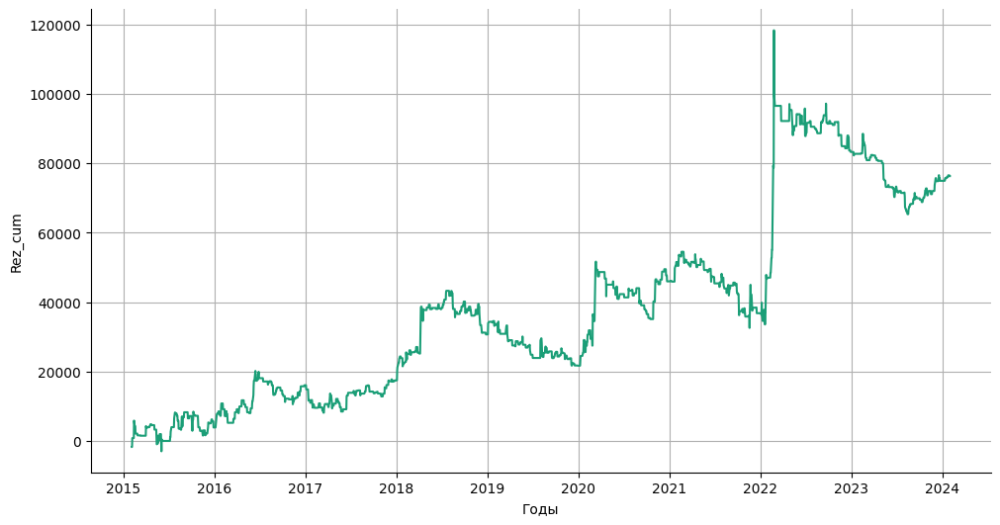
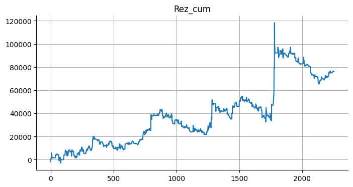
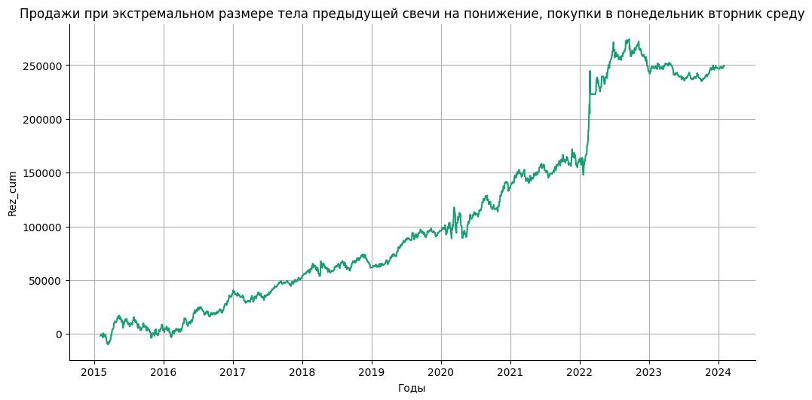

# Статистика по индексу RTS на основе размера тела свечи.

Статистика по направлениям после свечи с аномальным (превышающим 75 перцентиль за `PERIOD` свечей) телом свечи.  
Проверка гипотезы, что после свечи с аномальным превышением размера тела, следует свеча в том же направлении.


```python
PERIOD = 20
```

Подключение гугл диска


```python
from google.colab import drive
drive.mount('/content/drive', force_remount=True)
```

    Mounted at /content/drive
    

Подключение к БД.


```python
import pandas as pd
import numpy as np
import sqlite3
```


```python
connection = sqlite3.connect(r'/content/drive/MyDrive/data_quote_db/RTS_futures_day.db', check_same_thread=True)  # Создание соединения с БД
```

Загрузка данных в таблицу pandas.


```python
with connection:
  df = pd.read_sql('SELECT * FROM Day', connection)  # Загрузка данных из БД

print(df.to_string(max_rows=6, max_cols=25))  # Проверка того, что загрузилось
```

           TRADEDATE      SECID      OPEN       LOW      HIGH     CLOSE  VOLUME  OPENPOSITION SHORTNAME    LSTTRADE
    0     2015-01-05  RIH5_2015   76930.0   72470.0   78980.0   74600.0  372848        751996  RTS-3.15  2015-03-16
    1     2015-01-06  RIH5_2015   74470.0   71200.0   74610.0   73480.0  319307        731236  RTS-3.15  2015-03-16
    2     2015-01-08  RIH5_2015   73490.0   71000.0   81380.0   79980.0  537469        751010  RTS-3.15  2015-03-16
    ...          ...        ...       ...       ...       ...       ...     ...           ...       ...         ...
    2272  2024-01-29       RIH4  111600.0  111100.0  113470.0  113350.0   50559         55540  RTS-3.24  2024-03-21
    2273  2024-01-30       RIH4  113270.0  112680.0  114820.0  113060.0   45696         51310  RTS-3.24  2024-03-21
    2274  2024-01-31       RIH4  113130.0  112640.0  113930.0  113490.0   58349         49772  RTS-3.24  2024-03-21
    

Конвертация типа дат и сортировка по дате.


```python
df = df.drop(['SECID', 'VOLUME', 'OPENPOSITION', 'SHORTNAME', 'LSTTRADE'], axis=1)  # Очистка от неиспользуемых полей
df['TRADEDATE'] = pd.to_datetime(df['TRADEDATE'])
# df['LSTTRADE'] = pd.to_datetime(df['LSTTRADE'])
df = df.dropna().reset_index(drop=True)
df = df.sort_values (by='TRADEDATE', ascending=True)
```

Добавление колонки направления бара.  
0 - понижающийся бар  
1 - повышающийся бар


```python
df['Up/Down'] = df.apply(lambda x: 'Up' if (x['OPEN'] < x['CLOSE']) else 'Down', axis=1)
print(df.to_string(max_rows=6, max_cols=25))  # Проверка
print('\n', df.value_counts("Up/Down"))  # Подсчет количества баров на повышение и понижение
```

          TRADEDATE      OPEN       LOW      HIGH     CLOSE Up/Down
    0    2015-01-05   76930.0   72470.0   78980.0   74600.0    Down
    1    2015-01-06   74470.0   71200.0   74610.0   73480.0    Down
    2    2015-01-08   73490.0   71000.0   81380.0   79980.0      Up
    ...         ...       ...       ...       ...       ...     ...
    2272 2024-01-29  111600.0  111100.0  113470.0  113350.0      Up
    2273 2024-01-30  113270.0  112680.0  114820.0  113060.0    Down
    2274 2024-01-31  113130.0  112640.0  113930.0  113490.0      Up
    
     Up/Down
    Up      1202
    Down    1073
    dtype: int64
    

Размер тела свечи.  
Создание колонки с размером тела свечи (Body). Размер тела свечи записан по модулю.


```python
df['Body'] = df.apply(lambda x: abs(x['OPEN'] - x['CLOSE']), axis=1)
print(df.to_string(max_rows=6, max_cols=25))  # Проверка
```

          TRADEDATE      OPEN       LOW      HIGH     CLOSE Up/Down    Body
    0    2015-01-05   76930.0   72470.0   78980.0   74600.0    Down  2330.0
    1    2015-01-06   74470.0   71200.0   74610.0   73480.0    Down   990.0
    2    2015-01-08   73490.0   71000.0   81380.0   79980.0      Up  6490.0
    ...         ...       ...       ...       ...       ...     ...     ...
    2272 2024-01-29  111600.0  111100.0  113470.0  113350.0      Up  1750.0
    2273 2024-01-30  113270.0  112680.0  114820.0  113060.0    Down   210.0
    2274 2024-01-31  113130.0  112640.0  113930.0  113490.0      Up   360.0
    

Создание колонок с предыдущими размерами свечей для вычисления перцентилей.  
Количество дней для вычисления перцентилей берется с переменной PERIOD.


```python
for i in range(1, PERIOD + 1):
  df[f'Body_{i}'] = df['Body'].shift(i)
print(df.to_string(max_rows=6, max_cols=25))  # Проверка
```

          TRADEDATE      OPEN       LOW      HIGH     CLOSE Up/Down    Body  Body_1  Body_2  Body_3  Body_4  Body_5  ...  Body_9  Body_10  Body_11  Body_12  Body_13  Body_14  Body_15  Body_16  Body_17  Body_18  Body_19  Body_20
    0    2015-01-05   76930.0   72470.0   78980.0   74600.0    Down  2330.0     NaN     NaN     NaN     NaN     NaN  ...     NaN      NaN      NaN      NaN      NaN      NaN      NaN      NaN      NaN      NaN      NaN      NaN
    1    2015-01-06   74470.0   71200.0   74610.0   73480.0    Down   990.0  2330.0     NaN     NaN     NaN     NaN  ...     NaN      NaN      NaN      NaN      NaN      NaN      NaN      NaN      NaN      NaN      NaN      NaN
    2    2015-01-08   73490.0   71000.0   81380.0   79980.0      Up  6490.0   990.0  2330.0     NaN     NaN     NaN  ...     NaN      NaN      NaN      NaN      NaN      NaN      NaN      NaN      NaN      NaN      NaN      NaN
    ...         ...       ...       ...       ...       ...     ...     ...     ...     ...     ...     ...     ...  ...     ...      ...      ...      ...      ...      ...      ...      ...      ...      ...      ...      ...
    2272 2024-01-29  111600.0  111100.0  113470.0  113350.0      Up  1750.0   800.0   640.0   520.0  1090.0   810.0  ...   200.0    330.0    730.0   1620.0     40.0   1600.0    260.0    660.0    720.0    210.0    510.0   1090.0
    2273 2024-01-30  113270.0  112680.0  114820.0  113060.0    Down   210.0  1750.0   800.0   640.0   520.0  1090.0  ...  1160.0    200.0    330.0    730.0   1620.0     40.0   1600.0    260.0    660.0    720.0    210.0    510.0
    2274 2024-01-31  113130.0  112640.0  113930.0  113490.0      Up   360.0   210.0  1750.0   800.0   640.0   520.0  ...   280.0   1160.0    200.0    330.0    730.0   1620.0     40.0   1600.0    260.0    660.0    720.0    210.0
    

Очистка DF от NaN.  


```python
df = df.dropna().reset_index(drop=True)
print(df.to_string(max_rows=6, max_cols=25))  # Проверка
```

          TRADEDATE      OPEN       LOW      HIGH     CLOSE Up/Down    Body  Body_1  Body_2  Body_3  Body_4  Body_5  ...  Body_9  Body_10  Body_11  Body_12  Body_13  Body_14  Body_15  Body_16  Body_17  Body_18  Body_19  Body_20
    0    2015-02-03   73280.0   72650.0   77770.0   77490.0      Up  4210.0  1460.0  1760.0  1970.0  1950.0   890.0  ...  3070.0   1690.0    780.0   1770.0   1180.0    550.0    900.0   3310.0   2300.0   6490.0    990.0   2330.0
    1    2015-02-04   77380.0   75230.0   79680.0   75660.0    Down  1720.0  4210.0  1460.0  1760.0  1970.0  1950.0  ...  4070.0   3070.0   1690.0    780.0   1770.0   1180.0    550.0    900.0   3310.0   2300.0   6490.0    990.0
    2    2015-02-05   75450.0   73770.0   80110.0   79650.0      Up  4200.0  1720.0  4210.0  1460.0  1760.0  1970.0  ...   250.0   4070.0   3070.0   1690.0    780.0   1770.0   1180.0    550.0    900.0   3310.0   2300.0   6490.0
    ...         ...       ...       ...       ...       ...     ...     ...     ...     ...     ...     ...     ...  ...     ...      ...      ...      ...      ...      ...      ...      ...      ...      ...      ...      ...
    2252 2024-01-29  111600.0  111100.0  113470.0  113350.0      Up  1750.0   800.0   640.0   520.0  1090.0   810.0  ...   200.0    330.0    730.0   1620.0     40.0   1600.0    260.0    660.0    720.0    210.0    510.0   1090.0
    2253 2024-01-30  113270.0  112680.0  114820.0  113060.0    Down   210.0  1750.0   800.0   640.0   520.0  1090.0  ...  1160.0    200.0    330.0    730.0   1620.0     40.0   1600.0    260.0    660.0    720.0    210.0    510.0
    2254 2024-01-31  113130.0  112640.0  113930.0  113490.0      Up   360.0   210.0  1750.0   800.0   640.0   520.0  ...   280.0   1160.0    200.0    330.0    730.0   1620.0     40.0   1600.0    260.0    660.0    720.0    210.0
    

Создание колонки с расчетом 75 перцентиля (per75) и удаление колонок с предыдущими значениями тел свечей.


```python
df['per75'] = df.apply(lambda x: np.percentile([x[f'Body_{i}'] for i in range(1, PERIOD + 1)], 75), axis=1)
drop_column_lst = [f'Body_{i}' for i in range(1, PERIOD + 1)]
df = df.drop(drop_column_lst, axis=1)
print(df.to_string(max_rows=6, max_cols=25))  # Проверка
```

          TRADEDATE      OPEN       LOW      HIGH     CLOSE Up/Down    Body   per75
    0    2015-02-03   73280.0   72650.0   77770.0   77490.0      Up  4210.0  2515.0
    1    2015-02-04   77380.0   75230.0   79680.0   75660.0    Down  1720.0  3130.0
    2    2015-02-05   75450.0   73770.0   80110.0   79650.0      Up  4200.0  3130.0
    ...         ...       ...       ...       ...       ...     ...     ...     ...
    2252 2024-01-29  111600.0  111100.0  113470.0  113350.0      Up  1750.0   880.0
    2253 2024-01-30  113270.0  112680.0  114820.0  113060.0    Down   210.0   880.0
    2254 2024-01-31  113130.0  112640.0  113930.0  113490.0      Up   360.0   880.0
    

Создание колонки с маркерами выбросов больше 75 перцентиля (Over_per75).  
0 - нет превышения 75 перцентиля по размеру тела свечи.  
1 - есть превышение 75 перцентиля по размеру тела свечи.


```python
df['Over_per75'] = df.apply(lambda x: True if (x['Body'] > x['per75']) else False, axis=1)
print(df.to_string(max_rows=6, max_cols=25))  # Проверка
```

          TRADEDATE      OPEN       LOW      HIGH     CLOSE Up/Down    Body   per75  Over_per75
    0    2015-02-03   73280.0   72650.0   77770.0   77490.0      Up  4210.0  2515.0        True
    1    2015-02-04   77380.0   75230.0   79680.0   75660.0    Down  1720.0  3130.0       False
    2    2015-02-05   75450.0   73770.0   80110.0   79650.0      Up  4200.0  3130.0        True
    ...         ...       ...       ...       ...       ...     ...     ...     ...         ...
    2252 2024-01-29  111600.0  111100.0  113470.0  113350.0      Up  1750.0   880.0        True
    2253 2024-01-30  113270.0  112680.0  114820.0  113060.0    Down   210.0   880.0       False
    2254 2024-01-31  113130.0  112640.0  113930.0  113490.0      Up   360.0   880.0       False
    

Создание колонки с маркерами выбросов больше 75 пецентиля для предыдущего бара (prev_Over_per75).  
Создание колонки с направлением предыдущнго бара (prev_Up/Down).


```python
df['prev_Up/Down'] = df['Up/Down'].shift(1)
df['prev_Over_per75'] = df['Over_per75'].shift(1)
print(df.to_string(max_rows=6, max_cols=25))  # Проверка
```

          TRADEDATE      OPEN       LOW      HIGH     CLOSE Up/Down    Body   per75  Over_per75 prev_Up/Down prev_Over_per75
    0    2015-02-03   73280.0   72650.0   77770.0   77490.0      Up  4210.0  2515.0        True         None             NaN
    1    2015-02-04   77380.0   75230.0   79680.0   75660.0    Down  1720.0  3130.0       False           Up            True
    2    2015-02-05   75450.0   73770.0   80110.0   79650.0      Up  4200.0  3130.0        True         Down           False
    ...         ...       ...       ...       ...       ...     ...     ...     ...         ...          ...             ...
    2252 2024-01-29  111600.0  111100.0  113470.0  113350.0      Up  1750.0   880.0        True         Down           False
    2253 2024-01-30  113270.0  112680.0  114820.0  113060.0    Down   210.0   880.0       False           Up            True
    2254 2024-01-31  113130.0  112640.0  113930.0  113490.0      Up   360.0   880.0       False         Down           False
    

Очитка от NaN и смена типа на int


```python
df = df.dropna().reset_index(drop=True)
# df[['prev_Up/Down', 'prev_Over_per75']] = df[['prev_Up/Down', 'prev_Over_per75']].astype(int)
print(df.to_string(max_rows=6, max_cols=25))  # Проверка
```

          TRADEDATE      OPEN       LOW      HIGH     CLOSE Up/Down    Body   per75  Over_per75 prev_Up/Down prev_Over_per75
    0    2015-02-04   77380.0   75230.0   79680.0   75660.0    Down  1720.0  3130.0       False           Up            True
    1    2015-02-05   75450.0   73770.0   80110.0   79650.0      Up  4200.0  3130.0        True         Down           False
    2    2015-02-06   79610.0   78510.0   82900.0   82160.0      Up  2550.0  3130.0       False           Up            True
    ...         ...       ...       ...       ...       ...     ...     ...     ...         ...          ...             ...
    2251 2024-01-29  111600.0  111100.0  113470.0  113350.0      Up  1750.0   880.0        True         Down           False
    2252 2024-01-30  113270.0  112680.0  114820.0  113060.0    Down   210.0   880.0       False           Up            True
    2253 2024-01-31  113130.0  112640.0  113930.0  113490.0      Up   360.0   880.0       False         Down           False
    

Проверка гипотезы, что после свечи с аномальным превышением размера тела, следует свеча в том же направлении.  
-1 - гипотеза не подтверждается.  
0 - Без проверки гипотезы на этой свече (нет условия анамального размера тела предыдущей свечи).  
1 - Гипотеза подтверждается.  


```python
def rez(up_down, prev_up_down, prev_over_per75):
    if (up_down == prev_up_down) and (prev_over_per75 == 1):
        return 1
    elif (up_down != prev_up_down) and (prev_over_per75 == 1):
        return -1
    else:
        return 0

df['Rez'] = df.apply(lambda x: rez(x['Up/Down'], x['prev_Up/Down'], x['prev_Over_per75']), axis=1)
print(df.to_string(max_rows=6, max_cols=25))  # Проверка
print('\n', df.value_counts("Rez"))
```

          TRADEDATE      OPEN       LOW      HIGH     CLOSE Up/Down    Body   per75  Over_per75 prev_Up/Down prev_Over_per75  Rez
    0    2015-02-04   77380.0   75230.0   79680.0   75660.0    Down  1720.0  3130.0       False           Up            True   -1
    1    2015-02-05   75450.0   73770.0   80110.0   79650.0      Up  4200.0  3130.0        True         Down           False    0
    2    2015-02-06   79610.0   78510.0   82900.0   82160.0      Up  2550.0  3130.0       False           Up            True    1
    ...         ...       ...       ...       ...       ...     ...     ...     ...         ...          ...             ...  ...
    2251 2024-01-29  111600.0  111100.0  113470.0  113350.0      Up  1750.0   880.0        True         Down           False    0
    2252 2024-01-30  113270.0  112680.0  114820.0  113060.0    Down   210.0   880.0       False           Up            True   -1
    2253 2024-01-31  113130.0  112640.0  113930.0  113490.0      Up   360.0   880.0       False         Down           False    0
    
     Rez
     0    1630
     1     314
    -1     310
    dtype: int64
    

По результату видно, что количественная оценка не подтверждает гипотезу.  

---

Количественная оценка не может быть показателем для применения на практике т.к. аномальные размеры тела свечи в периоды спокойного рынка и в периоды высокой волатильности, очень сильно различаются.  
Подсчитаем сумму размеров тел свечей идущих следом за свечами с аномальным размером тела. С учетом направления. Своего рода симуляция торговли. Результат получен положительный.  


```python
def rez_value(body, rez):
    if rez == 1:
        return body
    elif rez == -1:
        return -body
    else:
        return 0

df_body = df.copy(deep=True)  # Создание копии
df_body['Rez_value'] = df_body.apply(lambda x: rez_value(x['Body'], x['Rez']), axis=1)
df_body["Rez_cum"] = df_body["Rez_value"].cumsum()
print(df_body.to_string(max_rows=6, max_cols=25))  # Проверка
print('\n', df_body[['Rez_value']].sum())  # Сумма всех элементов в колонке
```

          TRADEDATE      OPEN       LOW      HIGH     CLOSE Up/Down    Body   per75  Over_per75 prev_Up/Down prev_Over_per75  Rez  Rez_value  Rez_cum
    0    2015-02-04   77380.0   75230.0   79680.0   75660.0    Down  1720.0  3130.0       False           Up            True   -1    -1720.0  -1720.0
    1    2015-02-05   75450.0   73770.0   80110.0   79650.0      Up  4200.0  3130.0        True         Down           False    0        0.0  -1720.0
    2    2015-02-06   79610.0   78510.0   82900.0   82160.0      Up  2550.0  3130.0       False           Up            True    1     2550.0    830.0
    ...         ...       ...       ...       ...       ...     ...     ...     ...         ...          ...             ...  ...        ...      ...
    2251 2024-01-29  111600.0  111100.0  113470.0  113350.0      Up  1750.0   880.0        True         Down           False    0        0.0  76520.0
    2252 2024-01-30  113270.0  112680.0  114820.0  113060.0    Down   210.0   880.0       False           Up            True   -1     -210.0  76310.0
    2253 2024-01-31  113130.0  112640.0  113930.0  113490.0      Up   360.0   880.0       False         Down           False    0        0.0  76310.0
    
     Rez_value    76310.0
    dtype: float64
    

Строим график симуляции торговли по гипотезе.


```python
from matplotlib import pyplot as plt
import seaborn as sns
def _plot_series(series, series_name, series_index=0):
  from matplotlib import pyplot as plt
  import seaborn as sns
  palette = list(sns.palettes.mpl_palette('Dark2'))
  xs = series['TRADEDATE']
  ys = series['Rez_cum']

  plt.plot(xs, ys, label=series_name, color=palette[series_index % len(palette)])

fig, ax = plt.subplots(figsize=(10, 5.2), layout='constrained')
df_sorted = df_body.sort_values('TRADEDATE', ascending=True)
_plot_series(df_sorted, '')
sns.despine(fig=fig, ax=ax)
plt.xlabel('Годы')
plt.grid()
_ = plt.ylabel('Rez_cum')
```


    

    


```python
from matplotlib import pyplot as plt
df_body['Rez_cum'].plot(kind='line', figsize=(8, 4), title='Rez_cum')
plt.gca().spines[['top', 'right']].set_visible(False)
plt.grid()
```


    

    


## Выводы:  
1. Гипотеза: после свечи с аномальным превышением размера тела, следует свеча в том же направлении, не подтвердилась в количественном выражении.  
2. Симуляция торговли с использованием гипотезы дала положительный результат.  
3. Если рассматривать график результатов симуляции торговли, то можно сделать вывод, что положительный результат торговли достигается в периоды повышенной волатильности рынка (COVID-19, СВО).

---

## Добавление симуляции торговли по дням недели


Создание и заполнение колонки с торговым днем недели (Work_day).  
0 - Понедельник  
1 - Вторник  
и т.д.


```python
df['Work_day'] = df['TRADEDATE'].dt.weekday

df[['Work_day']] = df[['Work_day']].astype(int)
df = df.sort_values(by='TRADEDATE', ascending=True)  # Сортировка по возрастанию
print(df.to_string(max_rows=6, max_cols=25))  # Проверка
```

          TRADEDATE      OPEN       LOW      HIGH     CLOSE Up/Down    Body   per75  Over_per75 prev_Up/Down prev_Over_per75  Rez  Work_day
    0    2015-02-04   77380.0   75230.0   79680.0   75660.0    Down  1720.0  3130.0       False           Up            True   -1         2
    1    2015-02-05   75450.0   73770.0   80110.0   79650.0      Up  4200.0  3130.0        True         Down           False    0         3
    2    2015-02-06   79610.0   78510.0   82900.0   82160.0      Up  2550.0  3130.0       False           Up            True    1         4
    ...         ...       ...       ...       ...       ...     ...     ...     ...         ...          ...             ...  ...       ...
    2251 2024-01-29  111600.0  111100.0  113470.0  113350.0      Up  1750.0   880.0        True         Down           False    0         0
    2252 2024-01-30  113270.0  112680.0  114820.0  113060.0    Down   210.0   880.0       False           Up            True   -1         1
    2253 2024-01-31  113130.0  112640.0  113930.0  113490.0      Up   360.0   880.0       False         Down           False    0         2
    

Создание колонки с результатом при продажах при экстремальном размере тела предыдущей свечи на понижение и покупки в понедельник вторник среду.


```python
def rez_value(prev_Over_per75, prev_Up_Down, Up_Down, Work_day, body):
    if (prev_Over_per75 == True) and (prev_Up_Down == 'Down') and (Up_Down == 'Down'):
      return body
    elif (prev_Over_per75 == True) and (prev_Up_Down == 'Down') and (Up_Down == 'Up'):
      return -body
    elif (Work_day < 3) and (Up_Down == 'Up'):
      return body
    elif (Work_day < 3) and (Up_Down == 'Down'):
      return -body
    else:
      return 0

df['Rez_value'] = df.apply(lambda x: rez_value(x['prev_Over_per75'],
                                               x['prev_Up/Down'],
                                               x['Up/Down'],
                                               x['Work_day'],
                                               x['Body'], ), axis=1)
df["Rez_cum"] = df["Rez_value"].cumsum()
print(df.to_string(max_rows=20, max_cols=25))  # Проверка
print('\n', df[['Rez_value']].sum())  # Сумма всех элементов в колонке
```

          TRADEDATE      OPEN       LOW      HIGH     CLOSE Up/Down    Body   per75  Over_per75 prev_Up/Down prev_Over_per75  Rez  Work_day  Rez_value   Rez_cum
    0    2015-02-04   77380.0   75230.0   79680.0   75660.0    Down  1720.0  3130.0       False           Up            True   -1         2    -1720.0   -1720.0
    1    2015-02-05   75450.0   73770.0   80110.0   79650.0      Up  4200.0  3130.0        True         Down           False    0         3        0.0   -1720.0
    2    2015-02-06   79610.0   78510.0   82900.0   82160.0      Up  2550.0  3130.0       False           Up            True    1         4        0.0   -1720.0
    3    2015-02-09   82060.0   79560.0   88800.0   83710.0      Up  1650.0  3130.0       False           Up           False    0         0     1650.0     -70.0
    4    2015-02-10   83710.0   81470.0   85200.0   82570.0    Down  1140.0  2680.0       False           Up           False    0         1    -1140.0   -1210.0
    5    2015-02-11   82710.0   81640.0   85800.0   83160.0      Up   450.0  2680.0       False         Down           False    0         2      450.0    -760.0
    6    2015-02-12   83130.0   81900.0   88530.0   85850.0      Up  2720.0  2680.0        True           Up           False    0         3        0.0    -760.0
    7    2015-02-13   85880.0   85730.0   91240.0   90910.0      Up  5030.0  2807.5        True           Up            True    1         4        0.0    -760.0
    8    2015-02-16   90980.0   88920.0   92140.0   89320.0    Down  1660.0  3320.0       False           Up            True   -1         0    -1660.0   -2420.0
    9    2015-02-17   89400.0   88060.0   93250.0   88410.0    Down   990.0  3320.0       False         Down           False    0         1     -990.0   -3410.0
    ...         ...       ...       ...       ...       ...     ...     ...     ...         ...          ...             ...  ...       ...        ...       ...
    2244 2024-01-18  113650.0  113320.0  114480.0  113370.0    Down   280.0   902.5       False         Down            True    1         3      280.0  247450.0
    2245 2024-01-19  113460.0  112800.0  114240.0  114020.0      Up   560.0   902.5       False         Down           False    0         4        0.0  247450.0
    2246 2024-01-22  113930.0  113710.0  114990.0  114740.0      Up   810.0   902.5       False           Up           False    0         0      810.0  248260.0
    2247 2024-01-23  114740.0  113580.0  115130.0  113650.0    Down  1090.0   817.5        True           Up           False    0         1    -1090.0  247170.0
    2248 2024-01-24  113670.0  113070.0  114640.0  113150.0    Down   520.0   880.0       False         Down            True    1         2      520.0  247690.0
    2249 2024-01-25  113100.0  112100.0  113570.0  112460.0    Down   640.0   880.0       False         Down           False    0         3        0.0  247690.0
    2250 2024-01-26  112400.0  111300.0  112870.0  111600.0    Down   800.0   880.0       False         Down           False    0         4        0.0  247690.0
    2251 2024-01-29  111600.0  111100.0  113470.0  113350.0      Up  1750.0   880.0        True         Down           False    0         0     1750.0  249440.0
    2252 2024-01-30  113270.0  112680.0  114820.0  113060.0    Down   210.0   880.0       False           Up            True   -1         1     -210.0  249230.0
    2253 2024-01-31  113130.0  112640.0  113930.0  113490.0      Up   360.0   880.0       False         Down           False    0         2      360.0  249590.0
    
     Rez_value    249590.0
    dtype: float64
    

Строим график симуляции торговли по гипотезе.


```python
from matplotlib import pyplot as plt
import seaborn as sns
def _plot_series(series, series_name, series_index=0):
  palette = list(sns.palettes.mpl_palette('Dark2'))
  xs = series['TRADEDATE']
  ys = series['Rez_cum']

  plt.plot(xs, ys, label=series_name, color=palette[series_index % len(palette)])

fig, ax = plt.subplots(figsize=(10, 5.2), layout='constrained')
df_sorted = df.sort_values('TRADEDATE', ascending=True)
_plot_series(df_sorted, '')
sns.despine(fig=fig, ax=ax)
plt.xlabel('Годы')
plt.title('Продажи при экстремальном размере тела предыдущей свечи на понижение, покупки в понедельник вторник среду')
plt.grid()
_ = plt.ylabel('Rez_cum')
```


    

    

