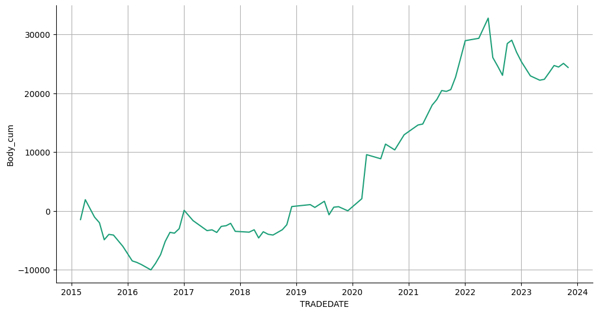

# Статистика по индексу RTS на основе дней в месяце сконвертированных из минут.

Статистика по направлениям свечей в зависимости от дня в месяце по конвертированным котировкам из минутных данных.

Подключение гугл диска


```python
from google.colab import drive
drive.mount('/content/drive')
```

    Drive already mounted at /content/drive; to attempt to forcibly remount, call drive.mount("/content/drive", force_remount=True).
    

Подключение к БД.


```python
import pandas as pd
import numpy as np
import sqlite3
import datetime
```


```python
connection = sqlite3.connect(r'/content/drive/MyDrive/data_quote_db/RTS_futures_minute_to_day_converter.db', check_same_thread=True)  # Создание соединения с БД
```

Загрузка данных в таблицу pandas.


```python
with connection:
  df = pd.read_sql('SELECT * FROM Day', connection)  # Загрузка данных из БД

print(df.to_string(max_rows=6, max_cols=25))  # Проверка того, что загрузилось
```

           TRADEDATE      OPEN       LOW      HIGH     CLOSE  VOLUME
    0     2015-01-05   78450.0   72470.0   78450.0   73100.0  375214
    1     2015-01-06   73230.0   71000.0   74900.0   72760.0  331659
    2     2015-01-08   72800.0   72800.0   81380.0   80190.0  520335
    ...          ...       ...       ...       ...       ...     ...
    2239  2023-12-12  105020.0  104240.0  106540.0  105710.0   89329
    2240  2023-12-13  105720.0  105150.0  107100.0  106960.0   73140
    2241  2023-12-14  106990.0  103910.0  107490.0  104100.0   95264
    

Подготовка DF


```python
# df = df.drop(['SECID', 'OPENPOSITION', 'SHORTNAME', 'LSTTRADE'], axis=1)
df['TRADEDATE'] = pd.to_datetime(df['TRADEDATE'])  # Смена типа
df = df.dropna().reset_index(drop=True)  # Удаление NaN
df = df.sort_values(by='TRADEDATE', ascending=False)  # Сортировка по убыванию
```

Создание и заполнение колонки с торговым днем месяца по убыванию.


```python
df['Work_day'] = np.nan  # Создание колонки и заполнение NaN
month_cur = 0
n = 1
for i in range(0, len(df)):
  if i == 0:
    month_prev = df.iloc[0, 0].month
  month_cur = df.iloc[i, 0].month
  if month_cur != month_prev:
    n = 1

  df.iloc[i, df.columns.get_loc('Work_day')] = n
  n += 1
  month_prev = month_cur

df[['Work_day']] = df[['Work_day']].astype(int)
df = df.sort_values(by='TRADEDATE', ascending=True)  # Сортировка по возрастанию
print(df.to_string(max_rows=6, max_cols=25))  # Проверка
```

          TRADEDATE      OPEN       LOW      HIGH     CLOSE  VOLUME  Work_day
    0    2015-01-05   78450.0   72470.0   78450.0   73100.0  375214        19
    1    2015-01-06   73230.0   71000.0   74900.0   72760.0  331659        18
    2    2015-01-08   72800.0   72800.0   81380.0   80190.0  520335        17
    ...         ...       ...       ...       ...       ...     ...       ...
    2239 2023-12-12  105020.0  104240.0  106540.0  105710.0   89329         3
    2240 2023-12-13  105720.0  105150.0  107100.0  106960.0   73140         2
    2241 2023-12-14  106990.0  103910.0  107490.0  104100.0   95264         1
    

Отбрасываем последний (неполный) месяц.


```python
year = df.iloc[-1, 0].year
month = df.iloc[-1, 0].month
end_date = datetime.datetime(year, month, 1)
df = df[df['TRADEDATE'] < end_date]
print(f'{year}-{month} отбрасываем этот месяц.')
print(df.to_string(max_rows=6, max_cols=25))  # Проверка
```

    2023-12 отбрасываем этот месяц.
          TRADEDATE      OPEN       LOW      HIGH     CLOSE  VOLUME  Work_day
    0    2015-01-05   78450.0   72470.0   78450.0   73100.0  375214        19
    1    2015-01-06   73230.0   71000.0   74900.0   72760.0  331659        18
    2    2015-01-08   72800.0   72800.0   81380.0   80190.0  520335        17
    ...         ...       ...       ...       ...       ...     ...       ...
    2229 2023-11-28  111760.0  111180.0  112160.0  111590.0   51503         3
    2230 2023-11-29  111660.0  110980.0  112560.0  112080.0   70978         2
    2231 2023-11-30  112200.0  110230.0  112240.0  110330.0   82948         1
    

Добавление колонки направления бара.


```python
# df['Up/Down'] = df.apply(lambda x: 1 if (x['OPEN'] < x['CLOSE']) else 0, axis=1)
df['Up'] = df.apply(lambda x: 1 if (x['OPEN'] < x['CLOSE']) else np.nan, axis=1)
df['Down'] = df.apply(lambda x: 1 if (x['OPEN'] >= x['CLOSE']) else np.nan, axis=1)
df['Body'] = df.apply(lambda x: -x['OPEN'] + x['CLOSE'], axis=1)
print(df.to_string(max_rows=6, max_cols=25))  # Проверка
# print('\n', df.value_counts("Up/Down"))
```

          TRADEDATE      OPEN       LOW      HIGH     CLOSE  VOLUME  Work_day   Up  Down    Body
    0    2015-01-05   78450.0   72470.0   78450.0   73100.0  375214        19  NaN   1.0 -5350.0
    1    2015-01-06   73230.0   71000.0   74900.0   72760.0  331659        18  NaN   1.0  -470.0
    2    2015-01-08   72800.0   72800.0   81380.0   80190.0  520335        17  1.0   NaN  7390.0
    ...         ...       ...       ...       ...       ...     ...       ...  ...   ...     ...
    2229 2023-11-28  111760.0  111180.0  112160.0  111590.0   51503         3  NaN   1.0  -170.0
    2230 2023-11-29  111660.0  110980.0  112560.0  112080.0   70978         2  1.0   NaN   420.0
    2231 2023-11-30  112200.0  110230.0  112240.0  110330.0   82948         1  NaN   1.0 -1870.0
    

Агрегация данных: подсчет количества баров на повышение и понижение по рабочену дню в месяце, суммирование размера тела свечи.


```python
agg_func_count = {'Up': ['count'],
                  'Down': ['count'],
                  'Body': ['sum']}
df_count = df.groupby(['Work_day']).agg(agg_func_count)  # статистика по Up / Down
df_count
```


  <div id="df-c37a2748-4d28-4698-9c33-11223f831055" class="colab-df-container">
    <div>
<style scoped>
    .dataframe tbody tr th:only-of-type {
        vertical-align: middle;
    }

    .dataframe tbody tr th {
        vertical-align: top;
    }

    .dataframe thead tr th {
        text-align: left;
    }

    .dataframe thead tr:last-of-type th {
        text-align: right;
    }
</style>
<table border="1" class="dataframe">
  <thead>
    <tr>
      <th></th>
      <th>Up</th>
      <th>Down</th>
      <th>Body</th>
    </tr>
    <tr>
      <th></th>
      <th>count</th>
      <th>count</th>
      <th>sum</th>
    </tr>
    <tr>
      <th>Work_day</th>
      <th></th>
      <th></th>
      <th></th>
    </tr>
  </thead>
  <tbody>
    <tr>
      <th>1</th>
      <td>45</td>
      <td>62</td>
      <td>-16240.0</td>
    </tr>
    <tr>
      <th>2</th>
      <td>60</td>
      <td>47</td>
      <td>-830.0</td>
    </tr>
    <tr>
      <th>3</th>
      <td>62</td>
      <td>45</td>
      <td>5660.0</td>
    </tr>
    <tr>
      <th>4</th>
      <td>47</td>
      <td>60</td>
      <td>-4350.0</td>
    </tr>
    <tr>
      <th>5</th>
      <td>62</td>
      <td>45</td>
      <td>-31970.0</td>
    </tr>
    <tr>
      <th>6</th>
      <td>58</td>
      <td>49</td>
      <td>23270.0</td>
    </tr>
    <tr>
      <th>7</th>
      <td>66</td>
      <td>40</td>
      <td>10.0</td>
    </tr>
    <tr>
      <th>8</th>
      <td>52</td>
      <td>54</td>
      <td>-6940.0</td>
    </tr>
    <tr>
      <th>9</th>
      <td>47</td>
      <td>59</td>
      <td>-16020.0</td>
    </tr>
    <tr>
      <th>10</th>
      <td>57</td>
      <td>49</td>
      <td>-7960.0</td>
    </tr>
    <tr>
      <th>11</th>
      <td>56</td>
      <td>50</td>
      <td>30190.0</td>
    </tr>
    <tr>
      <th>12</th>
      <td>62</td>
      <td>44</td>
      <td>6190.0</td>
    </tr>
    <tr>
      <th>13</th>
      <td>48</td>
      <td>58</td>
      <td>-8750.0</td>
    </tr>
    <tr>
      <th>14</th>
      <td>50</td>
      <td>56</td>
      <td>1760.0</td>
    </tr>
    <tr>
      <th>15</th>
      <td>64</td>
      <td>42</td>
      <td>26240.0</td>
    </tr>
    <tr>
      <th>16</th>
      <td>57</td>
      <td>49</td>
      <td>6550.0</td>
    </tr>
    <tr>
      <th>17</th>
      <td>55</td>
      <td>51</td>
      <td>9090.0</td>
    </tr>
    <tr>
      <th>18</th>
      <td>59</td>
      <td>47</td>
      <td>16170.0</td>
    </tr>
    <tr>
      <th>19</th>
      <td>60</td>
      <td>43</td>
      <td>5690.0</td>
    </tr>
    <tr>
      <th>20</th>
      <td>53</td>
      <td>39</td>
      <td>14730.0</td>
    </tr>
    <tr>
      <th>21</th>
      <td>42</td>
      <td>34</td>
      <td>24370.0</td>
    </tr>
    <tr>
      <th>22</th>
      <td>17</td>
      <td>21</td>
      <td>7890.0</td>
    </tr>
    <tr>
      <th>23</th>
      <td>3</td>
      <td>6</td>
      <td>-230.0</td>
    </tr>
  </tbody>
</table>
</div>
    <div class="colab-df-buttons">

  <div class="colab-df-container">
    <button class="colab-df-convert" onclick="convertToInteractive('df-c37a2748-4d28-4698-9c33-11223f831055')"
            title="Convert this dataframe to an interactive table."
            style="display:none;">

  <svg xmlns="http://www.w3.org/2000/svg" height="24px" viewBox="0 -960 960 960">
    <path d="M120-120v-720h720v720H120Zm60-500h600v-160H180v160Zm220 220h160v-160H400v160Zm0 220h160v-160H400v160ZM180-400h160v-160H180v160Zm440 0h160v-160H620v160ZM180-180h160v-160H180v160Zm440 0h160v-160H620v160Z"/>
  </svg>
    </button>

  <style>
    .colab-df-container {
      display:flex;
      gap: 12px;
    }

    .colab-df-convert {
      background-color: #E8F0FE;
      border: none;
      border-radius: 50%;
      cursor: pointer;
      display: none;
      fill: #1967D2;
      height: 32px;
      padding: 0 0 0 0;
      width: 32px;
    }

    .colab-df-convert:hover {
      background-color: #E2EBFA;
      box-shadow: 0px 1px 2px rgba(60, 64, 67, 0.3), 0px 1px 3px 1px rgba(60, 64, 67, 0.15);
      fill: #174EA6;
    }

    .colab-df-buttons div {
      margin-bottom: 4px;
    }

    [theme=dark] .colab-df-convert {
      background-color: #3B4455;
      fill: #D2E3FC;
    }

    [theme=dark] .colab-df-convert:hover {
      background-color: #434B5C;
      box-shadow: 0px 1px 3px 1px rgba(0, 0, 0, 0.15);
      filter: drop-shadow(0px 1px 2px rgba(0, 0, 0, 0.3));
      fill: #FFFFFF;
    }
  </style>

    <script>
      const buttonEl =
        document.querySelector('#df-c37a2748-4d28-4698-9c33-11223f831055 button.colab-df-convert');
      buttonEl.style.display =
        google.colab.kernel.accessAllowed ? 'block' : 'none';

      async function convertToInteractive(key) {
        const element = document.querySelector('#df-c37a2748-4d28-4698-9c33-11223f831055');
        const dataTable =
          await google.colab.kernel.invokeFunction('convertToInteractive',
                                                    [key], {});
        if (!dataTable) return;

        const docLinkHtml = 'Like what you see? Visit the ' +
          '<a target="_blank" href=https://colab.research.google.com/notebooks/data_table.ipynb>data table notebook</a>'
          + ' to learn more about interactive tables.';
        element.innerHTML = '';
        dataTable['output_type'] = 'display_data';
        await google.colab.output.renderOutput(dataTable, element);
        const docLink = document.createElement('div');
        docLink.innerHTML = docLinkHtml;
        element.appendChild(docLink);
      }
    </script>
  </div>


<div id="df-09c47976-b498-4ea4-98b5-6bbe516724d2">
  <button class="colab-df-quickchart" onclick="quickchart('df-09c47976-b498-4ea4-98b5-6bbe516724d2')"
            title="Suggest charts"
            style="display:none;">

<svg xmlns="http://www.w3.org/2000/svg" height="24px"viewBox="0 0 24 24"
     width="24px">
    <g>
        <path d="M19 3H5c-1.1 0-2 .9-2 2v14c0 1.1.9 2 2 2h14c1.1 0 2-.9 2-2V5c0-1.1-.9-2-2-2zM9 17H7v-7h2v7zm4 0h-2V7h2v10zm4 0h-2v-4h2v4z"/>
    </g>
</svg>
  </button>

<style>
  .colab-df-quickchart {
      --bg-color: #E8F0FE;
      --fill-color: #1967D2;
      --hover-bg-color: #E2EBFA;
      --hover-fill-color: #174EA6;
      --disabled-fill-color: #AAA;
      --disabled-bg-color: #DDD;
  }

  [theme=dark] .colab-df-quickchart {
      --bg-color: #3B4455;
      --fill-color: #D2E3FC;
      --hover-bg-color: #434B5C;
      --hover-fill-color: #FFFFFF;
      --disabled-bg-color: #3B4455;
      --disabled-fill-color: #666;
  }

  .colab-df-quickchart {
    background-color: var(--bg-color);
    border: none;
    border-radius: 50%;
    cursor: pointer;
    display: none;
    fill: var(--fill-color);
    height: 32px;
    padding: 0;
    width: 32px;
  }

  .colab-df-quickchart:hover {
    background-color: var(--hover-bg-color);
    box-shadow: 0 1px 2px rgba(60, 64, 67, 0.3), 0 1px 3px 1px rgba(60, 64, 67, 0.15);
    fill: var(--button-hover-fill-color);
  }

  .colab-df-quickchart-complete:disabled,
  .colab-df-quickchart-complete:disabled:hover {
    background-color: var(--disabled-bg-color);
    fill: var(--disabled-fill-color);
    box-shadow: none;
  }

  .colab-df-spinner {
    border: 2px solid var(--fill-color);
    border-color: transparent;
    border-bottom-color: var(--fill-color);
    animation:
      spin 1s steps(1) infinite;
  }

  @keyframes spin {
    0% {
      border-color: transparent;
      border-bottom-color: var(--fill-color);
      border-left-color: var(--fill-color);
    }
    20% {
      border-color: transparent;
      border-left-color: var(--fill-color);
      border-top-color: var(--fill-color);
    }
    30% {
      border-color: transparent;
      border-left-color: var(--fill-color);
      border-top-color: var(--fill-color);
      border-right-color: var(--fill-color);
    }
    40% {
      border-color: transparent;
      border-right-color: var(--fill-color);
      border-top-color: var(--fill-color);
    }
    60% {
      border-color: transparent;
      border-right-color: var(--fill-color);
    }
    80% {
      border-color: transparent;
      border-right-color: var(--fill-color);
      border-bottom-color: var(--fill-color);
    }
    90% {
      border-color: transparent;
      border-bottom-color: var(--fill-color);
    }
  }
</style>

  <script>
    async function quickchart(key) {
      const quickchartButtonEl =
        document.querySelector('#' + key + ' button');
      quickchartButtonEl.disabled = true;  // To prevent multiple clicks.
      quickchartButtonEl.classList.add('colab-df-spinner');
      try {
        const charts = await google.colab.kernel.invokeFunction(
            'suggestCharts', [key], {});
      } catch (error) {
        console.error('Error during call to suggestCharts:', error);
      }
      quickchartButtonEl.classList.remove('colab-df-spinner');
      quickchartButtonEl.classList.add('colab-df-quickchart-complete');
    }
    (() => {
      let quickchartButtonEl =
        document.querySelector('#df-09c47976-b498-4ea4-98b5-6bbe516724d2 button');
      quickchartButtonEl.style.display =
        google.colab.kernel.accessAllowed ? 'block' : 'none';
    })();
  </script>
</div>
    </div>
  </div>


Создание колонки соотношения повышающихся и понижающихся баров.


```python
df_count['Up-Down'] = df_count.apply(lambda x: x['Up'] - x['Down'], axis=1)
df_count[['Up-Down']] = df_count[['Up-Down']].astype(int)
df_count
```


  <div id="df-57bc644c-5ffb-468d-b951-74c715368088" class="colab-df-container">
    <div>
<style scoped>
    .dataframe tbody tr th:only-of-type {
        vertical-align: middle;
    }

    .dataframe tbody tr th {
        vertical-align: top;
    }

    .dataframe thead tr th {
        text-align: left;
    }

    .dataframe thead tr:last-of-type th {
        text-align: right;
    }
</style>
<table border="1" class="dataframe">
  <thead>
    <tr>
      <th></th>
      <th>Up</th>
      <th>Down</th>
      <th>Body</th>
      <th>Up-Down</th>
    </tr>
    <tr>
      <th></th>
      <th>count</th>
      <th>count</th>
      <th>sum</th>
      <th></th>
    </tr>
    <tr>
      <th>Work_day</th>
      <th></th>
      <th></th>
      <th></th>
      <th></th>
    </tr>
  </thead>
  <tbody>
    <tr>
      <th>1</th>
      <td>45</td>
      <td>62</td>
      <td>-16240.0</td>
      <td>-17</td>
    </tr>
    <tr>
      <th>2</th>
      <td>60</td>
      <td>47</td>
      <td>-830.0</td>
      <td>13</td>
    </tr>
    <tr>
      <th>3</th>
      <td>62</td>
      <td>45</td>
      <td>5660.0</td>
      <td>17</td>
    </tr>
    <tr>
      <th>4</th>
      <td>47</td>
      <td>60</td>
      <td>-4350.0</td>
      <td>-13</td>
    </tr>
    <tr>
      <th>5</th>
      <td>62</td>
      <td>45</td>
      <td>-31970.0</td>
      <td>17</td>
    </tr>
    <tr>
      <th>6</th>
      <td>58</td>
      <td>49</td>
      <td>23270.0</td>
      <td>9</td>
    </tr>
    <tr>
      <th>7</th>
      <td>66</td>
      <td>40</td>
      <td>10.0</td>
      <td>26</td>
    </tr>
    <tr>
      <th>8</th>
      <td>52</td>
      <td>54</td>
      <td>-6940.0</td>
      <td>-2</td>
    </tr>
    <tr>
      <th>9</th>
      <td>47</td>
      <td>59</td>
      <td>-16020.0</td>
      <td>-12</td>
    </tr>
    <tr>
      <th>10</th>
      <td>57</td>
      <td>49</td>
      <td>-7960.0</td>
      <td>8</td>
    </tr>
    <tr>
      <th>11</th>
      <td>56</td>
      <td>50</td>
      <td>30190.0</td>
      <td>6</td>
    </tr>
    <tr>
      <th>12</th>
      <td>62</td>
      <td>44</td>
      <td>6190.0</td>
      <td>18</td>
    </tr>
    <tr>
      <th>13</th>
      <td>48</td>
      <td>58</td>
      <td>-8750.0</td>
      <td>-10</td>
    </tr>
    <tr>
      <th>14</th>
      <td>50</td>
      <td>56</td>
      <td>1760.0</td>
      <td>-6</td>
    </tr>
    <tr>
      <th>15</th>
      <td>64</td>
      <td>42</td>
      <td>26240.0</td>
      <td>22</td>
    </tr>
    <tr>
      <th>16</th>
      <td>57</td>
      <td>49</td>
      <td>6550.0</td>
      <td>8</td>
    </tr>
    <tr>
      <th>17</th>
      <td>55</td>
      <td>51</td>
      <td>9090.0</td>
      <td>4</td>
    </tr>
    <tr>
      <th>18</th>
      <td>59</td>
      <td>47</td>
      <td>16170.0</td>
      <td>12</td>
    </tr>
    <tr>
      <th>19</th>
      <td>60</td>
      <td>43</td>
      <td>5690.0</td>
      <td>17</td>
    </tr>
    <tr>
      <th>20</th>
      <td>53</td>
      <td>39</td>
      <td>14730.0</td>
      <td>14</td>
    </tr>
    <tr>
      <th>21</th>
      <td>42</td>
      <td>34</td>
      <td>24370.0</td>
      <td>8</td>
    </tr>
    <tr>
      <th>22</th>
      <td>17</td>
      <td>21</td>
      <td>7890.0</td>
      <td>-4</td>
    </tr>
    <tr>
      <th>23</th>
      <td>3</td>
      <td>6</td>
      <td>-230.0</td>
      <td>-3</td>
    </tr>
  </tbody>
</table>
</div>
    <div class="colab-df-buttons">

  <div class="colab-df-container">
    <button class="colab-df-convert" onclick="convertToInteractive('df-57bc644c-5ffb-468d-b951-74c715368088')"
            title="Convert this dataframe to an interactive table."
            style="display:none;">

  <svg xmlns="http://www.w3.org/2000/svg" height="24px" viewBox="0 -960 960 960">
    <path d="M120-120v-720h720v720H120Zm60-500h600v-160H180v160Zm220 220h160v-160H400v160Zm0 220h160v-160H400v160ZM180-400h160v-160H180v160Zm440 0h160v-160H620v160ZM180-180h160v-160H180v160Zm440 0h160v-160H620v160Z"/>
  </svg>
    </button>

  <style>
    .colab-df-container {
      display:flex;
      gap: 12px;
    }

    .colab-df-convert {
      background-color: #E8F0FE;
      border: none;
      border-radius: 50%;
      cursor: pointer;
      display: none;
      fill: #1967D2;
      height: 32px;
      padding: 0 0 0 0;
      width: 32px;
    }

    .colab-df-convert:hover {
      background-color: #E2EBFA;
      box-shadow: 0px 1px 2px rgba(60, 64, 67, 0.3), 0px 1px 3px 1px rgba(60, 64, 67, 0.15);
      fill: #174EA6;
    }

    .colab-df-buttons div {
      margin-bottom: 4px;
    }

    [theme=dark] .colab-df-convert {
      background-color: #3B4455;
      fill: #D2E3FC;
    }

    [theme=dark] .colab-df-convert:hover {
      background-color: #434B5C;
      box-shadow: 0px 1px 3px 1px rgba(0, 0, 0, 0.15);
      filter: drop-shadow(0px 1px 2px rgba(0, 0, 0, 0.3));
      fill: #FFFFFF;
    }
  </style>

    <script>
      const buttonEl =
        document.querySelector('#df-57bc644c-5ffb-468d-b951-74c715368088 button.colab-df-convert');
      buttonEl.style.display =
        google.colab.kernel.accessAllowed ? 'block' : 'none';

      async function convertToInteractive(key) {
        const element = document.querySelector('#df-57bc644c-5ffb-468d-b951-74c715368088');
        const dataTable =
          await google.colab.kernel.invokeFunction('convertToInteractive',
                                                    [key], {});
        if (!dataTable) return;

        const docLinkHtml = 'Like what you see? Visit the ' +
          '<a target="_blank" href=https://colab.research.google.com/notebooks/data_table.ipynb>data table notebook</a>'
          + ' to learn more about interactive tables.';
        element.innerHTML = '';
        dataTable['output_type'] = 'display_data';
        await google.colab.output.renderOutput(dataTable, element);
        const docLink = document.createElement('div');
        docLink.innerHTML = docLinkHtml;
        element.appendChild(docLink);
      }
    </script>
  </div>


<div id="df-cbc253e5-01cc-43a8-82cb-bbda8efa0d4e">
  <button class="colab-df-quickchart" onclick="quickchart('df-cbc253e5-01cc-43a8-82cb-bbda8efa0d4e')"
            title="Suggest charts"
            style="display:none;">

<svg xmlns="http://www.w3.org/2000/svg" height="24px"viewBox="0 0 24 24"
     width="24px">
    <g>
        <path d="M19 3H5c-1.1 0-2 .9-2 2v14c0 1.1.9 2 2 2h14c1.1 0 2-.9 2-2V5c0-1.1-.9-2-2-2zM9 17H7v-7h2v7zm4 0h-2V7h2v10zm4 0h-2v-4h2v4z"/>
    </g>
</svg>
  </button>

<style>
  .colab-df-quickchart {
      --bg-color: #E8F0FE;
      --fill-color: #1967D2;
      --hover-bg-color: #E2EBFA;
      --hover-fill-color: #174EA6;
      --disabled-fill-color: #AAA;
      --disabled-bg-color: #DDD;
  }

  [theme=dark] .colab-df-quickchart {
      --bg-color: #3B4455;
      --fill-color: #D2E3FC;
      --hover-bg-color: #434B5C;
      --hover-fill-color: #FFFFFF;
      --disabled-bg-color: #3B4455;
      --disabled-fill-color: #666;
  }

  .colab-df-quickchart {
    background-color: var(--bg-color);
    border: none;
    border-radius: 50%;
    cursor: pointer;
    display: none;
    fill: var(--fill-color);
    height: 32px;
    padding: 0;
    width: 32px;
  }

  .colab-df-quickchart:hover {
    background-color: var(--hover-bg-color);
    box-shadow: 0 1px 2px rgba(60, 64, 67, 0.3), 0 1px 3px 1px rgba(60, 64, 67, 0.15);
    fill: var(--button-hover-fill-color);
  }

  .colab-df-quickchart-complete:disabled,
  .colab-df-quickchart-complete:disabled:hover {
    background-color: var(--disabled-bg-color);
    fill: var(--disabled-fill-color);
    box-shadow: none;
  }

  .colab-df-spinner {
    border: 2px solid var(--fill-color);
    border-color: transparent;
    border-bottom-color: var(--fill-color);
    animation:
      spin 1s steps(1) infinite;
  }

  @keyframes spin {
    0% {
      border-color: transparent;
      border-bottom-color: var(--fill-color);
      border-left-color: var(--fill-color);
    }
    20% {
      border-color: transparent;
      border-left-color: var(--fill-color);
      border-top-color: var(--fill-color);
    }
    30% {
      border-color: transparent;
      border-left-color: var(--fill-color);
      border-top-color: var(--fill-color);
      border-right-color: var(--fill-color);
    }
    40% {
      border-color: transparent;
      border-right-color: var(--fill-color);
      border-top-color: var(--fill-color);
    }
    60% {
      border-color: transparent;
      border-right-color: var(--fill-color);
    }
    80% {
      border-color: transparent;
      border-right-color: var(--fill-color);
      border-bottom-color: var(--fill-color);
    }
    90% {
      border-color: transparent;
      border-bottom-color: var(--fill-color);
    }
  }
</style>

  <script>
    async function quickchart(key) {
      const quickchartButtonEl =
        document.querySelector('#' + key + ' button');
      quickchartButtonEl.disabled = true;  // To prevent multiple clicks.
      quickchartButtonEl.classList.add('colab-df-spinner');
      try {
        const charts = await google.colab.kernel.invokeFunction(
            'suggestCharts', [key], {});
      } catch (error) {
        console.error('Error during call to suggestCharts:', error);
      }
      quickchartButtonEl.classList.remove('colab-df-spinner');
      quickchartButtonEl.classList.add('colab-df-quickchart-complete');
    }
    (() => {
      let quickchartButtonEl =
        document.querySelector('#df-cbc253e5-01cc-43a8-82cb-bbda8efa0d4e button');
      quickchartButtonEl.style.display =
        google.colab.kernel.accessAllowed ? 'block' : 'none';
    })();
  </script>
</div>
    </div>
  </div>


Расчет 75 перцентиля для определения выбросов вверх по сумме.  
Создание списка рабочих дней, когда произошли выбросы по сумме


```python
perc75 = np.percentile(df_count['Body', 'sum'], 75)
print(perc75)
df_count = df_count.loc[df_count['Body', 'sum'] > perc75]
day_lst = list(df_count.index)
print(day_lst)
df_count
```

    11910.0
    [6, 11, 15, 18, 20, 21]
    


  <div id="df-37db8c8c-e37c-4961-9544-f35b33a7695f" class="colab-df-container">
    <div>
<style scoped>
    .dataframe tbody tr th:only-of-type {
        vertical-align: middle;
    }

    .dataframe tbody tr th {
        vertical-align: top;
    }

    .dataframe thead tr th {
        text-align: left;
    }

    .dataframe thead tr:last-of-type th {
        text-align: right;
    }
</style>
<table border="1" class="dataframe">
  <thead>
    <tr>
      <th></th>
      <th>Up</th>
      <th>Down</th>
      <th>Body</th>
      <th>Up-Down</th>
    </tr>
    <tr>
      <th></th>
      <th>count</th>
      <th>count</th>
      <th>sum</th>
      <th></th>
    </tr>
    <tr>
      <th>Work_day</th>
      <th></th>
      <th></th>
      <th></th>
      <th></th>
    </tr>
  </thead>
  <tbody>
    <tr>
      <th>6</th>
      <td>58</td>
      <td>49</td>
      <td>23270.0</td>
      <td>9</td>
    </tr>
    <tr>
      <th>11</th>
      <td>56</td>
      <td>50</td>
      <td>30190.0</td>
      <td>6</td>
    </tr>
    <tr>
      <th>15</th>
      <td>64</td>
      <td>42</td>
      <td>26240.0</td>
      <td>22</td>
    </tr>
    <tr>
      <th>18</th>
      <td>59</td>
      <td>47</td>
      <td>16170.0</td>
      <td>12</td>
    </tr>
    <tr>
      <th>20</th>
      <td>53</td>
      <td>39</td>
      <td>14730.0</td>
      <td>14</td>
    </tr>
    <tr>
      <th>21</th>
      <td>42</td>
      <td>34</td>
      <td>24370.0</td>
      <td>8</td>
    </tr>
  </tbody>
</table>
</div>
    <div class="colab-df-buttons">

  <div class="colab-df-container">
    <button class="colab-df-convert" onclick="convertToInteractive('df-37db8c8c-e37c-4961-9544-f35b33a7695f')"
            title="Convert this dataframe to an interactive table."
            style="display:none;">

  <svg xmlns="http://www.w3.org/2000/svg" height="24px" viewBox="0 -960 960 960">
    <path d="M120-120v-720h720v720H120Zm60-500h600v-160H180v160Zm220 220h160v-160H400v160Zm0 220h160v-160H400v160ZM180-400h160v-160H180v160Zm440 0h160v-160H620v160ZM180-180h160v-160H180v160Zm440 0h160v-160H620v160Z"/>
  </svg>
    </button>

  <style>
    .colab-df-container {
      display:flex;
      gap: 12px;
    }

    .colab-df-convert {
      background-color: #E8F0FE;
      border: none;
      border-radius: 50%;
      cursor: pointer;
      display: none;
      fill: #1967D2;
      height: 32px;
      padding: 0 0 0 0;
      width: 32px;
    }

    .colab-df-convert:hover {
      background-color: #E2EBFA;
      box-shadow: 0px 1px 2px rgba(60, 64, 67, 0.3), 0px 1px 3px 1px rgba(60, 64, 67, 0.15);
      fill: #174EA6;
    }

    .colab-df-buttons div {
      margin-bottom: 4px;
    }

    [theme=dark] .colab-df-convert {
      background-color: #3B4455;
      fill: #D2E3FC;
    }

    [theme=dark] .colab-df-convert:hover {
      background-color: #434B5C;
      box-shadow: 0px 1px 3px 1px rgba(0, 0, 0, 0.15);
      filter: drop-shadow(0px 1px 2px rgba(0, 0, 0, 0.3));
      fill: #FFFFFF;
    }
  </style>

    <script>
      const buttonEl =
        document.querySelector('#df-37db8c8c-e37c-4961-9544-f35b33a7695f button.colab-df-convert');
      buttonEl.style.display =
        google.colab.kernel.accessAllowed ? 'block' : 'none';

      async function convertToInteractive(key) {
        const element = document.querySelector('#df-37db8c8c-e37c-4961-9544-f35b33a7695f');
        const dataTable =
          await google.colab.kernel.invokeFunction('convertToInteractive',
                                                    [key], {});
        if (!dataTable) return;

        const docLinkHtml = 'Like what you see? Visit the ' +
          '<a target="_blank" href=https://colab.research.google.com/notebooks/data_table.ipynb>data table notebook</a>'
          + ' to learn more about interactive tables.';
        element.innerHTML = '';
        dataTable['output_type'] = 'display_data';
        await google.colab.output.renderOutput(dataTable, element);
        const docLink = document.createElement('div');
        docLink.innerHTML = docLinkHtml;
        element.appendChild(docLink);
      }
    </script>
  </div>


<div id="df-464b6d4a-ea60-4c89-bd3e-85f5f7f19ee4">
  <button class="colab-df-quickchart" onclick="quickchart('df-464b6d4a-ea60-4c89-bd3e-85f5f7f19ee4')"
            title="Suggest charts"
            style="display:none;">

<svg xmlns="http://www.w3.org/2000/svg" height="24px"viewBox="0 0 24 24"
     width="24px">
    <g>
        <path d="M19 3H5c-1.1 0-2 .9-2 2v14c0 1.1.9 2 2 2h14c1.1 0 2-.9 2-2V5c0-1.1-.9-2-2-2zM9 17H7v-7h2v7zm4 0h-2V7h2v10zm4 0h-2v-4h2v4z"/>
    </g>
</svg>
  </button>

<style>
  .colab-df-quickchart {
      --bg-color: #E8F0FE;
      --fill-color: #1967D2;
      --hover-bg-color: #E2EBFA;
      --hover-fill-color: #174EA6;
      --disabled-fill-color: #AAA;
      --disabled-bg-color: #DDD;
  }

  [theme=dark] .colab-df-quickchart {
      --bg-color: #3B4455;
      --fill-color: #D2E3FC;
      --hover-bg-color: #434B5C;
      --hover-fill-color: #FFFFFF;
      --disabled-bg-color: #3B4455;
      --disabled-fill-color: #666;
  }

  .colab-df-quickchart {
    background-color: var(--bg-color);
    border: none;
    border-radius: 50%;
    cursor: pointer;
    display: none;
    fill: var(--fill-color);
    height: 32px;
    padding: 0;
    width: 32px;
  }

  .colab-df-quickchart:hover {
    background-color: var(--hover-bg-color);
    box-shadow: 0 1px 2px rgba(60, 64, 67, 0.3), 0 1px 3px 1px rgba(60, 64, 67, 0.15);
    fill: var(--button-hover-fill-color);
  }

  .colab-df-quickchart-complete:disabled,
  .colab-df-quickchart-complete:disabled:hover {
    background-color: var(--disabled-bg-color);
    fill: var(--disabled-fill-color);
    box-shadow: none;
  }

  .colab-df-spinner {
    border: 2px solid var(--fill-color);
    border-color: transparent;
    border-bottom-color: var(--fill-color);
    animation:
      spin 1s steps(1) infinite;
  }

  @keyframes spin {
    0% {
      border-color: transparent;
      border-bottom-color: var(--fill-color);
      border-left-color: var(--fill-color);
    }
    20% {
      border-color: transparent;
      border-left-color: var(--fill-color);
      border-top-color: var(--fill-color);
    }
    30% {
      border-color: transparent;
      border-left-color: var(--fill-color);
      border-top-color: var(--fill-color);
      border-right-color: var(--fill-color);
    }
    40% {
      border-color: transparent;
      border-right-color: var(--fill-color);
      border-top-color: var(--fill-color);
    }
    60% {
      border-color: transparent;
      border-right-color: var(--fill-color);
    }
    80% {
      border-color: transparent;
      border-right-color: var(--fill-color);
      border-bottom-color: var(--fill-color);
    }
    90% {
      border-color: transparent;
      border-bottom-color: var(--fill-color);
    }
  }
</style>

  <script>
    async function quickchart(key) {
      const quickchartButtonEl =
        document.querySelector('#' + key + ' button');
      quickchartButtonEl.disabled = true;  // To prevent multiple clicks.
      quickchartButtonEl.classList.add('colab-df-spinner');
      try {
        const charts = await google.colab.kernel.invokeFunction(
            'suggestCharts', [key], {});
      } catch (error) {
        console.error('Error during call to suggestCharts:', error);
      }
      quickchartButtonEl.classList.remove('colab-df-spinner');
      quickchartButtonEl.classList.add('colab-df-quickchart-complete');
    }
    (() => {
      let quickchartButtonEl =
        document.querySelector('#df-464b6d4a-ea60-4c89-bd3e-85f5f7f19ee4 button');
      quickchartButtonEl.style.display =
        google.colab.kernel.accessAllowed ? 'block' : 'none';
    })();
  </script>
</div>
    </div>
  </div>


```python
# df = df.loc[(df['Work_day'] >= 14) | (df['Work_day'] == 2)]  # Выборка по
# df = df.loc[df['Work_day'] >= 14]
# df = df.loc[df['Work_day'] == 2]
# df = df.loc[df['Work_day'].isin(day_lst)]
# df = df.loc[df['Work_day'] > 14]
# df = df.loc[(df['Work_day'] == 19) | (df['Work_day'] == 20) | (df['Work_day'] == 21)]  # Выборка по
df = df.loc[df['Work_day'] == 21]  # Выборка по

df["Body_cum"] = df["Body"].cumsum()
df
```

    <ipython-input-64-a62472a4a8f0>:9: SettingWithCopyWarning: 
    A value is trying to be set on a copy of a slice from a DataFrame.
    Try using .loc[row_indexer,col_indexer] = value instead
    
    See the caveats in the documentation: https://pandas.pydata.org/pandas-docs/stable/user_guide/indexing.html#returning-a-view-versus-a-copy
      df["Body_cum"] = df["Body"].cumsum()
    


  <div id="df-35eddf56-0636-420f-8797-743d7e35623e" class="colab-df-container">
    <div>
<style scoped>
    .dataframe tbody tr th:only-of-type {
        vertical-align: middle;
    }

    .dataframe tbody tr th {
        vertical-align: top;
    }

    .dataframe thead th {
        text-align: right;
    }
</style>
<table border="1" class="dataframe">
  <thead>
    <tr style="text-align: right;">
      <th></th>
      <th>TRADEDATE</th>
      <th>OPEN</th>
      <th>LOW</th>
      <th>HIGH</th>
      <th>CLOSE</th>
      <th>VOLUME</th>
      <th>Work_day</th>
      <th>Up</th>
      <th>Down</th>
      <th>Body</th>
      <th>Body_cum</th>
    </tr>
  </thead>
  <tbody>
    <tr>
      <th>38</th>
      <td>2015-03-02</td>
      <td>90350.0</td>
      <td>88520.0</td>
      <td>90600.0</td>
      <td>88880.0</td>
      <td>440817</td>
      <td>21</td>
      <td>NaN</td>
      <td>1.0</td>
      <td>-1470.0</td>
      <td>-1470.0</td>
    </tr>
    <tr>
      <th>60</th>
      <td>2015-04-02</td>
      <td>89380.0</td>
      <td>89270.0</td>
      <td>93400.0</td>
      <td>92760.0</td>
      <td>679442</td>
      <td>21</td>
      <td>1.0</td>
      <td>NaN</td>
      <td>3380.0</td>
      <td>1910.0</td>
    </tr>
    <tr>
      <th>99</th>
      <td>2015-06-01</td>
      <td>97830.0</td>
      <td>94750.0</td>
      <td>98200.0</td>
      <td>94870.0</td>
      <td>545975</td>
      <td>21</td>
      <td>NaN</td>
      <td>1.0</td>
      <td>-2960.0</td>
      <td>-1050.0</td>
    </tr>
    <tr>
      <th>122</th>
      <td>2015-07-03</td>
      <td>90550.0</td>
      <td>89220.0</td>
      <td>90950.0</td>
      <td>89590.0</td>
      <td>415919</td>
      <td>21</td>
      <td>NaN</td>
      <td>1.0</td>
      <td>-960.0</td>
      <td>-2010.0</td>
    </tr>
    <tr>
      <th>143</th>
      <td>2015-08-03</td>
      <td>84760.0</td>
      <td>81720.0</td>
      <td>84760.0</td>
      <td>81870.0</td>
      <td>876575</td>
      <td>21</td>
      <td>NaN</td>
      <td>1.0</td>
      <td>-2890.0</td>
      <td>-4900.0</td>
    </tr>
    <tr>
      <th>...</th>
      <td>...</td>
      <td>...</td>
      <td>...</td>
      <td>...</td>
      <td>...</td>
      <td>...</td>
      <td>...</td>
      <td>...</td>
      <td>...</td>
      <td>...</td>
      <td>...</td>
    </tr>
    <tr>
      <th>2123</th>
      <td>2023-07-03</td>
      <td>99490.0</td>
      <td>99440.0</td>
      <td>101090.0</td>
      <td>100660.0</td>
      <td>103455</td>
      <td>21</td>
      <td>1.0</td>
      <td>NaN</td>
      <td>1170.0</td>
      <td>23530.0</td>
    </tr>
    <tr>
      <th>2146</th>
      <td>2023-08-03</td>
      <td>105900.0</td>
      <td>105710.0</td>
      <td>107340.0</td>
      <td>107070.0</td>
      <td>97540</td>
      <td>21</td>
      <td>1.0</td>
      <td>NaN</td>
      <td>1170.0</td>
      <td>24700.0</td>
    </tr>
    <tr>
      <th>2167</th>
      <td>2023-09-01</td>
      <td>106830.0</td>
      <td>105810.0</td>
      <td>106900.0</td>
      <td>106570.0</td>
      <td>66704</td>
      <td>21</td>
      <td>NaN</td>
      <td>1.0</td>
      <td>-260.0</td>
      <td>24440.0</td>
    </tr>
    <tr>
      <th>2189</th>
      <td>2023-10-03</td>
      <td>100470.0</td>
      <td>99700.0</td>
      <td>101160.0</td>
      <td>101090.0</td>
      <td>75712</td>
      <td>21</td>
      <td>1.0</td>
      <td>NaN</td>
      <td>620.0</td>
      <td>25060.0</td>
    </tr>
    <tr>
      <th>2211</th>
      <td>2023-11-02</td>
      <td>107440.0</td>
      <td>106430.0</td>
      <td>107830.0</td>
      <td>106750.0</td>
      <td>55649</td>
      <td>21</td>
      <td>NaN</td>
      <td>1.0</td>
      <td>-690.0</td>
      <td>24370.0</td>
    </tr>
  </tbody>
</table>
<p>76 rows × 11 columns</p>
</div>
    <div class="colab-df-buttons">

  <div class="colab-df-container">
    <button class="colab-df-convert" onclick="convertToInteractive('df-35eddf56-0636-420f-8797-743d7e35623e')"
            title="Convert this dataframe to an interactive table."
            style="display:none;">

  <svg xmlns="http://www.w3.org/2000/svg" height="24px" viewBox="0 -960 960 960">
    <path d="M120-120v-720h720v720H120Zm60-500h600v-160H180v160Zm220 220h160v-160H400v160Zm0 220h160v-160H400v160ZM180-400h160v-160H180v160Zm440 0h160v-160H620v160ZM180-180h160v-160H180v160Zm440 0h160v-160H620v160Z"/>
  </svg>
    </button>

  <style>
    .colab-df-container {
      display:flex;
      gap: 12px;
    }

    .colab-df-convert {
      background-color: #E8F0FE;
      border: none;
      border-radius: 50%;
      cursor: pointer;
      display: none;
      fill: #1967D2;
      height: 32px;
      padding: 0 0 0 0;
      width: 32px;
    }

    .colab-df-convert:hover {
      background-color: #E2EBFA;
      box-shadow: 0px 1px 2px rgba(60, 64, 67, 0.3), 0px 1px 3px 1px rgba(60, 64, 67, 0.15);
      fill: #174EA6;
    }

    .colab-df-buttons div {
      margin-bottom: 4px;
    }

    [theme=dark] .colab-df-convert {
      background-color: #3B4455;
      fill: #D2E3FC;
    }

    [theme=dark] .colab-df-convert:hover {
      background-color: #434B5C;
      box-shadow: 0px 1px 3px 1px rgba(0, 0, 0, 0.15);
      filter: drop-shadow(0px 1px 2px rgba(0, 0, 0, 0.3));
      fill: #FFFFFF;
    }
  </style>

    <script>
      const buttonEl =
        document.querySelector('#df-35eddf56-0636-420f-8797-743d7e35623e button.colab-df-convert');
      buttonEl.style.display =
        google.colab.kernel.accessAllowed ? 'block' : 'none';

      async function convertToInteractive(key) {
        const element = document.querySelector('#df-35eddf56-0636-420f-8797-743d7e35623e');
        const dataTable =
          await google.colab.kernel.invokeFunction('convertToInteractive',
                                                    [key], {});
        if (!dataTable) return;

        const docLinkHtml = 'Like what you see? Visit the ' +
          '<a target="_blank" href=https://colab.research.google.com/notebooks/data_table.ipynb>data table notebook</a>'
          + ' to learn more about interactive tables.';
        element.innerHTML = '';
        dataTable['output_type'] = 'display_data';
        await google.colab.output.renderOutput(dataTable, element);
        const docLink = document.createElement('div');
        docLink.innerHTML = docLinkHtml;
        element.appendChild(docLink);
      }
    </script>
  </div>


<div id="df-5f6643a4-d550-4e1d-b0a4-8eb0f1139d50">
  <button class="colab-df-quickchart" onclick="quickchart('df-5f6643a4-d550-4e1d-b0a4-8eb0f1139d50')"
            title="Suggest charts"
            style="display:none;">

<svg xmlns="http://www.w3.org/2000/svg" height="24px"viewBox="0 0 24 24"
     width="24px">
    <g>
        <path d="M19 3H5c-1.1 0-2 .9-2 2v14c0 1.1.9 2 2 2h14c1.1 0 2-.9 2-2V5c0-1.1-.9-2-2-2zM9 17H7v-7h2v7zm4 0h-2V7h2v10zm4 0h-2v-4h2v4z"/>
    </g>
</svg>
  </button>

<style>
  .colab-df-quickchart {
      --bg-color: #E8F0FE;
      --fill-color: #1967D2;
      --hover-bg-color: #E2EBFA;
      --hover-fill-color: #174EA6;
      --disabled-fill-color: #AAA;
      --disabled-bg-color: #DDD;
  }

  [theme=dark] .colab-df-quickchart {
      --bg-color: #3B4455;
      --fill-color: #D2E3FC;
      --hover-bg-color: #434B5C;
      --hover-fill-color: #FFFFFF;
      --disabled-bg-color: #3B4455;
      --disabled-fill-color: #666;
  }

  .colab-df-quickchart {
    background-color: var(--bg-color);
    border: none;
    border-radius: 50%;
    cursor: pointer;
    display: none;
    fill: var(--fill-color);
    height: 32px;
    padding: 0;
    width: 32px;
  }

  .colab-df-quickchart:hover {
    background-color: var(--hover-bg-color);
    box-shadow: 0 1px 2px rgba(60, 64, 67, 0.3), 0 1px 3px 1px rgba(60, 64, 67, 0.15);
    fill: var(--button-hover-fill-color);
  }

  .colab-df-quickchart-complete:disabled,
  .colab-df-quickchart-complete:disabled:hover {
    background-color: var(--disabled-bg-color);
    fill: var(--disabled-fill-color);
    box-shadow: none;
  }

  .colab-df-spinner {
    border: 2px solid var(--fill-color);
    border-color: transparent;
    border-bottom-color: var(--fill-color);
    animation:
      spin 1s steps(1) infinite;
  }

  @keyframes spin {
    0% {
      border-color: transparent;
      border-bottom-color: var(--fill-color);
      border-left-color: var(--fill-color);
    }
    20% {
      border-color: transparent;
      border-left-color: var(--fill-color);
      border-top-color: var(--fill-color);
    }
    30% {
      border-color: transparent;
      border-left-color: var(--fill-color);
      border-top-color: var(--fill-color);
      border-right-color: var(--fill-color);
    }
    40% {
      border-color: transparent;
      border-right-color: var(--fill-color);
      border-top-color: var(--fill-color);
    }
    60% {
      border-color: transparent;
      border-right-color: var(--fill-color);
    }
    80% {
      border-color: transparent;
      border-right-color: var(--fill-color);
      border-bottom-color: var(--fill-color);
    }
    90% {
      border-color: transparent;
      border-bottom-color: var(--fill-color);
    }
  }
</style>

  <script>
    async function quickchart(key) {
      const quickchartButtonEl =
        document.querySelector('#' + key + ' button');
      quickchartButtonEl.disabled = true;  // To prevent multiple clicks.
      quickchartButtonEl.classList.add('colab-df-spinner');
      try {
        const charts = await google.colab.kernel.invokeFunction(
            'suggestCharts', [key], {});
      } catch (error) {
        console.error('Error during call to suggestCharts:', error);
      }
      quickchartButtonEl.classList.remove('colab-df-spinner');
      quickchartButtonEl.classList.add('colab-df-quickchart-complete');
    }
    (() => {
      let quickchartButtonEl =
        document.querySelector('#df-5f6643a4-d550-4e1d-b0a4-8eb0f1139d50 button');
      quickchartButtonEl.style.display =
        google.colab.kernel.accessAllowed ? 'block' : 'none';
    })();
  </script>
</div>
    </div>
  </div>


```python
from matplotlib import pyplot as plt
import seaborn as sns
def _plot_series(series, series_name, series_index=0):
  from matplotlib import pyplot as plt
  import seaborn as sns
  palette = list(sns.palettes.mpl_palette('Dark2'))
  xs = series['TRADEDATE']
  ys = series['Body_cum']

  plt.plot(xs, ys, label=series_name, color=palette[series_index % len(palette)])

fig, ax = plt.subplots(figsize=(10, 5.2), layout='constrained')
df_sorted = df.sort_values('TRADEDATE', ascending=True)
_plot_series(df_sorted, '')
sns.despine(fig=fig, ax=ax)
plt.xlabel('TRADEDATE')
# plt.grid(axis='x')  # , color='0.95'
plt.grid()
_ = plt.ylabel('Body_cum')
```


    

    

