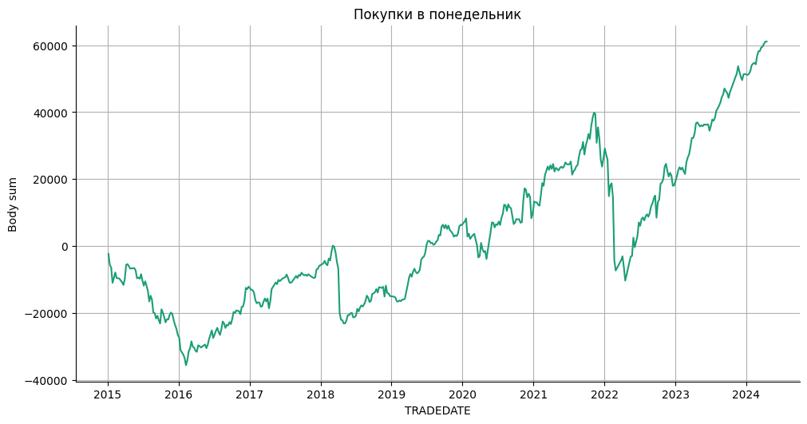
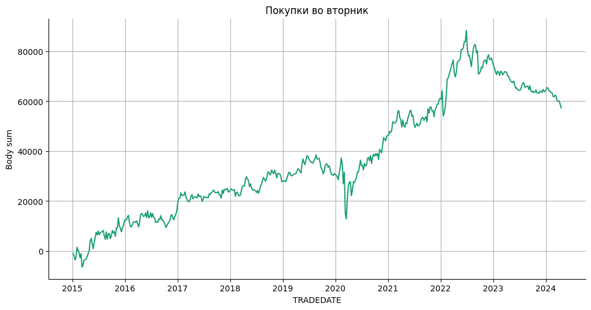
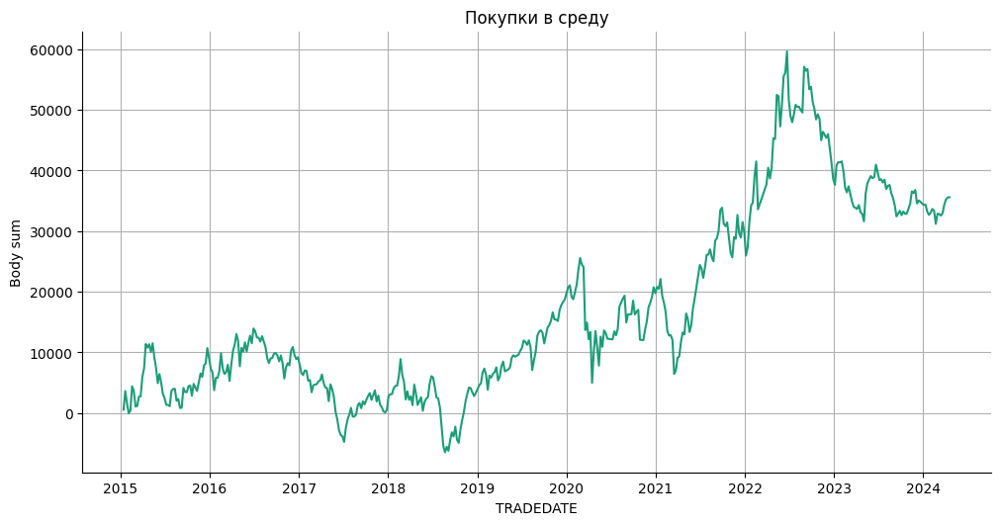
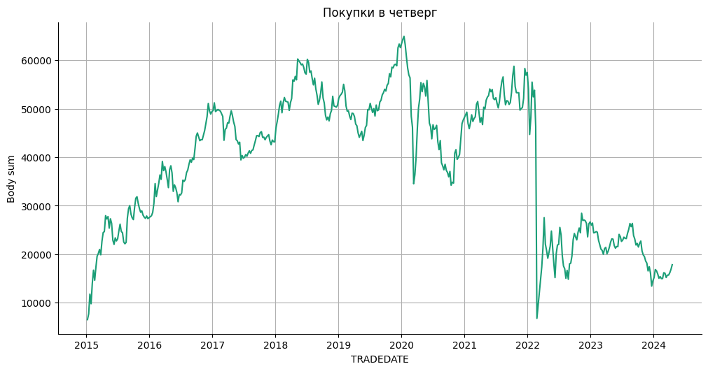
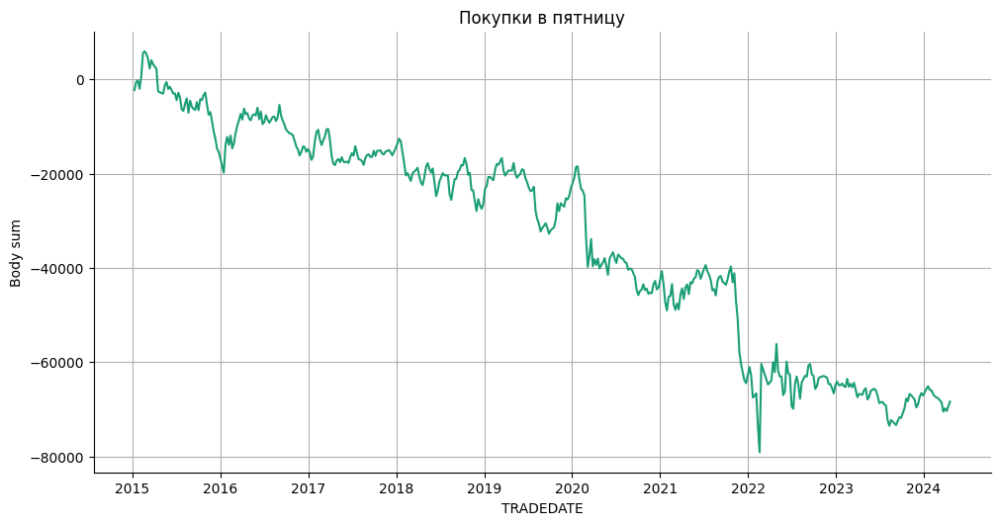
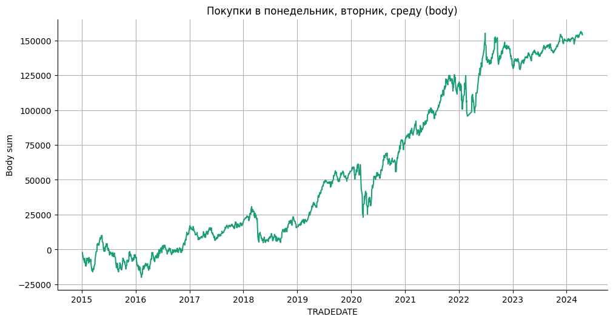
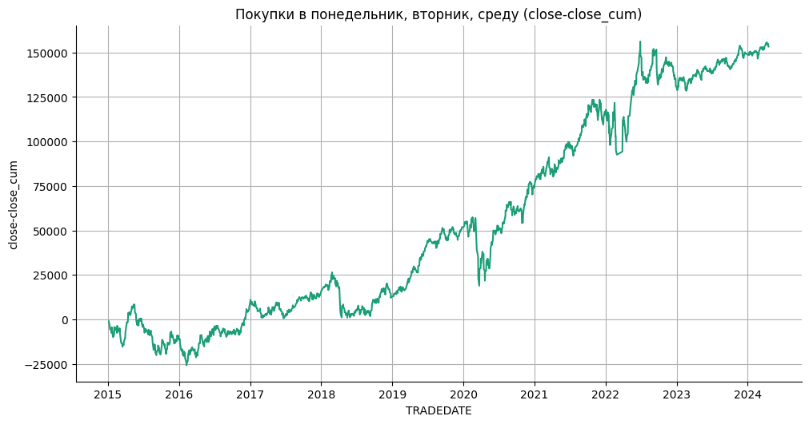

# Статистика по индексу RTS на основе дней в неделе.

Статистика по направлениям свечей в зависимости от дня в неделе.  
Проверка гипотезы на торговлю в определенные дни недели.

Подключение гугл диска


```python
from google.colab import drive
drive.mount('/content/drive', force_remount=True)
```

    Mounted at /content/drive
    

Подключение к БД.


```python
import pandas as pd
import numpy as np
import sqlite3
import datetime
```


```python
connection = sqlite3.connect(r'/content/drive/MyDrive/data_quote_db/RTS_futures_day.db', check_same_thread=True)  # Создание соединения с БД
```

Загрузка данных в таблицу pandas.


```python
with connection:
  df = pd.read_sql('SELECT * FROM Day', connection)  # Загрузка данных из БД

print(df.to_string(max_rows=6, max_cols=25))  # Проверка того, что загрузилось
```

           TRADEDATE      SECID      OPEN       LOW      HIGH     CLOSE  VOLUME  OPENPOSITION SHORTNAME    LSTTRADE
    0     2015-01-05  RIH5_2015   76930.0   72470.0   78980.0   74600.0  372848        751996  RTS-3.15  2015-03-16
    1     2015-01-06  RIH5_2015   74470.0   71200.0   74610.0   73480.0  319307        731236  RTS-3.15  2015-03-16
    2     2015-01-08  RIH5_2015   73490.0   71000.0   81380.0   79980.0  537469        751010  RTS-3.15  2015-03-16
    ...          ...        ...       ...       ...       ...       ...     ...           ...       ...         ...
    2327  2024-04-17       RIM4  113740.0  113190.0  114250.0  113780.0   58220         90778  RTS-6.24  2024-06-20
    2328  2024-04-18       RIM4  113760.0  113060.0  114860.0  114700.0   57204         96230  RTS-6.24  2024-06-20
    2329  2024-04-19       RIM4  114750.0  114570.0  116030.0  115800.0   59930        102164  RTS-6.24  2024-06-20
    

Подготовка DF


```python
df = df.drop(['SECID', 'OPENPOSITION', 'SHORTNAME', 'LSTTRADE'], axis=1)
df['TRADEDATE'] = pd.to_datetime(df['TRADEDATE'])  # Смена типа
df = df.dropna().reset_index(drop=True)  # Удаление NaN
```

Создание и заполнение колонки с торговым днем недели.


```python
df['Work_day'] = df['TRADEDATE'].dt.weekday

df[['Work_day']] = df[['Work_day']].astype(int)
df = df.sort_values(by='TRADEDATE', ascending=True)  # Сортировка по возрастанию
print(df.to_string(max_rows=6, max_cols=25))  # Проверка
```

          TRADEDATE      OPEN       LOW      HIGH     CLOSE  VOLUME  Work_day
    0    2015-01-05   76930.0   72470.0   78980.0   74600.0  372848         0
    1    2015-01-06   74470.0   71200.0   74610.0   73480.0  319307         1
    2    2015-01-08   73490.0   71000.0   81380.0   79980.0  537469         3
    ...         ...       ...       ...       ...       ...     ...       ...
    2327 2024-04-17  113740.0  113190.0  114250.0  113780.0   58220         2
    2328 2024-04-18  113760.0  113060.0  114860.0  114700.0   57204         3
    2329 2024-04-19  114750.0  114570.0  116030.0  115800.0   59930         4
    

Добавление колонок: направления бара и размера тела свечи.


```python
df['Up'] = df.apply(lambda x: 1 if (x['OPEN'] < x['CLOSE']) else np.nan, axis=1)
df['Down'] = df.apply(lambda x: 1 if (x['OPEN'] >= x['CLOSE']) else np.nan, axis=1)
df['Body'] = df.apply(lambda x: -x['OPEN'] + x['CLOSE'], axis=1)
print(df.to_string(max_rows=6, max_cols=25))  # Проверка
```

          TRADEDATE      OPEN       LOW      HIGH     CLOSE  VOLUME  Work_day   Up  Down    Body
    0    2015-01-05   76930.0   72470.0   78980.0   74600.0  372848         0  NaN   1.0 -2330.0
    1    2015-01-06   74470.0   71200.0   74610.0   73480.0  319307         1  NaN   1.0  -990.0
    2    2015-01-08   73490.0   71000.0   81380.0   79980.0  537469         3  1.0   NaN  6490.0
    ...         ...       ...       ...       ...       ...     ...       ...  ...   ...     ...
    2327 2024-04-17  113740.0  113190.0  114250.0  113780.0   58220         2  1.0   NaN    40.0
    2328 2024-04-18  113760.0  113060.0  114860.0  114700.0   57204         3  1.0   NaN   940.0
    2329 2024-04-19  114750.0  114570.0  116030.0  115800.0   59930         4  1.0   NaN  1050.0
    

Агрегация данных.


```python
agg_func_count = {'Up': ['count'],
                  'Down': ['count'],
                  'Body': ['sum']}
df_count = df.groupby(['Work_day']).agg(agg_func_count)  # статистика по Up / Down
df_count.columns = ['_'.join(col).rstrip('_') for col in df_count.columns.values]  # Объединение названий колонок
df_count
```


  <div id="df-b5367db5-31ba-49b1-8399-29648da8c649" class="colab-df-container">
    <div>
<style scoped>
    .dataframe tbody tr th:only-of-type {
        vertical-align: middle;
    }

    .dataframe tbody tr th {
        vertical-align: top;
    }

    .dataframe thead th {
        text-align: right;
    }
</style>
<table border="1" class="dataframe">
  <thead>
    <tr style="text-align: right;">
      <th></th>
      <th>Up_count</th>
      <th>Down_count</th>
      <th>Body_sum</th>
    </tr>
    <tr>
      <th>Work_day</th>
      <th></th>
      <th></th>
      <th></th>
    </tr>
  </thead>
  <tbody>
    <tr>
      <th>0</th>
      <td>254</td>
      <td>197</td>
      <td>61110.0</td>
    </tr>
    <tr>
      <th>1</th>
      <td>251</td>
      <td>215</td>
      <td>57340.0</td>
    </tr>
    <tr>
      <th>2</th>
      <td>252</td>
      <td>217</td>
      <td>35580.0</td>
    </tr>
    <tr>
      <th>3</th>
      <td>249</td>
      <td>223</td>
      <td>17820.0</td>
    </tr>
    <tr>
      <th>4</th>
      <td>223</td>
      <td>244</td>
      <td>-68340.0</td>
    </tr>
    <tr>
      <th>5</th>
      <td>3</td>
      <td>2</td>
      <td>770.0</td>
    </tr>
  </tbody>
</table>
</div>
    <div class="colab-df-buttons">

  <div class="colab-df-container">
    <button class="colab-df-convert" onclick="convertToInteractive('df-b5367db5-31ba-49b1-8399-29648da8c649')"
            title="Convert this dataframe to an interactive table."
            style="display:none;">

  <svg xmlns="http://www.w3.org/2000/svg" height="24px" viewBox="0 -960 960 960">
    <path d="M120-120v-720h720v720H120Zm60-500h600v-160H180v160Zm220 220h160v-160H400v160Zm0 220h160v-160H400v160ZM180-400h160v-160H180v160Zm440 0h160v-160H620v160ZM180-180h160v-160H180v160Zm440 0h160v-160H620v160Z"/>
  </svg>
    </button>

  <style>
    .colab-df-container {
      display:flex;
      gap: 12px;
    }

    .colab-df-convert {
      background-color: #E8F0FE;
      border: none;
      border-radius: 50%;
      cursor: pointer;
      display: none;
      fill: #1967D2;
      height: 32px;
      padding: 0 0 0 0;
      width: 32px;
    }

    .colab-df-convert:hover {
      background-color: #E2EBFA;
      box-shadow: 0px 1px 2px rgba(60, 64, 67, 0.3), 0px 1px 3px 1px rgba(60, 64, 67, 0.15);
      fill: #174EA6;
    }

    .colab-df-buttons div {
      margin-bottom: 4px;
    }

    [theme=dark] .colab-df-convert {
      background-color: #3B4455;
      fill: #D2E3FC;
    }

    [theme=dark] .colab-df-convert:hover {
      background-color: #434B5C;
      box-shadow: 0px 1px 3px 1px rgba(0, 0, 0, 0.15);
      filter: drop-shadow(0px 1px 2px rgba(0, 0, 0, 0.3));
      fill: #FFFFFF;
    }
  </style>

    <script>
      const buttonEl =
        document.querySelector('#df-b5367db5-31ba-49b1-8399-29648da8c649 button.colab-df-convert');
      buttonEl.style.display =
        google.colab.kernel.accessAllowed ? 'block' : 'none';

      async function convertToInteractive(key) {
        const element = document.querySelector('#df-b5367db5-31ba-49b1-8399-29648da8c649');
        const dataTable =
          await google.colab.kernel.invokeFunction('convertToInteractive',
                                                    [key], {});
        if (!dataTable) return;

        const docLinkHtml = 'Like what you see? Visit the ' +
          '<a target="_blank" href=https://colab.research.google.com/notebooks/data_table.ipynb>data table notebook</a>'
          + ' to learn more about interactive tables.';
        element.innerHTML = '';
        dataTable['output_type'] = 'display_data';
        await google.colab.output.renderOutput(dataTable, element);
        const docLink = document.createElement('div');
        docLink.innerHTML = docLinkHtml;
        element.appendChild(docLink);
      }
    </script>
  </div>


<div id="df-5409ef98-2937-43a6-99d1-cd556e3ebe6e">
  <button class="colab-df-quickchart" onclick="quickchart('df-5409ef98-2937-43a6-99d1-cd556e3ebe6e')"
            title="Suggest charts"
            style="display:none;">

<svg xmlns="http://www.w3.org/2000/svg" height="24px"viewBox="0 0 24 24"
     width="24px">
    <g>
        <path d="M19 3H5c-1.1 0-2 .9-2 2v14c0 1.1.9 2 2 2h14c1.1 0 2-.9 2-2V5c0-1.1-.9-2-2-2zM9 17H7v-7h2v7zm4 0h-2V7h2v10zm4 0h-2v-4h2v4z"/>
    </g>
</svg>
  </button>

<style>
  .colab-df-quickchart {
      --bg-color: #E8F0FE;
      --fill-color: #1967D2;
      --hover-bg-color: #E2EBFA;
      --hover-fill-color: #174EA6;
      --disabled-fill-color: #AAA;
      --disabled-bg-color: #DDD;
  }

  [theme=dark] .colab-df-quickchart {
      --bg-color: #3B4455;
      --fill-color: #D2E3FC;
      --hover-bg-color: #434B5C;
      --hover-fill-color: #FFFFFF;
      --disabled-bg-color: #3B4455;
      --disabled-fill-color: #666;
  }

  .colab-df-quickchart {
    background-color: var(--bg-color);
    border: none;
    border-radius: 50%;
    cursor: pointer;
    display: none;
    fill: var(--fill-color);
    height: 32px;
    padding: 0;
    width: 32px;
  }

  .colab-df-quickchart:hover {
    background-color: var(--hover-bg-color);
    box-shadow: 0 1px 2px rgba(60, 64, 67, 0.3), 0 1px 3px 1px rgba(60, 64, 67, 0.15);
    fill: var(--button-hover-fill-color);
  }

  .colab-df-quickchart-complete:disabled,
  .colab-df-quickchart-complete:disabled:hover {
    background-color: var(--disabled-bg-color);
    fill: var(--disabled-fill-color);
    box-shadow: none;
  }

  .colab-df-spinner {
    border: 2px solid var(--fill-color);
    border-color: transparent;
    border-bottom-color: var(--fill-color);
    animation:
      spin 1s steps(1) infinite;
  }

  @keyframes spin {
    0% {
      border-color: transparent;
      border-bottom-color: var(--fill-color);
      border-left-color: var(--fill-color);
    }
    20% {
      border-color: transparent;
      border-left-color: var(--fill-color);
      border-top-color: var(--fill-color);
    }
    30% {
      border-color: transparent;
      border-left-color: var(--fill-color);
      border-top-color: var(--fill-color);
      border-right-color: var(--fill-color);
    }
    40% {
      border-color: transparent;
      border-right-color: var(--fill-color);
      border-top-color: var(--fill-color);
    }
    60% {
      border-color: transparent;
      border-right-color: var(--fill-color);
    }
    80% {
      border-color: transparent;
      border-right-color: var(--fill-color);
      border-bottom-color: var(--fill-color);
    }
    90% {
      border-color: transparent;
      border-bottom-color: var(--fill-color);
    }
  }
</style>

  <script>
    async function quickchart(key) {
      const quickchartButtonEl =
        document.querySelector('#' + key + ' button');
      quickchartButtonEl.disabled = true;  // To prevent multiple clicks.
      quickchartButtonEl.classList.add('colab-df-spinner');
      try {
        const charts = await google.colab.kernel.invokeFunction(
            'suggestCharts', [key], {});
      } catch (error) {
        console.error('Error during call to suggestCharts:', error);
      }
      quickchartButtonEl.classList.remove('colab-df-spinner');
      quickchartButtonEl.classList.add('colab-df-quickchart-complete');
    }
    (() => {
      let quickchartButtonEl =
        document.querySelector('#df-5409ef98-2937-43a6-99d1-cd556e3ebe6e button');
      quickchartButtonEl.style.display =
        google.colab.kernel.accessAllowed ? 'block' : 'none';
    })();
  </script>
</div>
    </div>
  </div>


```python
df_count['Up-Down'] = df_count.apply(lambda x: x['Up_count'] - x['Down_count'], axis=1)
df_count[['Up-Down']] = df_count[['Up-Down']].astype(int)
df_count
```


  <div id="df-b7c284c4-0469-45f7-8c59-bd515ee0b15e" class="colab-df-container">
    <div>
<style scoped>
    .dataframe tbody tr th:only-of-type {
        vertical-align: middle;
    }

    .dataframe tbody tr th {
        vertical-align: top;
    }

    .dataframe thead th {
        text-align: right;
    }
</style>
<table border="1" class="dataframe">
  <thead>
    <tr style="text-align: right;">
      <th></th>
      <th>Up_count</th>
      <th>Down_count</th>
      <th>Body_sum</th>
      <th>Up-Down</th>
    </tr>
    <tr>
      <th>Work_day</th>
      <th></th>
      <th></th>
      <th></th>
      <th></th>
    </tr>
  </thead>
  <tbody>
    <tr>
      <th>0</th>
      <td>254</td>
      <td>197</td>
      <td>61110.0</td>
      <td>57</td>
    </tr>
    <tr>
      <th>1</th>
      <td>251</td>
      <td>215</td>
      <td>57340.0</td>
      <td>36</td>
    </tr>
    <tr>
      <th>2</th>
      <td>252</td>
      <td>217</td>
      <td>35580.0</td>
      <td>35</td>
    </tr>
    <tr>
      <th>3</th>
      <td>249</td>
      <td>223</td>
      <td>17820.0</td>
      <td>26</td>
    </tr>
    <tr>
      <th>4</th>
      <td>223</td>
      <td>244</td>
      <td>-68340.0</td>
      <td>-21</td>
    </tr>
    <tr>
      <th>5</th>
      <td>3</td>
      <td>2</td>
      <td>770.0</td>
      <td>1</td>
    </tr>
  </tbody>
</table>
</div>
    <div class="colab-df-buttons">

  <div class="colab-df-container">
    <button class="colab-df-convert" onclick="convertToInteractive('df-b7c284c4-0469-45f7-8c59-bd515ee0b15e')"
            title="Convert this dataframe to an interactive table."
            style="display:none;">

  <svg xmlns="http://www.w3.org/2000/svg" height="24px" viewBox="0 -960 960 960">
    <path d="M120-120v-720h720v720H120Zm60-500h600v-160H180v160Zm220 220h160v-160H400v160Zm0 220h160v-160H400v160ZM180-400h160v-160H180v160Zm440 0h160v-160H620v160ZM180-180h160v-160H180v160Zm440 0h160v-160H620v160Z"/>
  </svg>
    </button>

  <style>
    .colab-df-container {
      display:flex;
      gap: 12px;
    }

    .colab-df-convert {
      background-color: #E8F0FE;
      border: none;
      border-radius: 50%;
      cursor: pointer;
      display: none;
      fill: #1967D2;
      height: 32px;
      padding: 0 0 0 0;
      width: 32px;
    }

    .colab-df-convert:hover {
      background-color: #E2EBFA;
      box-shadow: 0px 1px 2px rgba(60, 64, 67, 0.3), 0px 1px 3px 1px rgba(60, 64, 67, 0.15);
      fill: #174EA6;
    }

    .colab-df-buttons div {
      margin-bottom: 4px;
    }

    [theme=dark] .colab-df-convert {
      background-color: #3B4455;
      fill: #D2E3FC;
    }

    [theme=dark] .colab-df-convert:hover {
      background-color: #434B5C;
      box-shadow: 0px 1px 3px 1px rgba(0, 0, 0, 0.15);
      filter: drop-shadow(0px 1px 2px rgba(0, 0, 0, 0.3));
      fill: #FFFFFF;
    }
  </style>

    <script>
      const buttonEl =
        document.querySelector('#df-b7c284c4-0469-45f7-8c59-bd515ee0b15e button.colab-df-convert');
      buttonEl.style.display =
        google.colab.kernel.accessAllowed ? 'block' : 'none';

      async function convertToInteractive(key) {
        const element = document.querySelector('#df-b7c284c4-0469-45f7-8c59-bd515ee0b15e');
        const dataTable =
          await google.colab.kernel.invokeFunction('convertToInteractive',
                                                    [key], {});
        if (!dataTable) return;

        const docLinkHtml = 'Like what you see? Visit the ' +
          '<a target="_blank" href=https://colab.research.google.com/notebooks/data_table.ipynb>data table notebook</a>'
          + ' to learn more about interactive tables.';
        element.innerHTML = '';
        dataTable['output_type'] = 'display_data';
        await google.colab.output.renderOutput(dataTable, element);
        const docLink = document.createElement('div');
        docLink.innerHTML = docLinkHtml;
        element.appendChild(docLink);
      }
    </script>
  </div>


<div id="df-7578dcfb-25d3-46d3-8db0-f2e9e6cfe8fc">
  <button class="colab-df-quickchart" onclick="quickchart('df-7578dcfb-25d3-46d3-8db0-f2e9e6cfe8fc')"
            title="Suggest charts"
            style="display:none;">

<svg xmlns="http://www.w3.org/2000/svg" height="24px"viewBox="0 0 24 24"
     width="24px">
    <g>
        <path d="M19 3H5c-1.1 0-2 .9-2 2v14c0 1.1.9 2 2 2h14c1.1 0 2-.9 2-2V5c0-1.1-.9-2-2-2zM9 17H7v-7h2v7zm4 0h-2V7h2v10zm4 0h-2v-4h2v4z"/>
    </g>
</svg>
  </button>

<style>
  .colab-df-quickchart {
      --bg-color: #E8F0FE;
      --fill-color: #1967D2;
      --hover-bg-color: #E2EBFA;
      --hover-fill-color: #174EA6;
      --disabled-fill-color: #AAA;
      --disabled-bg-color: #DDD;
  }

  [theme=dark] .colab-df-quickchart {
      --bg-color: #3B4455;
      --fill-color: #D2E3FC;
      --hover-bg-color: #434B5C;
      --hover-fill-color: #FFFFFF;
      --disabled-bg-color: #3B4455;
      --disabled-fill-color: #666;
  }

  .colab-df-quickchart {
    background-color: var(--bg-color);
    border: none;
    border-radius: 50%;
    cursor: pointer;
    display: none;
    fill: var(--fill-color);
    height: 32px;
    padding: 0;
    width: 32px;
  }

  .colab-df-quickchart:hover {
    background-color: var(--hover-bg-color);
    box-shadow: 0 1px 2px rgba(60, 64, 67, 0.3), 0 1px 3px 1px rgba(60, 64, 67, 0.15);
    fill: var(--button-hover-fill-color);
  }

  .colab-df-quickchart-complete:disabled,
  .colab-df-quickchart-complete:disabled:hover {
    background-color: var(--disabled-bg-color);
    fill: var(--disabled-fill-color);
    box-shadow: none;
  }

  .colab-df-spinner {
    border: 2px solid var(--fill-color);
    border-color: transparent;
    border-bottom-color: var(--fill-color);
    animation:
      spin 1s steps(1) infinite;
  }

  @keyframes spin {
    0% {
      border-color: transparent;
      border-bottom-color: var(--fill-color);
      border-left-color: var(--fill-color);
    }
    20% {
      border-color: transparent;
      border-left-color: var(--fill-color);
      border-top-color: var(--fill-color);
    }
    30% {
      border-color: transparent;
      border-left-color: var(--fill-color);
      border-top-color: var(--fill-color);
      border-right-color: var(--fill-color);
    }
    40% {
      border-color: transparent;
      border-right-color: var(--fill-color);
      border-top-color: var(--fill-color);
    }
    60% {
      border-color: transparent;
      border-right-color: var(--fill-color);
    }
    80% {
      border-color: transparent;
      border-right-color: var(--fill-color);
      border-bottom-color: var(--fill-color);
    }
    90% {
      border-color: transparent;
      border-bottom-color: var(--fill-color);
    }
  }
</style>

  <script>
    async function quickchart(key) {
      const quickchartButtonEl =
        document.querySelector('#' + key + ' button');
      quickchartButtonEl.disabled = true;  // To prevent multiple clicks.
      quickchartButtonEl.classList.add('colab-df-spinner');
      try {
        const charts = await google.colab.kernel.invokeFunction(
            'suggestCharts', [key], {});
      } catch (error) {
        console.error('Error during call to suggestCharts:', error);
      }
      quickchartButtonEl.classList.remove('colab-df-spinner');
      quickchartButtonEl.classList.add('colab-df-quickchart-complete');
    }
    (() => {
      let quickchartButtonEl =
        document.querySelector('#df-7578dcfb-25d3-46d3-8db0-f2e9e6cfe8fc button');
      quickchartButtonEl.style.display =
        google.colab.kernel.accessAllowed ? 'block' : 'none';
    })();
  </script>
</div>
    </div>
  </div>


По результатам статистики видно, что покупки по понедельникам, вторникам и средам дают положительный результат в симуляционной оценке торговли по телу свечи.

## Графики результатов при покупках по дням недели.

Построение графика результата при покупке по понедельникам.


```python
df_monday = df.copy(deep=True)  # Создание копии
df_monday = df_monday.loc[df_monday['Work_day'] == 0]  # Выборка по понедельникам
df_monday["Body_cum"] = df_monday["Body"].cumsum()
from matplotlib import pyplot as plt
import seaborn as sns
def _plot_series(series, series_name, series_index=0):
  palette = list(sns.palettes.mpl_palette('Dark2'))
  xs = series['TRADEDATE']
  ys = series['Body_cum']

  plt.plot(xs, ys, label=series_name, color=palette[series_index % len(palette)])

fig, ax = plt.subplots(figsize=(10, 5.2), layout='constrained')
df_sorted = df_monday.sort_values('TRADEDATE', ascending=True)
_plot_series(df_sorted, '')
sns.despine(fig=fig, ax=ax)
plt.xlabel('TRADEDATE')
plt.title('Покупки в понедельник')
plt.grid()
_ = plt.ylabel('Body sum')
```


    

    


---

Построение графика результата при покупке по вторникам.


```python
df_tuesday = df.copy(deep=True)  # Создание копии
df_tuesday = df_tuesday.loc[df_tuesday['Work_day'] == 1]  # Выборка по вторникам
df_tuesday["Body_cum"] = df_tuesday["Body"].cumsum()
from matplotlib import pyplot as plt
import seaborn as sns
def _plot_series(series, series_name, series_index=0):
  palette = list(sns.palettes.mpl_palette('Dark2'))
  xs = series['TRADEDATE']
  ys = series['Body_cum']

  plt.plot(xs, ys, label=series_name, color=palette[series_index % len(palette)])

fig, ax = plt.subplots(figsize=(10, 5.2), layout='constrained')
df_sorted = df_tuesday.sort_values('TRADEDATE', ascending=True)
_plot_series(df_sorted, '')
sns.despine(fig=fig, ax=ax)
plt.xlabel('TRADEDATE')
plt.title('Покупки во вторник')
plt.grid()
_ = plt.ylabel('Body sum')
```


    

    


---

Построение графика результата при покупке по средам.


```python
df_wednesday = df.copy(deep=True)  # Создание копии
df_wednesday = df_wednesday.loc[df_wednesday['Work_day'] == 2]  # Выборка по средам
df_wednesday["Body_cum"] = df_wednesday["Body"].cumsum()
from matplotlib import pyplot as plt
import seaborn as sns
def _plot_series(series, series_name, series_index=0):
  palette = list(sns.palettes.mpl_palette('Dark2'))
  xs = series['TRADEDATE']
  ys = series['Body_cum']

  plt.plot(xs, ys, label=series_name, color=palette[series_index % len(palette)])

fig, ax = plt.subplots(figsize=(10, 5.2), layout='constrained')
df_sorted = df_wednesday.sort_values('TRADEDATE', ascending=True)
_plot_series(df_sorted, '')
sns.despine(fig=fig, ax=ax)
plt.xlabel('TRADEDATE')
plt.title('Покупки в среду')
plt.grid()
_ = plt.ylabel('Body sum')
```


    

    


---

Построение графика результата при покупке по четвергам.


```python
df_thursday = df.copy(deep=True)  # Создание копии
df_thursday = df_thursday.loc[df_thursday['Work_day'] == 3]  # Выборка по четвергам
df_thursday["Body_cum"] = df_thursday["Body"].cumsum()
from matplotlib import pyplot as plt
import seaborn as sns
def _plot_series(series, series_name, series_index=0):
  palette = list(sns.palettes.mpl_palette('Dark2'))
  xs = series['TRADEDATE']
  ys = series['Body_cum']

  plt.plot(xs, ys, label=series_name, color=palette[series_index % len(palette)])

fig, ax = plt.subplots(figsize=(10, 5.2), layout='constrained')
df_sorted = df_thursday.sort_values('TRADEDATE', ascending=True)
_plot_series(df_sorted, '')
sns.despine(fig=fig, ax=ax)
plt.xlabel('TRADEDATE')
plt.title('Покупки в четверг')
plt.grid()
_ = plt.ylabel('Body sum')
```


    

    


---

Построение графика результата при покупке по пятницам.


```python
df_friday = df.copy(deep=True)  # Создание копии
df_friday = df_friday.loc[df_friday['Work_day'] == 4]  # Выборка по пятницам
df_friday["Body_cum"] = df_friday["Body"].cumsum()
from matplotlib import pyplot as plt
import seaborn as sns
def _plot_series(series, series_name, series_index=0):
  from matplotlib import pyplot as plt
  import seaborn as sns
  palette = list(sns.palettes.mpl_palette('Dark2'))
  xs = series['TRADEDATE']
  ys = series['Body_cum']

  plt.plot(xs, ys, label=series_name, color=palette[series_index % len(palette)])

fig, ax = plt.subplots(figsize=(10, 5.2), layout='constrained')
df_sorted = df_friday.sort_values('TRADEDATE', ascending=True)
_plot_series(df_sorted, '')
sns.despine(fig=fig, ax=ax)
plt.xlabel('TRADEDATE')
plt.title('Покупки в пятницу')
plt.grid()
_ = plt.ylabel('Body sum')
```


    

    


Построение графика результата при покупке в понедельник, вторник, среду.


```python
df_day = df.copy(deep=True)  # Создание копии
# df_day = df_day.loc[df_day['Work_day'] < 2]  # Выборка по понедельник, вторник
df_day = df_day.loc[df_day['Work_day'] < 3]  # Выборка по понедельник, вторник, среда
# df_day = df_day.loc[df_day['Work_day'] == 0]  # Выборка по понедельникам
# df_day = df_day.loc[df_day['Work_day'] == 1]  # Выборка по вторникам
df_day["Body_cum"] = df_day["Body"].cumsum()
df_day
```


  <div id="df-6b4c78ac-e663-48ef-b19f-03148ef0eaec" class="colab-df-container">
    <div>
<style scoped>
    .dataframe tbody tr th:only-of-type {
        vertical-align: middle;
    }

    .dataframe tbody tr th {
        vertical-align: top;
    }

    .dataframe thead th {
        text-align: right;
    }
</style>
<table border="1" class="dataframe">
  <thead>
    <tr style="text-align: right;">
      <th></th>
      <th>TRADEDATE</th>
      <th>OPEN</th>
      <th>LOW</th>
      <th>HIGH</th>
      <th>CLOSE</th>
      <th>VOLUME</th>
      <th>Work_day</th>
      <th>Up</th>
      <th>Down</th>
      <th>Body</th>
      <th>Body_cum</th>
    </tr>
  </thead>
  <tbody>
    <tr>
      <th>0</th>
      <td>2015-01-05</td>
      <td>76930.0</td>
      <td>72470.0</td>
      <td>78980.0</td>
      <td>74600.0</td>
      <td>372848</td>
      <td>0</td>
      <td>NaN</td>
      <td>1.0</td>
      <td>-2330.0</td>
      <td>-2330.0</td>
    </tr>
    <tr>
      <th>1</th>
      <td>2015-01-06</td>
      <td>74470.0</td>
      <td>71200.0</td>
      <td>74610.0</td>
      <td>73480.0</td>
      <td>319307</td>
      <td>1</td>
      <td>NaN</td>
      <td>1.0</td>
      <td>-990.0</td>
      <td>-3320.0</td>
    </tr>
    <tr>
      <th>4</th>
      <td>2015-01-12</td>
      <td>77210.0</td>
      <td>73180.0</td>
      <td>77550.0</td>
      <td>73900.0</td>
      <td>440908</td>
      <td>0</td>
      <td>NaN</td>
      <td>1.0</td>
      <td>-3310.0</td>
      <td>-6630.0</td>
    </tr>
    <tr>
      <th>5</th>
      <td>2015-01-13</td>
      <td>73940.0</td>
      <td>70870.0</td>
      <td>75500.0</td>
      <td>73040.0</td>
      <td>473504</td>
      <td>1</td>
      <td>NaN</td>
      <td>1.0</td>
      <td>-900.0</td>
      <td>-7530.0</td>
    </tr>
    <tr>
      <th>6</th>
      <td>2015-01-14</td>
      <td>72850.0</td>
      <td>70820.0</td>
      <td>73600.0</td>
      <td>73400.0</td>
      <td>550145</td>
      <td>2</td>
      <td>1.0</td>
      <td>NaN</td>
      <td>550.0</td>
      <td>-6980.0</td>
    </tr>
    <tr>
      <th>...</th>
      <td>...</td>
      <td>...</td>
      <td>...</td>
      <td>...</td>
      <td>...</td>
      <td>...</td>
      <td>...</td>
      <td>...</td>
      <td>...</td>
      <td>...</td>
      <td>...</td>
    </tr>
    <tr>
      <th>2321</th>
      <td>2024-04-09</td>
      <td>114500.0</td>
      <td>113160.0</td>
      <td>114860.0</td>
      <td>113290.0</td>
      <td>54168</td>
      <td>1</td>
      <td>NaN</td>
      <td>1.0</td>
      <td>-1210.0</td>
      <td>155160.0</td>
    </tr>
    <tr>
      <th>2322</th>
      <td>2024-04-10</td>
      <td>113250.0</td>
      <td>112420.0</td>
      <td>113850.0</td>
      <td>113550.0</td>
      <td>70716</td>
      <td>2</td>
      <td>1.0</td>
      <td>NaN</td>
      <td>300.0</td>
      <td>155460.0</td>
    </tr>
    <tr>
      <th>2325</th>
      <td>2024-04-15</td>
      <td>115230.0</td>
      <td>114530.0</td>
      <td>115560.0</td>
      <td>115310.0</td>
      <td>44189</td>
      <td>0</td>
      <td>1.0</td>
      <td>NaN</td>
      <td>80.0</td>
      <td>155540.0</td>
    </tr>
    <tr>
      <th>2326</th>
      <td>2024-04-16</td>
      <td>115240.0</td>
      <td>113620.0</td>
      <td>115340.0</td>
      <td>113690.0</td>
      <td>56371</td>
      <td>1</td>
      <td>NaN</td>
      <td>1.0</td>
      <td>-1550.0</td>
      <td>153990.0</td>
    </tr>
    <tr>
      <th>2327</th>
      <td>2024-04-17</td>
      <td>113740.0</td>
      <td>113190.0</td>
      <td>114250.0</td>
      <td>113780.0</td>
      <td>58220</td>
      <td>2</td>
      <td>1.0</td>
      <td>NaN</td>
      <td>40.0</td>
      <td>154030.0</td>
    </tr>
  </tbody>
</table>
<p>1386 rows × 11 columns</p>
</div>
    <div class="colab-df-buttons">

  <div class="colab-df-container">
    <button class="colab-df-convert" onclick="convertToInteractive('df-6b4c78ac-e663-48ef-b19f-03148ef0eaec')"
            title="Convert this dataframe to an interactive table."
            style="display:none;">

  <svg xmlns="http://www.w3.org/2000/svg" height="24px" viewBox="0 -960 960 960">
    <path d="M120-120v-720h720v720H120Zm60-500h600v-160H180v160Zm220 220h160v-160H400v160Zm0 220h160v-160H400v160ZM180-400h160v-160H180v160Zm440 0h160v-160H620v160ZM180-180h160v-160H180v160Zm440 0h160v-160H620v160Z"/>
  </svg>
    </button>

  <style>
    .colab-df-container {
      display:flex;
      gap: 12px;
    }

    .colab-df-convert {
      background-color: #E8F0FE;
      border: none;
      border-radius: 50%;
      cursor: pointer;
      display: none;
      fill: #1967D2;
      height: 32px;
      padding: 0 0 0 0;
      width: 32px;
    }

    .colab-df-convert:hover {
      background-color: #E2EBFA;
      box-shadow: 0px 1px 2px rgba(60, 64, 67, 0.3), 0px 1px 3px 1px rgba(60, 64, 67, 0.15);
      fill: #174EA6;
    }

    .colab-df-buttons div {
      margin-bottom: 4px;
    }

    [theme=dark] .colab-df-convert {
      background-color: #3B4455;
      fill: #D2E3FC;
    }

    [theme=dark] .colab-df-convert:hover {
      background-color: #434B5C;
      box-shadow: 0px 1px 3px 1px rgba(0, 0, 0, 0.15);
      filter: drop-shadow(0px 1px 2px rgba(0, 0, 0, 0.3));
      fill: #FFFFFF;
    }
  </style>

    <script>
      const buttonEl =
        document.querySelector('#df-6b4c78ac-e663-48ef-b19f-03148ef0eaec button.colab-df-convert');
      buttonEl.style.display =
        google.colab.kernel.accessAllowed ? 'block' : 'none';

      async function convertToInteractive(key) {
        const element = document.querySelector('#df-6b4c78ac-e663-48ef-b19f-03148ef0eaec');
        const dataTable =
          await google.colab.kernel.invokeFunction('convertToInteractive',
                                                    [key], {});
        if (!dataTable) return;

        const docLinkHtml = 'Like what you see? Visit the ' +
          '<a target="_blank" href=https://colab.research.google.com/notebooks/data_table.ipynb>data table notebook</a>'
          + ' to learn more about interactive tables.';
        element.innerHTML = '';
        dataTable['output_type'] = 'display_data';
        await google.colab.output.renderOutput(dataTable, element);
        const docLink = document.createElement('div');
        docLink.innerHTML = docLinkHtml;
        element.appendChild(docLink);
      }
    </script>
  </div>


<div id="df-bd0a49a2-04c3-4610-9332-0d6b68fae0f3">
  <button class="colab-df-quickchart" onclick="quickchart('df-bd0a49a2-04c3-4610-9332-0d6b68fae0f3')"
            title="Suggest charts"
            style="display:none;">

<svg xmlns="http://www.w3.org/2000/svg" height="24px"viewBox="0 0 24 24"
     width="24px">
    <g>
        <path d="M19 3H5c-1.1 0-2 .9-2 2v14c0 1.1.9 2 2 2h14c1.1 0 2-.9 2-2V5c0-1.1-.9-2-2-2zM9 17H7v-7h2v7zm4 0h-2V7h2v10zm4 0h-2v-4h2v4z"/>
    </g>
</svg>
  </button>

<style>
  .colab-df-quickchart {
      --bg-color: #E8F0FE;
      --fill-color: #1967D2;
      --hover-bg-color: #E2EBFA;
      --hover-fill-color: #174EA6;
      --disabled-fill-color: #AAA;
      --disabled-bg-color: #DDD;
  }

  [theme=dark] .colab-df-quickchart {
      --bg-color: #3B4455;
      --fill-color: #D2E3FC;
      --hover-bg-color: #434B5C;
      --hover-fill-color: #FFFFFF;
      --disabled-bg-color: #3B4455;
      --disabled-fill-color: #666;
  }

  .colab-df-quickchart {
    background-color: var(--bg-color);
    border: none;
    border-radius: 50%;
    cursor: pointer;
    display: none;
    fill: var(--fill-color);
    height: 32px;
    padding: 0;
    width: 32px;
  }

  .colab-df-quickchart:hover {
    background-color: var(--hover-bg-color);
    box-shadow: 0 1px 2px rgba(60, 64, 67, 0.3), 0 1px 3px 1px rgba(60, 64, 67, 0.15);
    fill: var(--button-hover-fill-color);
  }

  .colab-df-quickchart-complete:disabled,
  .colab-df-quickchart-complete:disabled:hover {
    background-color: var(--disabled-bg-color);
    fill: var(--disabled-fill-color);
    box-shadow: none;
  }

  .colab-df-spinner {
    border: 2px solid var(--fill-color);
    border-color: transparent;
    border-bottom-color: var(--fill-color);
    animation:
      spin 1s steps(1) infinite;
  }

  @keyframes spin {
    0% {
      border-color: transparent;
      border-bottom-color: var(--fill-color);
      border-left-color: var(--fill-color);
    }
    20% {
      border-color: transparent;
      border-left-color: var(--fill-color);
      border-top-color: var(--fill-color);
    }
    30% {
      border-color: transparent;
      border-left-color: var(--fill-color);
      border-top-color: var(--fill-color);
      border-right-color: var(--fill-color);
    }
    40% {
      border-color: transparent;
      border-right-color: var(--fill-color);
      border-top-color: var(--fill-color);
    }
    60% {
      border-color: transparent;
      border-right-color: var(--fill-color);
    }
    80% {
      border-color: transparent;
      border-right-color: var(--fill-color);
      border-bottom-color: var(--fill-color);
    }
    90% {
      border-color: transparent;
      border-bottom-color: var(--fill-color);
    }
  }
</style>

  <script>
    async function quickchart(key) {
      const quickchartButtonEl =
        document.querySelector('#' + key + ' button');
      quickchartButtonEl.disabled = true;  // To prevent multiple clicks.
      quickchartButtonEl.classList.add('colab-df-spinner');
      try {
        const charts = await google.colab.kernel.invokeFunction(
            'suggestCharts', [key], {});
      } catch (error) {
        console.error('Error during call to suggestCharts:', error);
      }
      quickchartButtonEl.classList.remove('colab-df-spinner');
      quickchartButtonEl.classList.add('colab-df-quickchart-complete');
    }
    (() => {
      let quickchartButtonEl =
        document.querySelector('#df-bd0a49a2-04c3-4610-9332-0d6b68fae0f3 button');
      quickchartButtonEl.style.display =
        google.colab.kernel.accessAllowed ? 'block' : 'none';
    })();
  </script>
</div>
    </div>
  </div>


```python
# df
```


```python
from matplotlib import pyplot as plt
import seaborn as sns
def _plot_series(series, series_name, series_index=0):
  palette = list(sns.palettes.mpl_palette('Dark2'))
  xs = series['TRADEDATE']
  ys = series['Body_cum']

  plt.plot(xs, ys, label=series_name, color=palette[series_index % len(palette)])

fig, ax = plt.subplots(figsize=(10, 5.2), layout='constrained')
df_sorted = df_day.sort_values('TRADEDATE', ascending=True)
_plot_series(df_sorted, '')
sns.despine(fig=fig, ax=ax)
plt.xlabel('TRADEDATE')
plt.title('Покупки в понедельник, вторник, среду (body)')
plt.grid()
_ = plt.ylabel('Body sum')
```


    

    


---

Проверка по close-close для определения влияния гэпа.


```python
df['close-close'] = np.nan  # Создание колонки и заполнение NaN
prev_close = 0
for i in range(0, len(df)):
  if i == 0:
    prev_close = df.iloc[i]['CLOSE']
    continue
  df.iloc[i, df.columns.get_loc('close-close')] = df.iloc[i, df.columns.get_loc('CLOSE')] - prev_close
  prev_close = df.iloc[i]['CLOSE']
df = df.drop(df.index[0])  # Удаление первой строки
df
```


  <div id="df-d458e044-258f-45ea-82a3-53916ff4c037" class="colab-df-container">
    <div>
<style scoped>
    .dataframe tbody tr th:only-of-type {
        vertical-align: middle;
    }

    .dataframe tbody tr th {
        vertical-align: top;
    }

    .dataframe thead th {
        text-align: right;
    }
</style>
<table border="1" class="dataframe">
  <thead>
    <tr style="text-align: right;">
      <th></th>
      <th>TRADEDATE</th>
      <th>OPEN</th>
      <th>LOW</th>
      <th>HIGH</th>
      <th>CLOSE</th>
      <th>VOLUME</th>
      <th>Work_day</th>
      <th>Up</th>
      <th>Down</th>
      <th>Body</th>
      <th>close-close</th>
    </tr>
  </thead>
  <tbody>
    <tr>
      <th>1</th>
      <td>2015-01-06</td>
      <td>74470.0</td>
      <td>71200.0</td>
      <td>74610.0</td>
      <td>73480.0</td>
      <td>319307</td>
      <td>1</td>
      <td>NaN</td>
      <td>1.0</td>
      <td>-990.0</td>
      <td>-1120.0</td>
    </tr>
    <tr>
      <th>2</th>
      <td>2015-01-08</td>
      <td>73490.0</td>
      <td>71000.0</td>
      <td>81380.0</td>
      <td>79980.0</td>
      <td>537469</td>
      <td>3</td>
      <td>1.0</td>
      <td>NaN</td>
      <td>6490.0</td>
      <td>6500.0</td>
    </tr>
    <tr>
      <th>3</th>
      <td>2015-01-09</td>
      <td>79950.0</td>
      <td>74450.0</td>
      <td>81050.0</td>
      <td>77650.0</td>
      <td>592715</td>
      <td>4</td>
      <td>NaN</td>
      <td>1.0</td>
      <td>-2300.0</td>
      <td>-2330.0</td>
    </tr>
    <tr>
      <th>4</th>
      <td>2015-01-12</td>
      <td>77210.0</td>
      <td>73180.0</td>
      <td>77550.0</td>
      <td>73900.0</td>
      <td>440908</td>
      <td>0</td>
      <td>NaN</td>
      <td>1.0</td>
      <td>-3310.0</td>
      <td>-3750.0</td>
    </tr>
    <tr>
      <th>5</th>
      <td>2015-01-13</td>
      <td>73940.0</td>
      <td>70870.0</td>
      <td>75500.0</td>
      <td>73040.0</td>
      <td>473504</td>
      <td>1</td>
      <td>NaN</td>
      <td>1.0</td>
      <td>-900.0</td>
      <td>-860.0</td>
    </tr>
    <tr>
      <th>...</th>
      <td>...</td>
      <td>...</td>
      <td>...</td>
      <td>...</td>
      <td>...</td>
      <td>...</td>
      <td>...</td>
      <td>...</td>
      <td>...</td>
      <td>...</td>
      <td>...</td>
    </tr>
    <tr>
      <th>2325</th>
      <td>2024-04-15</td>
      <td>115230.0</td>
      <td>114530.0</td>
      <td>115560.0</td>
      <td>115310.0</td>
      <td>44189</td>
      <td>0</td>
      <td>1.0</td>
      <td>NaN</td>
      <td>80.0</td>
      <td>0.0</td>
    </tr>
    <tr>
      <th>2326</th>
      <td>2024-04-16</td>
      <td>115240.0</td>
      <td>113620.0</td>
      <td>115340.0</td>
      <td>113690.0</td>
      <td>56371</td>
      <td>1</td>
      <td>NaN</td>
      <td>1.0</td>
      <td>-1550.0</td>
      <td>-1620.0</td>
    </tr>
    <tr>
      <th>2327</th>
      <td>2024-04-17</td>
      <td>113740.0</td>
      <td>113190.0</td>
      <td>114250.0</td>
      <td>113780.0</td>
      <td>58220</td>
      <td>2</td>
      <td>1.0</td>
      <td>NaN</td>
      <td>40.0</td>
      <td>90.0</td>
    </tr>
    <tr>
      <th>2328</th>
      <td>2024-04-18</td>
      <td>113760.0</td>
      <td>113060.0</td>
      <td>114860.0</td>
      <td>114700.0</td>
      <td>57204</td>
      <td>3</td>
      <td>1.0</td>
      <td>NaN</td>
      <td>940.0</td>
      <td>920.0</td>
    </tr>
    <tr>
      <th>2329</th>
      <td>2024-04-19</td>
      <td>114750.0</td>
      <td>114570.0</td>
      <td>116030.0</td>
      <td>115800.0</td>
      <td>59930</td>
      <td>4</td>
      <td>1.0</td>
      <td>NaN</td>
      <td>1050.0</td>
      <td>1100.0</td>
    </tr>
  </tbody>
</table>
<p>2329 rows × 11 columns</p>
</div>
    <div class="colab-df-buttons">

  <div class="colab-df-container">
    <button class="colab-df-convert" onclick="convertToInteractive('df-d458e044-258f-45ea-82a3-53916ff4c037')"
            title="Convert this dataframe to an interactive table."
            style="display:none;">

  <svg xmlns="http://www.w3.org/2000/svg" height="24px" viewBox="0 -960 960 960">
    <path d="M120-120v-720h720v720H120Zm60-500h600v-160H180v160Zm220 220h160v-160H400v160Zm0 220h160v-160H400v160ZM180-400h160v-160H180v160Zm440 0h160v-160H620v160ZM180-180h160v-160H180v160Zm440 0h160v-160H620v160Z"/>
  </svg>
    </button>

  <style>
    .colab-df-container {
      display:flex;
      gap: 12px;
    }

    .colab-df-convert {
      background-color: #E8F0FE;
      border: none;
      border-radius: 50%;
      cursor: pointer;
      display: none;
      fill: #1967D2;
      height: 32px;
      padding: 0 0 0 0;
      width: 32px;
    }

    .colab-df-convert:hover {
      background-color: #E2EBFA;
      box-shadow: 0px 1px 2px rgba(60, 64, 67, 0.3), 0px 1px 3px 1px rgba(60, 64, 67, 0.15);
      fill: #174EA6;
    }

    .colab-df-buttons div {
      margin-bottom: 4px;
    }

    [theme=dark] .colab-df-convert {
      background-color: #3B4455;
      fill: #D2E3FC;
    }

    [theme=dark] .colab-df-convert:hover {
      background-color: #434B5C;
      box-shadow: 0px 1px 3px 1px rgba(0, 0, 0, 0.15);
      filter: drop-shadow(0px 1px 2px rgba(0, 0, 0, 0.3));
      fill: #FFFFFF;
    }
  </style>

    <script>
      const buttonEl =
        document.querySelector('#df-d458e044-258f-45ea-82a3-53916ff4c037 button.colab-df-convert');
      buttonEl.style.display =
        google.colab.kernel.accessAllowed ? 'block' : 'none';

      async function convertToInteractive(key) {
        const element = document.querySelector('#df-d458e044-258f-45ea-82a3-53916ff4c037');
        const dataTable =
          await google.colab.kernel.invokeFunction('convertToInteractive',
                                                    [key], {});
        if (!dataTable) return;

        const docLinkHtml = 'Like what you see? Visit the ' +
          '<a target="_blank" href=https://colab.research.google.com/notebooks/data_table.ipynb>data table notebook</a>'
          + ' to learn more about interactive tables.';
        element.innerHTML = '';
        dataTable['output_type'] = 'display_data';
        await google.colab.output.renderOutput(dataTable, element);
        const docLink = document.createElement('div');
        docLink.innerHTML = docLinkHtml;
        element.appendChild(docLink);
      }
    </script>
  </div>


<div id="df-3d5e1cad-7ba2-4353-a5d5-65afe2170533">
  <button class="colab-df-quickchart" onclick="quickchart('df-3d5e1cad-7ba2-4353-a5d5-65afe2170533')"
            title="Suggest charts"
            style="display:none;">

<svg xmlns="http://www.w3.org/2000/svg" height="24px"viewBox="0 0 24 24"
     width="24px">
    <g>
        <path d="M19 3H5c-1.1 0-2 .9-2 2v14c0 1.1.9 2 2 2h14c1.1 0 2-.9 2-2V5c0-1.1-.9-2-2-2zM9 17H7v-7h2v7zm4 0h-2V7h2v10zm4 0h-2v-4h2v4z"/>
    </g>
</svg>
  </button>

<style>
  .colab-df-quickchart {
      --bg-color: #E8F0FE;
      --fill-color: #1967D2;
      --hover-bg-color: #E2EBFA;
      --hover-fill-color: #174EA6;
      --disabled-fill-color: #AAA;
      --disabled-bg-color: #DDD;
  }

  [theme=dark] .colab-df-quickchart {
      --bg-color: #3B4455;
      --fill-color: #D2E3FC;
      --hover-bg-color: #434B5C;
      --hover-fill-color: #FFFFFF;
      --disabled-bg-color: #3B4455;
      --disabled-fill-color: #666;
  }

  .colab-df-quickchart {
    background-color: var(--bg-color);
    border: none;
    border-radius: 50%;
    cursor: pointer;
    display: none;
    fill: var(--fill-color);
    height: 32px;
    padding: 0;
    width: 32px;
  }

  .colab-df-quickchart:hover {
    background-color: var(--hover-bg-color);
    box-shadow: 0 1px 2px rgba(60, 64, 67, 0.3), 0 1px 3px 1px rgba(60, 64, 67, 0.15);
    fill: var(--button-hover-fill-color);
  }

  .colab-df-quickchart-complete:disabled,
  .colab-df-quickchart-complete:disabled:hover {
    background-color: var(--disabled-bg-color);
    fill: var(--disabled-fill-color);
    box-shadow: none;
  }

  .colab-df-spinner {
    border: 2px solid var(--fill-color);
    border-color: transparent;
    border-bottom-color: var(--fill-color);
    animation:
      spin 1s steps(1) infinite;
  }

  @keyframes spin {
    0% {
      border-color: transparent;
      border-bottom-color: var(--fill-color);
      border-left-color: var(--fill-color);
    }
    20% {
      border-color: transparent;
      border-left-color: var(--fill-color);
      border-top-color: var(--fill-color);
    }
    30% {
      border-color: transparent;
      border-left-color: var(--fill-color);
      border-top-color: var(--fill-color);
      border-right-color: var(--fill-color);
    }
    40% {
      border-color: transparent;
      border-right-color: var(--fill-color);
      border-top-color: var(--fill-color);
    }
    60% {
      border-color: transparent;
      border-right-color: var(--fill-color);
    }
    80% {
      border-color: transparent;
      border-right-color: var(--fill-color);
      border-bottom-color: var(--fill-color);
    }
    90% {
      border-color: transparent;
      border-bottom-color: var(--fill-color);
    }
  }
</style>

  <script>
    async function quickchart(key) {
      const quickchartButtonEl =
        document.querySelector('#' + key + ' button');
      quickchartButtonEl.disabled = true;  // To prevent multiple clicks.
      quickchartButtonEl.classList.add('colab-df-spinner');
      try {
        const charts = await google.colab.kernel.invokeFunction(
            'suggestCharts', [key], {});
      } catch (error) {
        console.error('Error during call to suggestCharts:', error);
      }
      quickchartButtonEl.classList.remove('colab-df-spinner');
      quickchartButtonEl.classList.add('colab-df-quickchart-complete');
    }
    (() => {
      let quickchartButtonEl =
        document.querySelector('#df-3d5e1cad-7ba2-4353-a5d5-65afe2170533 button');
      quickchartButtonEl.style.display =
        google.colab.kernel.accessAllowed ? 'block' : 'none';
    })();
  </script>
</div>
    </div>
  </div>


```python
# df = df.loc[df['Work_day'] < 2]  # Выборка по понедельник, вторник
df_day = df.loc[df['Work_day'] < 3]  # Выборка по понедельник, вторник, среда
df_day["close-close_cum"] = df_day["close-close"].cumsum()
df_day
```

    <ipython-input-19-f4df719d84a5>:3: SettingWithCopyWarning: 
    A value is trying to be set on a copy of a slice from a DataFrame.
    Try using .loc[row_indexer,col_indexer] = value instead
    
    See the caveats in the documentation: https://pandas.pydata.org/pandas-docs/stable/user_guide/indexing.html#returning-a-view-versus-a-copy
      df_day["close-close_cum"] = df_day["close-close"].cumsum()
    


  <div id="df-f9d4f847-ad01-47e9-92f3-e6640773a1d6" class="colab-df-container">
    <div>
<style scoped>
    .dataframe tbody tr th:only-of-type {
        vertical-align: middle;
    }

    .dataframe tbody tr th {
        vertical-align: top;
    }

    .dataframe thead th {
        text-align: right;
    }
</style>
<table border="1" class="dataframe">
  <thead>
    <tr style="text-align: right;">
      <th></th>
      <th>TRADEDATE</th>
      <th>OPEN</th>
      <th>LOW</th>
      <th>HIGH</th>
      <th>CLOSE</th>
      <th>VOLUME</th>
      <th>Work_day</th>
      <th>Up</th>
      <th>Down</th>
      <th>Body</th>
      <th>close-close</th>
      <th>close-close_cum</th>
    </tr>
  </thead>
  <tbody>
    <tr>
      <th>1</th>
      <td>2015-01-06</td>
      <td>74470.0</td>
      <td>71200.0</td>
      <td>74610.0</td>
      <td>73480.0</td>
      <td>319307</td>
      <td>1</td>
      <td>NaN</td>
      <td>1.0</td>
      <td>-990.0</td>
      <td>-1120.0</td>
      <td>-1120.0</td>
    </tr>
    <tr>
      <th>4</th>
      <td>2015-01-12</td>
      <td>77210.0</td>
      <td>73180.0</td>
      <td>77550.0</td>
      <td>73900.0</td>
      <td>440908</td>
      <td>0</td>
      <td>NaN</td>
      <td>1.0</td>
      <td>-3310.0</td>
      <td>-3750.0</td>
      <td>-4870.0</td>
    </tr>
    <tr>
      <th>5</th>
      <td>2015-01-13</td>
      <td>73940.0</td>
      <td>70870.0</td>
      <td>75500.0</td>
      <td>73040.0</td>
      <td>473504</td>
      <td>1</td>
      <td>NaN</td>
      <td>1.0</td>
      <td>-900.0</td>
      <td>-860.0</td>
      <td>-5730.0</td>
    </tr>
    <tr>
      <th>6</th>
      <td>2015-01-14</td>
      <td>72850.0</td>
      <td>70820.0</td>
      <td>73600.0</td>
      <td>73400.0</td>
      <td>550145</td>
      <td>2</td>
      <td>1.0</td>
      <td>NaN</td>
      <td>550.0</td>
      <td>360.0</td>
      <td>-5370.0</td>
    </tr>
    <tr>
      <th>9</th>
      <td>2015-01-19</td>
      <td>76080.0</td>
      <td>74860.0</td>
      <td>78970.0</td>
      <td>75300.0</td>
      <td>682213</td>
      <td>0</td>
      <td>NaN</td>
      <td>1.0</td>
      <td>-780.0</td>
      <td>-670.0</td>
      <td>-6040.0</td>
    </tr>
    <tr>
      <th>...</th>
      <td>...</td>
      <td>...</td>
      <td>...</td>
      <td>...</td>
      <td>...</td>
      <td>...</td>
      <td>...</td>
      <td>...</td>
      <td>...</td>
      <td>...</td>
      <td>...</td>
      <td>...</td>
    </tr>
    <tr>
      <th>2321</th>
      <td>2024-04-09</td>
      <td>114500.0</td>
      <td>113160.0</td>
      <td>114860.0</td>
      <td>113290.0</td>
      <td>54168</td>
      <td>1</td>
      <td>NaN</td>
      <td>1.0</td>
      <td>-1210.0</td>
      <td>-1200.0</td>
      <td>154550.0</td>
    </tr>
    <tr>
      <th>2322</th>
      <td>2024-04-10</td>
      <td>113250.0</td>
      <td>112420.0</td>
      <td>113850.0</td>
      <td>113550.0</td>
      <td>70716</td>
      <td>2</td>
      <td>1.0</td>
      <td>NaN</td>
      <td>300.0</td>
      <td>260.0</td>
      <td>154810.0</td>
    </tr>
    <tr>
      <th>2325</th>
      <td>2024-04-15</td>
      <td>115230.0</td>
      <td>114530.0</td>
      <td>115560.0</td>
      <td>115310.0</td>
      <td>44189</td>
      <td>0</td>
      <td>1.0</td>
      <td>NaN</td>
      <td>80.0</td>
      <td>0.0</td>
      <td>154810.0</td>
    </tr>
    <tr>
      <th>2326</th>
      <td>2024-04-16</td>
      <td>115240.0</td>
      <td>113620.0</td>
      <td>115340.0</td>
      <td>113690.0</td>
      <td>56371</td>
      <td>1</td>
      <td>NaN</td>
      <td>1.0</td>
      <td>-1550.0</td>
      <td>-1620.0</td>
      <td>153190.0</td>
    </tr>
    <tr>
      <th>2327</th>
      <td>2024-04-17</td>
      <td>113740.0</td>
      <td>113190.0</td>
      <td>114250.0</td>
      <td>113780.0</td>
      <td>58220</td>
      <td>2</td>
      <td>1.0</td>
      <td>NaN</td>
      <td>40.0</td>
      <td>90.0</td>
      <td>153280.0</td>
    </tr>
  </tbody>
</table>
<p>1385 rows × 12 columns</p>
</div>
    <div class="colab-df-buttons">

  <div class="colab-df-container">
    <button class="colab-df-convert" onclick="convertToInteractive('df-f9d4f847-ad01-47e9-92f3-e6640773a1d6')"
            title="Convert this dataframe to an interactive table."
            style="display:none;">

  <svg xmlns="http://www.w3.org/2000/svg" height="24px" viewBox="0 -960 960 960">
    <path d="M120-120v-720h720v720H120Zm60-500h600v-160H180v160Zm220 220h160v-160H400v160Zm0 220h160v-160H400v160ZM180-400h160v-160H180v160Zm440 0h160v-160H620v160ZM180-180h160v-160H180v160Zm440 0h160v-160H620v160Z"/>
  </svg>
    </button>

  <style>
    .colab-df-container {
      display:flex;
      gap: 12px;
    }

    .colab-df-convert {
      background-color: #E8F0FE;
      border: none;
      border-radius: 50%;
      cursor: pointer;
      display: none;
      fill: #1967D2;
      height: 32px;
      padding: 0 0 0 0;
      width: 32px;
    }

    .colab-df-convert:hover {
      background-color: #E2EBFA;
      box-shadow: 0px 1px 2px rgba(60, 64, 67, 0.3), 0px 1px 3px 1px rgba(60, 64, 67, 0.15);
      fill: #174EA6;
    }

    .colab-df-buttons div {
      margin-bottom: 4px;
    }

    [theme=dark] .colab-df-convert {
      background-color: #3B4455;
      fill: #D2E3FC;
    }

    [theme=dark] .colab-df-convert:hover {
      background-color: #434B5C;
      box-shadow: 0px 1px 3px 1px rgba(0, 0, 0, 0.15);
      filter: drop-shadow(0px 1px 2px rgba(0, 0, 0, 0.3));
      fill: #FFFFFF;
    }
  </style>

    <script>
      const buttonEl =
        document.querySelector('#df-f9d4f847-ad01-47e9-92f3-e6640773a1d6 button.colab-df-convert');
      buttonEl.style.display =
        google.colab.kernel.accessAllowed ? 'block' : 'none';

      async function convertToInteractive(key) {
        const element = document.querySelector('#df-f9d4f847-ad01-47e9-92f3-e6640773a1d6');
        const dataTable =
          await google.colab.kernel.invokeFunction('convertToInteractive',
                                                    [key], {});
        if (!dataTable) return;

        const docLinkHtml = 'Like what you see? Visit the ' +
          '<a target="_blank" href=https://colab.research.google.com/notebooks/data_table.ipynb>data table notebook</a>'
          + ' to learn more about interactive tables.';
        element.innerHTML = '';
        dataTable['output_type'] = 'display_data';
        await google.colab.output.renderOutput(dataTable, element);
        const docLink = document.createElement('div');
        docLink.innerHTML = docLinkHtml;
        element.appendChild(docLink);
      }
    </script>
  </div>


<div id="df-92fe24ef-908b-4af2-acc0-9787c8c80c5c">
  <button class="colab-df-quickchart" onclick="quickchart('df-92fe24ef-908b-4af2-acc0-9787c8c80c5c')"
            title="Suggest charts"
            style="display:none;">

<svg xmlns="http://www.w3.org/2000/svg" height="24px"viewBox="0 0 24 24"
     width="24px">
    <g>
        <path d="M19 3H5c-1.1 0-2 .9-2 2v14c0 1.1.9 2 2 2h14c1.1 0 2-.9 2-2V5c0-1.1-.9-2-2-2zM9 17H7v-7h2v7zm4 0h-2V7h2v10zm4 0h-2v-4h2v4z"/>
    </g>
</svg>
  </button>

<style>
  .colab-df-quickchart {
      --bg-color: #E8F0FE;
      --fill-color: #1967D2;
      --hover-bg-color: #E2EBFA;
      --hover-fill-color: #174EA6;
      --disabled-fill-color: #AAA;
      --disabled-bg-color: #DDD;
  }

  [theme=dark] .colab-df-quickchart {
      --bg-color: #3B4455;
      --fill-color: #D2E3FC;
      --hover-bg-color: #434B5C;
      --hover-fill-color: #FFFFFF;
      --disabled-bg-color: #3B4455;
      --disabled-fill-color: #666;
  }

  .colab-df-quickchart {
    background-color: var(--bg-color);
    border: none;
    border-radius: 50%;
    cursor: pointer;
    display: none;
    fill: var(--fill-color);
    height: 32px;
    padding: 0;
    width: 32px;
  }

  .colab-df-quickchart:hover {
    background-color: var(--hover-bg-color);
    box-shadow: 0 1px 2px rgba(60, 64, 67, 0.3), 0 1px 3px 1px rgba(60, 64, 67, 0.15);
    fill: var(--button-hover-fill-color);
  }

  .colab-df-quickchart-complete:disabled,
  .colab-df-quickchart-complete:disabled:hover {
    background-color: var(--disabled-bg-color);
    fill: var(--disabled-fill-color);
    box-shadow: none;
  }

  .colab-df-spinner {
    border: 2px solid var(--fill-color);
    border-color: transparent;
    border-bottom-color: var(--fill-color);
    animation:
      spin 1s steps(1) infinite;
  }

  @keyframes spin {
    0% {
      border-color: transparent;
      border-bottom-color: var(--fill-color);
      border-left-color: var(--fill-color);
    }
    20% {
      border-color: transparent;
      border-left-color: var(--fill-color);
      border-top-color: var(--fill-color);
    }
    30% {
      border-color: transparent;
      border-left-color: var(--fill-color);
      border-top-color: var(--fill-color);
      border-right-color: var(--fill-color);
    }
    40% {
      border-color: transparent;
      border-right-color: var(--fill-color);
      border-top-color: var(--fill-color);
    }
    60% {
      border-color: transparent;
      border-right-color: var(--fill-color);
    }
    80% {
      border-color: transparent;
      border-right-color: var(--fill-color);
      border-bottom-color: var(--fill-color);
    }
    90% {
      border-color: transparent;
      border-bottom-color: var(--fill-color);
    }
  }
</style>

  <script>
    async function quickchart(key) {
      const quickchartButtonEl =
        document.querySelector('#' + key + ' button');
      quickchartButtonEl.disabled = true;  // To prevent multiple clicks.
      quickchartButtonEl.classList.add('colab-df-spinner');
      try {
        const charts = await google.colab.kernel.invokeFunction(
            'suggestCharts', [key], {});
      } catch (error) {
        console.error('Error during call to suggestCharts:', error);
      }
      quickchartButtonEl.classList.remove('colab-df-spinner');
      quickchartButtonEl.classList.add('colab-df-quickchart-complete');
    }
    (() => {
      let quickchartButtonEl =
        document.querySelector('#df-92fe24ef-908b-4af2-acc0-9787c8c80c5c button');
      quickchartButtonEl.style.display =
        google.colab.kernel.accessAllowed ? 'block' : 'none';
    })();
  </script>
</div>
    </div>
  </div>


```python
from matplotlib import pyplot as plt
import seaborn as sns
def _plot_series(series, series_name, series_index=0):
  palette = list(sns.palettes.mpl_palette('Dark2'))
  xs = series['TRADEDATE']
  ys = series['close-close_cum']

  plt.plot(xs, ys, label=series_name, color=palette[series_index % len(palette)])

fig, ax = plt.subplots(figsize=(10, 5.2), layout='constrained')
df_sorted = df_day.sort_values('TRADEDATE', ascending=True)
_plot_series(df_sorted, '')
sns.despine(fig=fig, ax=ax)
plt.xlabel('TRADEDATE')
plt.title('Покупки в понедельник, вторник, среду (close-close_cum)')
plt.grid()
_ = plt.ylabel('close-close_cum')
```


    

    


## Выводы.

Лучшая стратегия: покупка в 19 в пятницу с началом дополнительной сессии, закрытие позиции в понедельник с окончанием основной сессии. Не торговать во время массовых паник (КОВИД, СВО).

---


