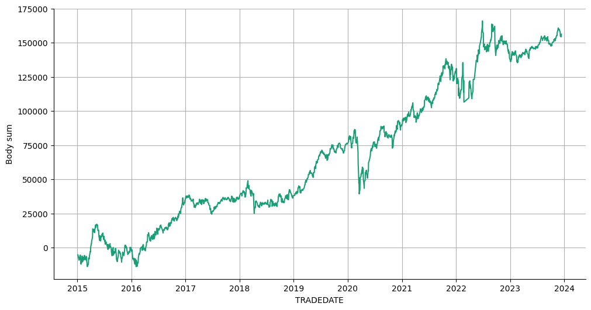
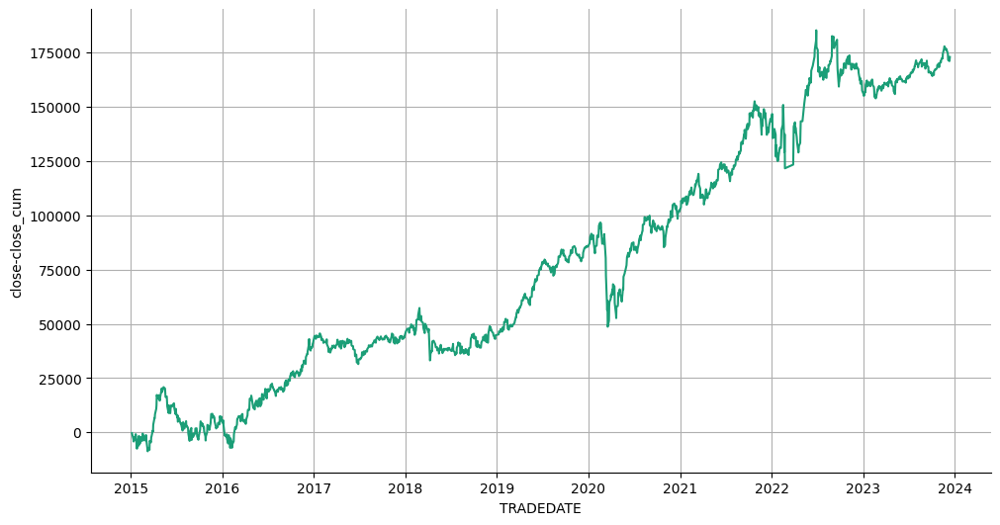

# Статистика по индексу RTS на основе дней в неделе.

Статистика по направлениям свечей в зависимости от дня в неделе из конвертированных(из минут) данных.

Подключение гугл диска


```python
from google.colab import drive
drive.mount('/content/drive')
```

    Drive already mounted at /content/drive; to attempt to forcibly remount, call drive.mount("/content/drive", force_remount=True).
    

Подключение к БД.


```python
import pandas as pd
import numpy as np
import sqlite3
import datetime
```


```python
connection = sqlite3.connect(r'/content/drive/MyDrive/data_quote_db/RTS_futures_minute_to_day_converter.db', check_same_thread=True)  # Создание соединения с БД
```

Загрузка данных в таблицу pandas.


```python
with connection:
  df = pd.read_sql('SELECT * FROM Day', connection)  # Загрузка данных из БД

print(df.to_string(max_rows=6, max_cols=25))  # Проверка того, что загрузилось
```

           TRADEDATE      OPEN       LOW      HIGH     CLOSE  VOLUME
    0     2015-01-05   78450.0   72470.0   78450.0   73100.0  375214
    1     2015-01-06   73230.0   71000.0   74900.0   72760.0  331659
    2     2015-01-08   72800.0   72800.0   81380.0   80190.0  520335
    ...          ...       ...       ...       ...       ...     ...
    2239  2023-12-12  105020.0  104240.0  106540.0  105710.0   89329
    2240  2023-12-13  105720.0  105150.0  107100.0  106960.0   73140
    2241  2023-12-14  106990.0  103910.0  107490.0  104100.0   95264
    

Подготовка DF


```python
# df = df.drop(['SECID', 'OPENPOSITION', 'SHORTNAME', 'LSTTRADE'], axis=1)
df['TRADEDATE'] = pd.to_datetime(df['TRADEDATE'])  # Смена типа
df = df.dropna().reset_index(drop=True)  # Удаление NaN
```

Создание и заполнение колонки с торговым днем недели.


```python
df['Work_day'] = df['TRADEDATE'].dt.weekday

df[['Work_day']] = df[['Work_day']].astype(int)
df = df.sort_values(by='TRADEDATE', ascending=True)  # Сортировка по возрастанию
print(df.to_string(max_rows=6, max_cols=25))  # Проверка
```

          TRADEDATE      OPEN       LOW      HIGH     CLOSE  VOLUME  Work_day
    0    2015-01-05   78450.0   72470.0   78450.0   73100.0  375214         0
    1    2015-01-06   73230.0   71000.0   74900.0   72760.0  331659         1
    2    2015-01-08   72800.0   72800.0   81380.0   80190.0  520335         3
    ...         ...       ...       ...       ...       ...     ...       ...
    2239 2023-12-12  105020.0  104240.0  106540.0  105710.0   89329         1
    2240 2023-12-13  105720.0  105150.0  107100.0  106960.0   73140         2
    2241 2023-12-14  106990.0  103910.0  107490.0  104100.0   95264         3
    

Добавление колонок: направления бара и размера тела свечи.


```python
df['Up'] = df.apply(lambda x: 1 if (x['OPEN'] < x['CLOSE']) else np.nan, axis=1)
df['Down'] = df.apply(lambda x: 1 if (x['OPEN'] >= x['CLOSE']) else np.nan, axis=1)
df['Body'] = df.apply(lambda x: -x['OPEN'] + x['CLOSE'], axis=1)
print(df.to_string(max_rows=20, max_cols=25))  # Проверка
```

          TRADEDATE      OPEN       LOW      HIGH     CLOSE  VOLUME  Work_day   Up  Down    Body
    0    2015-01-05   78450.0   72470.0   78450.0   73100.0  375214         0  NaN   1.0 -5350.0
    1    2015-01-06   73230.0   71000.0   74900.0   72760.0  331659         1  NaN   1.0  -470.0
    2    2015-01-08   72800.0   72800.0   81380.0   80190.0  520335         3  1.0   NaN  7390.0
    3    2015-01-09   80190.0   74450.0   81050.0   77330.0  614733         4  NaN   1.0 -2860.0
    4    2015-01-12   77140.0   73180.0   77140.0   74490.0  398285         0  NaN   1.0 -2650.0
    5    2015-01-13   74230.0   70870.0   74230.0   73470.0  509077         1  NaN   1.0  -760.0
    6    2015-01-14   73300.0   70820.0   76160.0   75580.0  575964         2  1.0   NaN  2280.0
    7    2015-01-15   75700.0   73210.0   77380.0   73320.0  663796         3  NaN   1.0 -2380.0
    8    2015-01-16   73300.0   72800.0   76470.0   75400.0  452111         4  1.0   NaN  2100.0
    9    2015-01-19   75380.0   74110.0   78970.0   74540.0  653861         0  NaN   1.0  -840.0
    ...         ...       ...       ...       ...       ...     ...       ...  ...   ...     ...
    2232 2023-12-01  110400.0  108430.0  110580.0  108600.0   66070         4  NaN   1.0 -1800.0
    2233 2023-12-04  108670.0  106650.0  108740.0  106800.0   73508         0  NaN   1.0 -1870.0
    2234 2023-12-05  106670.0  106010.0  107360.0  106460.0   76830         1  NaN   1.0  -210.0
    2235 2023-12-06  106400.0  103450.0  106550.0  103590.0  125223         2  NaN   1.0 -2810.0
    2236 2023-12-07  103500.0  103240.0  105370.0  104980.0   92497         3  1.0   NaN  1480.0
    2237 2023-12-08  105150.0  104970.0  106580.0  105590.0   76935         4  1.0   NaN   440.0
    2238 2023-12-11  105580.0  104420.0  106500.0  105050.0   91539         0  NaN   1.0  -530.0
    2239 2023-12-12  105020.0  104240.0  106540.0  105710.0   89329         1  1.0   NaN   690.0
    2240 2023-12-13  105720.0  105150.0  107100.0  106960.0   73140         2  1.0   NaN  1240.0
    2241 2023-12-14  106990.0  103910.0  107490.0  104100.0   95264         3  NaN   1.0 -2890.0
    

Агрегация данных.


```python
agg_func_count = {'Up': ['count'],
                  'Down': ['count'],
                  'Body': ['sum']}
df_count = df.groupby(['Work_day']).agg(agg_func_count)  # статистика по Up / Down
df_count
```


  <div id="df-00ef9b36-e929-4cb1-9b06-81b482bb2198" class="colab-df-container">
    <div>
<style scoped>
    .dataframe tbody tr th:only-of-type {
        vertical-align: middle;
    }

    .dataframe tbody tr th {
        vertical-align: top;
    }

    .dataframe thead tr th {
        text-align: left;
    }

    .dataframe thead tr:last-of-type th {
        text-align: right;
    }
</style>
<table border="1" class="dataframe">
  <thead>
    <tr>
      <th></th>
      <th>Up</th>
      <th>Down</th>
      <th>Body</th>
    </tr>
    <tr>
      <th></th>
      <th>count</th>
      <th>count</th>
      <th>sum</th>
    </tr>
    <tr>
      <th>Work_day</th>
      <th></th>
      <th></th>
      <th></th>
    </tr>
  </thead>
  <tbody>
    <tr>
      <th>0</th>
      <td>251</td>
      <td>182</td>
      <td>43020.0</td>
    </tr>
    <tr>
      <th>1</th>
      <td>240</td>
      <td>209</td>
      <td>70830.0</td>
    </tr>
    <tr>
      <th>2</th>
      <td>251</td>
      <td>200</td>
      <td>42410.0</td>
    </tr>
    <tr>
      <th>3</th>
      <td>222</td>
      <td>232</td>
      <td>-17990.0</td>
    </tr>
    <tr>
      <th>4</th>
      <td>221</td>
      <td>229</td>
      <td>-58190.0</td>
    </tr>
    <tr>
      <th>5</th>
      <td>1</td>
      <td>4</td>
      <td>-1820.0</td>
    </tr>
  </tbody>
</table>
</div>
    <div class="colab-df-buttons">

  <div class="colab-df-container">
    <button class="colab-df-convert" onclick="convertToInteractive('df-00ef9b36-e929-4cb1-9b06-81b482bb2198')"
            title="Convert this dataframe to an interactive table."
            style="display:none;">

  <svg xmlns="http://www.w3.org/2000/svg" height="24px" viewBox="0 -960 960 960">
    <path d="M120-120v-720h720v720H120Zm60-500h600v-160H180v160Zm220 220h160v-160H400v160Zm0 220h160v-160H400v160ZM180-400h160v-160H180v160Zm440 0h160v-160H620v160ZM180-180h160v-160H180v160Zm440 0h160v-160H620v160Z"/>
  </svg>
    </button>

  <style>
    .colab-df-container {
      display:flex;
      gap: 12px;
    }

    .colab-df-convert {
      background-color: #E8F0FE;
      border: none;
      border-radius: 50%;
      cursor: pointer;
      display: none;
      fill: #1967D2;
      height: 32px;
      padding: 0 0 0 0;
      width: 32px;
    }

    .colab-df-convert:hover {
      background-color: #E2EBFA;
      box-shadow: 0px 1px 2px rgba(60, 64, 67, 0.3), 0px 1px 3px 1px rgba(60, 64, 67, 0.15);
      fill: #174EA6;
    }

    .colab-df-buttons div {
      margin-bottom: 4px;
    }

    [theme=dark] .colab-df-convert {
      background-color: #3B4455;
      fill: #D2E3FC;
    }

    [theme=dark] .colab-df-convert:hover {
      background-color: #434B5C;
      box-shadow: 0px 1px 3px 1px rgba(0, 0, 0, 0.15);
      filter: drop-shadow(0px 1px 2px rgba(0, 0, 0, 0.3));
      fill: #FFFFFF;
    }
  </style>

    <script>
      const buttonEl =
        document.querySelector('#df-00ef9b36-e929-4cb1-9b06-81b482bb2198 button.colab-df-convert');
      buttonEl.style.display =
        google.colab.kernel.accessAllowed ? 'block' : 'none';

      async function convertToInteractive(key) {
        const element = document.querySelector('#df-00ef9b36-e929-4cb1-9b06-81b482bb2198');
        const dataTable =
          await google.colab.kernel.invokeFunction('convertToInteractive',
                                                    [key], {});
        if (!dataTable) return;

        const docLinkHtml = 'Like what you see? Visit the ' +
          '<a target="_blank" href=https://colab.research.google.com/notebooks/data_table.ipynb>data table notebook</a>'
          + ' to learn more about interactive tables.';
        element.innerHTML = '';
        dataTable['output_type'] = 'display_data';
        await google.colab.output.renderOutput(dataTable, element);
        const docLink = document.createElement('div');
        docLink.innerHTML = docLinkHtml;
        element.appendChild(docLink);
      }
    </script>
  </div>


<div id="df-bf5d15d8-9aaa-4797-90aa-90919be8f7b7">
  <button class="colab-df-quickchart" onclick="quickchart('df-bf5d15d8-9aaa-4797-90aa-90919be8f7b7')"
            title="Suggest charts"
            style="display:none;">

<svg xmlns="http://www.w3.org/2000/svg" height="24px"viewBox="0 0 24 24"
     width="24px">
    <g>
        <path d="M19 3H5c-1.1 0-2 .9-2 2v14c0 1.1.9 2 2 2h14c1.1 0 2-.9 2-2V5c0-1.1-.9-2-2-2zM9 17H7v-7h2v7zm4 0h-2V7h2v10zm4 0h-2v-4h2v4z"/>
    </g>
</svg>
  </button>

<style>
  .colab-df-quickchart {
      --bg-color: #E8F0FE;
      --fill-color: #1967D2;
      --hover-bg-color: #E2EBFA;
      --hover-fill-color: #174EA6;
      --disabled-fill-color: #AAA;
      --disabled-bg-color: #DDD;
  }

  [theme=dark] .colab-df-quickchart {
      --bg-color: #3B4455;
      --fill-color: #D2E3FC;
      --hover-bg-color: #434B5C;
      --hover-fill-color: #FFFFFF;
      --disabled-bg-color: #3B4455;
      --disabled-fill-color: #666;
  }

  .colab-df-quickchart {
    background-color: var(--bg-color);
    border: none;
    border-radius: 50%;
    cursor: pointer;
    display: none;
    fill: var(--fill-color);
    height: 32px;
    padding: 0;
    width: 32px;
  }

  .colab-df-quickchart:hover {
    background-color: var(--hover-bg-color);
    box-shadow: 0 1px 2px rgba(60, 64, 67, 0.3), 0 1px 3px 1px rgba(60, 64, 67, 0.15);
    fill: var(--button-hover-fill-color);
  }

  .colab-df-quickchart-complete:disabled,
  .colab-df-quickchart-complete:disabled:hover {
    background-color: var(--disabled-bg-color);
    fill: var(--disabled-fill-color);
    box-shadow: none;
  }

  .colab-df-spinner {
    border: 2px solid var(--fill-color);
    border-color: transparent;
    border-bottom-color: var(--fill-color);
    animation:
      spin 1s steps(1) infinite;
  }

  @keyframes spin {
    0% {
      border-color: transparent;
      border-bottom-color: var(--fill-color);
      border-left-color: var(--fill-color);
    }
    20% {
      border-color: transparent;
      border-left-color: var(--fill-color);
      border-top-color: var(--fill-color);
    }
    30% {
      border-color: transparent;
      border-left-color: var(--fill-color);
      border-top-color: var(--fill-color);
      border-right-color: var(--fill-color);
    }
    40% {
      border-color: transparent;
      border-right-color: var(--fill-color);
      border-top-color: var(--fill-color);
    }
    60% {
      border-color: transparent;
      border-right-color: var(--fill-color);
    }
    80% {
      border-color: transparent;
      border-right-color: var(--fill-color);
      border-bottom-color: var(--fill-color);
    }
    90% {
      border-color: transparent;
      border-bottom-color: var(--fill-color);
    }
  }
</style>

  <script>
    async function quickchart(key) {
      const quickchartButtonEl =
        document.querySelector('#' + key + ' button');
      quickchartButtonEl.disabled = true;  // To prevent multiple clicks.
      quickchartButtonEl.classList.add('colab-df-spinner');
      try {
        const charts = await google.colab.kernel.invokeFunction(
            'suggestCharts', [key], {});
      } catch (error) {
        console.error('Error during call to suggestCharts:', error);
      }
      quickchartButtonEl.classList.remove('colab-df-spinner');
      quickchartButtonEl.classList.add('colab-df-quickchart-complete');
    }
    (() => {
      let quickchartButtonEl =
        document.querySelector('#df-bf5d15d8-9aaa-4797-90aa-90919be8f7b7 button');
      quickchartButtonEl.style.display =
        google.colab.kernel.accessAllowed ? 'block' : 'none';
    })();
  </script>
</div>
    </div>
  </div>


```python
df_count['Up-Down'] = df_count.apply(lambda x: x['Up'] - x['Down'], axis=1)
df_count[['Up-Down']] = df_count[['Up-Down']].astype(int)
df_count
```


  <div id="df-1b234949-90fb-4fd1-9a11-374e9ab86a51" class="colab-df-container">
    <div>
<style scoped>
    .dataframe tbody tr th:only-of-type {
        vertical-align: middle;
    }

    .dataframe tbody tr th {
        vertical-align: top;
    }

    .dataframe thead tr th {
        text-align: left;
    }

    .dataframe thead tr:last-of-type th {
        text-align: right;
    }
</style>
<table border="1" class="dataframe">
  <thead>
    <tr>
      <th></th>
      <th>Up</th>
      <th>Down</th>
      <th>Body</th>
      <th>Up-Down</th>
    </tr>
    <tr>
      <th></th>
      <th>count</th>
      <th>count</th>
      <th>sum</th>
      <th></th>
    </tr>
    <tr>
      <th>Work_day</th>
      <th></th>
      <th></th>
      <th></th>
      <th></th>
    </tr>
  </thead>
  <tbody>
    <tr>
      <th>0</th>
      <td>251</td>
      <td>182</td>
      <td>43020.0</td>
      <td>69</td>
    </tr>
    <tr>
      <th>1</th>
      <td>240</td>
      <td>209</td>
      <td>70830.0</td>
      <td>31</td>
    </tr>
    <tr>
      <th>2</th>
      <td>251</td>
      <td>200</td>
      <td>42410.0</td>
      <td>51</td>
    </tr>
    <tr>
      <th>3</th>
      <td>222</td>
      <td>232</td>
      <td>-17990.0</td>
      <td>-10</td>
    </tr>
    <tr>
      <th>4</th>
      <td>221</td>
      <td>229</td>
      <td>-58190.0</td>
      <td>-8</td>
    </tr>
    <tr>
      <th>5</th>
      <td>1</td>
      <td>4</td>
      <td>-1820.0</td>
      <td>-3</td>
    </tr>
  </tbody>
</table>
</div>
    <div class="colab-df-buttons">

  <div class="colab-df-container">
    <button class="colab-df-convert" onclick="convertToInteractive('df-1b234949-90fb-4fd1-9a11-374e9ab86a51')"
            title="Convert this dataframe to an interactive table."
            style="display:none;">

  <svg xmlns="http://www.w3.org/2000/svg" height="24px" viewBox="0 -960 960 960">
    <path d="M120-120v-720h720v720H120Zm60-500h600v-160H180v160Zm220 220h160v-160H400v160Zm0 220h160v-160H400v160ZM180-400h160v-160H180v160Zm440 0h160v-160H620v160ZM180-180h160v-160H180v160Zm440 0h160v-160H620v160Z"/>
  </svg>
    </button>

  <style>
    .colab-df-container {
      display:flex;
      gap: 12px;
    }

    .colab-df-convert {
      background-color: #E8F0FE;
      border: none;
      border-radius: 50%;
      cursor: pointer;
      display: none;
      fill: #1967D2;
      height: 32px;
      padding: 0 0 0 0;
      width: 32px;
    }

    .colab-df-convert:hover {
      background-color: #E2EBFA;
      box-shadow: 0px 1px 2px rgba(60, 64, 67, 0.3), 0px 1px 3px 1px rgba(60, 64, 67, 0.15);
      fill: #174EA6;
    }

    .colab-df-buttons div {
      margin-bottom: 4px;
    }

    [theme=dark] .colab-df-convert {
      background-color: #3B4455;
      fill: #D2E3FC;
    }

    [theme=dark] .colab-df-convert:hover {
      background-color: #434B5C;
      box-shadow: 0px 1px 3px 1px rgba(0, 0, 0, 0.15);
      filter: drop-shadow(0px 1px 2px rgba(0, 0, 0, 0.3));
      fill: #FFFFFF;
    }
  </style>

    <script>
      const buttonEl =
        document.querySelector('#df-1b234949-90fb-4fd1-9a11-374e9ab86a51 button.colab-df-convert');
      buttonEl.style.display =
        google.colab.kernel.accessAllowed ? 'block' : 'none';

      async function convertToInteractive(key) {
        const element = document.querySelector('#df-1b234949-90fb-4fd1-9a11-374e9ab86a51');
        const dataTable =
          await google.colab.kernel.invokeFunction('convertToInteractive',
                                                    [key], {});
        if (!dataTable) return;

        const docLinkHtml = 'Like what you see? Visit the ' +
          '<a target="_blank" href=https://colab.research.google.com/notebooks/data_table.ipynb>data table notebook</a>'
          + ' to learn more about interactive tables.';
        element.innerHTML = '';
        dataTable['output_type'] = 'display_data';
        await google.colab.output.renderOutput(dataTable, element);
        const docLink = document.createElement('div');
        docLink.innerHTML = docLinkHtml;
        element.appendChild(docLink);
      }
    </script>
  </div>


<div id="df-06b48384-ad15-4c2c-bad1-55da89bba46d">
  <button class="colab-df-quickchart" onclick="quickchart('df-06b48384-ad15-4c2c-bad1-55da89bba46d')"
            title="Suggest charts"
            style="display:none;">

<svg xmlns="http://www.w3.org/2000/svg" height="24px"viewBox="0 0 24 24"
     width="24px">
    <g>
        <path d="M19 3H5c-1.1 0-2 .9-2 2v14c0 1.1.9 2 2 2h14c1.1 0 2-.9 2-2V5c0-1.1-.9-2-2-2zM9 17H7v-7h2v7zm4 0h-2V7h2v10zm4 0h-2v-4h2v4z"/>
    </g>
</svg>
  </button>

<style>
  .colab-df-quickchart {
      --bg-color: #E8F0FE;
      --fill-color: #1967D2;
      --hover-bg-color: #E2EBFA;
      --hover-fill-color: #174EA6;
      --disabled-fill-color: #AAA;
      --disabled-bg-color: #DDD;
  }

  [theme=dark] .colab-df-quickchart {
      --bg-color: #3B4455;
      --fill-color: #D2E3FC;
      --hover-bg-color: #434B5C;
      --hover-fill-color: #FFFFFF;
      --disabled-bg-color: #3B4455;
      --disabled-fill-color: #666;
  }

  .colab-df-quickchart {
    background-color: var(--bg-color);
    border: none;
    border-radius: 50%;
    cursor: pointer;
    display: none;
    fill: var(--fill-color);
    height: 32px;
    padding: 0;
    width: 32px;
  }

  .colab-df-quickchart:hover {
    background-color: var(--hover-bg-color);
    box-shadow: 0 1px 2px rgba(60, 64, 67, 0.3), 0 1px 3px 1px rgba(60, 64, 67, 0.15);
    fill: var(--button-hover-fill-color);
  }

  .colab-df-quickchart-complete:disabled,
  .colab-df-quickchart-complete:disabled:hover {
    background-color: var(--disabled-bg-color);
    fill: var(--disabled-fill-color);
    box-shadow: none;
  }

  .colab-df-spinner {
    border: 2px solid var(--fill-color);
    border-color: transparent;
    border-bottom-color: var(--fill-color);
    animation:
      spin 1s steps(1) infinite;
  }

  @keyframes spin {
    0% {
      border-color: transparent;
      border-bottom-color: var(--fill-color);
      border-left-color: var(--fill-color);
    }
    20% {
      border-color: transparent;
      border-left-color: var(--fill-color);
      border-top-color: var(--fill-color);
    }
    30% {
      border-color: transparent;
      border-left-color: var(--fill-color);
      border-top-color: var(--fill-color);
      border-right-color: var(--fill-color);
    }
    40% {
      border-color: transparent;
      border-right-color: var(--fill-color);
      border-top-color: var(--fill-color);
    }
    60% {
      border-color: transparent;
      border-right-color: var(--fill-color);
    }
    80% {
      border-color: transparent;
      border-right-color: var(--fill-color);
      border-bottom-color: var(--fill-color);
    }
    90% {
      border-color: transparent;
      border-bottom-color: var(--fill-color);
    }
  }
</style>

  <script>
    async function quickchart(key) {
      const quickchartButtonEl =
        document.querySelector('#' + key + ' button');
      quickchartButtonEl.disabled = true;  // To prevent multiple clicks.
      quickchartButtonEl.classList.add('colab-df-spinner');
      try {
        const charts = await google.colab.kernel.invokeFunction(
            'suggestCharts', [key], {});
      } catch (error) {
        console.error('Error during call to suggestCharts:', error);
      }
      quickchartButtonEl.classList.remove('colab-df-spinner');
      quickchartButtonEl.classList.add('colab-df-quickchart-complete');
    }
    (() => {
      let quickchartButtonEl =
        document.querySelector('#df-06b48384-ad15-4c2c-bad1-55da89bba46d button');
      quickchartButtonEl.style.display =
        google.colab.kernel.accessAllowed ? 'block' : 'none';
    })();
  </script>
</div>
    </div>
  </div>


```python
df_day = df.copy(deep=True)  # Создание копии
# df_day = df_day.loc[df_day['Work_day'] < 1]  # Выборка по понедельник, вторник
df_day = df_day.loc[df_day['Work_day'] < 3]  # Выборка по понедельник, вторник, среда
# df_day = df_day.loc[df_day['Work_day'] == 0]  # Выборка по понедельникам
# df_day = df_day.loc[df_day['Work_day'] == 1]  # Выборка по вторникам
df_day["Body_cum"] = df_day["Body"].cumsum()
df_day
```


  <div id="df-5755c8d9-0af4-4ad3-b2ab-7eddaabfe0fe" class="colab-df-container">
    <div>
<style scoped>
    .dataframe tbody tr th:only-of-type {
        vertical-align: middle;
    }

    .dataframe tbody tr th {
        vertical-align: top;
    }

    .dataframe thead th {
        text-align: right;
    }
</style>
<table border="1" class="dataframe">
  <thead>
    <tr style="text-align: right;">
      <th></th>
      <th>TRADEDATE</th>
      <th>OPEN</th>
      <th>LOW</th>
      <th>HIGH</th>
      <th>CLOSE</th>
      <th>VOLUME</th>
      <th>Work_day</th>
      <th>Up</th>
      <th>Down</th>
      <th>Body</th>
      <th>Body_cum</th>
    </tr>
  </thead>
  <tbody>
    <tr>
      <th>0</th>
      <td>2015-01-05</td>
      <td>78450.0</td>
      <td>72470.0</td>
      <td>78450.0</td>
      <td>73100.0</td>
      <td>375214</td>
      <td>0</td>
      <td>NaN</td>
      <td>1.0</td>
      <td>-5350.0</td>
      <td>-5350.0</td>
    </tr>
    <tr>
      <th>1</th>
      <td>2015-01-06</td>
      <td>73230.0</td>
      <td>71000.0</td>
      <td>74900.0</td>
      <td>72760.0</td>
      <td>331659</td>
      <td>1</td>
      <td>NaN</td>
      <td>1.0</td>
      <td>-470.0</td>
      <td>-5820.0</td>
    </tr>
    <tr>
      <th>4</th>
      <td>2015-01-12</td>
      <td>77140.0</td>
      <td>73180.0</td>
      <td>77140.0</td>
      <td>74490.0</td>
      <td>398285</td>
      <td>0</td>
      <td>NaN</td>
      <td>1.0</td>
      <td>-2650.0</td>
      <td>-8470.0</td>
    </tr>
    <tr>
      <th>5</th>
      <td>2015-01-13</td>
      <td>74230.0</td>
      <td>70870.0</td>
      <td>74230.0</td>
      <td>73470.0</td>
      <td>509077</td>
      <td>1</td>
      <td>NaN</td>
      <td>1.0</td>
      <td>-760.0</td>
      <td>-9230.0</td>
    </tr>
    <tr>
      <th>6</th>
      <td>2015-01-14</td>
      <td>73300.0</td>
      <td>70820.0</td>
      <td>76160.0</td>
      <td>75580.0</td>
      <td>575964</td>
      <td>2</td>
      <td>1.0</td>
      <td>NaN</td>
      <td>2280.0</td>
      <td>-6950.0</td>
    </tr>
    <tr>
      <th>...</th>
      <td>...</td>
      <td>...</td>
      <td>...</td>
      <td>...</td>
      <td>...</td>
      <td>...</td>
      <td>...</td>
      <td>...</td>
      <td>...</td>
      <td>...</td>
      <td>...</td>
    </tr>
    <tr>
      <th>2234</th>
      <td>2023-12-05</td>
      <td>106670.0</td>
      <td>106010.0</td>
      <td>107360.0</td>
      <td>106460.0</td>
      <td>76830</td>
      <td>1</td>
      <td>NaN</td>
      <td>1.0</td>
      <td>-210.0</td>
      <td>157670.0</td>
    </tr>
    <tr>
      <th>2235</th>
      <td>2023-12-06</td>
      <td>106400.0</td>
      <td>103450.0</td>
      <td>106550.0</td>
      <td>103590.0</td>
      <td>125223</td>
      <td>2</td>
      <td>NaN</td>
      <td>1.0</td>
      <td>-2810.0</td>
      <td>154860.0</td>
    </tr>
    <tr>
      <th>2238</th>
      <td>2023-12-11</td>
      <td>105580.0</td>
      <td>104420.0</td>
      <td>106500.0</td>
      <td>105050.0</td>
      <td>91539</td>
      <td>0</td>
      <td>NaN</td>
      <td>1.0</td>
      <td>-530.0</td>
      <td>154330.0</td>
    </tr>
    <tr>
      <th>2239</th>
      <td>2023-12-12</td>
      <td>105020.0</td>
      <td>104240.0</td>
      <td>106540.0</td>
      <td>105710.0</td>
      <td>89329</td>
      <td>1</td>
      <td>1.0</td>
      <td>NaN</td>
      <td>690.0</td>
      <td>155020.0</td>
    </tr>
    <tr>
      <th>2240</th>
      <td>2023-12-13</td>
      <td>105720.0</td>
      <td>105150.0</td>
      <td>107100.0</td>
      <td>106960.0</td>
      <td>73140</td>
      <td>2</td>
      <td>1.0</td>
      <td>NaN</td>
      <td>1240.0</td>
      <td>156260.0</td>
    </tr>
  </tbody>
</table>
<p>1333 rows × 11 columns</p>
</div>
    <div class="colab-df-buttons">

  <div class="colab-df-container">
    <button class="colab-df-convert" onclick="convertToInteractive('df-5755c8d9-0af4-4ad3-b2ab-7eddaabfe0fe')"
            title="Convert this dataframe to an interactive table."
            style="display:none;">

  <svg xmlns="http://www.w3.org/2000/svg" height="24px" viewBox="0 -960 960 960">
    <path d="M120-120v-720h720v720H120Zm60-500h600v-160H180v160Zm220 220h160v-160H400v160Zm0 220h160v-160H400v160ZM180-400h160v-160H180v160Zm440 0h160v-160H620v160ZM180-180h160v-160H180v160Zm440 0h160v-160H620v160Z"/>
  </svg>
    </button>

  <style>
    .colab-df-container {
      display:flex;
      gap: 12px;
    }

    .colab-df-convert {
      background-color: #E8F0FE;
      border: none;
      border-radius: 50%;
      cursor: pointer;
      display: none;
      fill: #1967D2;
      height: 32px;
      padding: 0 0 0 0;
      width: 32px;
    }

    .colab-df-convert:hover {
      background-color: #E2EBFA;
      box-shadow: 0px 1px 2px rgba(60, 64, 67, 0.3), 0px 1px 3px 1px rgba(60, 64, 67, 0.15);
      fill: #174EA6;
    }

    .colab-df-buttons div {
      margin-bottom: 4px;
    }

    [theme=dark] .colab-df-convert {
      background-color: #3B4455;
      fill: #D2E3FC;
    }

    [theme=dark] .colab-df-convert:hover {
      background-color: #434B5C;
      box-shadow: 0px 1px 3px 1px rgba(0, 0, 0, 0.15);
      filter: drop-shadow(0px 1px 2px rgba(0, 0, 0, 0.3));
      fill: #FFFFFF;
    }
  </style>

    <script>
      const buttonEl =
        document.querySelector('#df-5755c8d9-0af4-4ad3-b2ab-7eddaabfe0fe button.colab-df-convert');
      buttonEl.style.display =
        google.colab.kernel.accessAllowed ? 'block' : 'none';

      async function convertToInteractive(key) {
        const element = document.querySelector('#df-5755c8d9-0af4-4ad3-b2ab-7eddaabfe0fe');
        const dataTable =
          await google.colab.kernel.invokeFunction('convertToInteractive',
                                                    [key], {});
        if (!dataTable) return;

        const docLinkHtml = 'Like what you see? Visit the ' +
          '<a target="_blank" href=https://colab.research.google.com/notebooks/data_table.ipynb>data table notebook</a>'
          + ' to learn more about interactive tables.';
        element.innerHTML = '';
        dataTable['output_type'] = 'display_data';
        await google.colab.output.renderOutput(dataTable, element);
        const docLink = document.createElement('div');
        docLink.innerHTML = docLinkHtml;
        element.appendChild(docLink);
      }
    </script>
  </div>


<div id="df-e49b1b35-ff80-499b-adca-7821909ebefa">
  <button class="colab-df-quickchart" onclick="quickchart('df-e49b1b35-ff80-499b-adca-7821909ebefa')"
            title="Suggest charts"
            style="display:none;">

<svg xmlns="http://www.w3.org/2000/svg" height="24px"viewBox="0 0 24 24"
     width="24px">
    <g>
        <path d="M19 3H5c-1.1 0-2 .9-2 2v14c0 1.1.9 2 2 2h14c1.1 0 2-.9 2-2V5c0-1.1-.9-2-2-2zM9 17H7v-7h2v7zm4 0h-2V7h2v10zm4 0h-2v-4h2v4z"/>
    </g>
</svg>
  </button>

<style>
  .colab-df-quickchart {
      --bg-color: #E8F0FE;
      --fill-color: #1967D2;
      --hover-bg-color: #E2EBFA;
      --hover-fill-color: #174EA6;
      --disabled-fill-color: #AAA;
      --disabled-bg-color: #DDD;
  }

  [theme=dark] .colab-df-quickchart {
      --bg-color: #3B4455;
      --fill-color: #D2E3FC;
      --hover-bg-color: #434B5C;
      --hover-fill-color: #FFFFFF;
      --disabled-bg-color: #3B4455;
      --disabled-fill-color: #666;
  }

  .colab-df-quickchart {
    background-color: var(--bg-color);
    border: none;
    border-radius: 50%;
    cursor: pointer;
    display: none;
    fill: var(--fill-color);
    height: 32px;
    padding: 0;
    width: 32px;
  }

  .colab-df-quickchart:hover {
    background-color: var(--hover-bg-color);
    box-shadow: 0 1px 2px rgba(60, 64, 67, 0.3), 0 1px 3px 1px rgba(60, 64, 67, 0.15);
    fill: var(--button-hover-fill-color);
  }

  .colab-df-quickchart-complete:disabled,
  .colab-df-quickchart-complete:disabled:hover {
    background-color: var(--disabled-bg-color);
    fill: var(--disabled-fill-color);
    box-shadow: none;
  }

  .colab-df-spinner {
    border: 2px solid var(--fill-color);
    border-color: transparent;
    border-bottom-color: var(--fill-color);
    animation:
      spin 1s steps(1) infinite;
  }

  @keyframes spin {
    0% {
      border-color: transparent;
      border-bottom-color: var(--fill-color);
      border-left-color: var(--fill-color);
    }
    20% {
      border-color: transparent;
      border-left-color: var(--fill-color);
      border-top-color: var(--fill-color);
    }
    30% {
      border-color: transparent;
      border-left-color: var(--fill-color);
      border-top-color: var(--fill-color);
      border-right-color: var(--fill-color);
    }
    40% {
      border-color: transparent;
      border-right-color: var(--fill-color);
      border-top-color: var(--fill-color);
    }
    60% {
      border-color: transparent;
      border-right-color: var(--fill-color);
    }
    80% {
      border-color: transparent;
      border-right-color: var(--fill-color);
      border-bottom-color: var(--fill-color);
    }
    90% {
      border-color: transparent;
      border-bottom-color: var(--fill-color);
    }
  }
</style>

  <script>
    async function quickchart(key) {
      const quickchartButtonEl =
        document.querySelector('#' + key + ' button');
      quickchartButtonEl.disabled = true;  // To prevent multiple clicks.
      quickchartButtonEl.classList.add('colab-df-spinner');
      try {
        const charts = await google.colab.kernel.invokeFunction(
            'suggestCharts', [key], {});
      } catch (error) {
        console.error('Error during call to suggestCharts:', error);
      }
      quickchartButtonEl.classList.remove('colab-df-spinner');
      quickchartButtonEl.classList.add('colab-df-quickchart-complete');
    }
    (() => {
      let quickchartButtonEl =
        document.querySelector('#df-e49b1b35-ff80-499b-adca-7821909ebefa button');
      quickchartButtonEl.style.display =
        google.colab.kernel.accessAllowed ? 'block' : 'none';
    })();
  </script>
</div>
    </div>
  </div>


```python
# df
```


```python
from matplotlib import pyplot as plt
import seaborn as sns
def _plot_series(series, series_name, series_index=0):
  from matplotlib import pyplot as plt
  import seaborn as sns
  palette = list(sns.palettes.mpl_palette('Dark2'))
  xs = series['TRADEDATE']
  ys = series['Body_cum']

  plt.plot(xs, ys, label=series_name, color=palette[series_index % len(palette)])

fig, ax = plt.subplots(figsize=(10, 5.2), layout='constrained')
df_sorted = df_day.sort_values('TRADEDATE', ascending=True)
_plot_series(df_sorted, '')
sns.despine(fig=fig, ax=ax)
plt.xlabel('TRADEDATE')
plt.grid()
_ = plt.ylabel('Body sum')
```


    

    


```python
df['close-close'] = np.nan  # Создание колонки и заполнение NaN
prev_close = 0
for i in range(0, len(df)):
  if i == 0:
    prev_close = df.iloc[i]['CLOSE']
    continue
  df.iloc[i, df.columns.get_loc('close-close')] = df.iloc[i, df.columns.get_loc('CLOSE')] - prev_close
  prev_close = df.iloc[i]['CLOSE']
df = df.drop(df.index[0])  # Удаление первой строки
df
```


  <div id="df-da9d88ae-ee62-4f01-9963-29288ccb81c8" class="colab-df-container">
    <div>
<style scoped>
    .dataframe tbody tr th:only-of-type {
        vertical-align: middle;
    }

    .dataframe tbody tr th {
        vertical-align: top;
    }

    .dataframe thead th {
        text-align: right;
    }
</style>
<table border="1" class="dataframe">
  <thead>
    <tr style="text-align: right;">
      <th></th>
      <th>TRADEDATE</th>
      <th>OPEN</th>
      <th>LOW</th>
      <th>HIGH</th>
      <th>CLOSE</th>
      <th>VOLUME</th>
      <th>Work_day</th>
      <th>Up</th>
      <th>Down</th>
      <th>Body</th>
      <th>close-close</th>
    </tr>
  </thead>
  <tbody>
    <tr>
      <th>1</th>
      <td>2015-01-06</td>
      <td>73230.0</td>
      <td>71000.0</td>
      <td>74900.0</td>
      <td>72760.0</td>
      <td>331659</td>
      <td>1</td>
      <td>NaN</td>
      <td>1.0</td>
      <td>-470.0</td>
      <td>-340.0</td>
    </tr>
    <tr>
      <th>2</th>
      <td>2015-01-08</td>
      <td>72800.0</td>
      <td>72800.0</td>
      <td>81380.0</td>
      <td>80190.0</td>
      <td>520335</td>
      <td>3</td>
      <td>1.0</td>
      <td>NaN</td>
      <td>7390.0</td>
      <td>7430.0</td>
    </tr>
    <tr>
      <th>3</th>
      <td>2015-01-09</td>
      <td>80190.0</td>
      <td>74450.0</td>
      <td>81050.0</td>
      <td>77330.0</td>
      <td>614733</td>
      <td>4</td>
      <td>NaN</td>
      <td>1.0</td>
      <td>-2860.0</td>
      <td>-2860.0</td>
    </tr>
    <tr>
      <th>4</th>
      <td>2015-01-12</td>
      <td>77140.0</td>
      <td>73180.0</td>
      <td>77140.0</td>
      <td>74490.0</td>
      <td>398285</td>
      <td>0</td>
      <td>NaN</td>
      <td>1.0</td>
      <td>-2650.0</td>
      <td>-2840.0</td>
    </tr>
    <tr>
      <th>5</th>
      <td>2015-01-13</td>
      <td>74230.0</td>
      <td>70870.0</td>
      <td>74230.0</td>
      <td>73470.0</td>
      <td>509077</td>
      <td>1</td>
      <td>NaN</td>
      <td>1.0</td>
      <td>-760.0</td>
      <td>-1020.0</td>
    </tr>
    <tr>
      <th>...</th>
      <td>...</td>
      <td>...</td>
      <td>...</td>
      <td>...</td>
      <td>...</td>
      <td>...</td>
      <td>...</td>
      <td>...</td>
      <td>...</td>
      <td>...</td>
      <td>...</td>
    </tr>
    <tr>
      <th>2237</th>
      <td>2023-12-08</td>
      <td>105150.0</td>
      <td>104970.0</td>
      <td>106580.0</td>
      <td>105590.0</td>
      <td>76935</td>
      <td>4</td>
      <td>1.0</td>
      <td>NaN</td>
      <td>440.0</td>
      <td>610.0</td>
    </tr>
    <tr>
      <th>2238</th>
      <td>2023-12-11</td>
      <td>105580.0</td>
      <td>104420.0</td>
      <td>106500.0</td>
      <td>105050.0</td>
      <td>91539</td>
      <td>0</td>
      <td>NaN</td>
      <td>1.0</td>
      <td>-530.0</td>
      <td>-540.0</td>
    </tr>
    <tr>
      <th>2239</th>
      <td>2023-12-12</td>
      <td>105020.0</td>
      <td>104240.0</td>
      <td>106540.0</td>
      <td>105710.0</td>
      <td>89329</td>
      <td>1</td>
      <td>1.0</td>
      <td>NaN</td>
      <td>690.0</td>
      <td>660.0</td>
    </tr>
    <tr>
      <th>2240</th>
      <td>2023-12-13</td>
      <td>105720.0</td>
      <td>105150.0</td>
      <td>107100.0</td>
      <td>106960.0</td>
      <td>73140</td>
      <td>2</td>
      <td>1.0</td>
      <td>NaN</td>
      <td>1240.0</td>
      <td>1250.0</td>
    </tr>
    <tr>
      <th>2241</th>
      <td>2023-12-14</td>
      <td>106990.0</td>
      <td>103910.0</td>
      <td>107490.0</td>
      <td>104100.0</td>
      <td>95264</td>
      <td>3</td>
      <td>NaN</td>
      <td>1.0</td>
      <td>-2890.0</td>
      <td>-2860.0</td>
    </tr>
  </tbody>
</table>
<p>2241 rows × 11 columns</p>
</div>
    <div class="colab-df-buttons">

  <div class="colab-df-container">
    <button class="colab-df-convert" onclick="convertToInteractive('df-da9d88ae-ee62-4f01-9963-29288ccb81c8')"
            title="Convert this dataframe to an interactive table."
            style="display:none;">

  <svg xmlns="http://www.w3.org/2000/svg" height="24px" viewBox="0 -960 960 960">
    <path d="M120-120v-720h720v720H120Zm60-500h600v-160H180v160Zm220 220h160v-160H400v160Zm0 220h160v-160H400v160ZM180-400h160v-160H180v160Zm440 0h160v-160H620v160ZM180-180h160v-160H180v160Zm440 0h160v-160H620v160Z"/>
  </svg>
    </button>

  <style>
    .colab-df-container {
      display:flex;
      gap: 12px;
    }

    .colab-df-convert {
      background-color: #E8F0FE;
      border: none;
      border-radius: 50%;
      cursor: pointer;
      display: none;
      fill: #1967D2;
      height: 32px;
      padding: 0 0 0 0;
      width: 32px;
    }

    .colab-df-convert:hover {
      background-color: #E2EBFA;
      box-shadow: 0px 1px 2px rgba(60, 64, 67, 0.3), 0px 1px 3px 1px rgba(60, 64, 67, 0.15);
      fill: #174EA6;
    }

    .colab-df-buttons div {
      margin-bottom: 4px;
    }

    [theme=dark] .colab-df-convert {
      background-color: #3B4455;
      fill: #D2E3FC;
    }

    [theme=dark] .colab-df-convert:hover {
      background-color: #434B5C;
      box-shadow: 0px 1px 3px 1px rgba(0, 0, 0, 0.15);
      filter: drop-shadow(0px 1px 2px rgba(0, 0, 0, 0.3));
      fill: #FFFFFF;
    }
  </style>

    <script>
      const buttonEl =
        document.querySelector('#df-da9d88ae-ee62-4f01-9963-29288ccb81c8 button.colab-df-convert');
      buttonEl.style.display =
        google.colab.kernel.accessAllowed ? 'block' : 'none';

      async function convertToInteractive(key) {
        const element = document.querySelector('#df-da9d88ae-ee62-4f01-9963-29288ccb81c8');
        const dataTable =
          await google.colab.kernel.invokeFunction('convertToInteractive',
                                                    [key], {});
        if (!dataTable) return;

        const docLinkHtml = 'Like what you see? Visit the ' +
          '<a target="_blank" href=https://colab.research.google.com/notebooks/data_table.ipynb>data table notebook</a>'
          + ' to learn more about interactive tables.';
        element.innerHTML = '';
        dataTable['output_type'] = 'display_data';
        await google.colab.output.renderOutput(dataTable, element);
        const docLink = document.createElement('div');
        docLink.innerHTML = docLinkHtml;
        element.appendChild(docLink);
      }
    </script>
  </div>


<div id="df-6df7e6a3-51f8-4f8d-8191-45333a5024ac">
  <button class="colab-df-quickchart" onclick="quickchart('df-6df7e6a3-51f8-4f8d-8191-45333a5024ac')"
            title="Suggest charts"
            style="display:none;">

<svg xmlns="http://www.w3.org/2000/svg" height="24px"viewBox="0 0 24 24"
     width="24px">
    <g>
        <path d="M19 3H5c-1.1 0-2 .9-2 2v14c0 1.1.9 2 2 2h14c1.1 0 2-.9 2-2V5c0-1.1-.9-2-2-2zM9 17H7v-7h2v7zm4 0h-2V7h2v10zm4 0h-2v-4h2v4z"/>
    </g>
</svg>
  </button>

<style>
  .colab-df-quickchart {
      --bg-color: #E8F0FE;
      --fill-color: #1967D2;
      --hover-bg-color: #E2EBFA;
      --hover-fill-color: #174EA6;
      --disabled-fill-color: #AAA;
      --disabled-bg-color: #DDD;
  }

  [theme=dark] .colab-df-quickchart {
      --bg-color: #3B4455;
      --fill-color: #D2E3FC;
      --hover-bg-color: #434B5C;
      --hover-fill-color: #FFFFFF;
      --disabled-bg-color: #3B4455;
      --disabled-fill-color: #666;
  }

  .colab-df-quickchart {
    background-color: var(--bg-color);
    border: none;
    border-radius: 50%;
    cursor: pointer;
    display: none;
    fill: var(--fill-color);
    height: 32px;
    padding: 0;
    width: 32px;
  }

  .colab-df-quickchart:hover {
    background-color: var(--hover-bg-color);
    box-shadow: 0 1px 2px rgba(60, 64, 67, 0.3), 0 1px 3px 1px rgba(60, 64, 67, 0.15);
    fill: var(--button-hover-fill-color);
  }

  .colab-df-quickchart-complete:disabled,
  .colab-df-quickchart-complete:disabled:hover {
    background-color: var(--disabled-bg-color);
    fill: var(--disabled-fill-color);
    box-shadow: none;
  }

  .colab-df-spinner {
    border: 2px solid var(--fill-color);
    border-color: transparent;
    border-bottom-color: var(--fill-color);
    animation:
      spin 1s steps(1) infinite;
  }

  @keyframes spin {
    0% {
      border-color: transparent;
      border-bottom-color: var(--fill-color);
      border-left-color: var(--fill-color);
    }
    20% {
      border-color: transparent;
      border-left-color: var(--fill-color);
      border-top-color: var(--fill-color);
    }
    30% {
      border-color: transparent;
      border-left-color: var(--fill-color);
      border-top-color: var(--fill-color);
      border-right-color: var(--fill-color);
    }
    40% {
      border-color: transparent;
      border-right-color: var(--fill-color);
      border-top-color: var(--fill-color);
    }
    60% {
      border-color: transparent;
      border-right-color: var(--fill-color);
    }
    80% {
      border-color: transparent;
      border-right-color: var(--fill-color);
      border-bottom-color: var(--fill-color);
    }
    90% {
      border-color: transparent;
      border-bottom-color: var(--fill-color);
    }
  }
</style>

  <script>
    async function quickchart(key) {
      const quickchartButtonEl =
        document.querySelector('#' + key + ' button');
      quickchartButtonEl.disabled = true;  // To prevent multiple clicks.
      quickchartButtonEl.classList.add('colab-df-spinner');
      try {
        const charts = await google.colab.kernel.invokeFunction(
            'suggestCharts', [key], {});
      } catch (error) {
        console.error('Error during call to suggestCharts:', error);
      }
      quickchartButtonEl.classList.remove('colab-df-spinner');
      quickchartButtonEl.classList.add('colab-df-quickchart-complete');
    }
    (() => {
      let quickchartButtonEl =
        document.querySelector('#df-6df7e6a3-51f8-4f8d-8191-45333a5024ac button');
      quickchartButtonEl.style.display =
        google.colab.kernel.accessAllowed ? 'block' : 'none';
    })();
  </script>
</div>
    </div>
  </div>


```python
# df = df.loc[df['Work_day'] < 2]  # Выборка по понедельник, вторник
df = df.loc[df['Work_day'] < 3]  # Выборка по понедельник, вторник, среда
df["close-close_cum"] = df["close-close"].cumsum()
df
```

    <ipython-input-29-c7ba9f8246b9>:3: SettingWithCopyWarning: 
    A value is trying to be set on a copy of a slice from a DataFrame.
    Try using .loc[row_indexer,col_indexer] = value instead
    
    See the caveats in the documentation: https://pandas.pydata.org/pandas-docs/stable/user_guide/indexing.html#returning-a-view-versus-a-copy
      df["close-close_cum"] = df["close-close"].cumsum()
    


  <div id="df-bc117fc1-3873-40ad-9e6a-ea1d2f58123d" class="colab-df-container">
    <div>
<style scoped>
    .dataframe tbody tr th:only-of-type {
        vertical-align: middle;
    }

    .dataframe tbody tr th {
        vertical-align: top;
    }

    .dataframe thead th {
        text-align: right;
    }
</style>
<table border="1" class="dataframe">
  <thead>
    <tr style="text-align: right;">
      <th></th>
      <th>TRADEDATE</th>
      <th>OPEN</th>
      <th>LOW</th>
      <th>HIGH</th>
      <th>CLOSE</th>
      <th>VOLUME</th>
      <th>Work_day</th>
      <th>Up</th>
      <th>Down</th>
      <th>Body</th>
      <th>close-close</th>
      <th>close-close_cum</th>
    </tr>
  </thead>
  <tbody>
    <tr>
      <th>1</th>
      <td>2015-01-06</td>
      <td>73230.0</td>
      <td>71000.0</td>
      <td>74900.0</td>
      <td>72760.0</td>
      <td>331659</td>
      <td>1</td>
      <td>NaN</td>
      <td>1.0</td>
      <td>-470.0</td>
      <td>-340.0</td>
      <td>-340.0</td>
    </tr>
    <tr>
      <th>4</th>
      <td>2015-01-12</td>
      <td>77140.0</td>
      <td>73180.0</td>
      <td>77140.0</td>
      <td>74490.0</td>
      <td>398285</td>
      <td>0</td>
      <td>NaN</td>
      <td>1.0</td>
      <td>-2650.0</td>
      <td>-2840.0</td>
      <td>-3180.0</td>
    </tr>
    <tr>
      <th>5</th>
      <td>2015-01-13</td>
      <td>74230.0</td>
      <td>70870.0</td>
      <td>74230.0</td>
      <td>73470.0</td>
      <td>509077</td>
      <td>1</td>
      <td>NaN</td>
      <td>1.0</td>
      <td>-760.0</td>
      <td>-1020.0</td>
      <td>-4200.0</td>
    </tr>
    <tr>
      <th>6</th>
      <td>2015-01-14</td>
      <td>73300.0</td>
      <td>70820.0</td>
      <td>76160.0</td>
      <td>75580.0</td>
      <td>575964</td>
      <td>2</td>
      <td>1.0</td>
      <td>NaN</td>
      <td>2280.0</td>
      <td>2110.0</td>
      <td>-2090.0</td>
    </tr>
    <tr>
      <th>9</th>
      <td>2015-01-19</td>
      <td>75380.0</td>
      <td>74110.0</td>
      <td>78970.0</td>
      <td>74540.0</td>
      <td>653861</td>
      <td>0</td>
      <td>NaN</td>
      <td>1.0</td>
      <td>-840.0</td>
      <td>-860.0</td>
      <td>-2950.0</td>
    </tr>
    <tr>
      <th>...</th>
      <td>...</td>
      <td>...</td>
      <td>...</td>
      <td>...</td>
      <td>...</td>
      <td>...</td>
      <td>...</td>
      <td>...</td>
      <td>...</td>
      <td>...</td>
      <td>...</td>
      <td>...</td>
    </tr>
    <tr>
      <th>2234</th>
      <td>2023-12-05</td>
      <td>106670.0</td>
      <td>106010.0</td>
      <td>107360.0</td>
      <td>106460.0</td>
      <td>76830</td>
      <td>1</td>
      <td>NaN</td>
      <td>1.0</td>
      <td>-210.0</td>
      <td>-340.0</td>
      <td>174460.0</td>
    </tr>
    <tr>
      <th>2235</th>
      <td>2023-12-06</td>
      <td>106400.0</td>
      <td>103450.0</td>
      <td>106550.0</td>
      <td>103590.0</td>
      <td>125223</td>
      <td>2</td>
      <td>NaN</td>
      <td>1.0</td>
      <td>-2810.0</td>
      <td>-2870.0</td>
      <td>171590.0</td>
    </tr>
    <tr>
      <th>2238</th>
      <td>2023-12-11</td>
      <td>105580.0</td>
      <td>104420.0</td>
      <td>106500.0</td>
      <td>105050.0</td>
      <td>91539</td>
      <td>0</td>
      <td>NaN</td>
      <td>1.0</td>
      <td>-530.0</td>
      <td>-540.0</td>
      <td>171050.0</td>
    </tr>
    <tr>
      <th>2239</th>
      <td>2023-12-12</td>
      <td>105020.0</td>
      <td>104240.0</td>
      <td>106540.0</td>
      <td>105710.0</td>
      <td>89329</td>
      <td>1</td>
      <td>1.0</td>
      <td>NaN</td>
      <td>690.0</td>
      <td>660.0</td>
      <td>171710.0</td>
    </tr>
    <tr>
      <th>2240</th>
      <td>2023-12-13</td>
      <td>105720.0</td>
      <td>105150.0</td>
      <td>107100.0</td>
      <td>106960.0</td>
      <td>73140</td>
      <td>2</td>
      <td>1.0</td>
      <td>NaN</td>
      <td>1240.0</td>
      <td>1250.0</td>
      <td>172960.0</td>
    </tr>
  </tbody>
</table>
<p>1332 rows × 12 columns</p>
</div>
    <div class="colab-df-buttons">

  <div class="colab-df-container">
    <button class="colab-df-convert" onclick="convertToInteractive('df-bc117fc1-3873-40ad-9e6a-ea1d2f58123d')"
            title="Convert this dataframe to an interactive table."
            style="display:none;">

  <svg xmlns="http://www.w3.org/2000/svg" height="24px" viewBox="0 -960 960 960">
    <path d="M120-120v-720h720v720H120Zm60-500h600v-160H180v160Zm220 220h160v-160H400v160Zm0 220h160v-160H400v160ZM180-400h160v-160H180v160Zm440 0h160v-160H620v160ZM180-180h160v-160H180v160Zm440 0h160v-160H620v160Z"/>
  </svg>
    </button>

  <style>
    .colab-df-container {
      display:flex;
      gap: 12px;
    }

    .colab-df-convert {
      background-color: #E8F0FE;
      border: none;
      border-radius: 50%;
      cursor: pointer;
      display: none;
      fill: #1967D2;
      height: 32px;
      padding: 0 0 0 0;
      width: 32px;
    }

    .colab-df-convert:hover {
      background-color: #E2EBFA;
      box-shadow: 0px 1px 2px rgba(60, 64, 67, 0.3), 0px 1px 3px 1px rgba(60, 64, 67, 0.15);
      fill: #174EA6;
    }

    .colab-df-buttons div {
      margin-bottom: 4px;
    }

    [theme=dark] .colab-df-convert {
      background-color: #3B4455;
      fill: #D2E3FC;
    }

    [theme=dark] .colab-df-convert:hover {
      background-color: #434B5C;
      box-shadow: 0px 1px 3px 1px rgba(0, 0, 0, 0.15);
      filter: drop-shadow(0px 1px 2px rgba(0, 0, 0, 0.3));
      fill: #FFFFFF;
    }
  </style>

    <script>
      const buttonEl =
        document.querySelector('#df-bc117fc1-3873-40ad-9e6a-ea1d2f58123d button.colab-df-convert');
      buttonEl.style.display =
        google.colab.kernel.accessAllowed ? 'block' : 'none';

      async function convertToInteractive(key) {
        const element = document.querySelector('#df-bc117fc1-3873-40ad-9e6a-ea1d2f58123d');
        const dataTable =
          await google.colab.kernel.invokeFunction('convertToInteractive',
                                                    [key], {});
        if (!dataTable) return;

        const docLinkHtml = 'Like what you see? Visit the ' +
          '<a target="_blank" href=https://colab.research.google.com/notebooks/data_table.ipynb>data table notebook</a>'
          + ' to learn more about interactive tables.';
        element.innerHTML = '';
        dataTable['output_type'] = 'display_data';
        await google.colab.output.renderOutput(dataTable, element);
        const docLink = document.createElement('div');
        docLink.innerHTML = docLinkHtml;
        element.appendChild(docLink);
      }
    </script>
  </div>


<div id="df-5a6da7aa-e1e3-4741-8602-14e511f244fb">
  <button class="colab-df-quickchart" onclick="quickchart('df-5a6da7aa-e1e3-4741-8602-14e511f244fb')"
            title="Suggest charts"
            style="display:none;">

<svg xmlns="http://www.w3.org/2000/svg" height="24px"viewBox="0 0 24 24"
     width="24px">
    <g>
        <path d="M19 3H5c-1.1 0-2 .9-2 2v14c0 1.1.9 2 2 2h14c1.1 0 2-.9 2-2V5c0-1.1-.9-2-2-2zM9 17H7v-7h2v7zm4 0h-2V7h2v10zm4 0h-2v-4h2v4z"/>
    </g>
</svg>
  </button>

<style>
  .colab-df-quickchart {
      --bg-color: #E8F0FE;
      --fill-color: #1967D2;
      --hover-bg-color: #E2EBFA;
      --hover-fill-color: #174EA6;
      --disabled-fill-color: #AAA;
      --disabled-bg-color: #DDD;
  }

  [theme=dark] .colab-df-quickchart {
      --bg-color: #3B4455;
      --fill-color: #D2E3FC;
      --hover-bg-color: #434B5C;
      --hover-fill-color: #FFFFFF;
      --disabled-bg-color: #3B4455;
      --disabled-fill-color: #666;
  }

  .colab-df-quickchart {
    background-color: var(--bg-color);
    border: none;
    border-radius: 50%;
    cursor: pointer;
    display: none;
    fill: var(--fill-color);
    height: 32px;
    padding: 0;
    width: 32px;
  }

  .colab-df-quickchart:hover {
    background-color: var(--hover-bg-color);
    box-shadow: 0 1px 2px rgba(60, 64, 67, 0.3), 0 1px 3px 1px rgba(60, 64, 67, 0.15);
    fill: var(--button-hover-fill-color);
  }

  .colab-df-quickchart-complete:disabled,
  .colab-df-quickchart-complete:disabled:hover {
    background-color: var(--disabled-bg-color);
    fill: var(--disabled-fill-color);
    box-shadow: none;
  }

  .colab-df-spinner {
    border: 2px solid var(--fill-color);
    border-color: transparent;
    border-bottom-color: var(--fill-color);
    animation:
      spin 1s steps(1) infinite;
  }

  @keyframes spin {
    0% {
      border-color: transparent;
      border-bottom-color: var(--fill-color);
      border-left-color: var(--fill-color);
    }
    20% {
      border-color: transparent;
      border-left-color: var(--fill-color);
      border-top-color: var(--fill-color);
    }
    30% {
      border-color: transparent;
      border-left-color: var(--fill-color);
      border-top-color: var(--fill-color);
      border-right-color: var(--fill-color);
    }
    40% {
      border-color: transparent;
      border-right-color: var(--fill-color);
      border-top-color: var(--fill-color);
    }
    60% {
      border-color: transparent;
      border-right-color: var(--fill-color);
    }
    80% {
      border-color: transparent;
      border-right-color: var(--fill-color);
      border-bottom-color: var(--fill-color);
    }
    90% {
      border-color: transparent;
      border-bottom-color: var(--fill-color);
    }
  }
</style>

  <script>
    async function quickchart(key) {
      const quickchartButtonEl =
        document.querySelector('#' + key + ' button');
      quickchartButtonEl.disabled = true;  // To prevent multiple clicks.
      quickchartButtonEl.classList.add('colab-df-spinner');
      try {
        const charts = await google.colab.kernel.invokeFunction(
            'suggestCharts', [key], {});
      } catch (error) {
        console.error('Error during call to suggestCharts:', error);
      }
      quickchartButtonEl.classList.remove('colab-df-spinner');
      quickchartButtonEl.classList.add('colab-df-quickchart-complete');
    }
    (() => {
      let quickchartButtonEl =
        document.querySelector('#df-5a6da7aa-e1e3-4741-8602-14e511f244fb button');
      quickchartButtonEl.style.display =
        google.colab.kernel.accessAllowed ? 'block' : 'none';
    })();
  </script>
</div>
    </div>
  </div>


```python
from matplotlib import pyplot as plt
import seaborn as sns
def _plot_series(series, series_name, series_index=0):
  from matplotlib import pyplot as plt
  import seaborn as sns
  palette = list(sns.palettes.mpl_palette('Dark2'))
  xs = series['TRADEDATE']
  ys = series['close-close_cum']

  plt.plot(xs, ys, label=series_name, color=palette[series_index % len(palette)])

fig, ax = plt.subplots(figsize=(10, 5.2), layout='constrained')
df_sorted = df.sort_values('TRADEDATE', ascending=True)
_plot_series(df_sorted, '')
sns.despine(fig=fig, ax=ax)
plt.xlabel('TRADEDATE')
plt.grid()
_ = plt.ylabel('close-close_cum')
```


    

    

