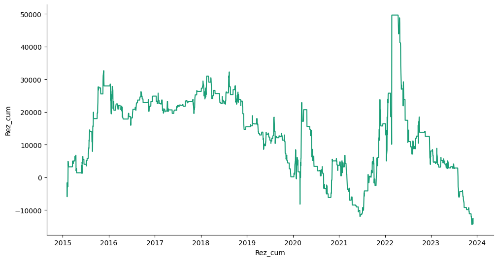
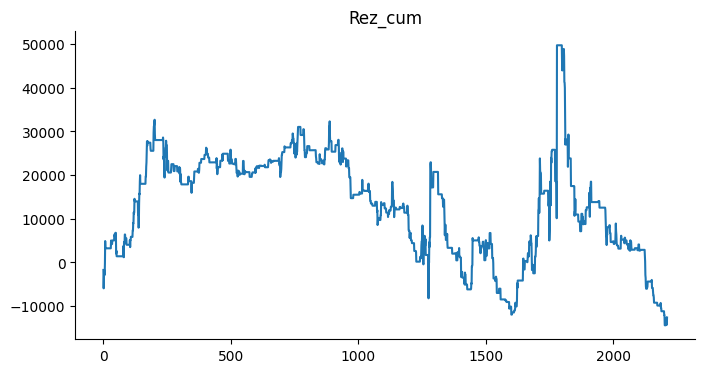

# Статистика по индексу RTS на основе объема свечи.

Статистика по направлениям после свечи с аномальным (превышающим 75 перцентиль за `PERIOD` свечей) объемом свечи.


```python
PERIOD = 20  # Количество предыдущих свечей для расчета перцентиля
```

Подключение гугл диска


```python
from google.colab import drive
drive.mount('/content/drive')
```

    Mounted at /content/drive
    

Подключение к БД.


```python
import pandas as pd
import numpy as np
import sqlite3
```


```python
connection = sqlite3.connect(r'/content/drive/MyDrive/data_quote_db/RTS_futures_day.db', check_same_thread=True)  # Создание соединения с БД
```

Загрузка данных в таблицу pandas.


```python
with connection:
  df = pd.read_sql('SELECT * FROM Day', connection)  # Загрузка данных из БД

print(df.to_string(max_rows=6, max_cols=25))  # Проверка того, что загрузилось
```

           TRADEDATE      SECID      OPEN       LOW      HIGH     CLOSE  VOLUME  OPENPOSITION  SHORTNAME    LSTTRADE
    0     2015-01-05  RIH5_2015   76930.0   72470.0   78980.0   74600.0  372848        751996   RTS-3.15  2015-03-16
    1     2015-01-06  RIH5_2015   74470.0   71200.0   74610.0   73480.0  319307        731236   RTS-3.15  2015-03-16
    2     2015-01-08  RIH5_2015   73490.0   71000.0   81380.0   79980.0  537469        751010   RTS-3.15  2015-03-16
    ...          ...        ...       ...       ...       ...       ...     ...           ...        ...         ...
    2231  2023-11-29       RIZ3  111530.0  110980.0  112560.0  112050.0   69535         76208  RTS-12.23  2023-12-21
    2232  2023-11-30       RIZ3  112050.0  110230.0  112280.0  110440.0   82290         80156  RTS-12.23  2023-12-21
    2233  2023-12-01       RIZ3  110340.0  108540.0  110630.0  108680.0   65318         71270  RTS-12.23  2023-12-21
    


```python
df = df.drop(['SECID', 'OPENPOSITION', 'SHORTNAME', 'LSTTRADE'], axis=1)  # Удаление неучаствующих в исследовании колонок
df['TRADEDATE'] = pd.to_datetime(df['TRADEDATE'])
df = df.dropna().reset_index(drop=True)
df = df.sort_values (by='TRADEDATE', ascending=True)
```

Добавление колонки направления бара.


```python
df['Up/Down'] = df.apply(lambda x: 1 if (x['OPEN'] < x['CLOSE']) else 0, axis=1)
print(df.to_string(max_rows=6, max_cols=25))  # Проверка
print('\n', df.value_counts("Up/Down"))
```

          TRADEDATE      OPEN       LOW      HIGH     CLOSE  VOLUME  Up/Down
    0    2015-01-05   76930.0   72470.0   78980.0   74600.0  372848        0
    1    2015-01-06   74470.0   71200.0   74610.0   73480.0  319307        0
    2    2015-01-08   73490.0   71000.0   81380.0   79980.0  537469        1
    ...         ...       ...       ...       ...       ...     ...      ...
    2231 2023-11-29  111530.0  110980.0  112560.0  112050.0   69535        1
    2232 2023-11-30  112050.0  110230.0  112280.0  110440.0   82290        0
    2233 2023-12-01  110340.0  108540.0  110630.0  108680.0   65318        0
    
     Up/Down
    1    1182
    0    1052
    dtype: int64
    

Создание колонок с предыдущими объемами свечей


```python
for i in range(1, PERIOD + 1):
  df[f'Vol_{i}'] = df['VOLUME'].shift(i)
print(df.to_string(max_rows=6, max_cols=25))  # Проверка
```

          TRADEDATE      OPEN       LOW      HIGH     CLOSE  VOLUME  Up/Down     Vol_1     Vol_2    Vol_3    Vol_4    Vol_5  ...    Vol_9   Vol_10   Vol_11   Vol_12   Vol_13   Vol_14   Vol_15   Vol_16   Vol_17   Vol_18   Vol_19   Vol_20
    0    2015-01-05   76930.0   72470.0   78980.0   74600.0  372848        0       NaN       NaN      NaN      NaN      NaN  ...      NaN      NaN      NaN      NaN      NaN      NaN      NaN      NaN      NaN      NaN      NaN      NaN
    1    2015-01-06   74470.0   71200.0   74610.0   73480.0  319307        0  372848.0       NaN      NaN      NaN      NaN  ...      NaN      NaN      NaN      NaN      NaN      NaN      NaN      NaN      NaN      NaN      NaN      NaN
    2    2015-01-08   73490.0   71000.0   81380.0   79980.0  537469        1  319307.0  372848.0      NaN      NaN      NaN  ...      NaN      NaN      NaN      NaN      NaN      NaN      NaN      NaN      NaN      NaN      NaN      NaN
    ...         ...       ...       ...       ...       ...     ...      ...       ...       ...      ...      ...      ...  ...      ...      ...      ...      ...      ...      ...      ...      ...      ...      ...      ...      ...
    2231 2023-11-29  111530.0  110980.0  112560.0  112050.0   69535        1   53501.0   69916.0  81771.0  52644.0  54597.0  ...  58673.0  71754.0  65871.0  61423.0  51686.0  63705.0  57614.0  49521.0  41444.0  57419.0  55788.0  67557.0
    2232 2023-11-30  112050.0  110230.0  112280.0  110440.0   82290        0   69535.0   53501.0  69916.0  81771.0  52644.0  ...  71115.0  58673.0  71754.0  65871.0  61423.0  51686.0  63705.0  57614.0  49521.0  41444.0  57419.0  55788.0
    2233 2023-12-01  110340.0  108540.0  110630.0  108680.0   65318        0   82290.0   69535.0  53501.0  69916.0  81771.0  ...  68152.0  71115.0  58673.0  71754.0  65871.0  61423.0  51686.0  63705.0  57614.0  49521.0  41444.0  57419.0
    

Очистка DF от NaN


```python
df = df.dropna().reset_index(drop=True)
print(df.to_string(max_rows=6, max_cols=25))  # Проверка
```

          TRADEDATE      OPEN       LOW      HIGH     CLOSE  VOLUME  Up/Down     Vol_1     Vol_2     Vol_3     Vol_4     Vol_5  ...     Vol_9    Vol_10    Vol_11    Vol_12    Vol_13    Vol_14    Vol_15    Vol_16    Vol_17    Vol_18    Vol_19    Vol_20
    0    2015-02-03   73280.0   72650.0   77770.0   77490.0  776092        1  810609.0  638352.0  545550.0  581408.0  697014.0  ...  598524.0  578746.0  682213.0  464776.0  711239.0  550145.0  473504.0  440908.0  592715.0  537469.0  319307.0  372848.0
    1    2015-02-04   77380.0   75230.0   79680.0   75660.0  713556        0  776092.0  810609.0  638352.0  545550.0  581408.0  ...  740477.0  598524.0  578746.0  682213.0  464776.0  711239.0  550145.0  473504.0  440908.0  592715.0  537469.0  319307.0
    2    2015-02-05   75450.0   73770.0   80110.0   79650.0  905235        1  713556.0  776092.0  810609.0  638352.0  545550.0  ...  655618.0  740477.0  598524.0  578746.0  682213.0  464776.0  711239.0  550145.0  473504.0  440908.0  592715.0  537469.0
    ...         ...       ...       ...       ...       ...     ...      ...       ...       ...       ...       ...       ...  ...       ...       ...       ...       ...       ...       ...       ...       ...       ...       ...       ...       ...
    2211 2023-11-29  111530.0  110980.0  112560.0  112050.0   69535        1   53501.0   69916.0   81771.0   52644.0   54597.0  ...   58673.0   71754.0   65871.0   61423.0   51686.0   63705.0   57614.0   49521.0   41444.0   57419.0   55788.0   67557.0
    2212 2023-11-30  112050.0  110230.0  112280.0  110440.0   82290        0   69535.0   53501.0   69916.0   81771.0   52644.0  ...   71115.0   58673.0   71754.0   65871.0   61423.0   51686.0   63705.0   57614.0   49521.0   41444.0   57419.0   55788.0
    2213 2023-12-01  110340.0  108540.0  110630.0  108680.0   65318        0   82290.0   69535.0   53501.0   69916.0   81771.0  ...   68152.0   71115.0   58673.0   71754.0   65871.0   61423.0   51686.0   63705.0   57614.0   49521.0   41444.0   57419.0
    

Создание колонки с расчетом 75 перцентиля по объемам за `PERIOD` предыдущих свечей и удаление колонок с предыдущими значениями объемов.


```python
df['per75'] = df.apply(lambda x: np.percentile([x[f'Vol_{i}'] for i in range(1, PERIOD + 1)], 75), axis=1)
# df['per75'] = df.apply(lambda x: np.percentile([x['Vol_1'], x['Vol_2'],
#                                                 x['Vol_3'], x['Vol_4'],
#                                                 x['Vol_5'], x['Vol_6'],
#                                                 x['Vol_7'], x['Vol_8'],
#                                                 x['Vol_9'], x['Vol_10']],
#                                                75), axis=1)
drop_column_lst = [f'Vol_{i}' for i in range(1, PERIOD + 1)]
df = df.drop(drop_column_lst, axis=1)
print(df.to_string(max_rows=6, max_cols=25))  # Проверка
```

          TRADEDATE      OPEN       LOW      HIGH     CLOSE  VOLUME  Up/Down      per75
    0    2015-02-03   73280.0   72650.0   77770.0   77490.0  776092        1  662266.75
    1    2015-02-04   77380.0   75230.0   79680.0   75660.0  713556        0  685913.25
    2    2015-02-05   75450.0   73770.0   80110.0   79650.0  905235        1  700570.25
    ...         ...       ...       ...       ...       ...     ...      ...        ...
    2211 2023-11-29  111530.0  110980.0  112560.0  112050.0   69535        1   67705.75
    2212 2023-11-30  112050.0  110230.0  112280.0  110440.0   82290        0   68497.75
    2213 2023-12-01  110340.0  108540.0  110630.0  108680.0   65318        0   69630.25
    

Создание колонки с маркером превышения 75 перцентиля по объемам за 10 предыдущих свечей.


```python
df['Over_per75'] = df.apply(lambda x: 1 if (x['VOLUME'] > x['per75']) else 0, axis=1)
print(df.to_string(max_rows=6, max_cols=25))  # Проверка
```

          TRADEDATE      OPEN       LOW      HIGH     CLOSE  VOLUME  Up/Down      per75  Over_per75
    0    2015-02-03   73280.0   72650.0   77770.0   77490.0  776092        1  662266.75           1
    1    2015-02-04   77380.0   75230.0   79680.0   75660.0  713556        0  685913.25           1
    2    2015-02-05   75450.0   73770.0   80110.0   79650.0  905235        1  700570.25           1
    ...         ...       ...       ...       ...       ...     ...      ...        ...         ...
    2211 2023-11-29  111530.0  110980.0  112560.0  112050.0   69535        1   67705.75           1
    2212 2023-11-30  112050.0  110230.0  112280.0  110440.0   82290        0   68497.75           1
    2213 2023-12-01  110340.0  108540.0  110630.0  108680.0   65318        0   69630.25           0
    

Создание колонок с предыдущим значением: направления свечи и превышения по объему.


```python
df['prev_Up/Down'] = df['Up/Down'].shift(1)
df['prev_Over_per75'] = df['Over_per75'].shift(1)
print(df.to_string(max_rows=6, max_cols=25))  # Проверка
```

          TRADEDATE      OPEN       LOW      HIGH     CLOSE  VOLUME  Up/Down      per75  Over_per75  prev_Up/Down  prev_Over_per75
    0    2015-02-03   73280.0   72650.0   77770.0   77490.0  776092        1  662266.75           1           NaN              NaN
    1    2015-02-04   77380.0   75230.0   79680.0   75660.0  713556        0  685913.25           1           1.0              1.0
    2    2015-02-05   75450.0   73770.0   80110.0   79650.0  905235        1  700570.25           1           0.0              1.0
    ...         ...       ...       ...       ...       ...     ...      ...        ...         ...           ...              ...
    2211 2023-11-29  111530.0  110980.0  112560.0  112050.0   69535        1   67705.75           1           0.0              0.0
    2212 2023-11-30  112050.0  110230.0  112280.0  110440.0   82290        0   68497.75           1           1.0              1.0
    2213 2023-12-01  110340.0  108540.0  110630.0  108680.0   65318        0   69630.25           0           0.0              1.0
    

Очистка от NaN и переиндексация.


```python
df = df.dropna().reset_index(drop=True)
df[['prev_Up/Down', 'prev_Over_per75']] = df[['prev_Up/Down', 'prev_Over_per75']].astype(int)
print(df.to_string(max_rows=6, max_cols=25))  # Проверка
```

          TRADEDATE      OPEN       LOW      HIGH     CLOSE  VOLUME  Up/Down      per75  Over_per75  prev_Up/Down  prev_Over_per75
    0    2015-02-04   77380.0   75230.0   79680.0   75660.0  713556        0  685913.25           1             1                1
    1    2015-02-05   75450.0   73770.0   80110.0   79650.0  905235        1  700570.25           1             0                1
    2    2015-02-06   79610.0   78510.0   82900.0   82160.0  877665        1  711818.25           1             1                1
    ...         ...       ...       ...       ...       ...     ...      ...        ...         ...           ...              ...
    2210 2023-11-29  111530.0  110980.0  112560.0  112050.0   69535        1   67705.75           1             0                0
    2211 2023-11-30  112050.0  110230.0  112280.0  110440.0   82290        0   68497.75           1             1                1
    2212 2023-12-01  110340.0  108540.0  110630.0  108680.0   65318        0   69630.25           0             0                1
    

Результирующие расчеты.


```python
def rez(up_down, prev_up_down, prev_over_per75):
    if (up_down == prev_up_down) and (prev_over_per75 == 1):  # Направление предыдущего и текущего бара совпадает и предыдущий бар аномальный по объему
        return 1
    elif (up_down != prev_up_down) and (prev_over_per75 == 1):  # Направление предыдущего и текущего бара не совпадает и предыдущий бар аномальный по объему
        return -1
    else:
        return 0

df['Rez'] = df.apply(lambda x: rez(x['Up/Down'], x['prev_Up/Down'], x['prev_Over_per75']), axis=1)
print(df.to_string(max_rows=60, max_cols=25))  # Проверка
print('\n', df.value_counts("Rez"))
```

          TRADEDATE      OPEN       LOW      HIGH     CLOSE   VOLUME  Up/Down      per75  Over_per75  prev_Up/Down  prev_Over_per75  Rez
    0    2015-02-04   77380.0   75230.0   79680.0   75660.0   713556        0  685913.25           1             1                1   -1
    1    2015-02-05   75450.0   73770.0   80110.0   79650.0   905235        1  700570.25           1             0                1   -1
    2    2015-02-06   79610.0   78510.0   82900.0   82160.0   877665        1  711818.25           1             1                1    1
    3    2015-02-09   82060.0   79560.0   88800.0   83710.0  1237992        1  720286.25           1             1                1    1
    4    2015-02-10   83710.0   81470.0   85200.0   82570.0   712336        0  749380.75           0             1                1   -1
    5    2015-02-11   82710.0   81640.0   85800.0   83160.0   773518        1  749380.75           1             0                0    0
    6    2015-02-12   83130.0   81900.0   88530.0   85850.0  1336043        1  774161.50           1             1                1    1
    7    2015-02-13   85880.0   85730.0   91240.0   90910.0   934530        1  784721.25           1             1                1    1
    8    2015-02-16   90980.0   88920.0   92140.0   89320.0   587487        0  827373.00           0             1                1   -1
    9    2015-02-17   89400.0   88060.0   93250.0   88410.0   704605        0  827373.00           0             0                0    0
    10   2015-02-18   88440.0   88430.0   93610.0   92450.0   824820        1  827373.00           0             0                0    0
    11   2015-02-19   92500.0   88280.0   93190.0   90420.0   704408        0  838031.25           0             1                0    0
    12   2015-02-20   90430.0   89750.0   92630.0   90790.0   614669        1  838031.25           0             0                0    0
    13   2015-02-24   90730.0   86020.0   91760.0   88650.0   542237        0  838031.25           0             1                0    0
    14   2015-02-25   88510.0   87090.0   89150.0   87760.0   450094        0  838031.25           0             0                0    0
    15   2015-02-26   87850.0   87630.0   92000.0   90560.0   615477        1  838031.25           0             0                0    0
    16   2015-02-27   90330.0   87850.0   91050.0   89820.0   597863        0  838031.25           0             1                0    0
    17   2015-03-02   89910.0   89000.0   90860.0   89760.0   444380        0  838031.25           0             0                0    0
    18   2015-03-03   89860.0   88520.0   92510.0   91450.0   631004        1  838031.25           0             0                0    0
    19   2015-03-04   91320.0   88370.0   92320.0   88730.0   612749        0  838031.25           0             1                0    0
    20   2015-03-05   88750.0   88580.0   91870.0   91030.0   654721        1  838031.25           0             0                0    0
    21   2015-03-06   91090.0   90000.0   93170.0   90030.0   551193        0  838031.25           0             1                0    0
    22   2015-03-10   90020.0   84520.0   90060.0   84690.0   702249        0  786343.50           0             0                0    0
    23   2015-03-11   84550.0   83240.0   85700.0   84650.0   692022        1  727631.50           0             0                0    0
    24   2015-03-12   84730.0   84370.0   86910.0   85260.0   644653        1  706537.75           0             1                0    0
    25   2015-03-13   85160.0   82750.0   85540.0   83080.0   573571        0  704457.25           0             1                0    0
    26   2015-03-16   83190.0   81150.0   83390.0   82070.0   290193        0  702788.75           0             0                0    0
    27   2015-03-17   79930.0   79730.0   81440.0   80820.0   552443        1  694578.75           0             0                0    0
    28   2015-03-18   80800.0   80520.0   83050.0   82330.0   491316        1  664046.25           0             1                0    0
    29   2015-03-19   82420.0   82420.0   86470.0   83260.0   741351        1  664046.25           1             1                0    0
    ...         ...       ...       ...       ...       ...      ...      ...        ...         ...           ...              ...  ...
    2183 2023-10-23  107460.0  107160.0  108770.0  108600.0    67494        1   78251.50           0             1                0    0
    2184 2023-10-24  108560.0  108020.0  109580.0  109470.0    56315        1   75690.25           0             1                0    0
    2185 2023-10-25  109410.0  108390.0  109740.0  109430.0    69107        1   75690.25           0             1                0    0
    2186 2023-10-26  109440.0  107330.0  109620.0  107410.0    84589        0   75690.25           1             1                0    0
    2187 2023-10-27  107410.0  106620.0  108210.0  106820.0    98523        0   78430.50           1             0                1    1
    2188 2023-10-30  106730.0  106670.0  108600.0  107840.0    71041        1   78430.50           0             0                1   -1
    2189 2023-10-31  107930.0  105970.0  108830.0  106720.0    85813        0   75690.25           1             1                0    0
    2190 2023-11-01  106720.0  106060.0  107680.0  107500.0    67557        1   77686.75           0             0                1   -1
    2191 2023-11-02  107500.0  106510.0  107830.0  106680.0    55788        0   77686.75           0             1                0    0
    2192 2023-11-03  106670.0  106430.0  108270.0  108200.0    57419        1   77686.75           0             0                0    0
    2193 2023-11-06  108200.0  107790.0  109370.0  109370.0    41444        1   77166.25           0             1                0    0
    2194 2023-11-07  109350.0  108410.0  109550.0  109430.0    49521        1   72307.00           0             1                0    0
    2195 2023-11-08  109450.0  108530.0  110400.0  110330.0    57614        1   71953.75           0             1                0    0
    2196 2023-11-09  110320.0  109200.0  110320.0  109960.0    63705        0   71953.75           0             1                0    0
    2197 2023-11-10  109970.0  109200.0  110150.0  109700.0    51686        0   70816.75           0             0                0    0
    2198 2023-11-13  109700.0  108880.0  110800.0  110700.0    61423        1   70816.75           0             0                0    0
    2199 2023-11-14  110660.0  109500.0  110890.0  110420.0    65871        0   70816.75           0             1                0    0
    2200 2023-11-15  110430.0  110000.0  112530.0  112450.0    71754        1   70816.75           1             0                0    0
    2201 2023-11-16  112510.0  111480.0  112680.0  111600.0    58673        0   70816.75           0             1                1   -1
    2202 2023-11-17  111600.0  110440.0  111730.0  111170.0    71115        0   70816.75           1             0                0    0
    2203 2023-11-20  111170.0  110990.0  113800.0  113470.0    68152        1   71059.50           0             0                1   -1
    2204 2023-11-21  113530.0  113370.0  114560.0  114400.0    54566        1   71059.50           0             1                0    0
    2205 2023-11-22  114500.0  113480.0  115110.0  114220.0    54597        0   71059.50           0             1                0    0
    2206 2023-11-23  114210.0  113430.0  114960.0  113770.0    52644        0   71059.50           0             0                0    0
    2207 2023-11-24  113840.0  112180.0  114310.0  113380.0    81771        0   68874.25           1             0                0    0
    2208 2023-11-27  113350.0  111500.0  113550.0  111700.0    69916        0   68874.25           1             0                1    1
    2209 2023-11-28  111680.0  111180.0  112160.0  111610.0    53501        0   68593.00           0             0                1    1
    2210 2023-11-29  111530.0  110980.0  112560.0  112050.0    69535        1   67705.75           1             0                0    0
    2211 2023-11-30  112050.0  110230.0  112280.0  110440.0    82290        0   68497.75           1             1                1   -1
    2212 2023-12-01  110340.0  108540.0  110630.0  108680.0    65318        0   69630.25           0             0                1    1
    
     Rez
     0    1598
    -1     328
     1     287
    dtype: int64
    


```python
def rez_value(body, rez):
    if rez == 1:
        return body
    elif rez == -1:
        return -body
    else:
        return 0

df['Rez_value'] = df.apply(lambda x: rez_value(abs(x['OPEN']-x['CLOSE']), x['Rez']), axis=1)
df["Rez_cum"] = df["Rez_value"].cumsum()
print(df.to_string(max_rows=6, max_cols=25))  # Проверка
print('\n', df[['Rez_value']].sum())  # Сумма всех элементов в колонке
```

          TRADEDATE      OPEN       LOW      HIGH     CLOSE  VOLUME  Up/Down      per75  Over_per75  prev_Up/Down  prev_Over_per75  Rez  Rez_value  Rez_cum
    0    2015-02-04   77380.0   75230.0   79680.0   75660.0  713556        0  685913.25           1             1                1   -1    -1720.0  -1720.0
    1    2015-02-05   75450.0   73770.0   80110.0   79650.0  905235        1  700570.25           1             0                1   -1    -4200.0  -5920.0
    2    2015-02-06   79610.0   78510.0   82900.0   82160.0  877665        1  711818.25           1             1                1    1     2550.0  -3370.0
    ...         ...       ...       ...       ...       ...     ...      ...        ...         ...           ...              ...  ...        ...      ...
    2210 2023-11-29  111530.0  110980.0  112560.0  112050.0   69535        1   67705.75           1             0                0    0        0.0 -12650.0
    2211 2023-11-30  112050.0  110230.0  112280.0  110440.0   82290        0   68497.75           1             1                1   -1    -1610.0 -14260.0
    2212 2023-12-01  110340.0  108540.0  110630.0  108680.0   65318        0   69630.25           0             0                1    1     1660.0 -12600.0
    
     Rez_value   -12600.0
    dtype: float64
    


```python
df
```


  <div id="df-e028dee0-a966-4959-b014-456edcbef194" class="colab-df-container">
    <div>
<style scoped>
    .dataframe tbody tr th:only-of-type {
        vertical-align: middle;
    }

    .dataframe tbody tr th {
        vertical-align: top;
    }

    .dataframe thead th {
        text-align: right;
    }
</style>
<table border="1" class="dataframe">
  <thead>
    <tr style="text-align: right;">
      <th></th>
      <th>TRADEDATE</th>
      <th>OPEN</th>
      <th>LOW</th>
      <th>HIGH</th>
      <th>CLOSE</th>
      <th>VOLUME</th>
      <th>Up/Down</th>
      <th>per75</th>
      <th>Over_per75</th>
      <th>prev_Up/Down</th>
      <th>prev_Over_per75</th>
      <th>Rez</th>
      <th>Rez_value</th>
      <th>Rez_cum</th>
    </tr>
  </thead>
  <tbody>
    <tr>
      <th>0</th>
      <td>2015-02-04</td>
      <td>77380.0</td>
      <td>75230.0</td>
      <td>79680.0</td>
      <td>75660.0</td>
      <td>713556</td>
      <td>0</td>
      <td>685913.25</td>
      <td>1</td>
      <td>1</td>
      <td>1</td>
      <td>-1</td>
      <td>-1720.0</td>
      <td>-1720.0</td>
    </tr>
    <tr>
      <th>1</th>
      <td>2015-02-05</td>
      <td>75450.0</td>
      <td>73770.0</td>
      <td>80110.0</td>
      <td>79650.0</td>
      <td>905235</td>
      <td>1</td>
      <td>700570.25</td>
      <td>1</td>
      <td>0</td>
      <td>1</td>
      <td>-1</td>
      <td>-4200.0</td>
      <td>-5920.0</td>
    </tr>
    <tr>
      <th>2</th>
      <td>2015-02-06</td>
      <td>79610.0</td>
      <td>78510.0</td>
      <td>82900.0</td>
      <td>82160.0</td>
      <td>877665</td>
      <td>1</td>
      <td>711818.25</td>
      <td>1</td>
      <td>1</td>
      <td>1</td>
      <td>1</td>
      <td>2550.0</td>
      <td>-3370.0</td>
    </tr>
    <tr>
      <th>3</th>
      <td>2015-02-09</td>
      <td>82060.0</td>
      <td>79560.0</td>
      <td>88800.0</td>
      <td>83710.0</td>
      <td>1237992</td>
      <td>1</td>
      <td>720286.25</td>
      <td>1</td>
      <td>1</td>
      <td>1</td>
      <td>1</td>
      <td>1650.0</td>
      <td>-1720.0</td>
    </tr>
    <tr>
      <th>4</th>
      <td>2015-02-10</td>
      <td>83710.0</td>
      <td>81470.0</td>
      <td>85200.0</td>
      <td>82570.0</td>
      <td>712336</td>
      <td>0</td>
      <td>749380.75</td>
      <td>0</td>
      <td>1</td>
      <td>1</td>
      <td>-1</td>
      <td>-1140.0</td>
      <td>-2860.0</td>
    </tr>
    <tr>
      <th>...</th>
      <td>...</td>
      <td>...</td>
      <td>...</td>
      <td>...</td>
      <td>...</td>
      <td>...</td>
      <td>...</td>
      <td>...</td>
      <td>...</td>
      <td>...</td>
      <td>...</td>
      <td>...</td>
      <td>...</td>
      <td>...</td>
    </tr>
    <tr>
      <th>2208</th>
      <td>2023-11-27</td>
      <td>113350.0</td>
      <td>111500.0</td>
      <td>113550.0</td>
      <td>111700.0</td>
      <td>69916</td>
      <td>0</td>
      <td>68874.25</td>
      <td>1</td>
      <td>0</td>
      <td>1</td>
      <td>1</td>
      <td>1650.0</td>
      <td>-12720.0</td>
    </tr>
    <tr>
      <th>2209</th>
      <td>2023-11-28</td>
      <td>111680.0</td>
      <td>111180.0</td>
      <td>112160.0</td>
      <td>111610.0</td>
      <td>53501</td>
      <td>0</td>
      <td>68593.00</td>
      <td>0</td>
      <td>0</td>
      <td>1</td>
      <td>1</td>
      <td>70.0</td>
      <td>-12650.0</td>
    </tr>
    <tr>
      <th>2210</th>
      <td>2023-11-29</td>
      <td>111530.0</td>
      <td>110980.0</td>
      <td>112560.0</td>
      <td>112050.0</td>
      <td>69535</td>
      <td>1</td>
      <td>67705.75</td>
      <td>1</td>
      <td>0</td>
      <td>0</td>
      <td>0</td>
      <td>0.0</td>
      <td>-12650.0</td>
    </tr>
    <tr>
      <th>2211</th>
      <td>2023-11-30</td>
      <td>112050.0</td>
      <td>110230.0</td>
      <td>112280.0</td>
      <td>110440.0</td>
      <td>82290</td>
      <td>0</td>
      <td>68497.75</td>
      <td>1</td>
      <td>1</td>
      <td>1</td>
      <td>-1</td>
      <td>-1610.0</td>
      <td>-14260.0</td>
    </tr>
    <tr>
      <th>2212</th>
      <td>2023-12-01</td>
      <td>110340.0</td>
      <td>108540.0</td>
      <td>110630.0</td>
      <td>108680.0</td>
      <td>65318</td>
      <td>0</td>
      <td>69630.25</td>
      <td>0</td>
      <td>0</td>
      <td>1</td>
      <td>1</td>
      <td>1660.0</td>
      <td>-12600.0</td>
    </tr>
  </tbody>
</table>
<p>2213 rows × 14 columns</p>
</div>
    <div class="colab-df-buttons">

  <div class="colab-df-container">
    <button class="colab-df-convert" onclick="convertToInteractive('df-e028dee0-a966-4959-b014-456edcbef194')"
            title="Convert this dataframe to an interactive table."
            style="display:none;">

  <svg xmlns="http://www.w3.org/2000/svg" height="24px" viewBox="0 -960 960 960">
    <path d="M120-120v-720h720v720H120Zm60-500h600v-160H180v160Zm220 220h160v-160H400v160Zm0 220h160v-160H400v160ZM180-400h160v-160H180v160Zm440 0h160v-160H620v160ZM180-180h160v-160H180v160Zm440 0h160v-160H620v160Z"/>
  </svg>
    </button>

  <style>
    .colab-df-container {
      display:flex;
      gap: 12px;
    }

    .colab-df-convert {
      background-color: #E8F0FE;
      border: none;
      border-radius: 50%;
      cursor: pointer;
      display: none;
      fill: #1967D2;
      height: 32px;
      padding: 0 0 0 0;
      width: 32px;
    }

    .colab-df-convert:hover {
      background-color: #E2EBFA;
      box-shadow: 0px 1px 2px rgba(60, 64, 67, 0.3), 0px 1px 3px 1px rgba(60, 64, 67, 0.15);
      fill: #174EA6;
    }

    .colab-df-buttons div {
      margin-bottom: 4px;
    }

    [theme=dark] .colab-df-convert {
      background-color: #3B4455;
      fill: #D2E3FC;
    }

    [theme=dark] .colab-df-convert:hover {
      background-color: #434B5C;
      box-shadow: 0px 1px 3px 1px rgba(0, 0, 0, 0.15);
      filter: drop-shadow(0px 1px 2px rgba(0, 0, 0, 0.3));
      fill: #FFFFFF;
    }
  </style>

    <script>
      const buttonEl =
        document.querySelector('#df-e028dee0-a966-4959-b014-456edcbef194 button.colab-df-convert');
      buttonEl.style.display =
        google.colab.kernel.accessAllowed ? 'block' : 'none';

      async function convertToInteractive(key) {
        const element = document.querySelector('#df-e028dee0-a966-4959-b014-456edcbef194');
        const dataTable =
          await google.colab.kernel.invokeFunction('convertToInteractive',
                                                    [key], {});
        if (!dataTable) return;

        const docLinkHtml = 'Like what you see? Visit the ' +
          '<a target="_blank" href=https://colab.research.google.com/notebooks/data_table.ipynb>data table notebook</a>'
          + ' to learn more about interactive tables.';
        element.innerHTML = '';
        dataTable['output_type'] = 'display_data';
        await google.colab.output.renderOutput(dataTable, element);
        const docLink = document.createElement('div');
        docLink.innerHTML = docLinkHtml;
        element.appendChild(docLink);
      }
    </script>
  </div>


<div id="df-dc0c9400-8522-45d0-b45f-736558ad5531">
  <button class="colab-df-quickchart" onclick="quickchart('df-dc0c9400-8522-45d0-b45f-736558ad5531')"
            title="Suggest charts"
            style="display:none;">

<svg xmlns="http://www.w3.org/2000/svg" height="24px"viewBox="0 0 24 24"
     width="24px">
    <g>
        <path d="M19 3H5c-1.1 0-2 .9-2 2v14c0 1.1.9 2 2 2h14c1.1 0 2-.9 2-2V5c0-1.1-.9-2-2-2zM9 17H7v-7h2v7zm4 0h-2V7h2v10zm4 0h-2v-4h2v4z"/>
    </g>
</svg>
  </button>

<style>
  .colab-df-quickchart {
      --bg-color: #E8F0FE;
      --fill-color: #1967D2;
      --hover-bg-color: #E2EBFA;
      --hover-fill-color: #174EA6;
      --disabled-fill-color: #AAA;
      --disabled-bg-color: #DDD;
  }

  [theme=dark] .colab-df-quickchart {
      --bg-color: #3B4455;
      --fill-color: #D2E3FC;
      --hover-bg-color: #434B5C;
      --hover-fill-color: #FFFFFF;
      --disabled-bg-color: #3B4455;
      --disabled-fill-color: #666;
  }

  .colab-df-quickchart {
    background-color: var(--bg-color);
    border: none;
    border-radius: 50%;
    cursor: pointer;
    display: none;
    fill: var(--fill-color);
    height: 32px;
    padding: 0;
    width: 32px;
  }

  .colab-df-quickchart:hover {
    background-color: var(--hover-bg-color);
    box-shadow: 0 1px 2px rgba(60, 64, 67, 0.3), 0 1px 3px 1px rgba(60, 64, 67, 0.15);
    fill: var(--button-hover-fill-color);
  }

  .colab-df-quickchart-complete:disabled,
  .colab-df-quickchart-complete:disabled:hover {
    background-color: var(--disabled-bg-color);
    fill: var(--disabled-fill-color);
    box-shadow: none;
  }

  .colab-df-spinner {
    border: 2px solid var(--fill-color);
    border-color: transparent;
    border-bottom-color: var(--fill-color);
    animation:
      spin 1s steps(1) infinite;
  }

  @keyframes spin {
    0% {
      border-color: transparent;
      border-bottom-color: var(--fill-color);
      border-left-color: var(--fill-color);
    }
    20% {
      border-color: transparent;
      border-left-color: var(--fill-color);
      border-top-color: var(--fill-color);
    }
    30% {
      border-color: transparent;
      border-left-color: var(--fill-color);
      border-top-color: var(--fill-color);
      border-right-color: var(--fill-color);
    }
    40% {
      border-color: transparent;
      border-right-color: var(--fill-color);
      border-top-color: var(--fill-color);
    }
    60% {
      border-color: transparent;
      border-right-color: var(--fill-color);
    }
    80% {
      border-color: transparent;
      border-right-color: var(--fill-color);
      border-bottom-color: var(--fill-color);
    }
    90% {
      border-color: transparent;
      border-bottom-color: var(--fill-color);
    }
  }
</style>

  <script>
    async function quickchart(key) {
      const quickchartButtonEl =
        document.querySelector('#' + key + ' button');
      quickchartButtonEl.disabled = true;  // To prevent multiple clicks.
      quickchartButtonEl.classList.add('colab-df-spinner');
      try {
        const charts = await google.colab.kernel.invokeFunction(
            'suggestCharts', [key], {});
      } catch (error) {
        console.error('Error during call to suggestCharts:', error);
      }
      quickchartButtonEl.classList.remove('colab-df-spinner');
      quickchartButtonEl.classList.add('colab-df-quickchart-complete');
    }
    (() => {
      let quickchartButtonEl =
        document.querySelector('#df-dc0c9400-8522-45d0-b45f-736558ad5531 button');
      quickchartButtonEl.style.display =
        google.colab.kernel.accessAllowed ? 'block' : 'none';
    })();
  </script>
</div>
    </div>
  </div>


```python
from matplotlib import pyplot as plt
import seaborn as sns
def _plot_series(series, series_name, series_index=0):
  from matplotlib import pyplot as plt
  import seaborn as sns
  palette = list(sns.palettes.mpl_palette('Dark2'))
  xs = series['TRADEDATE']
  ys = series['Rez_cum']

  plt.plot(xs, ys, label=series_name, color=palette[series_index % len(palette)])

fig, ax = plt.subplots(figsize=(10, 5.2), layout='constrained')
df_sorted = df.sort_values('TRADEDATE', ascending=True)
_plot_series(df_sorted, '')
sns.despine(fig=fig, ax=ax)
plt.xlabel('Rez_cum')
_ = plt.ylabel('Rez_cum')
```


    

    


```python
from matplotlib import pyplot as plt
df['Rez_cum'].plot(kind='line', figsize=(8, 4), title='Rez_cum')
plt.gca().spines[['top', 'right']].set_visible(False)
```


    

    

