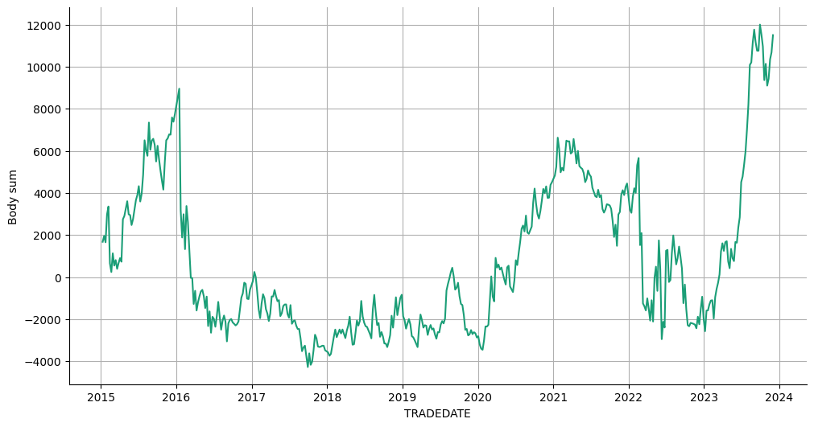
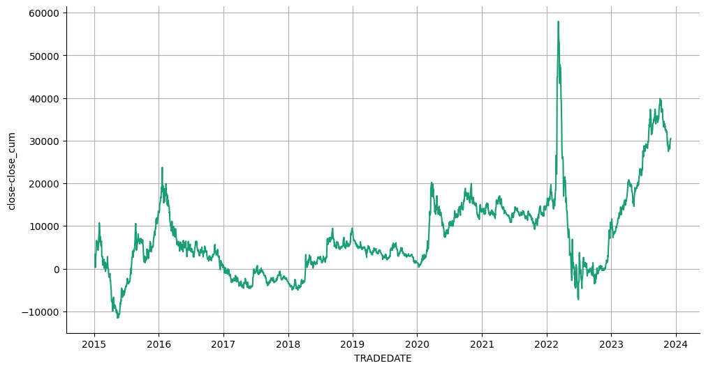

# Статистика по фьючерсу Si на основе дней в неделе.

Статистика по направлениям свечей в зависимости от дня в неделе.

Подключение гугл диска


```python
from google.colab import drive
drive.mount('/content/drive')
```

    Mounted at /content/drive
    

Подключение к БД.


```python
import pandas as pd
import numpy as np
import sqlite3
import datetime
```


```python
connection = sqlite3.connect(r'/content/drive/MyDrive/data_quote_db/Si_futures_day.db', check_same_thread=True)  # Создание соединения с БД
```

Загрузка данных в таблицу pandas.


```python
with connection:
  df = pd.read_sql('SELECT * FROM Day', connection)  # Загрузка данных из БД

print(df.to_string(max_rows=6, max_cols=25))  # Проверка того, что загрузилось
```

           TRADEDATE      SECID     OPEN      LOW     HIGH    CLOSE   VOLUME  OPENPOSITION SHORTNAME    LSTTRADE
    0     2015-01-05  SiH5_2015  57860.0  56424.0  61483.0  61101.0   837896       2052722   Si-3.15  2015-03-16
    1     2015-01-06  SiH5_2015  61260.0  61076.0  65850.0  64464.0   924763       2041056   Si-3.15  2015-03-16
    2     2015-01-08  SiH5_2015  64424.0  61000.0  65708.0  61380.0  1328024       2069926   Si-3.15  2015-03-16
    ...          ...        ...      ...      ...      ...      ...      ...           ...       ...         ...
    2246  2023-11-30       SiZ3  89242.0  88899.0  90305.0  90138.0  1063131       5604960  Si-12.23  2023-12-21
    2247  2023-12-01       SiZ3  90150.0  89741.0  91019.0  90969.0   865188       5564512  Si-12.23  2023-12-21
    2248  2023-12-04       SiZ3  91000.0  90661.0  91695.0  91610.0   841721       5446546  Si-12.23  2023-12-21
    

Подготовка DF


```python
df = df.drop(['SECID', 'OPENPOSITION', 'SHORTNAME', 'LSTTRADE'], axis=1)
df['TRADEDATE'] = pd.to_datetime(df['TRADEDATE'])  # Смена типа
df = df.dropna().reset_index(drop=True)  # Удаление NaN
```

Создание и заполнение колонки с торговым днем недели.


```python
df['Work_day'] = df['TRADEDATE'].dt.weekday

df[['Work_day']] = df[['Work_day']].astype(int)
df = df.sort_values(by='TRADEDATE', ascending=True)  # Сортировка по возрастанию
print(df.to_string(max_rows=6, max_cols=25))  # Проверка
```

          TRADEDATE     OPEN      LOW     HIGH    CLOSE   VOLUME  Work_day
    0    2015-01-05  57860.0  56424.0  61483.0  61101.0   837896         0
    1    2015-01-06  61260.0  61076.0  65850.0  64464.0   924763         1
    2    2015-01-08  64424.0  61000.0  65708.0  61380.0  1328024         3
    ...         ...      ...      ...      ...      ...      ...       ...
    2246 2023-11-30  89242.0  88899.0  90305.0  90138.0  1063131         3
    2247 2023-12-01  90150.0  89741.0  91019.0  90969.0   865188         4
    2248 2023-12-04  91000.0  90661.0  91695.0  91610.0   841721         0
    

Добавление колонок: направления бара и размера тела свечи.


```python
df['Up'] = df.apply(lambda x: 1 if (x['OPEN'] < x['CLOSE']) else np.nan, axis=1)
df['Down'] = df.apply(lambda x: 1 if (x['OPEN'] >= x['CLOSE']) else np.nan, axis=1)
df['Body'] = df.apply(lambda x: -x['OPEN'] + x['CLOSE'], axis=1)
print(df.to_string(max_rows=20, max_cols=25))  # Проверка
```

          TRADEDATE     OPEN      LOW     HIGH    CLOSE   VOLUME  Work_day   Up  Down    Body
    0    2015-01-05  57860.0  56424.0  61483.0  61101.0   837896         0  1.0   NaN  3241.0
    1    2015-01-06  61260.0  61076.0  65850.0  64464.0   924763         1  1.0   NaN  3204.0
    2    2015-01-08  64424.0  61000.0  65708.0  61380.0  1328024         3  NaN   1.0 -3044.0
    3    2015-01-09  61422.0  61170.0  64196.0  63100.0  1320467         4  1.0   NaN  1678.0
    4    2015-01-12  63175.0  62810.0  65671.0  65400.0  1594752         0  1.0   NaN  2225.0
    5    2015-01-13  65338.0  64740.0  68724.0  67550.0  1833143         1  1.0   NaN  2212.0
    6    2015-01-14  67700.0  67117.0  68616.0  67700.0  1733856         2  NaN   1.0     0.0
    7    2015-01-15  67746.0  65208.0  68120.0  66570.0  2806797         3  NaN   1.0 -1176.0
    8    2015-01-16  66698.0  66130.0  67500.0  66976.0  1722115         4  1.0   NaN   278.0
    9    2015-01-19  66966.0  65531.0  67300.0  66452.0  1903087         0  NaN   1.0  -514.0
    ...         ...      ...      ...      ...      ...      ...       ...  ...   ...     ...
    2239 2023-11-21  88995.0  88200.0  88995.0  88589.0   894428         1  NaN   1.0  -406.0
    2240 2023-11-22  88548.0  88029.0  89492.0  89165.0   772232         2  1.0   NaN   617.0
    2241 2023-11-23  89180.0  88512.0  89428.0  89100.0   784678         3  NaN   1.0   -80.0
    2242 2023-11-24  89127.0  88830.0  90080.0  89461.0  1492045         4  1.0   NaN   334.0
    2243 2023-11-27  89450.0  89005.0  89719.0  89629.0   776992         0  1.0   NaN   179.0
    2244 2023-11-28  89628.0  89230.0  90262.0  90067.0   997493         1  1.0   NaN   439.0
    2245 2023-11-29  90068.0  89057.0  90239.0  89245.0  1116565         2  NaN   1.0  -823.0
    2246 2023-11-30  89242.0  88899.0  90305.0  90138.0  1063131         3  1.0   NaN   896.0
    2247 2023-12-01  90150.0  89741.0  91019.0  90969.0   865188         4  1.0   NaN   819.0
    2248 2023-12-04  91000.0  90661.0  91695.0  91610.0   841721         0  1.0   NaN   610.0
    

Агрегация данных.


```python
agg_func_count = {'Up': ['count'],
                  'Down': ['count'],
                  'Body': ['sum']}
df_count = df.groupby(['Work_day']).agg(agg_func_count)  # статистика по Up / Down
df_count
```


  <div id="df-03b834be-b6c9-4846-a5a2-3303c1b8838c" class="colab-df-container">
    <div>
<style scoped>
    .dataframe tbody tr th:only-of-type {
        vertical-align: middle;
    }

    .dataframe tbody tr th {
        vertical-align: top;
    }

    .dataframe thead tr th {
        text-align: left;
    }

    .dataframe thead tr:last-of-type th {
        text-align: right;
    }
</style>
<table border="1" class="dataframe">
  <thead>
    <tr>
      <th></th>
      <th>Up</th>
      <th>Down</th>
      <th>Body</th>
    </tr>
    <tr>
      <th></th>
      <th>count</th>
      <th>count</th>
      <th>sum</th>
    </tr>
    <tr>
      <th>Work_day</th>
      <th></th>
      <th></th>
      <th></th>
    </tr>
  </thead>
  <tbody>
    <tr>
      <th>0</th>
      <td>211</td>
      <td>224</td>
      <td>-12570.0</td>
    </tr>
    <tr>
      <th>1</th>
      <td>223</td>
      <td>226</td>
      <td>5992.0</td>
    </tr>
    <tr>
      <th>2</th>
      <td>228</td>
      <td>225</td>
      <td>11595.0</td>
    </tr>
    <tr>
      <th>3</th>
      <td>196</td>
      <td>259</td>
      <td>-44076.0</td>
    </tr>
    <tr>
      <th>4</th>
      <td>232</td>
      <td>220</td>
      <td>11501.0</td>
    </tr>
    <tr>
      <th>5</th>
      <td>4</td>
      <td>1</td>
      <td>-322.0</td>
    </tr>
  </tbody>
</table>
</div>
    <div class="colab-df-buttons">

  <div class="colab-df-container">
    <button class="colab-df-convert" onclick="convertToInteractive('df-03b834be-b6c9-4846-a5a2-3303c1b8838c')"
            title="Convert this dataframe to an interactive table."
            style="display:none;">

  <svg xmlns="http://www.w3.org/2000/svg" height="24px" viewBox="0 -960 960 960">
    <path d="M120-120v-720h720v720H120Zm60-500h600v-160H180v160Zm220 220h160v-160H400v160Zm0 220h160v-160H400v160ZM180-400h160v-160H180v160Zm440 0h160v-160H620v160ZM180-180h160v-160H180v160Zm440 0h160v-160H620v160Z"/>
  </svg>
    </button>

  <style>
    .colab-df-container {
      display:flex;
      gap: 12px;
    }

    .colab-df-convert {
      background-color: #E8F0FE;
      border: none;
      border-radius: 50%;
      cursor: pointer;
      display: none;
      fill: #1967D2;
      height: 32px;
      padding: 0 0 0 0;
      width: 32px;
    }

    .colab-df-convert:hover {
      background-color: #E2EBFA;
      box-shadow: 0px 1px 2px rgba(60, 64, 67, 0.3), 0px 1px 3px 1px rgba(60, 64, 67, 0.15);
      fill: #174EA6;
    }

    .colab-df-buttons div {
      margin-bottom: 4px;
    }

    [theme=dark] .colab-df-convert {
      background-color: #3B4455;
      fill: #D2E3FC;
    }

    [theme=dark] .colab-df-convert:hover {
      background-color: #434B5C;
      box-shadow: 0px 1px 3px 1px rgba(0, 0, 0, 0.15);
      filter: drop-shadow(0px 1px 2px rgba(0, 0, 0, 0.3));
      fill: #FFFFFF;
    }
  </style>

    <script>
      const buttonEl =
        document.querySelector('#df-03b834be-b6c9-4846-a5a2-3303c1b8838c button.colab-df-convert');
      buttonEl.style.display =
        google.colab.kernel.accessAllowed ? 'block' : 'none';

      async function convertToInteractive(key) {
        const element = document.querySelector('#df-03b834be-b6c9-4846-a5a2-3303c1b8838c');
        const dataTable =
          await google.colab.kernel.invokeFunction('convertToInteractive',
                                                    [key], {});
        if (!dataTable) return;

        const docLinkHtml = 'Like what you see? Visit the ' +
          '<a target="_blank" href=https://colab.research.google.com/notebooks/data_table.ipynb>data table notebook</a>'
          + ' to learn more about interactive tables.';
        element.innerHTML = '';
        dataTable['output_type'] = 'display_data';
        await google.colab.output.renderOutput(dataTable, element);
        const docLink = document.createElement('div');
        docLink.innerHTML = docLinkHtml;
        element.appendChild(docLink);
      }
    </script>
  </div>


<div id="df-829dc228-2ff6-4075-b082-236be53726d4">
  <button class="colab-df-quickchart" onclick="quickchart('df-829dc228-2ff6-4075-b082-236be53726d4')"
            title="Suggest charts"
            style="display:none;">

<svg xmlns="http://www.w3.org/2000/svg" height="24px"viewBox="0 0 24 24"
     width="24px">
    <g>
        <path d="M19 3H5c-1.1 0-2 .9-2 2v14c0 1.1.9 2 2 2h14c1.1 0 2-.9 2-2V5c0-1.1-.9-2-2-2zM9 17H7v-7h2v7zm4 0h-2V7h2v10zm4 0h-2v-4h2v4z"/>
    </g>
</svg>
  </button>

<style>
  .colab-df-quickchart {
      --bg-color: #E8F0FE;
      --fill-color: #1967D2;
      --hover-bg-color: #E2EBFA;
      --hover-fill-color: #174EA6;
      --disabled-fill-color: #AAA;
      --disabled-bg-color: #DDD;
  }

  [theme=dark] .colab-df-quickchart {
      --bg-color: #3B4455;
      --fill-color: #D2E3FC;
      --hover-bg-color: #434B5C;
      --hover-fill-color: #FFFFFF;
      --disabled-bg-color: #3B4455;
      --disabled-fill-color: #666;
  }

  .colab-df-quickchart {
    background-color: var(--bg-color);
    border: none;
    border-radius: 50%;
    cursor: pointer;
    display: none;
    fill: var(--fill-color);
    height: 32px;
    padding: 0;
    width: 32px;
  }

  .colab-df-quickchart:hover {
    background-color: var(--hover-bg-color);
    box-shadow: 0 1px 2px rgba(60, 64, 67, 0.3), 0 1px 3px 1px rgba(60, 64, 67, 0.15);
    fill: var(--button-hover-fill-color);
  }

  .colab-df-quickchart-complete:disabled,
  .colab-df-quickchart-complete:disabled:hover {
    background-color: var(--disabled-bg-color);
    fill: var(--disabled-fill-color);
    box-shadow: none;
  }

  .colab-df-spinner {
    border: 2px solid var(--fill-color);
    border-color: transparent;
    border-bottom-color: var(--fill-color);
    animation:
      spin 1s steps(1) infinite;
  }

  @keyframes spin {
    0% {
      border-color: transparent;
      border-bottom-color: var(--fill-color);
      border-left-color: var(--fill-color);
    }
    20% {
      border-color: transparent;
      border-left-color: var(--fill-color);
      border-top-color: var(--fill-color);
    }
    30% {
      border-color: transparent;
      border-left-color: var(--fill-color);
      border-top-color: var(--fill-color);
      border-right-color: var(--fill-color);
    }
    40% {
      border-color: transparent;
      border-right-color: var(--fill-color);
      border-top-color: var(--fill-color);
    }
    60% {
      border-color: transparent;
      border-right-color: var(--fill-color);
    }
    80% {
      border-color: transparent;
      border-right-color: var(--fill-color);
      border-bottom-color: var(--fill-color);
    }
    90% {
      border-color: transparent;
      border-bottom-color: var(--fill-color);
    }
  }
</style>

  <script>
    async function quickchart(key) {
      const quickchartButtonEl =
        document.querySelector('#' + key + ' button');
      quickchartButtonEl.disabled = true;  // To prevent multiple clicks.
      quickchartButtonEl.classList.add('colab-df-spinner');
      try {
        const charts = await google.colab.kernel.invokeFunction(
            'suggestCharts', [key], {});
      } catch (error) {
        console.error('Error during call to suggestCharts:', error);
      }
      quickchartButtonEl.classList.remove('colab-df-spinner');
      quickchartButtonEl.classList.add('colab-df-quickchart-complete');
    }
    (() => {
      let quickchartButtonEl =
        document.querySelector('#df-829dc228-2ff6-4075-b082-236be53726d4 button');
      quickchartButtonEl.style.display =
        google.colab.kernel.accessAllowed ? 'block' : 'none';
    })();
  </script>
</div>
    </div>
  </div>


```python
df_count['Up-Down'] = df_count.apply(lambda x: x['Up'] - x['Down'], axis=1)
df_count[['Up-Down']] = df_count[['Up-Down']].astype(int)
df_count
```


  <div id="df-bb67d098-cc3e-409a-b1a7-df3ea482b5ca" class="colab-df-container">
    <div>
<style scoped>
    .dataframe tbody tr th:only-of-type {
        vertical-align: middle;
    }

    .dataframe tbody tr th {
        vertical-align: top;
    }

    .dataframe thead tr th {
        text-align: left;
    }

    .dataframe thead tr:last-of-type th {
        text-align: right;
    }
</style>
<table border="1" class="dataframe">
  <thead>
    <tr>
      <th></th>
      <th>Up</th>
      <th>Down</th>
      <th>Body</th>
      <th>Up-Down</th>
    </tr>
    <tr>
      <th></th>
      <th>count</th>
      <th>count</th>
      <th>sum</th>
      <th></th>
    </tr>
    <tr>
      <th>Work_day</th>
      <th></th>
      <th></th>
      <th></th>
      <th></th>
    </tr>
  </thead>
  <tbody>
    <tr>
      <th>0</th>
      <td>211</td>
      <td>224</td>
      <td>-12570.0</td>
      <td>-13</td>
    </tr>
    <tr>
      <th>1</th>
      <td>223</td>
      <td>226</td>
      <td>5992.0</td>
      <td>-3</td>
    </tr>
    <tr>
      <th>2</th>
      <td>228</td>
      <td>225</td>
      <td>11595.0</td>
      <td>3</td>
    </tr>
    <tr>
      <th>3</th>
      <td>196</td>
      <td>259</td>
      <td>-44076.0</td>
      <td>-63</td>
    </tr>
    <tr>
      <th>4</th>
      <td>232</td>
      <td>220</td>
      <td>11501.0</td>
      <td>12</td>
    </tr>
    <tr>
      <th>5</th>
      <td>4</td>
      <td>1</td>
      <td>-322.0</td>
      <td>3</td>
    </tr>
  </tbody>
</table>
</div>
    <div class="colab-df-buttons">

  <div class="colab-df-container">
    <button class="colab-df-convert" onclick="convertToInteractive('df-bb67d098-cc3e-409a-b1a7-df3ea482b5ca')"
            title="Convert this dataframe to an interactive table."
            style="display:none;">

  <svg xmlns="http://www.w3.org/2000/svg" height="24px" viewBox="0 -960 960 960">
    <path d="M120-120v-720h720v720H120Zm60-500h600v-160H180v160Zm220 220h160v-160H400v160Zm0 220h160v-160H400v160ZM180-400h160v-160H180v160Zm440 0h160v-160H620v160ZM180-180h160v-160H180v160Zm440 0h160v-160H620v160Z"/>
  </svg>
    </button>

  <style>
    .colab-df-container {
      display:flex;
      gap: 12px;
    }

    .colab-df-convert {
      background-color: #E8F0FE;
      border: none;
      border-radius: 50%;
      cursor: pointer;
      display: none;
      fill: #1967D2;
      height: 32px;
      padding: 0 0 0 0;
      width: 32px;
    }

    .colab-df-convert:hover {
      background-color: #E2EBFA;
      box-shadow: 0px 1px 2px rgba(60, 64, 67, 0.3), 0px 1px 3px 1px rgba(60, 64, 67, 0.15);
      fill: #174EA6;
    }

    .colab-df-buttons div {
      margin-bottom: 4px;
    }

    [theme=dark] .colab-df-convert {
      background-color: #3B4455;
      fill: #D2E3FC;
    }

    [theme=dark] .colab-df-convert:hover {
      background-color: #434B5C;
      box-shadow: 0px 1px 3px 1px rgba(0, 0, 0, 0.15);
      filter: drop-shadow(0px 1px 2px rgba(0, 0, 0, 0.3));
      fill: #FFFFFF;
    }
  </style>

    <script>
      const buttonEl =
        document.querySelector('#df-bb67d098-cc3e-409a-b1a7-df3ea482b5ca button.colab-df-convert');
      buttonEl.style.display =
        google.colab.kernel.accessAllowed ? 'block' : 'none';

      async function convertToInteractive(key) {
        const element = document.querySelector('#df-bb67d098-cc3e-409a-b1a7-df3ea482b5ca');
        const dataTable =
          await google.colab.kernel.invokeFunction('convertToInteractive',
                                                    [key], {});
        if (!dataTable) return;

        const docLinkHtml = 'Like what you see? Visit the ' +
          '<a target="_blank" href=https://colab.research.google.com/notebooks/data_table.ipynb>data table notebook</a>'
          + ' to learn more about interactive tables.';
        element.innerHTML = '';
        dataTable['output_type'] = 'display_data';
        await google.colab.output.renderOutput(dataTable, element);
        const docLink = document.createElement('div');
        docLink.innerHTML = docLinkHtml;
        element.appendChild(docLink);
      }
    </script>
  </div>


<div id="df-969572f4-70c0-4584-bcf1-f0c03701e2e6">
  <button class="colab-df-quickchart" onclick="quickchart('df-969572f4-70c0-4584-bcf1-f0c03701e2e6')"
            title="Suggest charts"
            style="display:none;">

<svg xmlns="http://www.w3.org/2000/svg" height="24px"viewBox="0 0 24 24"
     width="24px">
    <g>
        <path d="M19 3H5c-1.1 0-2 .9-2 2v14c0 1.1.9 2 2 2h14c1.1 0 2-.9 2-2V5c0-1.1-.9-2-2-2zM9 17H7v-7h2v7zm4 0h-2V7h2v10zm4 0h-2v-4h2v4z"/>
    </g>
</svg>
  </button>

<style>
  .colab-df-quickchart {
      --bg-color: #E8F0FE;
      --fill-color: #1967D2;
      --hover-bg-color: #E2EBFA;
      --hover-fill-color: #174EA6;
      --disabled-fill-color: #AAA;
      --disabled-bg-color: #DDD;
  }

  [theme=dark] .colab-df-quickchart {
      --bg-color: #3B4455;
      --fill-color: #D2E3FC;
      --hover-bg-color: #434B5C;
      --hover-fill-color: #FFFFFF;
      --disabled-bg-color: #3B4455;
      --disabled-fill-color: #666;
  }

  .colab-df-quickchart {
    background-color: var(--bg-color);
    border: none;
    border-radius: 50%;
    cursor: pointer;
    display: none;
    fill: var(--fill-color);
    height: 32px;
    padding: 0;
    width: 32px;
  }

  .colab-df-quickchart:hover {
    background-color: var(--hover-bg-color);
    box-shadow: 0 1px 2px rgba(60, 64, 67, 0.3), 0 1px 3px 1px rgba(60, 64, 67, 0.15);
    fill: var(--button-hover-fill-color);
  }

  .colab-df-quickchart-complete:disabled,
  .colab-df-quickchart-complete:disabled:hover {
    background-color: var(--disabled-bg-color);
    fill: var(--disabled-fill-color);
    box-shadow: none;
  }

  .colab-df-spinner {
    border: 2px solid var(--fill-color);
    border-color: transparent;
    border-bottom-color: var(--fill-color);
    animation:
      spin 1s steps(1) infinite;
  }

  @keyframes spin {
    0% {
      border-color: transparent;
      border-bottom-color: var(--fill-color);
      border-left-color: var(--fill-color);
    }
    20% {
      border-color: transparent;
      border-left-color: var(--fill-color);
      border-top-color: var(--fill-color);
    }
    30% {
      border-color: transparent;
      border-left-color: var(--fill-color);
      border-top-color: var(--fill-color);
      border-right-color: var(--fill-color);
    }
    40% {
      border-color: transparent;
      border-right-color: var(--fill-color);
      border-top-color: var(--fill-color);
    }
    60% {
      border-color: transparent;
      border-right-color: var(--fill-color);
    }
    80% {
      border-color: transparent;
      border-right-color: var(--fill-color);
      border-bottom-color: var(--fill-color);
    }
    90% {
      border-color: transparent;
      border-bottom-color: var(--fill-color);
    }
  }
</style>

  <script>
    async function quickchart(key) {
      const quickchartButtonEl =
        document.querySelector('#' + key + ' button');
      quickchartButtonEl.disabled = true;  // To prevent multiple clicks.
      quickchartButtonEl.classList.add('colab-df-spinner');
      try {
        const charts = await google.colab.kernel.invokeFunction(
            'suggestCharts', [key], {});
      } catch (error) {
        console.error('Error during call to suggestCharts:', error);
      }
      quickchartButtonEl.classList.remove('colab-df-spinner');
      quickchartButtonEl.classList.add('colab-df-quickchart-complete');
    }
    (() => {
      let quickchartButtonEl =
        document.querySelector('#df-969572f4-70c0-4584-bcf1-f0c03701e2e6 button');
      quickchartButtonEl.style.display =
        google.colab.kernel.accessAllowed ? 'block' : 'none';
    })();
  </script>
</div>
    </div>
  </div>


```python
df_day = df.copy(deep=True)  # Создание копии
# df_day = df_day.loc[(df_day['Work_day'] == 2) | (df_day['Work_day'] == 4)]  # Выборка по нужным дням
df_day = df_day.loc[df_day['Work_day'] == 4]  # Выборка по пятницам
df_day["Body_cum"] = df_day["Body"].cumsum()
df_day
```


  <div id="df-e398b82f-bc0f-446d-9939-739168c922dd" class="colab-df-container">
    <div>
<style scoped>
    .dataframe tbody tr th:only-of-type {
        vertical-align: middle;
    }

    .dataframe tbody tr th {
        vertical-align: top;
    }

    .dataframe thead th {
        text-align: right;
    }
</style>
<table border="1" class="dataframe">
  <thead>
    <tr style="text-align: right;">
      <th></th>
      <th>TRADEDATE</th>
      <th>OPEN</th>
      <th>LOW</th>
      <th>HIGH</th>
      <th>CLOSE</th>
      <th>VOLUME</th>
      <th>Work_day</th>
      <th>Up</th>
      <th>Down</th>
      <th>Body</th>
      <th>Body_cum</th>
    </tr>
  </thead>
  <tbody>
    <tr>
      <th>3</th>
      <td>2015-01-09</td>
      <td>61422.0</td>
      <td>61170.0</td>
      <td>64196.0</td>
      <td>63100.0</td>
      <td>1320467</td>
      <td>4</td>
      <td>1.0</td>
      <td>NaN</td>
      <td>1678.0</td>
      <td>1678.0</td>
    </tr>
    <tr>
      <th>8</th>
      <td>2015-01-16</td>
      <td>66698.0</td>
      <td>66130.0</td>
      <td>67500.0</td>
      <td>66976.0</td>
      <td>1722115</td>
      <td>4</td>
      <td>1.0</td>
      <td>NaN</td>
      <td>278.0</td>
      <td>1956.0</td>
    </tr>
    <tr>
      <th>13</th>
      <td>2015-01-23</td>
      <td>65720.0</td>
      <td>64168.0</td>
      <td>66200.0</td>
      <td>65419.0</td>
      <td>2232033</td>
      <td>4</td>
      <td>NaN</td>
      <td>1.0</td>
      <td>-301.0</td>
      <td>1655.0</td>
    </tr>
    <tr>
      <th>18</th>
      <td>2015-01-30</td>
      <td>70497.0</td>
      <td>69153.0</td>
      <td>72900.0</td>
      <td>71819.0</td>
      <td>2909011</td>
      <td>4</td>
      <td>1.0</td>
      <td>NaN</td>
      <td>1322.0</td>
      <td>2977.0</td>
    </tr>
    <tr>
      <th>23</th>
      <td>2015-02-06</td>
      <td>67461.0</td>
      <td>66412.0</td>
      <td>68488.0</td>
      <td>67840.0</td>
      <td>3189885</td>
      <td>4</td>
      <td>1.0</td>
      <td>NaN</td>
      <td>379.0</td>
      <td>3356.0</td>
    </tr>
    <tr>
      <th>...</th>
      <td>...</td>
      <td>...</td>
      <td>...</td>
      <td>...</td>
      <td>...</td>
      <td>...</td>
      <td>...</td>
      <td>...</td>
      <td>...</td>
      <td>...</td>
      <td>...</td>
    </tr>
    <tr>
      <th>2227</th>
      <td>2023-11-03</td>
      <td>94650.0</td>
      <td>93467.0</td>
      <td>94950.0</td>
      <td>93615.0</td>
      <td>1119360</td>
      <td>4</td>
      <td>NaN</td>
      <td>1.0</td>
      <td>-1035.0</td>
      <td>9101.0</td>
    </tr>
    <tr>
      <th>2232</th>
      <td>2023-11-10</td>
      <td>93182.0</td>
      <td>93022.0</td>
      <td>93620.0</td>
      <td>93507.0</td>
      <td>631396</td>
      <td>4</td>
      <td>1.0</td>
      <td>NaN</td>
      <td>325.0</td>
      <td>9426.0</td>
    </tr>
    <tr>
      <th>2237</th>
      <td>2023-11-17</td>
      <td>90090.0</td>
      <td>89926.0</td>
      <td>91400.0</td>
      <td>91012.0</td>
      <td>1175992</td>
      <td>4</td>
      <td>1.0</td>
      <td>NaN</td>
      <td>922.0</td>
      <td>10348.0</td>
    </tr>
    <tr>
      <th>2242</th>
      <td>2023-11-24</td>
      <td>89127.0</td>
      <td>88830.0</td>
      <td>90080.0</td>
      <td>89461.0</td>
      <td>1492045</td>
      <td>4</td>
      <td>1.0</td>
      <td>NaN</td>
      <td>334.0</td>
      <td>10682.0</td>
    </tr>
    <tr>
      <th>2247</th>
      <td>2023-12-01</td>
      <td>90150.0</td>
      <td>89741.0</td>
      <td>91019.0</td>
      <td>90969.0</td>
      <td>865188</td>
      <td>4</td>
      <td>1.0</td>
      <td>NaN</td>
      <td>819.0</td>
      <td>11501.0</td>
    </tr>
  </tbody>
</table>
<p>452 rows × 11 columns</p>
</div>
    <div class="colab-df-buttons">

  <div class="colab-df-container">
    <button class="colab-df-convert" onclick="convertToInteractive('df-e398b82f-bc0f-446d-9939-739168c922dd')"
            title="Convert this dataframe to an interactive table."
            style="display:none;">

  <svg xmlns="http://www.w3.org/2000/svg" height="24px" viewBox="0 -960 960 960">
    <path d="M120-120v-720h720v720H120Zm60-500h600v-160H180v160Zm220 220h160v-160H400v160Zm0 220h160v-160H400v160ZM180-400h160v-160H180v160Zm440 0h160v-160H620v160ZM180-180h160v-160H180v160Zm440 0h160v-160H620v160Z"/>
  </svg>
    </button>

  <style>
    .colab-df-container {
      display:flex;
      gap: 12px;
    }

    .colab-df-convert {
      background-color: #E8F0FE;
      border: none;
      border-radius: 50%;
      cursor: pointer;
      display: none;
      fill: #1967D2;
      height: 32px;
      padding: 0 0 0 0;
      width: 32px;
    }

    .colab-df-convert:hover {
      background-color: #E2EBFA;
      box-shadow: 0px 1px 2px rgba(60, 64, 67, 0.3), 0px 1px 3px 1px rgba(60, 64, 67, 0.15);
      fill: #174EA6;
    }

    .colab-df-buttons div {
      margin-bottom: 4px;
    }

    [theme=dark] .colab-df-convert {
      background-color: #3B4455;
      fill: #D2E3FC;
    }

    [theme=dark] .colab-df-convert:hover {
      background-color: #434B5C;
      box-shadow: 0px 1px 3px 1px rgba(0, 0, 0, 0.15);
      filter: drop-shadow(0px 1px 2px rgba(0, 0, 0, 0.3));
      fill: #FFFFFF;
    }
  </style>

    <script>
      const buttonEl =
        document.querySelector('#df-e398b82f-bc0f-446d-9939-739168c922dd button.colab-df-convert');
      buttonEl.style.display =
        google.colab.kernel.accessAllowed ? 'block' : 'none';

      async function convertToInteractive(key) {
        const element = document.querySelector('#df-e398b82f-bc0f-446d-9939-739168c922dd');
        const dataTable =
          await google.colab.kernel.invokeFunction('convertToInteractive',
                                                    [key], {});
        if (!dataTable) return;

        const docLinkHtml = 'Like what you see? Visit the ' +
          '<a target="_blank" href=https://colab.research.google.com/notebooks/data_table.ipynb>data table notebook</a>'
          + ' to learn more about interactive tables.';
        element.innerHTML = '';
        dataTable['output_type'] = 'display_data';
        await google.colab.output.renderOutput(dataTable, element);
        const docLink = document.createElement('div');
        docLink.innerHTML = docLinkHtml;
        element.appendChild(docLink);
      }
    </script>
  </div>


<div id="df-e0292c13-e500-4a0a-b373-bb199a51f441">
  <button class="colab-df-quickchart" onclick="quickchart('df-e0292c13-e500-4a0a-b373-bb199a51f441')"
            title="Suggest charts"
            style="display:none;">

<svg xmlns="http://www.w3.org/2000/svg" height="24px"viewBox="0 0 24 24"
     width="24px">
    <g>
        <path d="M19 3H5c-1.1 0-2 .9-2 2v14c0 1.1.9 2 2 2h14c1.1 0 2-.9 2-2V5c0-1.1-.9-2-2-2zM9 17H7v-7h2v7zm4 0h-2V7h2v10zm4 0h-2v-4h2v4z"/>
    </g>
</svg>
  </button>

<style>
  .colab-df-quickchart {
      --bg-color: #E8F0FE;
      --fill-color: #1967D2;
      --hover-bg-color: #E2EBFA;
      --hover-fill-color: #174EA6;
      --disabled-fill-color: #AAA;
      --disabled-bg-color: #DDD;
  }

  [theme=dark] .colab-df-quickchart {
      --bg-color: #3B4455;
      --fill-color: #D2E3FC;
      --hover-bg-color: #434B5C;
      --hover-fill-color: #FFFFFF;
      --disabled-bg-color: #3B4455;
      --disabled-fill-color: #666;
  }

  .colab-df-quickchart {
    background-color: var(--bg-color);
    border: none;
    border-radius: 50%;
    cursor: pointer;
    display: none;
    fill: var(--fill-color);
    height: 32px;
    padding: 0;
    width: 32px;
  }

  .colab-df-quickchart:hover {
    background-color: var(--hover-bg-color);
    box-shadow: 0 1px 2px rgba(60, 64, 67, 0.3), 0 1px 3px 1px rgba(60, 64, 67, 0.15);
    fill: var(--button-hover-fill-color);
  }

  .colab-df-quickchart-complete:disabled,
  .colab-df-quickchart-complete:disabled:hover {
    background-color: var(--disabled-bg-color);
    fill: var(--disabled-fill-color);
    box-shadow: none;
  }

  .colab-df-spinner {
    border: 2px solid var(--fill-color);
    border-color: transparent;
    border-bottom-color: var(--fill-color);
    animation:
      spin 1s steps(1) infinite;
  }

  @keyframes spin {
    0% {
      border-color: transparent;
      border-bottom-color: var(--fill-color);
      border-left-color: var(--fill-color);
    }
    20% {
      border-color: transparent;
      border-left-color: var(--fill-color);
      border-top-color: var(--fill-color);
    }
    30% {
      border-color: transparent;
      border-left-color: var(--fill-color);
      border-top-color: var(--fill-color);
      border-right-color: var(--fill-color);
    }
    40% {
      border-color: transparent;
      border-right-color: var(--fill-color);
      border-top-color: var(--fill-color);
    }
    60% {
      border-color: transparent;
      border-right-color: var(--fill-color);
    }
    80% {
      border-color: transparent;
      border-right-color: var(--fill-color);
      border-bottom-color: var(--fill-color);
    }
    90% {
      border-color: transparent;
      border-bottom-color: var(--fill-color);
    }
  }
</style>

  <script>
    async function quickchart(key) {
      const quickchartButtonEl =
        document.querySelector('#' + key + ' button');
      quickchartButtonEl.disabled = true;  // To prevent multiple clicks.
      quickchartButtonEl.classList.add('colab-df-spinner');
      try {
        const charts = await google.colab.kernel.invokeFunction(
            'suggestCharts', [key], {});
      } catch (error) {
        console.error('Error during call to suggestCharts:', error);
      }
      quickchartButtonEl.classList.remove('colab-df-spinner');
      quickchartButtonEl.classList.add('colab-df-quickchart-complete');
    }
    (() => {
      let quickchartButtonEl =
        document.querySelector('#df-e0292c13-e500-4a0a-b373-bb199a51f441 button');
      quickchartButtonEl.style.display =
        google.colab.kernel.accessAllowed ? 'block' : 'none';
    })();
  </script>
</div>
    </div>
  </div>


```python
# df
```


```python
from matplotlib import pyplot as plt
import seaborn as sns
def _plot_series(series, series_name, series_index=0):
  from matplotlib import pyplot as plt
  import seaborn as sns
  palette = list(sns.palettes.mpl_palette('Dark2'))
  xs = series['TRADEDATE']
  ys = series['Body_cum']

  plt.plot(xs, ys, label=series_name, color=palette[series_index % len(palette)])

fig, ax = plt.subplots(figsize=(10, 5.2), layout='constrained')
df_sorted = df_day.sort_values('TRADEDATE', ascending=True)
_plot_series(df_sorted, '')
sns.despine(fig=fig, ax=ax)
plt.xlabel('TRADEDATE')
plt.grid()
_ = plt.ylabel('Body sum')
```


    

    


```python
df['close-close'] = np.nan  # Создание колонки и заполнение NaN
prev_close = 0
for i in range(0, len(df)):
  if i == 0:
    prev_close = df.iloc[i]['CLOSE']
    continue
  df.iloc[i, df.columns.get_loc('close-close')] = df.iloc[i, df.columns.get_loc('CLOSE')] - prev_close
  prev_close = df.iloc[i]['CLOSE']
df = df.drop(df.index[0])  # Удаление первой строки
df
```


  <div id="df-e7f2d5f8-f491-4b24-8871-12bd4fc5f100" class="colab-df-container">
    <div>
<style scoped>
    .dataframe tbody tr th:only-of-type {
        vertical-align: middle;
    }

    .dataframe tbody tr th {
        vertical-align: top;
    }

    .dataframe thead th {
        text-align: right;
    }
</style>
<table border="1" class="dataframe">
  <thead>
    <tr style="text-align: right;">
      <th></th>
      <th>TRADEDATE</th>
      <th>OPEN</th>
      <th>LOW</th>
      <th>HIGH</th>
      <th>CLOSE</th>
      <th>VOLUME</th>
      <th>Work_day</th>
      <th>Up</th>
      <th>Down</th>
      <th>Body</th>
      <th>close-close</th>
    </tr>
  </thead>
  <tbody>
    <tr>
      <th>1</th>
      <td>2015-01-06</td>
      <td>61260.0</td>
      <td>61076.0</td>
      <td>65850.0</td>
      <td>64464.0</td>
      <td>924763</td>
      <td>1</td>
      <td>1.0</td>
      <td>NaN</td>
      <td>3204.0</td>
      <td>3363.0</td>
    </tr>
    <tr>
      <th>2</th>
      <td>2015-01-08</td>
      <td>64424.0</td>
      <td>61000.0</td>
      <td>65708.0</td>
      <td>61380.0</td>
      <td>1328024</td>
      <td>3</td>
      <td>NaN</td>
      <td>1.0</td>
      <td>-3044.0</td>
      <td>-3084.0</td>
    </tr>
    <tr>
      <th>3</th>
      <td>2015-01-09</td>
      <td>61422.0</td>
      <td>61170.0</td>
      <td>64196.0</td>
      <td>63100.0</td>
      <td>1320467</td>
      <td>4</td>
      <td>1.0</td>
      <td>NaN</td>
      <td>1678.0</td>
      <td>1720.0</td>
    </tr>
    <tr>
      <th>4</th>
      <td>2015-01-12</td>
      <td>63175.0</td>
      <td>62810.0</td>
      <td>65671.0</td>
      <td>65400.0</td>
      <td>1594752</td>
      <td>0</td>
      <td>1.0</td>
      <td>NaN</td>
      <td>2225.0</td>
      <td>2300.0</td>
    </tr>
    <tr>
      <th>5</th>
      <td>2015-01-13</td>
      <td>65338.0</td>
      <td>64740.0</td>
      <td>68724.0</td>
      <td>67550.0</td>
      <td>1833143</td>
      <td>1</td>
      <td>1.0</td>
      <td>NaN</td>
      <td>2212.0</td>
      <td>2150.0</td>
    </tr>
    <tr>
      <th>...</th>
      <td>...</td>
      <td>...</td>
      <td>...</td>
      <td>...</td>
      <td>...</td>
      <td>...</td>
      <td>...</td>
      <td>...</td>
      <td>...</td>
      <td>...</td>
      <td>...</td>
    </tr>
    <tr>
      <th>2244</th>
      <td>2023-11-28</td>
      <td>89628.0</td>
      <td>89230.0</td>
      <td>90262.0</td>
      <td>90067.0</td>
      <td>997493</td>
      <td>1</td>
      <td>1.0</td>
      <td>NaN</td>
      <td>439.0</td>
      <td>438.0</td>
    </tr>
    <tr>
      <th>2245</th>
      <td>2023-11-29</td>
      <td>90068.0</td>
      <td>89057.0</td>
      <td>90239.0</td>
      <td>89245.0</td>
      <td>1116565</td>
      <td>2</td>
      <td>NaN</td>
      <td>1.0</td>
      <td>-823.0</td>
      <td>-822.0</td>
    </tr>
    <tr>
      <th>2246</th>
      <td>2023-11-30</td>
      <td>89242.0</td>
      <td>88899.0</td>
      <td>90305.0</td>
      <td>90138.0</td>
      <td>1063131</td>
      <td>3</td>
      <td>1.0</td>
      <td>NaN</td>
      <td>896.0</td>
      <td>893.0</td>
    </tr>
    <tr>
      <th>2247</th>
      <td>2023-12-01</td>
      <td>90150.0</td>
      <td>89741.0</td>
      <td>91019.0</td>
      <td>90969.0</td>
      <td>865188</td>
      <td>4</td>
      <td>1.0</td>
      <td>NaN</td>
      <td>819.0</td>
      <td>831.0</td>
    </tr>
    <tr>
      <th>2248</th>
      <td>2023-12-04</td>
      <td>91000.0</td>
      <td>90661.0</td>
      <td>91695.0</td>
      <td>91610.0</td>
      <td>841721</td>
      <td>0</td>
      <td>1.0</td>
      <td>NaN</td>
      <td>610.0</td>
      <td>641.0</td>
    </tr>
  </tbody>
</table>
<p>2248 rows × 11 columns</p>
</div>
    <div class="colab-df-buttons">

  <div class="colab-df-container">
    <button class="colab-df-convert" onclick="convertToInteractive('df-e7f2d5f8-f491-4b24-8871-12bd4fc5f100')"
            title="Convert this dataframe to an interactive table."
            style="display:none;">

  <svg xmlns="http://www.w3.org/2000/svg" height="24px" viewBox="0 -960 960 960">
    <path d="M120-120v-720h720v720H120Zm60-500h600v-160H180v160Zm220 220h160v-160H400v160Zm0 220h160v-160H400v160ZM180-400h160v-160H180v160Zm440 0h160v-160H620v160ZM180-180h160v-160H180v160Zm440 0h160v-160H620v160Z"/>
  </svg>
    </button>

  <style>
    .colab-df-container {
      display:flex;
      gap: 12px;
    }

    .colab-df-convert {
      background-color: #E8F0FE;
      border: none;
      border-radius: 50%;
      cursor: pointer;
      display: none;
      fill: #1967D2;
      height: 32px;
      padding: 0 0 0 0;
      width: 32px;
    }

    .colab-df-convert:hover {
      background-color: #E2EBFA;
      box-shadow: 0px 1px 2px rgba(60, 64, 67, 0.3), 0px 1px 3px 1px rgba(60, 64, 67, 0.15);
      fill: #174EA6;
    }

    .colab-df-buttons div {
      margin-bottom: 4px;
    }

    [theme=dark] .colab-df-convert {
      background-color: #3B4455;
      fill: #D2E3FC;
    }

    [theme=dark] .colab-df-convert:hover {
      background-color: #434B5C;
      box-shadow: 0px 1px 3px 1px rgba(0, 0, 0, 0.15);
      filter: drop-shadow(0px 1px 2px rgba(0, 0, 0, 0.3));
      fill: #FFFFFF;
    }
  </style>

    <script>
      const buttonEl =
        document.querySelector('#df-e7f2d5f8-f491-4b24-8871-12bd4fc5f100 button.colab-df-convert');
      buttonEl.style.display =
        google.colab.kernel.accessAllowed ? 'block' : 'none';

      async function convertToInteractive(key) {
        const element = document.querySelector('#df-e7f2d5f8-f491-4b24-8871-12bd4fc5f100');
        const dataTable =
          await google.colab.kernel.invokeFunction('convertToInteractive',
                                                    [key], {});
        if (!dataTable) return;

        const docLinkHtml = 'Like what you see? Visit the ' +
          '<a target="_blank" href=https://colab.research.google.com/notebooks/data_table.ipynb>data table notebook</a>'
          + ' to learn more about interactive tables.';
        element.innerHTML = '';
        dataTable['output_type'] = 'display_data';
        await google.colab.output.renderOutput(dataTable, element);
        const docLink = document.createElement('div');
        docLink.innerHTML = docLinkHtml;
        element.appendChild(docLink);
      }
    </script>
  </div>


<div id="df-e2173219-2393-4bab-819d-9214e4a2417b">
  <button class="colab-df-quickchart" onclick="quickchart('df-e2173219-2393-4bab-819d-9214e4a2417b')"
            title="Suggest charts"
            style="display:none;">

<svg xmlns="http://www.w3.org/2000/svg" height="24px"viewBox="0 0 24 24"
     width="24px">
    <g>
        <path d="M19 3H5c-1.1 0-2 .9-2 2v14c0 1.1.9 2 2 2h14c1.1 0 2-.9 2-2V5c0-1.1-.9-2-2-2zM9 17H7v-7h2v7zm4 0h-2V7h2v10zm4 0h-2v-4h2v4z"/>
    </g>
</svg>
  </button>

<style>
  .colab-df-quickchart {
      --bg-color: #E8F0FE;
      --fill-color: #1967D2;
      --hover-bg-color: #E2EBFA;
      --hover-fill-color: #174EA6;
      --disabled-fill-color: #AAA;
      --disabled-bg-color: #DDD;
  }

  [theme=dark] .colab-df-quickchart {
      --bg-color: #3B4455;
      --fill-color: #D2E3FC;
      --hover-bg-color: #434B5C;
      --hover-fill-color: #FFFFFF;
      --disabled-bg-color: #3B4455;
      --disabled-fill-color: #666;
  }

  .colab-df-quickchart {
    background-color: var(--bg-color);
    border: none;
    border-radius: 50%;
    cursor: pointer;
    display: none;
    fill: var(--fill-color);
    height: 32px;
    padding: 0;
    width: 32px;
  }

  .colab-df-quickchart:hover {
    background-color: var(--hover-bg-color);
    box-shadow: 0 1px 2px rgba(60, 64, 67, 0.3), 0 1px 3px 1px rgba(60, 64, 67, 0.15);
    fill: var(--button-hover-fill-color);
  }

  .colab-df-quickchart-complete:disabled,
  .colab-df-quickchart-complete:disabled:hover {
    background-color: var(--disabled-bg-color);
    fill: var(--disabled-fill-color);
    box-shadow: none;
  }

  .colab-df-spinner {
    border: 2px solid var(--fill-color);
    border-color: transparent;
    border-bottom-color: var(--fill-color);
    animation:
      spin 1s steps(1) infinite;
  }

  @keyframes spin {
    0% {
      border-color: transparent;
      border-bottom-color: var(--fill-color);
      border-left-color: var(--fill-color);
    }
    20% {
      border-color: transparent;
      border-left-color: var(--fill-color);
      border-top-color: var(--fill-color);
    }
    30% {
      border-color: transparent;
      border-left-color: var(--fill-color);
      border-top-color: var(--fill-color);
      border-right-color: var(--fill-color);
    }
    40% {
      border-color: transparent;
      border-right-color: var(--fill-color);
      border-top-color: var(--fill-color);
    }
    60% {
      border-color: transparent;
      border-right-color: var(--fill-color);
    }
    80% {
      border-color: transparent;
      border-right-color: var(--fill-color);
      border-bottom-color: var(--fill-color);
    }
    90% {
      border-color: transparent;
      border-bottom-color: var(--fill-color);
    }
  }
</style>

  <script>
    async function quickchart(key) {
      const quickchartButtonEl =
        document.querySelector('#' + key + ' button');
      quickchartButtonEl.disabled = true;  // To prevent multiple clicks.
      quickchartButtonEl.classList.add('colab-df-spinner');
      try {
        const charts = await google.colab.kernel.invokeFunction(
            'suggestCharts', [key], {});
      } catch (error) {
        console.error('Error during call to suggestCharts:', error);
      }
      quickchartButtonEl.classList.remove('colab-df-spinner');
      quickchartButtonEl.classList.add('colab-df-quickchart-complete');
    }
    (() => {
      let quickchartButtonEl =
        document.querySelector('#df-e2173219-2393-4bab-819d-9214e4a2417b button');
      quickchartButtonEl.style.display =
        google.colab.kernel.accessAllowed ? 'block' : 'none';
    })();
  </script>
</div>
    </div>
  </div>


```python
df_day = df_day.loc[(df_day['Work_day'] == 2) | (df_day['Work_day'] == 4)]  # Выборка по нужным дням
df["close-close_cum"] = df["close-close"].cumsum()
df
```


  <div id="df-a458d7ba-5c2c-48af-a207-637ad95a9958" class="colab-df-container">
    <div>
<style scoped>
    .dataframe tbody tr th:only-of-type {
        vertical-align: middle;
    }

    .dataframe tbody tr th {
        vertical-align: top;
    }

    .dataframe thead th {
        text-align: right;
    }
</style>
<table border="1" class="dataframe">
  <thead>
    <tr style="text-align: right;">
      <th></th>
      <th>TRADEDATE</th>
      <th>OPEN</th>
      <th>LOW</th>
      <th>HIGH</th>
      <th>CLOSE</th>
      <th>VOLUME</th>
      <th>Work_day</th>
      <th>Up</th>
      <th>Down</th>
      <th>Body</th>
      <th>close-close</th>
      <th>close-close_cum</th>
    </tr>
  </thead>
  <tbody>
    <tr>
      <th>1</th>
      <td>2015-01-06</td>
      <td>61260.0</td>
      <td>61076.0</td>
      <td>65850.0</td>
      <td>64464.0</td>
      <td>924763</td>
      <td>1</td>
      <td>1.0</td>
      <td>NaN</td>
      <td>3204.0</td>
      <td>3363.0</td>
      <td>3363.0</td>
    </tr>
    <tr>
      <th>2</th>
      <td>2015-01-08</td>
      <td>64424.0</td>
      <td>61000.0</td>
      <td>65708.0</td>
      <td>61380.0</td>
      <td>1328024</td>
      <td>3</td>
      <td>NaN</td>
      <td>1.0</td>
      <td>-3044.0</td>
      <td>-3084.0</td>
      <td>279.0</td>
    </tr>
    <tr>
      <th>3</th>
      <td>2015-01-09</td>
      <td>61422.0</td>
      <td>61170.0</td>
      <td>64196.0</td>
      <td>63100.0</td>
      <td>1320467</td>
      <td>4</td>
      <td>1.0</td>
      <td>NaN</td>
      <td>1678.0</td>
      <td>1720.0</td>
      <td>1999.0</td>
    </tr>
    <tr>
      <th>4</th>
      <td>2015-01-12</td>
      <td>63175.0</td>
      <td>62810.0</td>
      <td>65671.0</td>
      <td>65400.0</td>
      <td>1594752</td>
      <td>0</td>
      <td>1.0</td>
      <td>NaN</td>
      <td>2225.0</td>
      <td>2300.0</td>
      <td>4299.0</td>
    </tr>
    <tr>
      <th>5</th>
      <td>2015-01-13</td>
      <td>65338.0</td>
      <td>64740.0</td>
      <td>68724.0</td>
      <td>67550.0</td>
      <td>1833143</td>
      <td>1</td>
      <td>1.0</td>
      <td>NaN</td>
      <td>2212.0</td>
      <td>2150.0</td>
      <td>6449.0</td>
    </tr>
    <tr>
      <th>...</th>
      <td>...</td>
      <td>...</td>
      <td>...</td>
      <td>...</td>
      <td>...</td>
      <td>...</td>
      <td>...</td>
      <td>...</td>
      <td>...</td>
      <td>...</td>
      <td>...</td>
      <td>...</td>
    </tr>
    <tr>
      <th>2244</th>
      <td>2023-11-28</td>
      <td>89628.0</td>
      <td>89230.0</td>
      <td>90262.0</td>
      <td>90067.0</td>
      <td>997493</td>
      <td>1</td>
      <td>1.0</td>
      <td>NaN</td>
      <td>439.0</td>
      <td>438.0</td>
      <td>28966.0</td>
    </tr>
    <tr>
      <th>2245</th>
      <td>2023-11-29</td>
      <td>90068.0</td>
      <td>89057.0</td>
      <td>90239.0</td>
      <td>89245.0</td>
      <td>1116565</td>
      <td>2</td>
      <td>NaN</td>
      <td>1.0</td>
      <td>-823.0</td>
      <td>-822.0</td>
      <td>28144.0</td>
    </tr>
    <tr>
      <th>2246</th>
      <td>2023-11-30</td>
      <td>89242.0</td>
      <td>88899.0</td>
      <td>90305.0</td>
      <td>90138.0</td>
      <td>1063131</td>
      <td>3</td>
      <td>1.0</td>
      <td>NaN</td>
      <td>896.0</td>
      <td>893.0</td>
      <td>29037.0</td>
    </tr>
    <tr>
      <th>2247</th>
      <td>2023-12-01</td>
      <td>90150.0</td>
      <td>89741.0</td>
      <td>91019.0</td>
      <td>90969.0</td>
      <td>865188</td>
      <td>4</td>
      <td>1.0</td>
      <td>NaN</td>
      <td>819.0</td>
      <td>831.0</td>
      <td>29868.0</td>
    </tr>
    <tr>
      <th>2248</th>
      <td>2023-12-04</td>
      <td>91000.0</td>
      <td>90661.0</td>
      <td>91695.0</td>
      <td>91610.0</td>
      <td>841721</td>
      <td>0</td>
      <td>1.0</td>
      <td>NaN</td>
      <td>610.0</td>
      <td>641.0</td>
      <td>30509.0</td>
    </tr>
  </tbody>
</table>
<p>2248 rows × 12 columns</p>
</div>
    <div class="colab-df-buttons">

  <div class="colab-df-container">
    <button class="colab-df-convert" onclick="convertToInteractive('df-a458d7ba-5c2c-48af-a207-637ad95a9958')"
            title="Convert this dataframe to an interactive table."
            style="display:none;">

  <svg xmlns="http://www.w3.org/2000/svg" height="24px" viewBox="0 -960 960 960">
    <path d="M120-120v-720h720v720H120Zm60-500h600v-160H180v160Zm220 220h160v-160H400v160Zm0 220h160v-160H400v160ZM180-400h160v-160H180v160Zm440 0h160v-160H620v160ZM180-180h160v-160H180v160Zm440 0h160v-160H620v160Z"/>
  </svg>
    </button>

  <style>
    .colab-df-container {
      display:flex;
      gap: 12px;
    }

    .colab-df-convert {
      background-color: #E8F0FE;
      border: none;
      border-radius: 50%;
      cursor: pointer;
      display: none;
      fill: #1967D2;
      height: 32px;
      padding: 0 0 0 0;
      width: 32px;
    }

    .colab-df-convert:hover {
      background-color: #E2EBFA;
      box-shadow: 0px 1px 2px rgba(60, 64, 67, 0.3), 0px 1px 3px 1px rgba(60, 64, 67, 0.15);
      fill: #174EA6;
    }

    .colab-df-buttons div {
      margin-bottom: 4px;
    }

    [theme=dark] .colab-df-convert {
      background-color: #3B4455;
      fill: #D2E3FC;
    }

    [theme=dark] .colab-df-convert:hover {
      background-color: #434B5C;
      box-shadow: 0px 1px 3px 1px rgba(0, 0, 0, 0.15);
      filter: drop-shadow(0px 1px 2px rgba(0, 0, 0, 0.3));
      fill: #FFFFFF;
    }
  </style>

    <script>
      const buttonEl =
        document.querySelector('#df-a458d7ba-5c2c-48af-a207-637ad95a9958 button.colab-df-convert');
      buttonEl.style.display =
        google.colab.kernel.accessAllowed ? 'block' : 'none';

      async function convertToInteractive(key) {
        const element = document.querySelector('#df-a458d7ba-5c2c-48af-a207-637ad95a9958');
        const dataTable =
          await google.colab.kernel.invokeFunction('convertToInteractive',
                                                    [key], {});
        if (!dataTable) return;

        const docLinkHtml = 'Like what you see? Visit the ' +
          '<a target="_blank" href=https://colab.research.google.com/notebooks/data_table.ipynb>data table notebook</a>'
          + ' to learn more about interactive tables.';
        element.innerHTML = '';
        dataTable['output_type'] = 'display_data';
        await google.colab.output.renderOutput(dataTable, element);
        const docLink = document.createElement('div');
        docLink.innerHTML = docLinkHtml;
        element.appendChild(docLink);
      }
    </script>
  </div>


<div id="df-a929f505-c234-4b6f-92d8-f97491ced0bd">
  <button class="colab-df-quickchart" onclick="quickchart('df-a929f505-c234-4b6f-92d8-f97491ced0bd')"
            title="Suggest charts"
            style="display:none;">

<svg xmlns="http://www.w3.org/2000/svg" height="24px"viewBox="0 0 24 24"
     width="24px">
    <g>
        <path d="M19 3H5c-1.1 0-2 .9-2 2v14c0 1.1.9 2 2 2h14c1.1 0 2-.9 2-2V5c0-1.1-.9-2-2-2zM9 17H7v-7h2v7zm4 0h-2V7h2v10zm4 0h-2v-4h2v4z"/>
    </g>
</svg>
  </button>

<style>
  .colab-df-quickchart {
      --bg-color: #E8F0FE;
      --fill-color: #1967D2;
      --hover-bg-color: #E2EBFA;
      --hover-fill-color: #174EA6;
      --disabled-fill-color: #AAA;
      --disabled-bg-color: #DDD;
  }

  [theme=dark] .colab-df-quickchart {
      --bg-color: #3B4455;
      --fill-color: #D2E3FC;
      --hover-bg-color: #434B5C;
      --hover-fill-color: #FFFFFF;
      --disabled-bg-color: #3B4455;
      --disabled-fill-color: #666;
  }

  .colab-df-quickchart {
    background-color: var(--bg-color);
    border: none;
    border-radius: 50%;
    cursor: pointer;
    display: none;
    fill: var(--fill-color);
    height: 32px;
    padding: 0;
    width: 32px;
  }

  .colab-df-quickchart:hover {
    background-color: var(--hover-bg-color);
    box-shadow: 0 1px 2px rgba(60, 64, 67, 0.3), 0 1px 3px 1px rgba(60, 64, 67, 0.15);
    fill: var(--button-hover-fill-color);
  }

  .colab-df-quickchart-complete:disabled,
  .colab-df-quickchart-complete:disabled:hover {
    background-color: var(--disabled-bg-color);
    fill: var(--disabled-fill-color);
    box-shadow: none;
  }

  .colab-df-spinner {
    border: 2px solid var(--fill-color);
    border-color: transparent;
    border-bottom-color: var(--fill-color);
    animation:
      spin 1s steps(1) infinite;
  }

  @keyframes spin {
    0% {
      border-color: transparent;
      border-bottom-color: var(--fill-color);
      border-left-color: var(--fill-color);
    }
    20% {
      border-color: transparent;
      border-left-color: var(--fill-color);
      border-top-color: var(--fill-color);
    }
    30% {
      border-color: transparent;
      border-left-color: var(--fill-color);
      border-top-color: var(--fill-color);
      border-right-color: var(--fill-color);
    }
    40% {
      border-color: transparent;
      border-right-color: var(--fill-color);
      border-top-color: var(--fill-color);
    }
    60% {
      border-color: transparent;
      border-right-color: var(--fill-color);
    }
    80% {
      border-color: transparent;
      border-right-color: var(--fill-color);
      border-bottom-color: var(--fill-color);
    }
    90% {
      border-color: transparent;
      border-bottom-color: var(--fill-color);
    }
  }
</style>

  <script>
    async function quickchart(key) {
      const quickchartButtonEl =
        document.querySelector('#' + key + ' button');
      quickchartButtonEl.disabled = true;  // To prevent multiple clicks.
      quickchartButtonEl.classList.add('colab-df-spinner');
      try {
        const charts = await google.colab.kernel.invokeFunction(
            'suggestCharts', [key], {});
      } catch (error) {
        console.error('Error during call to suggestCharts:', error);
      }
      quickchartButtonEl.classList.remove('colab-df-spinner');
      quickchartButtonEl.classList.add('colab-df-quickchart-complete');
    }
    (() => {
      let quickchartButtonEl =
        document.querySelector('#df-a929f505-c234-4b6f-92d8-f97491ced0bd button');
      quickchartButtonEl.style.display =
        google.colab.kernel.accessAllowed ? 'block' : 'none';
    })();
  </script>
</div>
    </div>
  </div>


```python
from matplotlib import pyplot as plt
import seaborn as sns
def _plot_series(series, series_name, series_index=0):
  from matplotlib import pyplot as plt
  import seaborn as sns
  palette = list(sns.palettes.mpl_palette('Dark2'))
  xs = series['TRADEDATE']
  ys = series['close-close_cum']

  plt.plot(xs, ys, label=series_name, color=palette[series_index % len(palette)])

fig, ax = plt.subplots(figsize=(10, 5.2), layout='constrained')
df_sorted = df.sort_values('TRADEDATE', ascending=True)
_plot_series(df_sorted, '')
sns.despine(fig=fig, ax=ax)
plt.xlabel('TRADEDATE')
plt.grid()
_ = plt.ylabel('close-close_cum')
```


    

    

