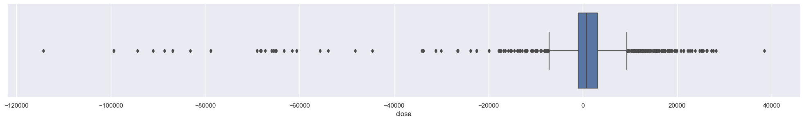
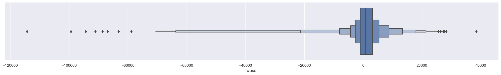
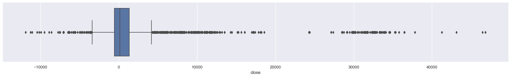
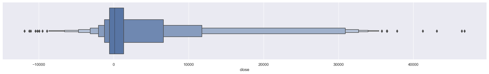

# Точка минимальных выплат по опционам. Машинное обучение. RTS и Si. Тюнинг гиперпараметров.  

## Краткое описание идеи

Исследование основано на идее того, что в современной системе бирж массово используется система контроля рисков SPAN. Причем использование системы SPAN не ограничивается использованием только биржей, эту систему используют и маркетмейкеры и брокеры. Всем кто использует систему SPAN, она помогает контролировать риски. К примеру: положительная вариационная маржа розничного торговца, как правило является риском для маркетмейкера. Именно таких рисков маркетмейкер и стремиться избежать. Другими словами, маркетмейкеру выгодно, чтобы к моменту клиринга цена была около точки минимальных выплат по купленным опционам. В тоже время маркетмейкеру выгодно, чтобы за время торговой сессии цена достаточно отклонялась от точки минимальных выплат, для реализации дельта нейтральных стратегий ("доить" дельту).

## Загрузка данных по RTS.  

Определение цели прогнозирования.


```python
TARGET = 'close'
# TARGET = 'low'
# TARGET = 'high'
```

Загрузка файла с БД по опционам. Формат файла SQLite. При запуске из Colab.


```python
# !curl -o rts_nn.db -L 'https://drive.google.com/uc?export=download&confirm=yes&id=1ML9AKyQexvic_ut2aMstI_7DQ2b6vHrv'  # Закачка файла БД, для Colab
```

Загрузка данных из БД в DF.


```python
import pandas as pd
from typing import Any
import numpy as np
import sqlite3
import matplotlib.pyplot as plt


# connection = sqlite3.connect('rts_nn.db', check_same_thread=True)  # Создание соединения с БД для Colab
connection = sqlite3.connect(r'c:\Users\Alkor\gd\data_quote_db\RTS_nn.db', check_same_thread=True)  # Создание соединения с БД для Local
with connection:
  df_all_rts = pd.read_sql('SELECT * FROM `All_opt`', connection)  # Загрузка данных из БД

print(df_all_rts.to_string(max_rows=6, max_cols=16))  # Проверка того, что загрузилось
```

           TRADEDATE    -22500    -20000    -17500    -15000    -12500    -10000     -7500  ...     15000     17500     20000     22500  zero_strike   close     low    high
    0     2015-01-05  0.728363  0.605605  0.600028  0.456538  0.454987  0.258267  0.345876  ...  0.458944  0.909248  0.768367  1.000000        72500  2100.0   -30.0  6480.0
    1     2015-01-06  0.676081  0.560392  0.555003  0.416899  0.415333  0.229272  0.311330  ...  0.484260  0.916784  0.780905  1.000000        72500   980.0 -1300.0  2110.0
    2     2015-01-08  0.548794  0.450866  0.446081  0.330494  0.329217  0.181043  0.258321  ...  0.469379  0.870850  0.757173  1.000000        72500  7480.0 -1500.0  8880.0
    ...          ...       ...       ...       ...       ...       ...       ...       ...  ...       ...       ...       ...       ...          ...     ...     ...     ...
    2009  2023-02-01  0.872061  0.857970  0.842024  0.777315  0.743621  0.669229  0.614358  ...  0.794009  0.847321  0.862301  1.000000        97500  2880.0  2370.0  3870.0
    2010  2023-02-02  1.000000  0.906813  0.869751  0.761446  0.734554  0.509508  0.356657  ...  0.672168  0.857213  0.873239  0.896630       102500 -1930.0 -2420.0  -810.0
    2011  2023-02-03  1.000000  0.915020  0.880871  0.765629  0.719663  0.501125  0.302640  ...  0.740660  0.909755  0.924095  0.945018       102500 -2400.0 -3450.0 -1520.0
    

## Очистка данных RTS.

Создание DF из колонок с фичами и целевой колонки. Проверка полученного DF на наличие ячеек с NaN.  


```python
features = '-22500 -20000 -17500 -15000 -12500 -10000 -7500 -5000 -2500 0 2500 5000 7500 10000 12500 15000 17500 20000 22500'.split()  # Создание списка признаков
df_rts = df_all_rts[['TRADEDATE'] + features + [TARGET]]
# print(df_rts.isnull().sum())  # Проверка на NaN
# print(f'\nВсего значений NaN: {df_rts.isnull().sum().sum()}')  # Всего NaN
```

Видно, что ячейки с NaN находятся рядом с нормированным к "0" страйком, значит значения NaN можно заменить на ноль.


```python
df_rts = df_rts.fillna(0)  # Замена NaN на "0"
print(f'Всего значений NaN: {df_rts.isnull().sum().sum()}')  # Всего NaN
```

    Всего значений NaN: 0
    

Данные которые анализируются, являются биржевыми, и среди значений присутствуют выбросы. Для качественного обучения, нужно исключить из обучающей выборки данные с выбросами.  
Проверка данных на выбросы графическим способом.


```python
# Box Plot
import seaborn as sns


sns.set(rc={'figure.figsize':(25,3)})
sns.boxplot(x=df_rts[TARGET])
```


    <AxesSubplot: xlabel='close'>


    

    


```python
sns.set(rc={'figure.figsize':(25,3)})
sns.boxenplot(x=df_rts[TARGET])
```


    <AxesSubplot: xlabel='close'>


    

    


Посмотрим числовые значения перцентилей:


```python
a = df_rts[TARGET]
percentile_min = int(np.percentile(a, 25) - (np.percentile(a, 75) - np.percentile(a, 25)) * 1.5)
print(f'Перцентиле min:\t{percentile_min:,}')

percentile_25 = int(np.percentile(a, 25))
print(f'Перцентиле 25:\t{percentile_25:,}')

percentile_median = int(np.median(a))
print(f'Медиана:\t{percentile_median:,}')

percentile_75 = int(np.percentile(a, 75))
print(f'Перцентиле 75:\t{percentile_75:,}')

percentile_max = int(np.percentile(a, 75) + (np.percentile(a, 75) - np.percentile(a, 25)) * 1.5)
print(f'Перцентиле max:\t{percentile_max:,}')
```

    Перцентиле min:	-7,175
    Перцентиле 25:	-972
    Медиана:	790
    Перцентиле 75:	3,162
    Перцентиле max:	9,365
    

Значения ниже ```'Перцентиле min'``` и выше ```'Перцентиле max'``` будем считать экстремальными. В такие моменты на рынке происходят неординарные события и в это время лучше не торговать. Т.к. тоговать при экстримальных значениях не буду, то и прогнозы для таких значений строить не имеет смысла. Удалю из выборки все экстримальные значения.  
Создание массивов индексов с экстремальными значениями.

Удаляем из DF строки с выбросами


```python
old_shape = df_rts.shape
print("Old Shape: ", old_shape)

df_rts = df_rts[(df_rts[TARGET] > percentile_min) & (df_rts[TARGET] < percentile_max)]  # Осекаем все строки где TARGET ниже Перцентиле min и выше Перцентиле max

new_shape = df_rts.shape
print("New Shape: ", new_shape)
print(f'Всего удалено строк: {old_shape[0]-new_shape[0]} это {100-(new_shape[0]*100/old_shape[0]):.2f}%')

```

    Old Shape:  (2012, 21)
    New Shape:  (1824, 21)
    Всего удалено строк: 188 это 9.34%
    


```python
df_rts = df_rts.set_index('TRADEDATE').sort_index(ascending=True)
df_rts
```


<div>
<style scoped>
    .dataframe tbody tr th:only-of-type {
        vertical-align: middle;
    }

    .dataframe tbody tr th {
        vertical-align: top;
    }

    .dataframe thead th {
        text-align: right;
    }
</style>
<table border="1" class="dataframe">
  <thead>
    <tr style="text-align: right;">
      <th></th>
      <th>-22500</th>
      <th>-20000</th>
      <th>-17500</th>
      <th>-15000</th>
      <th>-12500</th>
      <th>-10000</th>
      <th>-7500</th>
      <th>-5000</th>
      <th>-2500</th>
      <th>0</th>
      <th>2500</th>
      <th>5000</th>
      <th>7500</th>
      <th>10000</th>
      <th>12500</th>
      <th>15000</th>
      <th>17500</th>
      <th>20000</th>
      <th>22500</th>
      <th>close</th>
    </tr>
    <tr>
      <th>TRADEDATE</th>
      <th></th>
      <th></th>
      <th></th>
      <th></th>
      <th></th>
      <th></th>
      <th></th>
      <th></th>
      <th></th>
      <th></th>
      <th></th>
      <th></th>
      <th></th>
      <th></th>
      <th></th>
      <th></th>
      <th></th>
      <th></th>
      <th></th>
      <th></th>
    </tr>
  </thead>
  <tbody>
    <tr>
      <th>2015-01-05</th>
      <td>0.728363</td>
      <td>0.605605</td>
      <td>0.600028</td>
      <td>0.456538</td>
      <td>0.454987</td>
      <td>0.258267</td>
      <td>0.345876</td>
      <td>0.183768</td>
      <td>0.262591</td>
      <td>0.0</td>
      <td>0.284517</td>
      <td>0.170603</td>
      <td>0.359587</td>
      <td>0.260492</td>
      <td>0.504470</td>
      <td>0.458944</td>
      <td>0.909248</td>
      <td>0.768367</td>
      <td>1.000000</td>
      <td>2100.0</td>
    </tr>
    <tr>
      <th>2015-01-06</th>
      <td>0.676081</td>
      <td>0.560392</td>
      <td>0.555003</td>
      <td>0.416899</td>
      <td>0.415333</td>
      <td>0.229272</td>
      <td>0.311330</td>
      <td>0.161136</td>
      <td>0.233857</td>
      <td>0.0</td>
      <td>0.289971</td>
      <td>0.189553</td>
      <td>0.379894</td>
      <td>0.285059</td>
      <td>0.530621</td>
      <td>0.484260</td>
      <td>0.916784</td>
      <td>0.780905</td>
      <td>1.000000</td>
      <td>980.0</td>
    </tr>
    <tr>
      <th>2015-01-08</th>
      <td>0.548794</td>
      <td>0.450866</td>
      <td>0.446081</td>
      <td>0.330494</td>
      <td>0.329217</td>
      <td>0.181043</td>
      <td>0.258321</td>
      <td>0.138457</td>
      <td>0.202241</td>
      <td>0.0</td>
      <td>0.265168</td>
      <td>0.160529</td>
      <td>0.330973</td>
      <td>0.258061</td>
      <td>0.506760</td>
      <td>0.469379</td>
      <td>0.870850</td>
      <td>0.757173</td>
      <td>1.000000</td>
      <td>7480.0</td>
    </tr>
    <tr>
      <th>2015-01-09</th>
      <td>0.559924</td>
      <td>0.466296</td>
      <td>0.461580</td>
      <td>0.354638</td>
      <td>0.353160</td>
      <td>0.208631</td>
      <td>0.279128</td>
      <td>0.164433</td>
      <td>0.219659</td>
      <td>0.0</td>
      <td>0.260765</td>
      <td>0.168380</td>
      <td>0.359579</td>
      <td>0.273218</td>
      <td>0.526385</td>
      <td>0.489670</td>
      <td>0.873389</td>
      <td>0.773063</td>
      <td>1.000000</td>
      <td>5150.0</td>
    </tr>
    <tr>
      <th>2015-01-12</th>
      <td>0.610150</td>
      <td>0.516013</td>
      <td>0.511173</td>
      <td>0.397643</td>
      <td>0.395831</td>
      <td>0.251979</td>
      <td>0.318691</td>
      <td>0.172907</td>
      <td>0.224839</td>
      <td>0.0</td>
      <td>0.265984</td>
      <td>0.160885</td>
      <td>0.373722</td>
      <td>0.293259</td>
      <td>0.550495</td>
      <td>0.513607</td>
      <td>0.884952</td>
      <td>0.783246</td>
      <td>1.000000</td>
      <td>1400.0</td>
    </tr>
    <tr>
      <th>...</th>
      <td>...</td>
      <td>...</td>
      <td>...</td>
      <td>...</td>
      <td>...</td>
      <td>...</td>
      <td>...</td>
      <td>...</td>
      <td>...</td>
      <td>...</td>
      <td>...</td>
      <td>...</td>
      <td>...</td>
      <td>...</td>
      <td>...</td>
      <td>...</td>
      <td>...</td>
      <td>...</td>
      <td>...</td>
      <td>...</td>
    </tr>
    <tr>
      <th>2023-01-30</th>
      <td>0.971523</td>
      <td>0.954721</td>
      <td>0.935105</td>
      <td>0.858222</td>
      <td>0.818321</td>
      <td>0.739957</td>
      <td>0.679822</td>
      <td>0.415552</td>
      <td>0.216412</td>
      <td>0.0</td>
      <td>0.261608</td>
      <td>0.290873</td>
      <td>0.532085</td>
      <td>0.625980</td>
      <td>0.788588</td>
      <td>0.801423</td>
      <td>0.847244</td>
      <td>0.865185</td>
      <td>1.000000</td>
      <td>1360.0</td>
    </tr>
    <tr>
      <th>2023-01-31</th>
      <td>0.897380</td>
      <td>0.881991</td>
      <td>0.864575</td>
      <td>0.796357</td>
      <td>0.762014</td>
      <td>0.690502</td>
      <td>0.635054</td>
      <td>0.393539</td>
      <td>0.217968</td>
      <td>0.0</td>
      <td>0.206447</td>
      <td>0.288777</td>
      <td>0.528492</td>
      <td>0.628240</td>
      <td>0.797053</td>
      <td>0.811636</td>
      <td>0.853846</td>
      <td>0.869841</td>
      <td>1.000000</td>
      <td>2730.0</td>
    </tr>
    <tr>
      <th>2023-02-01</th>
      <td>0.872061</td>
      <td>0.857970</td>
      <td>0.842024</td>
      <td>0.777315</td>
      <td>0.743621</td>
      <td>0.669229</td>
      <td>0.614358</td>
      <td>0.375956</td>
      <td>0.215762</td>
      <td>0.0</td>
      <td>0.291723</td>
      <td>0.270914</td>
      <td>0.502344</td>
      <td>0.609511</td>
      <td>0.777689</td>
      <td>0.794009</td>
      <td>0.847321</td>
      <td>0.862301</td>
      <td>1.000000</td>
      <td>2880.0</td>
    </tr>
    <tr>
      <th>2023-02-02</th>
      <td>1.000000</td>
      <td>0.906813</td>
      <td>0.869751</td>
      <td>0.761446</td>
      <td>0.734554</td>
      <td>0.509508</td>
      <td>0.356657</td>
      <td>0.127674</td>
      <td>0.131308</td>
      <td>0.0</td>
      <td>0.208113</td>
      <td>0.290636</td>
      <td>0.560918</td>
      <td>0.572594</td>
      <td>0.652131</td>
      <td>0.672168</td>
      <td>0.857213</td>
      <td>0.873239</td>
      <td>0.896630</td>
      <td>-1930.0</td>
    </tr>
    <tr>
      <th>2023-02-03</th>
      <td>1.000000</td>
      <td>0.915020</td>
      <td>0.880871</td>
      <td>0.765629</td>
      <td>0.719663</td>
      <td>0.501125</td>
      <td>0.302640</td>
      <td>0.024736</td>
      <td>0.078355</td>
      <td>0.0</td>
      <td>0.248547</td>
      <td>0.353640</td>
      <td>0.616837</td>
      <td>0.639819</td>
      <td>0.720914</td>
      <td>0.740660</td>
      <td>0.909755</td>
      <td>0.924095</td>
      <td>0.945018</td>
      <td>-2400.0</td>
    </tr>
  </tbody>
</table>
<p>1824 rows × 20 columns</p>
</div>


## Загрузка данных по Si.  


```python
connection = sqlite3.connect(r'c:\Users\Alkor\gd\data_quote_db\Si_nn.db', check_same_thread=True)  # Создание соединения с БД для Local
with connection:
  df_all_si = pd.read_sql('SELECT * FROM `All_opt`', connection)  # Загрузка данных из БД

print(df_all_si.to_string(max_rows=6, max_cols=16))  # Проверка того, что загрузилось
```

           TRADEDATE     -2250     -2000     -1750     -1500     -1250     -1000      -750  ...      1500      1750      2000      2250  zero_strike    close      low     high
    0     2015-01-05  0.006252  0.006252  0.006252  0.006252  0.000000  0.000000  0.000000  ...  0.717323  0.708655  0.708655  0.708655        34000  27101.0  22424.0  27483.0
    1     2015-01-06  0.005575  0.005575  0.005575  0.005575  0.000000  0.000000  0.000000  ...  0.712768  0.705039  0.705039  0.705039        34000  30464.0  27076.0  31850.0
    2     2015-01-08  0.006267  0.006267  0.006267  0.006267  0.000000  0.000000  0.000000  ...  0.716860  0.708279  0.708279  0.708279        34000  27380.0  27000.0  31708.0
    ...          ...       ...       ...       ...       ...       ...       ...       ...  ...       ...       ...       ...       ...          ...      ...      ...      ...
    2028  2023-02-01  0.248309  0.243750  0.265086  0.219328  0.226498  0.213476  0.247006  ...  0.847069  0.887480  0.876657  1.000000        69750    968.0    755.0   1353.0
    2029  2023-02-02  0.223494  0.221501  0.244221  0.211682  0.215144  0.206349  0.238279  ...  0.888791  0.926829  0.921303  1.000000        69750   1364.0    633.0   1437.0
    2030  2023-02-03  0.225137  0.223231  0.244591  0.207209  0.210694  0.200653  0.231397  ...  0.840861  0.894466  0.886287  1.000000        69750   1570.0   1027.0   1813.0
    

## Очистка данных Si.

Создание DF из колонок с фичами и целевой колонки. Проверка полученного DF на наличие ячеек с NaN.  


```python
features = '-2250 -2000 -1750 -1500 -1250 -1000 -750 -500 -250 0 250 500 750 1000 1250 1500 1750 2000 2250'.split()  # Создание списка признаков
df_si = df_all_si[['TRADEDATE'] + features + [TARGET]]
# print(df_rts.isnull().sum())  # Проверка на NaN
# print(f'\nВсего значений NaN: {df_rts.isnull().sum().sum()}')  # Всего NaN

df_si = df_si.fillna(0)  # Замена NaN на "0"
print(f'Всего значений NaN: {df_si.isnull().sum().sum()}')  # Всего NaN
```

    Всего значений NaN: 0
    

Данные которые анализируются, являются биржевыми, и среди значений присутствуют выбросы. Для качественного обучения, нужно исключить из обучающей выборки данные с выбросами.  
Проверка данных на выбросы графическим способом.


```python
sns.set(rc={'figure.figsize':(25,3)})
sns.boxplot(x=df_si[TARGET])
```


    <AxesSubplot: xlabel='close'>


    

    


```python
sns.set(rc={'figure.figsize':(25,3)})
sns.boxenplot(x=df_si[TARGET])
```


    <AxesSubplot: xlabel='close'>


    

    


```python
a = df_si[TARGET]
percentile_min = int(np.percentile(a, 25) - (np.percentile(a, 75) - np.percentile(a, 25)) * 1.5)
print(f'Перцентиле min:\t{percentile_min:,}')

percentile_25 = int(np.percentile(a, 25))
print(f'Перцентиле 25:\t{percentile_25:,}')

percentile_median = int(np.median(a))
print(f'Медиана:\t{percentile_median:,}')

percentile_75 = int(np.percentile(a, 75))
print(f'Перцентиле 75:\t{percentile_75:,}')

percentile_max = int(np.percentile(a, 75) + (np.percentile(a, 75) - np.percentile(a, 25)) * 1.5)
print(f'Перцентиле max:\t{percentile_max:,}')
```

    Перцентиле min:	-3,410
    Перцентиле 25:	-555
    Медиана:	129
    Перцентиле 75:	1,347
    Перцентиле max:	4,202
    

Перцентиле max и min выходят за границы сохранения истории в базу данных, поэтому буду отсекать данные когда TARGET будет ниже -2250 и выше 2250.  


```python
old_shape = df_si.shape
print("Old Shape: ", old_shape)

df_si = df_si[(df_si[TARGET] > -2250) & (df_si[TARGET] < 2250)]  # Осекаем все строки где TARGET ниже -2250 и выше 2250 

new_shape = df_si.shape
print("New Shape: ", new_shape)
print(f'Всего удалено строк: {old_shape[0]-new_shape[0]} это {100-(new_shape[0]*100/old_shape[0]):.2f}%')
```

    Old Shape:  (2031, 21)
    New Shape:  (1530, 21)
    Всего удалено строк: 501 это 24.67%
    


```python
df_si = df_si.set_index('TRADEDATE').sort_index(ascending=True)  # TRADEDATE в индекс
df_si['close'] = df_si.apply(lambda x: (x['close'] - (-2250)) / (2250 - (-2250)), axis=1)  # Нормализация close
df_si
```


<div>
<style scoped>
    .dataframe tbody tr th:only-of-type {
        vertical-align: middle;
    }

    .dataframe tbody tr th {
        vertical-align: top;
    }

    .dataframe thead th {
        text-align: right;
    }
</style>
<table border="1" class="dataframe">
  <thead>
    <tr style="text-align: right;">
      <th></th>
      <th>-2250</th>
      <th>-2000</th>
      <th>-1750</th>
      <th>-1500</th>
      <th>-1250</th>
      <th>-1000</th>
      <th>-750</th>
      <th>-500</th>
      <th>-250</th>
      <th>0</th>
      <th>250</th>
      <th>500</th>
      <th>750</th>
      <th>1000</th>
      <th>1250</th>
      <th>1500</th>
      <th>1750</th>
      <th>2000</th>
      <th>2250</th>
      <th>close</th>
    </tr>
    <tr>
      <th>TRADEDATE</th>
      <th></th>
      <th></th>
      <th></th>
      <th></th>
      <th></th>
      <th></th>
      <th></th>
      <th></th>
      <th></th>
      <th></th>
      <th></th>
      <th></th>
      <th></th>
      <th></th>
      <th></th>
      <th></th>
      <th></th>
      <th></th>
      <th></th>
      <th></th>
    </tr>
  </thead>
  <tbody>
    <tr>
      <th>2015-03-16</th>
      <td>0.603576</td>
      <td>0.381278</td>
      <td>0.476056</td>
      <td>0.330553</td>
      <td>0.330683</td>
      <td>0.126419</td>
      <td>0.345037</td>
      <td>0.166701</td>
      <td>0.446073</td>
      <td>0.0</td>
      <td>0.348355</td>
      <td>0.110739</td>
      <td>0.505375</td>
      <td>0.069088</td>
      <td>1.000000</td>
      <td>0.065738</td>
      <td>0.180944</td>
      <td>0.111498</td>
      <td>0.457071</td>
      <td>0.695778</td>
    </tr>
    <tr>
      <th>2015-03-17</th>
      <td>0.746421</td>
      <td>0.434423</td>
      <td>0.536031</td>
      <td>0.372069</td>
      <td>0.372200</td>
      <td>0.149309</td>
      <td>0.375065</td>
      <td>0.193380</td>
      <td>0.474789</td>
      <td>0.0</td>
      <td>0.375718</td>
      <td>0.054796</td>
      <td>0.519556</td>
      <td>0.024040</td>
      <td>1.000000</td>
      <td>0.016313</td>
      <td>0.152803</td>
      <td>0.079169</td>
      <td>0.442136</td>
      <td>0.540889</td>
    </tr>
    <tr>
      <th>2015-03-18</th>
      <td>0.888630</td>
      <td>0.718180</td>
      <td>0.711229</td>
      <td>0.383300</td>
      <td>0.466807</td>
      <td>0.268389</td>
      <td>0.268396</td>
      <td>0.058375</td>
      <td>0.242837</td>
      <td>0.0</td>
      <td>0.437042</td>
      <td>0.036333</td>
      <td>0.590882</td>
      <td>0.219544</td>
      <td>0.566882</td>
      <td>0.149613</td>
      <td>1.000000</td>
      <td>0.168578</td>
      <td>0.317898</td>
      <td>0.527333</td>
    </tr>
    <tr>
      <th>2015-03-27</th>
      <td>0.863580</td>
      <td>0.501232</td>
      <td>0.733256</td>
      <td>0.324915</td>
      <td>0.624192</td>
      <td>0.338288</td>
      <td>1.000000</td>
      <td>0.347224</td>
      <td>0.792084</td>
      <td>0.0</td>
      <td>0.937943</td>
      <td>0.352234</td>
      <td>0.720247</td>
      <td>0.205019</td>
      <td>0.831269</td>
      <td>0.203600</td>
      <td>0.749241</td>
      <td>0.412898</td>
      <td>0.983809</td>
      <td>0.200222</td>
    </tr>
    <tr>
      <th>2015-03-30</th>
      <td>0.743866</td>
      <td>0.363651</td>
      <td>0.594337</td>
      <td>0.183044</td>
      <td>0.596420</td>
      <td>0.279794</td>
      <td>1.000000</td>
      <td>0.336466</td>
      <td>0.793032</td>
      <td>0.0</td>
      <td>0.980362</td>
      <td>0.394545</td>
      <td>0.772158</td>
      <td>0.256317</td>
      <td>0.828528</td>
      <td>0.200448</td>
      <td>0.725619</td>
      <td>0.388878</td>
      <td>0.978509</td>
      <td>0.222000</td>
    </tr>
    <tr>
      <th>...</th>
      <td>...</td>
      <td>...</td>
      <td>...</td>
      <td>...</td>
      <td>...</td>
      <td>...</td>
      <td>...</td>
      <td>...</td>
      <td>...</td>
      <td>...</td>
      <td>...</td>
      <td>...</td>
      <td>...</td>
      <td>...</td>
      <td>...</td>
      <td>...</td>
      <td>...</td>
      <td>...</td>
      <td>...</td>
      <td>...</td>
    </tr>
    <tr>
      <th>2023-01-30</th>
      <td>0.227968</td>
      <td>0.223713</td>
      <td>0.246568</td>
      <td>0.205503</td>
      <td>0.213237</td>
      <td>0.202561</td>
      <td>0.238101</td>
      <td>0.006181</td>
      <td>0.022079</td>
      <td>0.0</td>
      <td>0.764113</td>
      <td>0.681324</td>
      <td>0.771188</td>
      <td>0.784279</td>
      <td>0.949541</td>
      <td>0.926370</td>
      <td>0.941946</td>
      <td>0.939625</td>
      <td>1.000000</td>
      <td>0.782000</td>
    </tr>
    <tr>
      <th>2023-01-31</th>
      <td>0.240886</td>
      <td>0.236401</td>
      <td>0.257834</td>
      <td>0.216665</td>
      <td>0.224037</td>
      <td>0.212242</td>
      <td>0.246168</td>
      <td>0.014503</td>
      <td>0.030298</td>
      <td>0.0</td>
      <td>0.743574</td>
      <td>0.610996</td>
      <td>0.698194</td>
      <td>0.701239</td>
      <td>0.904323</td>
      <td>0.847249</td>
      <td>0.904409</td>
      <td>0.892732</td>
      <td>1.000000</td>
      <td>0.746667</td>
    </tr>
    <tr>
      <th>2023-02-01</th>
      <td>0.248309</td>
      <td>0.243750</td>
      <td>0.265086</td>
      <td>0.219328</td>
      <td>0.226498</td>
      <td>0.213476</td>
      <td>0.247006</td>
      <td>0.016087</td>
      <td>0.031563</td>
      <td>0.0</td>
      <td>0.729160</td>
      <td>0.581014</td>
      <td>0.666458</td>
      <td>0.634676</td>
      <td>0.904736</td>
      <td>0.847069</td>
      <td>0.887480</td>
      <td>0.876657</td>
      <td>1.000000</td>
      <td>0.715111</td>
    </tr>
    <tr>
      <th>2023-02-02</th>
      <td>0.223494</td>
      <td>0.221501</td>
      <td>0.244221</td>
      <td>0.211682</td>
      <td>0.215144</td>
      <td>0.206349</td>
      <td>0.238279</td>
      <td>0.010355</td>
      <td>0.017890</td>
      <td>0.0</td>
      <td>0.742361</td>
      <td>0.645912</td>
      <td>0.719262</td>
      <td>0.737644</td>
      <td>0.919830</td>
      <td>0.888791</td>
      <td>0.926829</td>
      <td>0.921303</td>
      <td>1.000000</td>
      <td>0.803111</td>
    </tr>
    <tr>
      <th>2023-02-03</th>
      <td>0.225137</td>
      <td>0.223231</td>
      <td>0.244591</td>
      <td>0.207209</td>
      <td>0.210694</td>
      <td>0.200653</td>
      <td>0.231397</td>
      <td>0.011082</td>
      <td>0.018189</td>
      <td>0.0</td>
      <td>0.724428</td>
      <td>0.618447</td>
      <td>0.688047</td>
      <td>0.698947</td>
      <td>0.881952</td>
      <td>0.840861</td>
      <td>0.894466</td>
      <td>0.886287</td>
      <td>1.000000</td>
      <td>0.848889</td>
    </tr>
  </tbody>
</table>
<p>1530 rows × 20 columns</p>
</div>


## Обработка (слияние) RTS и Si.  


```python
df = pd.merge(df_si, df_rts, left_index=True, right_index=True)
df
```


<div>
<style scoped>
    .dataframe tbody tr th:only-of-type {
        vertical-align: middle;
    }

    .dataframe tbody tr th {
        vertical-align: top;
    }

    .dataframe thead th {
        text-align: right;
    }
</style>
<table border="1" class="dataframe">
  <thead>
    <tr style="text-align: right;">
      <th></th>
      <th>-2250</th>
      <th>-2000</th>
      <th>-1750</th>
      <th>-1500</th>
      <th>-1250</th>
      <th>-1000</th>
      <th>-750</th>
      <th>-500</th>
      <th>-250</th>
      <th>0_x</th>
      <th>...</th>
      <th>2500</th>
      <th>5000</th>
      <th>7500</th>
      <th>10000</th>
      <th>12500</th>
      <th>15000</th>
      <th>17500</th>
      <th>20000</th>
      <th>22500</th>
      <th>close_y</th>
    </tr>
    <tr>
      <th>TRADEDATE</th>
      <th></th>
      <th></th>
      <th></th>
      <th></th>
      <th></th>
      <th></th>
      <th></th>
      <th></th>
      <th></th>
      <th></th>
      <th></th>
      <th></th>
      <th></th>
      <th></th>
      <th></th>
      <th></th>
      <th></th>
      <th></th>
      <th></th>
      <th></th>
      <th></th>
    </tr>
  </thead>
  <tbody>
    <tr>
      <th>2015-03-16</th>
      <td>0.603576</td>
      <td>0.381278</td>
      <td>0.476056</td>
      <td>0.330553</td>
      <td>0.330683</td>
      <td>0.126419</td>
      <td>0.345037</td>
      <td>0.166701</td>
      <td>0.446073</td>
      <td>0.0</td>
      <td>...</td>
      <td>0.100503</td>
      <td>0.057867</td>
      <td>0.348518</td>
      <td>0.319443</td>
      <td>0.585120</td>
      <td>0.601947</td>
      <td>0.903402</td>
      <td>0.903402</td>
      <td>0.943478</td>
      <td>-2740.0</td>
    </tr>
    <tr>
      <th>2015-03-17</th>
      <td>0.746421</td>
      <td>0.434423</td>
      <td>0.536031</td>
      <td>0.372069</td>
      <td>0.372200</td>
      <td>0.149309</td>
      <td>0.375065</td>
      <td>0.193380</td>
      <td>0.474789</td>
      <td>0.0</td>
      <td>...</td>
      <td>0.166883</td>
      <td>0.169175</td>
      <td>0.418729</td>
      <td>0.408041</td>
      <td>0.659352</td>
      <td>0.670472</td>
      <td>0.910694</td>
      <td>0.910694</td>
      <td>0.947628</td>
      <td>-1680.0</td>
    </tr>
    <tr>
      <th>2015-03-18</th>
      <td>0.888630</td>
      <td>0.718180</td>
      <td>0.711229</td>
      <td>0.383300</td>
      <td>0.466807</td>
      <td>0.268389</td>
      <td>0.268396</td>
      <td>0.058375</td>
      <td>0.242837</td>
      <td>0.0</td>
      <td>...</td>
      <td>0.173836</td>
      <td>0.177210</td>
      <td>0.435027</td>
      <td>0.441385</td>
      <td>0.668314</td>
      <td>0.682677</td>
      <td>0.920911</td>
      <td>0.920911</td>
      <td>0.954471</td>
      <td>-170.0</td>
    </tr>
    <tr>
      <th>2015-03-27</th>
      <td>0.863580</td>
      <td>0.501232</td>
      <td>0.733256</td>
      <td>0.324915</td>
      <td>0.624192</td>
      <td>0.338288</td>
      <td>1.000000</td>
      <td>0.347224</td>
      <td>0.792084</td>
      <td>0.0</td>
      <td>...</td>
      <td>0.192339</td>
      <td>0.070976</td>
      <td>0.318036</td>
      <td>0.382801</td>
      <td>0.625691</td>
      <td>0.649860</td>
      <td>0.886448</td>
      <td>0.883100</td>
      <td>0.920936</td>
      <td>2130.0</td>
    </tr>
    <tr>
      <th>2015-03-30</th>
      <td>0.743866</td>
      <td>0.363651</td>
      <td>0.594337</td>
      <td>0.183044</td>
      <td>0.596420</td>
      <td>0.279794</td>
      <td>1.000000</td>
      <td>0.336466</td>
      <td>0.793032</td>
      <td>0.0</td>
      <td>...</td>
      <td>0.191475</td>
      <td>0.071010</td>
      <td>0.324585</td>
      <td>0.386958</td>
      <td>0.635840</td>
      <td>0.659406</td>
      <td>0.903895</td>
      <td>0.900765</td>
      <td>0.939168</td>
      <td>3980.0</td>
    </tr>
    <tr>
      <th>...</th>
      <td>...</td>
      <td>...</td>
      <td>...</td>
      <td>...</td>
      <td>...</td>
      <td>...</td>
      <td>...</td>
      <td>...</td>
      <td>...</td>
      <td>...</td>
      <td>...</td>
      <td>...</td>
      <td>...</td>
      <td>...</td>
      <td>...</td>
      <td>...</td>
      <td>...</td>
      <td>...</td>
      <td>...</td>
      <td>...</td>
      <td>...</td>
    </tr>
    <tr>
      <th>2023-01-30</th>
      <td>0.227968</td>
      <td>0.223713</td>
      <td>0.246568</td>
      <td>0.205503</td>
      <td>0.213237</td>
      <td>0.202561</td>
      <td>0.238101</td>
      <td>0.006181</td>
      <td>0.022079</td>
      <td>0.0</td>
      <td>...</td>
      <td>0.261608</td>
      <td>0.290873</td>
      <td>0.532085</td>
      <td>0.625980</td>
      <td>0.788588</td>
      <td>0.801423</td>
      <td>0.847244</td>
      <td>0.865185</td>
      <td>1.000000</td>
      <td>1360.0</td>
    </tr>
    <tr>
      <th>2023-01-31</th>
      <td>0.240886</td>
      <td>0.236401</td>
      <td>0.257834</td>
      <td>0.216665</td>
      <td>0.224037</td>
      <td>0.212242</td>
      <td>0.246168</td>
      <td>0.014503</td>
      <td>0.030298</td>
      <td>0.0</td>
      <td>...</td>
      <td>0.206447</td>
      <td>0.288777</td>
      <td>0.528492</td>
      <td>0.628240</td>
      <td>0.797053</td>
      <td>0.811636</td>
      <td>0.853846</td>
      <td>0.869841</td>
      <td>1.000000</td>
      <td>2730.0</td>
    </tr>
    <tr>
      <th>2023-02-01</th>
      <td>0.248309</td>
      <td>0.243750</td>
      <td>0.265086</td>
      <td>0.219328</td>
      <td>0.226498</td>
      <td>0.213476</td>
      <td>0.247006</td>
      <td>0.016087</td>
      <td>0.031563</td>
      <td>0.0</td>
      <td>...</td>
      <td>0.291723</td>
      <td>0.270914</td>
      <td>0.502344</td>
      <td>0.609511</td>
      <td>0.777689</td>
      <td>0.794009</td>
      <td>0.847321</td>
      <td>0.862301</td>
      <td>1.000000</td>
      <td>2880.0</td>
    </tr>
    <tr>
      <th>2023-02-02</th>
      <td>0.223494</td>
      <td>0.221501</td>
      <td>0.244221</td>
      <td>0.211682</td>
      <td>0.215144</td>
      <td>0.206349</td>
      <td>0.238279</td>
      <td>0.010355</td>
      <td>0.017890</td>
      <td>0.0</td>
      <td>...</td>
      <td>0.208113</td>
      <td>0.290636</td>
      <td>0.560918</td>
      <td>0.572594</td>
      <td>0.652131</td>
      <td>0.672168</td>
      <td>0.857213</td>
      <td>0.873239</td>
      <td>0.896630</td>
      <td>-1930.0</td>
    </tr>
    <tr>
      <th>2023-02-03</th>
      <td>0.225137</td>
      <td>0.223231</td>
      <td>0.244591</td>
      <td>0.207209</td>
      <td>0.210694</td>
      <td>0.200653</td>
      <td>0.231397</td>
      <td>0.011082</td>
      <td>0.018189</td>
      <td>0.0</td>
      <td>...</td>
      <td>0.248547</td>
      <td>0.353640</td>
      <td>0.616837</td>
      <td>0.639819</td>
      <td>0.720914</td>
      <td>0.740660</td>
      <td>0.909755</td>
      <td>0.924095</td>
      <td>0.945018</td>
      <td>-2400.0</td>
    </tr>
  </tbody>
</table>
<p>1422 rows × 40 columns</p>
</div>


```python
print(df.shape)
```

    (1422, 40)
    

## Разделение данных на обучающую и тестовую выборку.

Просмотр текущего Dataframe


```python
print(df.to_string(max_rows=6, max_cols=16))  # Просмотр DF
```

                   -2250     -2000     -1750     -1500     -1250     -1000      -750      -500  ...      7500     10000     12500     15000     17500     20000     22500  close_y
    TRADEDATE                                                                                   ...                                                                               
    2015-03-16  0.603576  0.381278  0.476056  0.330553  0.330683  0.126419  0.345037  0.166701  ...  0.348518  0.319443  0.585120  0.601947  0.903402  0.903402  0.943478  -2740.0
    2015-03-17  0.746421  0.434423  0.536031  0.372069  0.372200  0.149309  0.375065  0.193380  ...  0.418729  0.408041  0.659352  0.670472  0.910694  0.910694  0.947628  -1680.0
    2015-03-18  0.888630  0.718180  0.711229  0.383300  0.466807  0.268389  0.268396  0.058375  ...  0.435027  0.441385  0.668314  0.682677  0.920911  0.920911  0.954471   -170.0
    ...              ...       ...       ...       ...       ...       ...       ...       ...  ...       ...       ...       ...       ...       ...       ...       ...      ...
    2023-02-01  0.248309  0.243750  0.265086  0.219328  0.226498  0.213476  0.247006  0.016087  ...  0.502344  0.609511  0.777689  0.794009  0.847321  0.862301  1.000000   2880.0
    2023-02-02  0.223494  0.221501  0.244221  0.211682  0.215144  0.206349  0.238279  0.010355  ...  0.560918  0.572594  0.652131  0.672168  0.857213  0.873239  0.896630  -1930.0
    2023-02-03  0.225137  0.223231  0.244591  0.207209  0.210694  0.200653  0.231397  0.011082  ...  0.616837  0.639819  0.720914  0.740660  0.909755  0.924095  0.945018  -2400.0
    

Датафрейм преобразуем в массив. Массивы - это формат данных, который может обрабатывать Keras.


```python
dataset = df.values  # Datframe преобразуем в Dataset
dataset = dataset.astype(np.float32)  # Смена типа для корректой работы Keras

X = dataset[:,0:39]  # Все, что стоит перед запятой, относится к строкам массива, а все, что стоит после запятой, относится к столбцам массивов.
y = dataset[:,39]
```

Теперь мы перешли к последнему этапу обработки данных, который заключается в разделении нашего набора данных на обучающий набор, набор проверки и набор тестов.  
Мы будем использовать код из scikit-learn под названием "train_test_split", который, как следует из названия, разбивает наш набор данных на обучающий и тестовый наборы. Сначала мы импортируем необходимый нам код:


```python
from sklearn.model_selection import train_test_split
```

Затем разделите свой набор данных следующим образом:  
Это говорит scikit-learn, что ваш размер test будет составлять 15% от общего набора данных. Код сохранит разделенные данные в первые четыре переменные слева от знака равенства, как следует из имен переменных.


```python
X_train, X_test, y_train, y_test = train_test_split(X, y, test_size=0.15, random_state=3, shuffle=True)
```

## Задаем функцию создания нейронной сети


```python
from sklearn.metrics import mean_absolute_error
from sklearn.metrics import r2_score
from keras.callbacks import EarlyStopping, ModelCheckpoint
from keras.models import load_model
from keras.models import Sequential
from keras.layers import Dense, Dropout, BatchNormalization
from keras_tuner.tuners import RandomSearch, Hyperband, BayesianOptimization
import tensorflow as tf
import keras_tuner
from tensorflow import keras

tf.random.set_seed(9)

def build_model(hp):
    model = Sequential()
    model.add(Dense(512, activation='relu', input_shape=(X_train.shape[1],)))
    model.add(BatchNormalization())
    # model.add(Dropout(units=hp.Int('units_input', min_value=0.1, max_value=0.3, step=0.1)))
    model.add(Dropout(0.2))

    for i in range(hp.Int('num_layers', 1, 5)):
        Dense(units=hp.Int(f'units_{i}', min_value=128, max_value=1024, step=128), activation='relu')
        model.add(BatchNormalization())
        if hp.Boolean('dropout'):
            model.add(Dropout(0.1))

    # model.add(Dense(units=hp.Int('units_input', min_value=128, max_value=1024, step=128), activation='relu'))   
    # model.add(BatchNormalization())
    # model.add(Dropout(0.1))

    # model.add(Dense(units=hp.Int('units_input', min_value=128, max_value=1024, step=128), activation='relu'))   
    # # model.add(Dense(512, activation='relu'))
    # model.add(BatchNormalization())
    # model.add(Dropout(0.1))

    # model.add(Dense(units=hp.Int('units_input', min_value=128, max_value=1024, step=128), activation='relu'))   
    # # model.add(Dense(512, activation='relu'))
    # model.add(BatchNormalization())
    # model.add(Dropout(0.1))

    model.add(Dense(1))

    # model.compile(optimizer='adam', loss='mse', metrics=['mae'])
    model.compile(optimizer='adam', loss='mse', metrics=['mae'])
    # model.compile(loss='mse')
    return model
```


```python
# tuner = keras_tuner.Hyperband(
tuner = keras_tuner.RandomSearch(
    build_model,                 # функция создания модели
    objective=keras_tuner.Objective('val_loss', direction="min"),
    # max_epochs=5000,
    max_trials=50,                # максимальное количество запусков обучения 
    overwrite=True,
    directory='test_directory'   # каталог, куда сохраняются обученные сети  
    )

```

Функция обратного вызова ранней остановки


```python
es = EarlyStopping(
            monitor='val_loss',
            mode='min',
            patience=2000,
            verbose=0
        )
```

## Запускаем подбор гиперпараметров


```python
tuner.search_space_summary()
```

    Search space summary
    Default search space size: 3
    num_layers (Int)
    {'default': None, 'conditions': [], 'min_value': 1, 'max_value': 5, 'step': 1, 'sampling': 'linear'}
    units_0 (Int)
    {'default': None, 'conditions': [], 'min_value': 128, 'max_value': 1024, 'step': 128, 'sampling': 'linear'}
    dropout (Boolean)
    {'default': False, 'conditions': []}
    

Подбор гиперпараметров


```python
tuner.search(X_train,                  # Данные для обучения
             y_train,                  # Правильные ответы
             batch_size=1312,           # Размер мини-выборки
             epochs=5000,                # Количество эпох обучения 
             callbacks=[es],
             validation_split=0.15,     # Часть данных, которая будет использоваться для проверки
             )
```

    Trial 50 Complete [00h 05m 15s]
    val_loss: 3222062.75
    
    Best val_loss So Far: 2853163.5
    Total elapsed time: 04h 26m 28s
    INFO:tensorflow:Oracle triggered exit
    

## Выбираем лучшую модель


```python
tuner.results_summary()
```

    Results summary
    Results in test_directory\untitled_project
    Showing 10 best trials
    <keras_tuner.engine.objective.Objective object at 0x000001492851F700>
    Trial summary
    Hyperparameters:
    num_layers: 2
    units_0: 384
    dropout: True
    units_1: 384
    units_2: 768
    units_3: 1024
    units_4: 768
    Score: 2853163.5
    Trial summary
    Hyperparameters:
    num_layers: 2
    units_0: 640
    dropout: True
    units_1: 1024
    units_2: 256
    units_3: 512
    units_4: 640
    Score: 2892307.75
    Trial summary
    Hyperparameters:
    num_layers: 1
    units_0: 384
    dropout: True
    units_1: 896
    units_2: 896
    units_3: 896
    Score: 2943202.0
    Trial summary
    Hyperparameters:
    num_layers: 2
    units_0: 1024
    dropout: True
    units_1: 768
    units_2: 256
    units_3: 640
    units_4: 896
    Score: 2981794.0
    Trial summary
    Hyperparameters:
    num_layers: 2
    units_0: 128
    dropout: True
    units_1: 768
    units_2: 768
    units_3: 512
    Score: 3008746.25
    Trial summary
    Hyperparameters:
    num_layers: 1
    units_0: 640
    dropout: False
    units_1: 896
    units_2: 768
    units_3: 1024
    units_4: 768
    Score: 3024740.25
    Trial summary
    Hyperparameters:
    num_layers: 3
    units_0: 256
    dropout: False
    units_1: 640
    units_2: 1024
    units_3: 768
    units_4: 384
    Score: 3048656.5
    Trial summary
    Hyperparameters:
    num_layers: 1
    units_0: 640
    dropout: True
    units_1: 896
    units_2: 896
    units_3: 1024
    units_4: 128
    Score: 3061177.25
    Trial summary
    Hyperparameters:
    num_layers: 3
    units_0: 1024
    dropout: True
    units_1: 1024
    units_2: 128
    units_3: 384
    units_4: 1024
    Score: 3061217.75
    Trial summary
    Hyperparameters:
    num_layers: 2
    units_0: 512
    dropout: False
    units_1: 512
    units_2: 512
    units_3: 1024
    Score: 3071561.75
    

Получаем три лучших модели


```python
models = tuner.get_best_models(num_models=3)
```

Оцениваем качество модели на тестовых данных


```python
for model in models:
  model.summary()
  model.evaluate(X_test, y_test)
  print() 
```

    Model: "sequential"
    _________________________________________________________________
     Layer (type)                Output Shape              Param #   
    =================================================================
     dense (Dense)               (None, 512)               20480     
                                                                     
     batch_normalization (BatchN  (None, 512)              2048      
     ormalization)                                                   
                                                                     
     dropout (Dropout)           (None, 512)               0         
                                                                     
     batch_normalization_1 (Batc  (None, 512)              2048      
     hNormalization)                                                 
                                                                     
     dropout_1 (Dropout)         (None, 512)               0         
                                                                     
     batch_normalization_2 (Batc  (None, 512)              2048      
     hNormalization)                                                 
                                                                     
     dropout_2 (Dropout)         (None, 512)               0         
                                                                     
     dense_3 (Dense)             (None, 1)                 513       
                                                                     
    =================================================================
    Total params: 27,137
    Trainable params: 24,065
    Non-trainable params: 3,072
    _________________________________________________________________
    7/7 [==============================] - 0s 1ms/step - loss: 3721093.0000 - mae: 1282.3070
    
    Model: "sequential"
    _________________________________________________________________
     Layer (type)                Output Shape              Param #   
    =================================================================
     dense (Dense)               (None, 512)               20480     
                                                                     
     batch_normalization (BatchN  (None, 512)              2048      
     ormalization)                                                   
                                                                     
     dropout (Dropout)           (None, 512)               0         
                                                                     
     batch_normalization_1 (Batc  (None, 512)              2048      
     hNormalization)                                                 
                                                                     
     dropout_1 (Dropout)         (None, 512)               0         
                                                                     
     batch_normalization_2 (Batc  (None, 512)              2048      
     hNormalization)                                                 
                                                                     
     dropout_2 (Dropout)         (None, 512)               0         
                                                                     
     dense_3 (Dense)             (None, 1)                 513       
                                                                     
    =================================================================
    Total params: 27,137
    Trainable params: 24,065
    Non-trainable params: 3,072
    _________________________________________________________________
    7/7 [==============================] - 0s 1ms/step - loss: 3471183.7500 - mae: 1284.9946
    
    Model: "sequential"
    _________________________________________________________________
     Layer (type)                Output Shape              Param #   
    =================================================================
     dense (Dense)               (None, 512)               20480     
                                                                     
     batch_normalization (BatchN  (None, 512)              2048      
     ormalization)                                                   
                                                                     
     dropout (Dropout)           (None, 512)               0         
                                                                     
     batch_normalization_1 (Batc  (None, 512)              2048      
     hNormalization)                                                 
                                                                     
     dropout_1 (Dropout)         (None, 512)               0         
                                                                     
     dense_2 (Dense)             (None, 1)                 513       
                                                                     
    =================================================================
    Total params: 25,089
    Trainable params: 23,041
    Non-trainable params: 2,048
    _________________________________________________________________
    7/7 [==============================] - 0s 1ms/step - loss: 3180235.0000 - mae: 1241.5006
    
    
