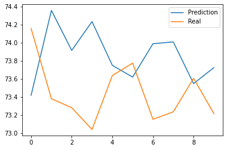

# Модель предсказания курса валюты


```python
import pandas
dataframe = pandas.read_excel('usd_rate.xlsx')  # Файл с сайта ЦБ https://cbr.ru/currency_base/
dataframe.head(3)  # Смотрю название колонок, чтобы выбрать нужное название для дальнейшей работы
```


<div>
<style scoped>
    .dataframe tbody tr th:only-of-type {
        vertical-align: middle;
    }

    .dataframe tbody tr th {
        vertical-align: top;
    }

    .dataframe thead th {
        text-align: right;
    }
</style>
<table border="1" class="dataframe">
  <thead>
    <tr style="text-align: right;">
      <th></th>
      <th>nominal</th>
      <th>data</th>
      <th>curs</th>
      <th>cdx</th>
    </tr>
  </thead>
  <tbody>
    <tr>
      <th>0</th>
      <td>1</td>
      <td>2017-01-10</td>
      <td>59.8961</td>
      <td>Доллар США</td>
    </tr>
    <tr>
      <th>1</th>
      <td>1</td>
      <td>2017-01-11</td>
      <td>59.9533</td>
      <td>Доллар США</td>
    </tr>
    <tr>
      <th>2</th>
      <td>1</td>
      <td>2017-01-12</td>
      <td>60.1614</td>
      <td>Доллар США</td>
    </tr>
  </tbody>
</table>
</div>


```python
rate = dataframe.curs
rate.head(3)  # Проверка, что все идет нормально
```


    0    59.8961
    1    59.9533
    2    60.1614
    Name: curs, dtype: float64


```python
rate.plot()
```


    <matplotlib.axes._subplots.AxesSubplot at 0x150d93b63a0>


    

    


```python
past = 28  # Для обучения будем брать данные за 4 недеди из прошлого
# Будем пытаться на их основе спрогнозировать курс на завтра
length = len(rate)  # Всего дней с данными
count = length - past  # Всего выборка для обучения
print(f' Рассматриваем с {past} по {length} день, всего {count} дней')
```

     Рассматриваем с 28 по 886 день, всего 858 дней
    


```python
past_days = []
current_day =[]
for day in range(past, length):
    slc = list(rate[(day-past):day])  # Срез выборки rate[0:29] для day = 28
    past_days.append(slc)  # Добавление среза в список
    current_day.append(rate[day])  # Добавление в словарь дня
    # current_day.append(rate[day:day+7])  # Предсказание на семь дней вперед
```


```python
past_columns = []
for i in range(past):
    past_columns.append(f'past_{i}')
x = pandas.DataFrame(data=past_days, columns=past_columns)  # То на основе чего мы делаем предсказание
x.head(3)
```


<div>
<style scoped>
    .dataframe tbody tr th:only-of-type {
        vertical-align: middle;
    }

    .dataframe tbody tr th {
        vertical-align: top;
    }

    .dataframe thead th {
        text-align: right;
    }
</style>
<table border="1" class="dataframe">
  <thead>
    <tr style="text-align: right;">
      <th></th>
      <th>past_0</th>
      <th>past_1</th>
      <th>past_2</th>
      <th>past_3</th>
      <th>past_4</th>
      <th>past_5</th>
      <th>past_6</th>
      <th>past_7</th>
      <th>past_8</th>
      <th>past_9</th>
      <th>...</th>
      <th>past_18</th>
      <th>past_19</th>
      <th>past_20</th>
      <th>past_21</th>
      <th>past_22</th>
      <th>past_23</th>
      <th>past_24</th>
      <th>past_25</th>
      <th>past_26</th>
      <th>past_27</th>
    </tr>
  </thead>
  <tbody>
    <tr>
      <th>0</th>
      <td>59.8961</td>
      <td>59.9533</td>
      <td>60.1614</td>
      <td>59.4978</td>
      <td>59.3700</td>
      <td>59.6067</td>
      <td>59.4015</td>
      <td>59.1830</td>
      <td>59.3521</td>
      <td>59.6697</td>
      <td>...</td>
      <td>59.9858</td>
      <td>59.3137</td>
      <td>58.7121</td>
      <td>59.1933</td>
      <td>59.5129</td>
      <td>59.0235</td>
      <td>58.8457</td>
      <td>58.0619</td>
      <td>57.7388</td>
      <td>56.7719</td>
    </tr>
    <tr>
      <th>1</th>
      <td>59.9533</td>
      <td>60.1614</td>
      <td>59.4978</td>
      <td>59.3700</td>
      <td>59.6067</td>
      <td>59.4015</td>
      <td>59.1830</td>
      <td>59.3521</td>
      <td>59.6697</td>
      <td>59.5034</td>
      <td>...</td>
      <td>59.3137</td>
      <td>58.7121</td>
      <td>59.1933</td>
      <td>59.5129</td>
      <td>59.0235</td>
      <td>58.8457</td>
      <td>58.0619</td>
      <td>57.7388</td>
      <td>56.7719</td>
      <td>57.1507</td>
    </tr>
    <tr>
      <th>2</th>
      <td>60.1614</td>
      <td>59.4978</td>
      <td>59.3700</td>
      <td>59.6067</td>
      <td>59.4015</td>
      <td>59.1830</td>
      <td>59.3521</td>
      <td>59.6697</td>
      <td>59.5034</td>
      <td>59.2168</td>
      <td>...</td>
      <td>58.7121</td>
      <td>59.1933</td>
      <td>59.5129</td>
      <td>59.0235</td>
      <td>58.8457</td>
      <td>58.0619</td>
      <td>57.7388</td>
      <td>56.7719</td>
      <td>57.1507</td>
      <td>57.6342</td>
    </tr>
  </tbody>
</table>
<p>3 rows × 28 columns</p>
</div>


```python
y = pandas.Series(current_day, name='target')  # То что мы пытаемся предсказать
y.head(3)
```


    0    57.1507
    1    57.6342
    2    58.0967
    dtype: float64


```python
# Обучающая выборка
x_train = x[:-10]  
y_train = y[:-10]
```


```python
# Тестовая выборка, Экзамен
x_test = x[-10:]
y_test = y[-10:]
```


```python
from sklearn.linear_model import LinearRegression  # https://scikit-learn.org/stable/modules/classes.html
```


```python
lr_model = LinearRegression()
```


```python
lr_model.fit(x_train, y_train)
```


    LinearRegression()


```python
prediction = lr_model.predict(x_test)
list(prediction)  # Предсказание
```


    [73.29089244468594,
     74.17513352232194,
     73.4696731624843,
     73.3707236945097,
     72.92473135048766,
     73.62323289818448,
     73.7473483106287,
     72.98868867493209,
     73.1054691886302,
     73.58799434348157]


```python
list(y_test)  # Реальные данные
```


    [74.1586,
     73.3806,
     73.2806,
     73.0397,
     73.6376,
     73.775,
     73.1522,
     73.2351,
     73.6067,
     73.2157]


```python
import matplotlib.pyplot as plt
```


```python
# Без использования срезов для подгонки (возможно в расчетах ошибка или поменялись данные с момента обучения)
plt.plot(list(prediction), label='Prediction') 
plt.plot(list(y_test), label='Real')
plt.legend()
```


    <matplotlib.legend.Legend at 0x150dc623b20>


    

    


```python
# Определение важности колонок
imp = pandas.Series(list(lr_model.coef_), name='importances')
cols = pandas.Series(past_columns, name='columns')
df = pandas.DataFrame(cols)
df['imp'] = imp
df
```


<div>
<style scoped>
    .dataframe tbody tr th:only-of-type {
        vertical-align: middle;
    }

    .dataframe tbody tr th {
        vertical-align: top;
    }

    .dataframe thead th {
        text-align: right;
    }
</style>
<table border="1" class="dataframe">
  <thead>
    <tr style="text-align: right;">
      <th></th>
      <th>columns</th>
      <th>imp</th>
    </tr>
  </thead>
  <tbody>
    <tr>
      <th>0</th>
      <td>past_0</td>
      <td>0.039663</td>
    </tr>
    <tr>
      <th>1</th>
      <td>past_1</td>
      <td>-0.070523</td>
    </tr>
    <tr>
      <th>2</th>
      <td>past_2</td>
      <td>0.030022</td>
    </tr>
    <tr>
      <th>3</th>
      <td>past_3</td>
      <td>0.001975</td>
    </tr>
    <tr>
      <th>4</th>
      <td>past_4</td>
      <td>0.023680</td>
    </tr>
    <tr>
      <th>5</th>
      <td>past_5</td>
      <td>-0.100469</td>
    </tr>
    <tr>
      <th>6</th>
      <td>past_6</td>
      <td>0.141402</td>
    </tr>
    <tr>
      <th>7</th>
      <td>past_7</td>
      <td>-0.089511</td>
    </tr>
    <tr>
      <th>8</th>
      <td>past_8</td>
      <td>0.026251</td>
    </tr>
    <tr>
      <th>9</th>
      <td>past_9</td>
      <td>-0.031367</td>
    </tr>
    <tr>
      <th>10</th>
      <td>past_10</td>
      <td>0.067735</td>
    </tr>
    <tr>
      <th>11</th>
      <td>past_11</td>
      <td>-0.099759</td>
    </tr>
    <tr>
      <th>12</th>
      <td>past_12</td>
      <td>0.027186</td>
    </tr>
    <tr>
      <th>13</th>
      <td>past_13</td>
      <td>0.057004</td>
    </tr>
    <tr>
      <th>14</th>
      <td>past_14</td>
      <td>-0.044241</td>
    </tr>
    <tr>
      <th>15</th>
      <td>past_15</td>
      <td>-0.011042</td>
    </tr>
    <tr>
      <th>16</th>
      <td>past_16</td>
      <td>0.130846</td>
    </tr>
    <tr>
      <th>17</th>
      <td>past_17</td>
      <td>-0.069519</td>
    </tr>
    <tr>
      <th>18</th>
      <td>past_18</td>
      <td>-0.085667</td>
    </tr>
    <tr>
      <th>19</th>
      <td>past_19</td>
      <td>0.099876</td>
    </tr>
    <tr>
      <th>20</th>
      <td>past_20</td>
      <td>-0.071638</td>
    </tr>
    <tr>
      <th>21</th>
      <td>past_21</td>
      <td>0.037163</td>
    </tr>
    <tr>
      <th>22</th>
      <td>past_22</td>
      <td>-0.088264</td>
    </tr>
    <tr>
      <th>23</th>
      <td>past_23</td>
      <td>0.064428</td>
    </tr>
    <tr>
      <th>24</th>
      <td>past_24</td>
      <td>0.009627</td>
    </tr>
    <tr>
      <th>25</th>
      <td>past_25</td>
      <td>-0.016042</td>
    </tr>
    <tr>
      <th>26</th>
      <td>past_26</td>
      <td>-0.014720</td>
    </tr>
    <tr>
      <th>27</th>
      <td>past_27</td>
      <td>1.030041</td>
    </tr>
  </tbody>
</table>
</div>


```python
plt.plot(list(prediction[1:]), label='Prediction')  # Использовал срез для подгонки list(prediction[1:]
plt.plot(list(y_test[:-1]), label='Real') # Использовал срез для подгонки list(y_test[:-1]
plt.legend()
```


    <matplotlib.legend.Legend at 0x150dc5d9850>


    

    


```python
from sklearn.metrics import mean_absolute_error
```


```python
mean_absolute_error(prediction[1:], y_test[:-1])  # Средняя абсолютная ошибка для данных с подгонкой
```


    0.07384062366347166


```python
mean_absolute_error(prediction, y_test)  # Средняя абсолютная ошибка для данных без подгонки
```


    0.4762058476505871


```python
from sklearn.ensemble import RandomForestRegressor
```


```python
rf_model = RandomForestRegressor(n_estimators=200, max_depth=10)
rf_model.fit(x_train, y_train)
prediction = rf_model.predict(x_test)
plt.plot(list(prediction), label='Prediction') 
plt.plot(list(y_test), label='Real')
plt.legend()
mae = mean_absolute_error(prediction, y_test)
print(f'{mae=}')
```

    mae=0.3612707200179031
    


    

    


```python
# Определение важности колонок
imp = pandas.Series(list(rf_model.feature_importances_), name='importances')
cols = pandas.Series(past_columns, name='columns')
df = pandas.DataFrame(cols)
df['imp'] = imp
df
```


<div>
<style scoped>
    .dataframe tbody tr th:only-of-type {
        vertical-align: middle;
    }

    .dataframe tbody tr th {
        vertical-align: top;
    }

    .dataframe thead th {
        text-align: right;
    }
</style>
<table border="1" class="dataframe">
  <thead>
    <tr style="text-align: right;">
      <th></th>
      <th>columns</th>
      <th>imp</th>
    </tr>
  </thead>
  <tbody>
    <tr>
      <th>0</th>
      <td>past_0</td>
      <td>0.000661</td>
    </tr>
    <tr>
      <th>1</th>
      <td>past_1</td>
      <td>0.000534</td>
    </tr>
    <tr>
      <th>2</th>
      <td>past_2</td>
      <td>0.000413</td>
    </tr>
    <tr>
      <th>3</th>
      <td>past_3</td>
      <td>0.000200</td>
    </tr>
    <tr>
      <th>4</th>
      <td>past_4</td>
      <td>0.000666</td>
    </tr>
    <tr>
      <th>5</th>
      <td>past_5</td>
      <td>0.000869</td>
    </tr>
    <tr>
      <th>6</th>
      <td>past_6</td>
      <td>0.000489</td>
    </tr>
    <tr>
      <th>7</th>
      <td>past_7</td>
      <td>0.000368</td>
    </tr>
    <tr>
      <th>8</th>
      <td>past_8</td>
      <td>0.000306</td>
    </tr>
    <tr>
      <th>9</th>
      <td>past_9</td>
      <td>0.000196</td>
    </tr>
    <tr>
      <th>10</th>
      <td>past_10</td>
      <td>0.000271</td>
    </tr>
    <tr>
      <th>11</th>
      <td>past_11</td>
      <td>0.000301</td>
    </tr>
    <tr>
      <th>12</th>
      <td>past_12</td>
      <td>0.000490</td>
    </tr>
    <tr>
      <th>13</th>
      <td>past_13</td>
      <td>0.000304</td>
    </tr>
    <tr>
      <th>14</th>
      <td>past_14</td>
      <td>0.000352</td>
    </tr>
    <tr>
      <th>15</th>
      <td>past_15</td>
      <td>0.000279</td>
    </tr>
    <tr>
      <th>16</th>
      <td>past_16</td>
      <td>0.000279</td>
    </tr>
    <tr>
      <th>17</th>
      <td>past_17</td>
      <td>0.000213</td>
    </tr>
    <tr>
      <th>18</th>
      <td>past_18</td>
      <td>0.000297</td>
    </tr>
    <tr>
      <th>19</th>
      <td>past_19</td>
      <td>0.000298</td>
    </tr>
    <tr>
      <th>20</th>
      <td>past_20</td>
      <td>0.000406</td>
    </tr>
    <tr>
      <th>21</th>
      <td>past_21</td>
      <td>0.000330</td>
    </tr>
    <tr>
      <th>22</th>
      <td>past_22</td>
      <td>0.000385</td>
    </tr>
    <tr>
      <th>23</th>
      <td>past_23</td>
      <td>0.000365</td>
    </tr>
    <tr>
      <th>24</th>
      <td>past_24</td>
      <td>0.000801</td>
    </tr>
    <tr>
      <th>25</th>
      <td>past_25</td>
      <td>0.004940</td>
    </tr>
    <tr>
      <th>26</th>
      <td>past_26</td>
      <td>0.047285</td>
    </tr>
    <tr>
      <th>27</th>
      <td>past_27</td>
      <td>0.937702</td>
    </tr>
  </tbody>
</table>
</div>


```python
# Линейная регрессия с нормализацией
lr_model_normalize = LinearRegression(normalize=True)
lr_model_normalize.fit(x_train, y_train)
prediction = lr_model_normalize.predict(x_test)
plt.plot(list(prediction), label='Prediction') 
plt.plot(list(y_test), label='Real')
plt.legend()
mae = mean_absolute_error(prediction, y_test)
print(f'{mae=}')
```

    mae=0.47620584765058
    


    

    


```python
from sklearn.neural_network import MLPRegressor
```


```python
# Нейронная сеть
mlp_model = MLPRegressor(max_iter=1000, hidden_layer_sizes=(200, 200, 200))
mlp_model.fit(x_train, y_train)
prediction = mlp_model.predict(x_test)
plt.plot(list(prediction), label='Prediction') 
plt.plot(list(y_test), label='Real')
plt.legend()
mae = mean_absolute_error(prediction, y_test)
print(f'{mae=}')
```

    mae=1.10221822870797
    


    

    


```python
from sklearn.neighbors import KNeighborsRegressor
```


```python
# К соседних точек
knn_model = KNeighborsRegressor(n_neighbors=10)
knn_model.fit(x_train, y_train)
prediction = knn_model.predict(x_test)
plt.plot(list(prediction), label='Prediction') 
plt.plot(list(y_test), label='Real')
plt.legend()
mae = mean_absolute_error(prediction, y_test)
print(f'{mae=}')
```

    mae=1.5674900000000007
    


    

    


```python
from sklearn.ensemble import GradientBoostingRegressor
```


```python
# GradientBoostingRegressor
gb_model = GradientBoostingRegressor(n_estimators=1000)
gb_model.fit(x_train, y_train)
prediction = gb_model.predict(x_test)
plt.plot(list(prediction), label='Prediction') 
plt.plot(list(y_test), label='Real')
plt.legend()
mae = mean_absolute_error(prediction, y_test)
print(f'{mae=}')
```

    mae=0.599732055181093
    


    

    


```python
# Определение важности колонок
imp = pandas.Series(list(gb_model.feature_importances_), name='importances')
cols = pandas.Series(past_columns, name='columns')
df = pandas.DataFrame(cols)
df['imp'] = imp
df
```


<div>
<style scoped>
    .dataframe tbody tr th:only-of-type {
        vertical-align: middle;
    }

    .dataframe tbody tr th {
        vertical-align: top;
    }

    .dataframe thead th {
        text-align: right;
    }
</style>
<table border="1" class="dataframe">
  <thead>
    <tr style="text-align: right;">
      <th></th>
      <th>columns</th>
      <th>imp</th>
    </tr>
  </thead>
  <tbody>
    <tr>
      <th>0</th>
      <td>past_0</td>
      <td>0.000837</td>
    </tr>
    <tr>
      <th>1</th>
      <td>past_1</td>
      <td>0.000584</td>
    </tr>
    <tr>
      <th>2</th>
      <td>past_2</td>
      <td>0.000315</td>
    </tr>
    <tr>
      <th>3</th>
      <td>past_3</td>
      <td>0.000196</td>
    </tr>
    <tr>
      <th>4</th>
      <td>past_4</td>
      <td>0.000294</td>
    </tr>
    <tr>
      <th>5</th>
      <td>past_5</td>
      <td>0.001505</td>
    </tr>
    <tr>
      <th>6</th>
      <td>past_6</td>
      <td>0.001242</td>
    </tr>
    <tr>
      <th>7</th>
      <td>past_7</td>
      <td>0.000628</td>
    </tr>
    <tr>
      <th>8</th>
      <td>past_8</td>
      <td>0.000152</td>
    </tr>
    <tr>
      <th>9</th>
      <td>past_9</td>
      <td>0.000239</td>
    </tr>
    <tr>
      <th>10</th>
      <td>past_10</td>
      <td>0.000370</td>
    </tr>
    <tr>
      <th>11</th>
      <td>past_11</td>
      <td>0.000208</td>
    </tr>
    <tr>
      <th>12</th>
      <td>past_12</td>
      <td>0.000230</td>
    </tr>
    <tr>
      <th>13</th>
      <td>past_13</td>
      <td>0.000315</td>
    </tr>
    <tr>
      <th>14</th>
      <td>past_14</td>
      <td>0.000336</td>
    </tr>
    <tr>
      <th>15</th>
      <td>past_15</td>
      <td>0.000185</td>
    </tr>
    <tr>
      <th>16</th>
      <td>past_16</td>
      <td>0.000767</td>
    </tr>
    <tr>
      <th>17</th>
      <td>past_17</td>
      <td>0.000152</td>
    </tr>
    <tr>
      <th>18</th>
      <td>past_18</td>
      <td>0.003606</td>
    </tr>
    <tr>
      <th>19</th>
      <td>past_19</td>
      <td>0.000325</td>
    </tr>
    <tr>
      <th>20</th>
      <td>past_20</td>
      <td>0.000557</td>
    </tr>
    <tr>
      <th>21</th>
      <td>past_21</td>
      <td>0.000255</td>
    </tr>
    <tr>
      <th>22</th>
      <td>past_22</td>
      <td>0.000508</td>
    </tr>
    <tr>
      <th>23</th>
      <td>past_23</td>
      <td>0.000121</td>
    </tr>
    <tr>
      <th>24</th>
      <td>past_24</td>
      <td>0.000806</td>
    </tr>
    <tr>
      <th>25</th>
      <td>past_25</td>
      <td>0.015008</td>
    </tr>
    <tr>
      <th>26</th>
      <td>past_26</td>
      <td>0.006962</td>
    </tr>
    <tr>
      <th>27</th>
      <td>past_27</td>
      <td>0.963298</td>
    </tr>
  </tbody>
</table>
</div>


```python

```
