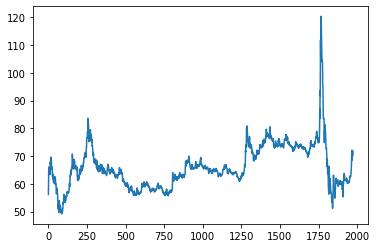
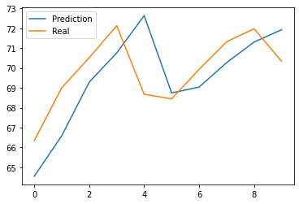
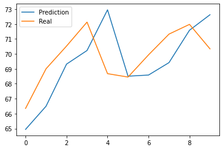
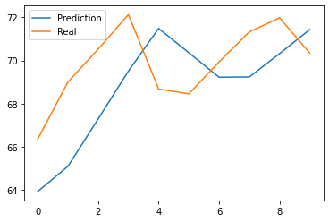
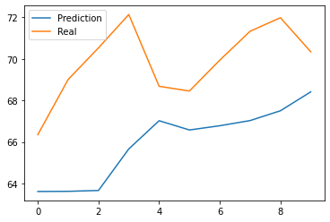
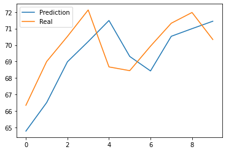
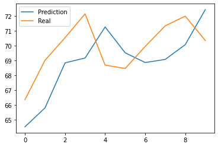

# Модель предсказания курса валюты

По материалам вебинара SkillBox. 2-ой день.

## Загрузка данных


```python
import pandas as pd

start_date = '01/01/2015'  # Начальная дата для загрузки
end_date = '31/12/2022'  # Конечная дата для загрузки

url = f'https://www.cbr.ru/scripts/XML_dynamic.asp?date_req1={start_date}&date_req2={end_date}&VAL_NM_RQ=R01235'  # Закачка данных с сайта ЦБ
df = pd.read_xml(url)  # Данные в DF
print(df.to_string(max_rows=6, max_cols=25))  # Проверка того, что загрузилось
```

                Date      Id  Nominal    Value
    0     01.01.2015  R01235        1  56,2376
    1     13.01.2015  R01235        1  62,7363
    2     14.01.2015  R01235        1  64,8425
    ...          ...     ...      ...      ...
    1970  29.12.2022  R01235        1  71,3261
    1971  30.12.2022  R01235        1  71,9778
    1972  31.12.2022  R01235        1  70,3375
    


```python
from numpy import float64

rate = df.Value  # Колонку в pandas.series
rate = rate.str.replace(',', '.')  # Замена запятой на точку
rate = rate.astype("float64")  # Смена типа со str на float
rate.head(5)
```


    0    56.2376
    1    62.7363
    2    64.8425
    3    66.0983
    4    64.8337
    Name: Value, dtype: float64


```python
rate.plot()
```


    <matplotlib.axes._subplots.AxesSubplot at 0x7f0a3973d880>


    

    


## Подготовка данных для тренировки и теста


```python
past: int = 28  # Для обучения будем брать данные за 4 недели из прошлого
# Будем пытаться на их основе спрогнозировать курс на завтра
length: int = len(rate)  # Всего дней с данными
count: int = length - past  # Всего выборка для обучения
print(f' Рассматриваем с {past} по {length} день, всего {count} дней')
```

     Рассматриваем с 28 по 1973 день, всего 1945 дней
    


```python
past_days = []
current_day =[]
for day in range(past, length):
    slc = list(rate[(day-past):day])  # Срез выборки rate[0:29] для day = 28
    past_days.append(slc)  # Добавление среза в список
    current_day.append(rate[day])  # Добавление в словарь дня
    # current_day.append(rate[day:day+7])  # Предсказание на семь дней вперед
```


```python
past_columns = []
for i in range(past):
    past_columns.append(f'past_{i}')
x = pd.DataFrame(data=past_days, columns=past_columns)  # То на основе чего мы делаем предсказание
x.head(3)
```


  <div id="df-b5da2dc8-c8eb-4ba4-90ff-f3c620a43865">
    <div class="colab-df-container">
      <div>
<style scoped>
    .dataframe tbody tr th:only-of-type {
        vertical-align: middle;
    }

    .dataframe tbody tr th {
        vertical-align: top;
    }

    .dataframe thead th {
        text-align: right;
    }
</style>
<table border="1" class="dataframe">
  <thead>
    <tr style="text-align: right;">
      <th></th>
      <th>past_0</th>
      <th>past_1</th>
      <th>past_2</th>
      <th>past_3</th>
      <th>past_4</th>
      <th>past_5</th>
      <th>past_6</th>
      <th>past_7</th>
      <th>past_8</th>
      <th>past_9</th>
      <th>...</th>
      <th>past_18</th>
      <th>past_19</th>
      <th>past_20</th>
      <th>past_21</th>
      <th>past_22</th>
      <th>past_23</th>
      <th>past_24</th>
      <th>past_25</th>
      <th>past_26</th>
      <th>past_27</th>
    </tr>
  </thead>
  <tbody>
    <tr>
      <th>0</th>
      <td>56.2376</td>
      <td>62.7363</td>
      <td>64.8425</td>
      <td>66.0983</td>
      <td>64.8337</td>
      <td>65.1738</td>
      <td>64.9732</td>
      <td>64.9862</td>
      <td>65.5558</td>
      <td>65.4000</td>
      <td>...</td>
      <td>65.4470</td>
      <td>68.6113</td>
      <td>66.0432</td>
      <td>65.7817</td>
      <td>65.4469</td>
      <td>66.0585</td>
      <td>66.0994</td>
      <td>65.0862</td>
      <td>62.6632</td>
      <td>62.8353</td>
    </tr>
    <tr>
      <th>1</th>
      <td>62.7363</td>
      <td>64.8425</td>
      <td>66.0983</td>
      <td>64.8337</td>
      <td>65.1738</td>
      <td>64.9732</td>
      <td>64.9862</td>
      <td>65.5558</td>
      <td>65.4000</td>
      <td>63.3930</td>
      <td>...</td>
      <td>68.6113</td>
      <td>66.0432</td>
      <td>65.7817</td>
      <td>65.4469</td>
      <td>66.0585</td>
      <td>66.0994</td>
      <td>65.0862</td>
      <td>62.6632</td>
      <td>62.8353</td>
      <td>62.4001</td>
    </tr>
    <tr>
      <th>2</th>
      <td>64.8425</td>
      <td>66.0983</td>
      <td>64.8337</td>
      <td>65.1738</td>
      <td>64.9732</td>
      <td>64.9862</td>
      <td>65.5558</td>
      <td>65.4000</td>
      <td>63.3930</td>
      <td>65.5937</td>
      <td>...</td>
      <td>66.0432</td>
      <td>65.7817</td>
      <td>65.4469</td>
      <td>66.0585</td>
      <td>66.0994</td>
      <td>65.0862</td>
      <td>62.6632</td>
      <td>62.8353</td>
      <td>62.4001</td>
      <td>62.1307</td>
    </tr>
  </tbody>
</table>
<p>3 rows × 28 columns</p>
</div>
      <button class="colab-df-convert" onclick="convertToInteractive('df-b5da2dc8-c8eb-4ba4-90ff-f3c620a43865')"
              title="Convert this dataframe to an interactive table."
              style="display:none;">

  <svg xmlns="http://www.w3.org/2000/svg" height="24px"viewBox="0 0 24 24"
       width="24px">
    <path d="M0 0h24v24H0V0z" fill="none"/>
    <path d="M18.56 5.44l.94 2.06.94-2.06 2.06-.94-2.06-.94-.94-2.06-.94 2.06-2.06.94zm-11 1L8.5 8.5l.94-2.06 2.06-.94-2.06-.94L8.5 2.5l-.94 2.06-2.06.94zm10 10l.94 2.06.94-2.06 2.06-.94-2.06-.94-.94-2.06-.94 2.06-2.06.94z"/><path d="M17.41 7.96l-1.37-1.37c-.4-.4-.92-.59-1.43-.59-.52 0-1.04.2-1.43.59L10.3 9.45l-7.72 7.72c-.78.78-.78 2.05 0 2.83L4 21.41c.39.39.9.59 1.41.59.51 0 1.02-.2 1.41-.59l7.78-7.78 2.81-2.81c.8-.78.8-2.07 0-2.86zM5.41 20L4 18.59l7.72-7.72 1.47 1.35L5.41 20z"/>
  </svg>
      </button>

  <style>
    .colab-df-container {
      display:flex;
      flex-wrap:wrap;
      gap: 12px;
    }

    .colab-df-convert {
      background-color: #E8F0FE;
      border: none;
      border-radius: 50%;
      cursor: pointer;
      display: none;
      fill: #1967D2;
      height: 32px;
      padding: 0 0 0 0;
      width: 32px;
    }

    .colab-df-convert:hover {
      background-color: #E2EBFA;
      box-shadow: 0px 1px 2px rgba(60, 64, 67, 0.3), 0px 1px 3px 1px rgba(60, 64, 67, 0.15);
      fill: #174EA6;
    }

    [theme=dark] .colab-df-convert {
      background-color: #3B4455;
      fill: #D2E3FC;
    }

    [theme=dark] .colab-df-convert:hover {
      background-color: #434B5C;
      box-shadow: 0px 1px 3px 1px rgba(0, 0, 0, 0.15);
      filter: drop-shadow(0px 1px 2px rgba(0, 0, 0, 0.3));
      fill: #FFFFFF;
    }
  </style>

      <script>
        const buttonEl =
          document.querySelector('#df-b5da2dc8-c8eb-4ba4-90ff-f3c620a43865 button.colab-df-convert');
        buttonEl.style.display =
          google.colab.kernel.accessAllowed ? 'block' : 'none';

        async function convertToInteractive(key) {
          const element = document.querySelector('#df-b5da2dc8-c8eb-4ba4-90ff-f3c620a43865');
          const dataTable =
            await google.colab.kernel.invokeFunction('convertToInteractive',
                                                     [key], {});
          if (!dataTable) return;

          const docLinkHtml = 'Like what you see? Visit the ' +
            '<a target="_blank" href=https://colab.research.google.com/notebooks/data_table.ipynb>data table notebook</a>'
            + ' to learn more about interactive tables.';
          element.innerHTML = '';
          dataTable['output_type'] = 'display_data';
          await google.colab.output.renderOutput(dataTable, element);
          const docLink = document.createElement('div');
          docLink.innerHTML = docLinkHtml;
          element.appendChild(docLink);
        }
      </script>
    </div>
  </div>


```python
y = pd.Series(current_day, name='target')  # То что мы пытаемся предсказать
y.head(3)
```


    0    62.4001
    1    62.1307
    2    61.7235
    Name: target, dtype: float64


```python
# Обучающая выборка
x_train = x[:-10]  
y_train = y[:-10]
```


```python
# Тестовая выборка, Экзамен
x_test = x[-10:]
y_test = y[-10:]
```

## Линейная регрессия


```python
from sklearn.linear_model import LinearRegression  # https://scikit-learn.org/stable/modules/classes.html
from sklearn.metrics import mean_absolute_error
from sklearn.metrics import r2_score

lr_model = LinearRegression()
lr_model.fit(x_train, y_train)  # Тренировка модели
```


    LinearRegression()


```python
prediction = lr_model.predict(x_test)  # Создание предсказаний

pred_df = pd.DataFrame({
                        'true': y_test,
                        'pred': prediction
                        })
print(pred_df.to_string(max_rows=10, max_cols=2))  # 
```

             true       pred
    1935  66.3474  64.545974
    1936  69.0037  66.589027
    1937  70.5256  69.287724
    1938  72.1306  70.759895
    1939  68.6760  72.638328
    1940  68.4487  68.743086
    1941  69.9346  69.041653
    1942  71.3261  70.270089
    1943  71.9778  71.308103
    1944  70.3375  71.928958
    


```python
import matplotlib.pyplot as plt
```


```python
# Без использования срезов для подгонки (возможно в расчетах ошибка или поменялись данные с момента обучения)
plt.plot(list(prediction), label='Prediction') 
plt.plot(list(y_test), label='Real')
plt.legend()

lr_mae = mean_absolute_error(prediction, y_test)  # Средняя абсолютная ошибка для данных
lr_r2 = r2_score(y_test, prediction)  # Коэффициент детерминации
print(f'Средняя абсолютная ошибка: {lr_mae=:.3f}. Коэффициент детерминации: {lr_r2=:.3f}')
```

    Средняя абсолютная ошибка: lr_mae=1.529. Коэффициент детерминации: lr_r2=-0.146
    


    

    


```python
# Определение важности колонок
imp = pd.Series(list(lr_model.coef_), name='importances')
cols = pd.Series(past_columns, name='columns')
df = pd.DataFrame(cols)
df['imp'] = imp
df.tail(3)
```


  <div id="df-bbd0f329-e0ce-47a8-9e80-9ca133be12c9">
    <div class="colab-df-container">
      <div>
<style scoped>
    .dataframe tbody tr th:only-of-type {
        vertical-align: middle;
    }

    .dataframe tbody tr th {
        vertical-align: top;
    }

    .dataframe thead th {
        text-align: right;
    }
</style>
<table border="1" class="dataframe">
  <thead>
    <tr style="text-align: right;">
      <th></th>
      <th>columns</th>
      <th>imp</th>
    </tr>
  </thead>
  <tbody>
    <tr>
      <th>25</th>
      <td>past_25</td>
      <td>0.110071</td>
    </tr>
    <tr>
      <th>26</th>
      <td>past_26</td>
      <td>-0.102672</td>
    </tr>
    <tr>
      <th>27</th>
      <td>past_27</td>
      <td>1.071976</td>
    </tr>
  </tbody>
</table>
</div>
      <button class="colab-df-convert" onclick="convertToInteractive('df-bbd0f329-e0ce-47a8-9e80-9ca133be12c9')"
              title="Convert this dataframe to an interactive table."
              style="display:none;">

  <svg xmlns="http://www.w3.org/2000/svg" height="24px"viewBox="0 0 24 24"
       width="24px">
    <path d="M0 0h24v24H0V0z" fill="none"/>
    <path d="M18.56 5.44l.94 2.06.94-2.06 2.06-.94-2.06-.94-.94-2.06-.94 2.06-2.06.94zm-11 1L8.5 8.5l.94-2.06 2.06-.94-2.06-.94L8.5 2.5l-.94 2.06-2.06.94zm10 10l.94 2.06.94-2.06 2.06-.94-2.06-.94-.94-2.06-.94 2.06-2.06.94z"/><path d="M17.41 7.96l-1.37-1.37c-.4-.4-.92-.59-1.43-.59-.52 0-1.04.2-1.43.59L10.3 9.45l-7.72 7.72c-.78.78-.78 2.05 0 2.83L4 21.41c.39.39.9.59 1.41.59.51 0 1.02-.2 1.41-.59l7.78-7.78 2.81-2.81c.8-.78.8-2.07 0-2.86zM5.41 20L4 18.59l7.72-7.72 1.47 1.35L5.41 20z"/>
  </svg>
      </button>

  <style>
    .colab-df-container {
      display:flex;
      flex-wrap:wrap;
      gap: 12px;
    }

    .colab-df-convert {
      background-color: #E8F0FE;
      border: none;
      border-radius: 50%;
      cursor: pointer;
      display: none;
      fill: #1967D2;
      height: 32px;
      padding: 0 0 0 0;
      width: 32px;
    }

    .colab-df-convert:hover {
      background-color: #E2EBFA;
      box-shadow: 0px 1px 2px rgba(60, 64, 67, 0.3), 0px 1px 3px 1px rgba(60, 64, 67, 0.15);
      fill: #174EA6;
    }

    [theme=dark] .colab-df-convert {
      background-color: #3B4455;
      fill: #D2E3FC;
    }

    [theme=dark] .colab-df-convert:hover {
      background-color: #434B5C;
      box-shadow: 0px 1px 3px 1px rgba(0, 0, 0, 0.15);
      filter: drop-shadow(0px 1px 2px rgba(0, 0, 0, 0.3));
      fill: #FFFFFF;
    }
  </style>

      <script>
        const buttonEl =
          document.querySelector('#df-bbd0f329-e0ce-47a8-9e80-9ca133be12c9 button.colab-df-convert');
        buttonEl.style.display =
          google.colab.kernel.accessAllowed ? 'block' : 'none';

        async function convertToInteractive(key) {
          const element = document.querySelector('#df-bbd0f329-e0ce-47a8-9e80-9ca133be12c9');
          const dataTable =
            await google.colab.kernel.invokeFunction('convertToInteractive',
                                                     [key], {});
          if (!dataTable) return;

          const docLinkHtml = 'Like what you see? Visit the ' +
            '<a target="_blank" href=https://colab.research.google.com/notebooks/data_table.ipynb>data table notebook</a>'
            + ' to learn more about interactive tables.';
          element.innerHTML = '';
          dataTable['output_type'] = 'display_data';
          await google.colab.output.renderOutput(dataTable, element);
          const docLink = document.createElement('div');
          docLink.innerHTML = docLinkHtml;
          element.appendChild(docLink);
        }
      </script>
    </div>
  </div>


## Случайный лес (регрессия)


```python
from sklearn.ensemble import RandomForestRegressor

rf_model = RandomForestRegressor(n_estimators=200, max_depth=10)
rf_model.fit(x_train, y_train)
prediction = rf_model.predict(x_test)
plt.plot(list(prediction), label='Prediction') 
plt.plot(list(y_test), label='Real')
plt.legend()

rf_mae = mean_absolute_error(prediction, y_test)  # Средняя абсолютная ошибка для данных
rf_r2 = r2_score(y_test, prediction)  # Коэффициент детерминации
print(f'Средняя абсолютная ошибка: {rf_mae=:.3f}. Коэффициент детерминации: {rf_r2=:.3f}')
```

    Средняя абсолютная ошибка: rf_mae=1.730. Коэффициент детерминации: rf_r2=-0.469
    


    

    


```python
# Определение важности колонок
imp = pd.Series(list(rf_model.feature_importances_), name='importances')
cols = pd.Series(past_columns, name='columns')
df = pd.DataFrame(cols)
df['imp'] = imp
df.tail(3)
```


  <div id="df-270a531b-e744-451e-af4b-19bc49f7a1d6">
    <div class="colab-df-container">
      <div>
<style scoped>
    .dataframe tbody tr th:only-of-type {
        vertical-align: middle;
    }

    .dataframe tbody tr th {
        vertical-align: top;
    }

    .dataframe thead th {
        text-align: right;
    }
</style>
<table border="1" class="dataframe">
  <thead>
    <tr style="text-align: right;">
      <th></th>
      <th>columns</th>
      <th>imp</th>
    </tr>
  </thead>
  <tbody>
    <tr>
      <th>25</th>
      <td>past_25</td>
      <td>0.002862</td>
    </tr>
    <tr>
      <th>26</th>
      <td>past_26</td>
      <td>0.044708</td>
    </tr>
    <tr>
      <th>27</th>
      <td>past_27</td>
      <td>0.935052</td>
    </tr>
  </tbody>
</table>
</div>
      <button class="colab-df-convert" onclick="convertToInteractive('df-270a531b-e744-451e-af4b-19bc49f7a1d6')"
              title="Convert this dataframe to an interactive table."
              style="display:none;">

  <svg xmlns="http://www.w3.org/2000/svg" height="24px"viewBox="0 0 24 24"
       width="24px">
    <path d="M0 0h24v24H0V0z" fill="none"/>
    <path d="M18.56 5.44l.94 2.06.94-2.06 2.06-.94-2.06-.94-.94-2.06-.94 2.06-2.06.94zm-11 1L8.5 8.5l.94-2.06 2.06-.94-2.06-.94L8.5 2.5l-.94 2.06-2.06.94zm10 10l.94 2.06.94-2.06 2.06-.94-2.06-.94-.94-2.06-.94 2.06-2.06.94z"/><path d="M17.41 7.96l-1.37-1.37c-.4-.4-.92-.59-1.43-.59-.52 0-1.04.2-1.43.59L10.3 9.45l-7.72 7.72c-.78.78-.78 2.05 0 2.83L4 21.41c.39.39.9.59 1.41.59.51 0 1.02-.2 1.41-.59l7.78-7.78 2.81-2.81c.8-.78.8-2.07 0-2.86zM5.41 20L4 18.59l7.72-7.72 1.47 1.35L5.41 20z"/>
  </svg>
      </button>

  <style>
    .colab-df-container {
      display:flex;
      flex-wrap:wrap;
      gap: 12px;
    }

    .colab-df-convert {
      background-color: #E8F0FE;
      border: none;
      border-radius: 50%;
      cursor: pointer;
      display: none;
      fill: #1967D2;
      height: 32px;
      padding: 0 0 0 0;
      width: 32px;
    }

    .colab-df-convert:hover {
      background-color: #E2EBFA;
      box-shadow: 0px 1px 2px rgba(60, 64, 67, 0.3), 0px 1px 3px 1px rgba(60, 64, 67, 0.15);
      fill: #174EA6;
    }

    [theme=dark] .colab-df-convert {
      background-color: #3B4455;
      fill: #D2E3FC;
    }

    [theme=dark] .colab-df-convert:hover {
      background-color: #434B5C;
      box-shadow: 0px 1px 3px 1px rgba(0, 0, 0, 0.15);
      filter: drop-shadow(0px 1px 2px rgba(0, 0, 0, 0.3));
      fill: #FFFFFF;
    }
  </style>

      <script>
        const buttonEl =
          document.querySelector('#df-270a531b-e744-451e-af4b-19bc49f7a1d6 button.colab-df-convert');
        buttonEl.style.display =
          google.colab.kernel.accessAllowed ? 'block' : 'none';

        async function convertToInteractive(key) {
          const element = document.querySelector('#df-270a531b-e744-451e-af4b-19bc49f7a1d6');
          const dataTable =
            await google.colab.kernel.invokeFunction('convertToInteractive',
                                                     [key], {});
          if (!dataTable) return;

          const docLinkHtml = 'Like what you see? Visit the ' +
            '<a target="_blank" href=https://colab.research.google.com/notebooks/data_table.ipynb>data table notebook</a>'
            + ' to learn more about interactive tables.';
          element.innerHTML = '';
          dataTable['output_type'] = 'display_data';
          await google.colab.output.renderOutput(dataTable, element);
          const docLink = document.createElement('div');
          docLink.innerHTML = docLinkHtml;
          element.appendChild(docLink);
        }
      </script>
    </div>
  </div>


```python
# Линейная регрессия с нормализацией
lr_model_normalize = LinearRegression(normalize=True)
lr_model_normalize.fit(x_train, y_train)
prediction = lr_model_normalize.predict(x_test)
plt.plot(list(prediction), label='Prediction') 
plt.plot(list(y_test), label='Real')
plt.legend()

lrn_mae = mean_absolute_error(prediction, y_test)  # Средняя абсолютная ошибка для данных
lrn_r2 = r2_score(y_test, prediction)  # Коэффициент детерминации
print(f'Средняя абсолютная ошибка: {lrn_mae=:.3f}. Коэффициент детерминации: {lrn_r2=:.3f}')
```

    /usr/local/lib/python3.8/dist-packages/sklearn/linear_model/_base.py:141: FutureWarning: 'normalize' was deprecated in version 1.0 and will be removed in 1.2.
    If you wish to scale the data, use Pipeline with a StandardScaler in a preprocessing stage. To reproduce the previous behavior:
    
    from sklearn.pipeline import make_pipeline
    
    model = make_pipeline(StandardScaler(with_mean=False), LinearRegression())
    
    If you wish to pass a sample_weight parameter, you need to pass it as a fit parameter to each step of the pipeline as follows:
    
    kwargs = {s[0] + '__sample_weight': sample_weight for s in model.steps}
    model.fit(X, y, **kwargs)
    
    
      warnings.warn(
    

    Средняя абсолютная ошибка: lrn_mae=1.529. Коэффициент детерминации: lrn_r2=-0.146
    


    

    


## Нейронная сеть


```python
from sklearn.neural_network import MLPRegressor  # Нейронная сеть


mlp_model = MLPRegressor(max_iter=1000, hidden_layer_sizes=(200, 200, 200))
mlp_model.fit(x_train, y_train)
prediction = mlp_model.predict(x_test)
plt.plot(list(prediction), label='Prediction') 
plt.plot(list(y_test), label='Real')
plt.legend()

MLP_mae = mean_absolute_error(prediction, y_test)  # Средняя абсолютная ошибка для данных
MLP_r2 = r2_score(y_test, prediction)  # Коэффициент детерминации
print(f'Средняя абсолютная ошибка: {MLP_mae=:.3f}. Коэффициент детерминации: {MLP_r2=:.3f}')
```

    Средняя абсолютная ошибка: MLP_mae=2.248. Коэффициент детерминации: MLP_r2=-1.038
    


    

    


## K-ближайших соседей


```python
from sklearn.neighbors import KNeighborsRegressor
```


```python
# К соседних точек
knn_model = KNeighborsRegressor(n_neighbors=10)
knn_model.fit(x_train, y_train)
prediction = knn_model.predict(x_test)
plt.plot(list(prediction), label='Prediction') 
plt.plot(list(y_test), label='Real')
plt.legend()

KN_mae = mean_absolute_error(prediction, y_test)  # Средняя абсолютная ошибка для данных
KN_r2 = r2_score(y_test, prediction)  # Коэффициент детерминации
print(f'Средняя абсолютная ошибка: {KN_mae=:.3f}. Коэффициент детерминации: {KN_r2=:.3f}')
```

    Средняя абсолютная ошибка: KN_mae=3.885. Коэффициент детерминации: KN_r2=-5.359
    


    

    


## Градиентный спуск


```python
from sklearn.ensemble import GradientBoostingRegressor  # GradientBoostingRegressor


gb_model = GradientBoostingRegressor(n_estimators=1000)
gb_model.fit(x_train, y_train)
prediction = gb_model.predict(x_test)
plt.plot(list(prediction), label='Prediction') 
plt.plot(list(y_test), label='Real')
plt.legend()

GB_mae = mean_absolute_error(prediction, y_test)  # Средняя абсолютная ошибка для данных
GB_r2 = r2_score(y_test, prediction)  # Коэффициент детерминации
print(f'Средняя абсолютная ошибка: {GB_mae=:.3f}. Коэффициент детерминации: {GB_r2=:.3f}')
```

    Средняя абсолютная ошибка: GB_mae=1.557. Коэффициент детерминации: GB_r2=0.017
    


    

    


```python
# Определение важности колонок
imp = pd.Series(list(gb_model.feature_importances_), name='importances')
cols = pd.Series(past_columns, name='columns')
df = pd.DataFrame(cols)
df['imp'] = imp
df.tail(3)
```


  <div id="df-cccc48cf-34e4-45e0-adf6-f8a04016a1ae">
    <div class="colab-df-container">
      <div>
<style scoped>
    .dataframe tbody tr th:only-of-type {
        vertical-align: middle;
    }

    .dataframe tbody tr th {
        vertical-align: top;
    }

    .dataframe thead th {
        text-align: right;
    }
</style>
<table border="1" class="dataframe">
  <thead>
    <tr style="text-align: right;">
      <th></th>
      <th>columns</th>
      <th>imp</th>
    </tr>
  </thead>
  <tbody>
    <tr>
      <th>25</th>
      <td>past_25</td>
      <td>0.001363</td>
    </tr>
    <tr>
      <th>26</th>
      <td>past_26</td>
      <td>0.041306</td>
    </tr>
    <tr>
      <th>27</th>
      <td>past_27</td>
      <td>0.939005</td>
    </tr>
  </tbody>
</table>
</div>
      <button class="colab-df-convert" onclick="convertToInteractive('df-cccc48cf-34e4-45e0-adf6-f8a04016a1ae')"
              title="Convert this dataframe to an interactive table."
              style="display:none;">

  <svg xmlns="http://www.w3.org/2000/svg" height="24px"viewBox="0 0 24 24"
       width="24px">
    <path d="M0 0h24v24H0V0z" fill="none"/>
    <path d="M18.56 5.44l.94 2.06.94-2.06 2.06-.94-2.06-.94-.94-2.06-.94 2.06-2.06.94zm-11 1L8.5 8.5l.94-2.06 2.06-.94-2.06-.94L8.5 2.5l-.94 2.06-2.06.94zm10 10l.94 2.06.94-2.06 2.06-.94-2.06-.94-.94-2.06-.94 2.06-2.06.94z"/><path d="M17.41 7.96l-1.37-1.37c-.4-.4-.92-.59-1.43-.59-.52 0-1.04.2-1.43.59L10.3 9.45l-7.72 7.72c-.78.78-.78 2.05 0 2.83L4 21.41c.39.39.9.59 1.41.59.51 0 1.02-.2 1.41-.59l7.78-7.78 2.81-2.81c.8-.78.8-2.07 0-2.86zM5.41 20L4 18.59l7.72-7.72 1.47 1.35L5.41 20z"/>
  </svg>
      </button>

  <style>
    .colab-df-container {
      display:flex;
      flex-wrap:wrap;
      gap: 12px;
    }

    .colab-df-convert {
      background-color: #E8F0FE;
      border: none;
      border-radius: 50%;
      cursor: pointer;
      display: none;
      fill: #1967D2;
      height: 32px;
      padding: 0 0 0 0;
      width: 32px;
    }

    .colab-df-convert:hover {
      background-color: #E2EBFA;
      box-shadow: 0px 1px 2px rgba(60, 64, 67, 0.3), 0px 1px 3px 1px rgba(60, 64, 67, 0.15);
      fill: #174EA6;
    }

    [theme=dark] .colab-df-convert {
      background-color: #3B4455;
      fill: #D2E3FC;
    }

    [theme=dark] .colab-df-convert:hover {
      background-color: #434B5C;
      box-shadow: 0px 1px 3px 1px rgba(0, 0, 0, 0.15);
      filter: drop-shadow(0px 1px 2px rgba(0, 0, 0, 0.3));
      fill: #FFFFFF;
    }
  </style>

      <script>
        const buttonEl =
          document.querySelector('#df-cccc48cf-34e4-45e0-adf6-f8a04016a1ae button.colab-df-convert');
        buttonEl.style.display =
          google.colab.kernel.accessAllowed ? 'block' : 'none';

        async function convertToInteractive(key) {
          const element = document.querySelector('#df-cccc48cf-34e4-45e0-adf6-f8a04016a1ae');
          const dataTable =
            await google.colab.kernel.invokeFunction('convertToInteractive',
                                                     [key], {});
          if (!dataTable) return;

          const docLinkHtml = 'Like what you see? Visit the ' +
            '<a target="_blank" href=https://colab.research.google.com/notebooks/data_table.ipynb>data table notebook</a>'
            + ' to learn more about interactive tables.';
          element.innerHTML = '';
          dataTable['output_type'] = 'display_data';
          await google.colab.output.renderOutput(dataTable, element);
          const docLink = document.createElement('div');
          docLink.innerHTML = docLinkHtml;
          element.appendChild(docLink);
        }
      </script>
    </div>
  </div>


## CatBoostRegressor


```python
!pip install catboost
```

    Looking in indexes: https://pypi.org/simple, https://us-python.pkg.dev/colab-wheels/public/simple/
    Collecting catboost
      Downloading catboost-1.1.1-cp38-none-manylinux1_x86_64.whl (76.6 MB)
         ━━━━━━━━━━━━━━━━━━━━━━━━━━━━━━━━━━━━━━━━ 76.6/76.6 MB 7.1 MB/s eta 0:00:00
    [?25hRequirement already satisfied: plotly in /usr/local/lib/python3.8/dist-packages (from catboost) (5.5.0)
    Requirement already satisfied: matplotlib in /usr/local/lib/python3.8/dist-packages (from catboost) (3.2.2)
    Requirement already satisfied: six in /usr/local/lib/python3.8/dist-packages (from catboost) (1.15.0)
    Requirement already satisfied: numpy>=1.16.0 in /usr/local/lib/python3.8/dist-packages (from catboost) (1.21.6)
    Requirement already satisfied: pandas>=0.24.0 in /usr/local/lib/python3.8/dist-packages (from catboost) (1.3.5)
    Requirement already satisfied: scipy in /usr/local/lib/python3.8/dist-packages (from catboost) (1.7.3)
    Requirement already satisfied: graphviz in /usr/local/lib/python3.8/dist-packages (from catboost) (0.10.1)
    Requirement already satisfied: pytz>=2017.3 in /usr/local/lib/python3.8/dist-packages (from pandas>=0.24.0->catboost) (2022.7)
    Requirement already satisfied: python-dateutil>=2.7.3 in /usr/local/lib/python3.8/dist-packages (from pandas>=0.24.0->catboost) (2.8.2)
    Requirement already satisfied: cycler>=0.10 in /usr/local/lib/python3.8/dist-packages (from matplotlib->catboost) (0.11.0)
    Requirement already satisfied: pyparsing!=2.0.4,!=2.1.2,!=2.1.6,>=2.0.1 in /usr/local/lib/python3.8/dist-packages (from matplotlib->catboost) (3.0.9)
    Requirement already satisfied: kiwisolver>=1.0.1 in /usr/local/lib/python3.8/dist-packages (from matplotlib->catboost) (1.4.4)
    Requirement already satisfied: tenacity>=6.2.0 in /usr/local/lib/python3.8/dist-packages (from plotly->catboost) (8.1.0)
    Installing collected packages: catboost
    Successfully installed catboost-1.1.1
    


```python
from catboost import CatBoostRegressor

cb_model = CatBoostRegressor()
cb_model.fit(x_train, y_train, verbose=False)
prediction = cb_model.predict(x_test)
plt.plot(list(prediction), label='Prediction') 
plt.plot(list(y_test), label='Real')
plt.legend()

cb_mae = mean_absolute_error(prediction, y_test)  # Средняя абсолютная ошибка для данных
cb_r2 = r2_score(y_test, prediction)  # Коэффициент детерминации
print(f'Средняя абсолютная ошибка: {cb_mae=:.3f}. Коэффициент детерминации: {cb_r2=:.3f}')
```

    Средняя абсолютная ошибка: cb_mae=2.069. Коэффициент детерминации: cb_r2=-0.639
    


    

    


```python
print(f'Средняя абсолютная ошибка: {lr_mae=:.3f}. Коэффициент детерминации: {lr_r2=:.3f}')
print(f'Средняя абсолютная ошибка: {rf_mae=:.3f}. Коэффициент детерминации: {rf_r2=:.3f}')
print(f'Средняя абсолютная ошибка: {lrn_mae=:.3f}. Коэффициент детерминации: {lrn_r2=:.3f}')
print(f'Средняя абсолютная ошибка: {MLP_mae=:.3f}. Коэффициент детерминации: {MLP_r2=:.3f}')
print(f'Средняя абсолютная ошибка: {KN_mae=:.3f}. Коэффициент детерминации: {KN_r2=:.3f}')
print(f'Средняя абсолютная ошибка: {GB_mae=:.3f}. Коэффициент детерминации: {GB_r2=:.3f}')
print(f'Средняя абсолютная ошибка: {cb_mae=:.3f}. Коэффициент детерминации: {cb_r2=:.3f}')
```

    Средняя абсолютная ошибка: lr_mae=1.529. Коэффициент детерминации: lr_r2=-0.146
    Средняя абсолютная ошибка: rf_mae=1.730. Коэффициент детерминации: rf_r2=-0.469
    Средняя абсолютная ошибка: lrn_mae=1.529. Коэффициент детерминации: lrn_r2=-0.146
    Средняя абсолютная ошибка: MLP_mae=2.248. Коэффициент детерминации: MLP_r2=-1.038
    Средняя абсолютная ошибка: KN_mae=3.885. Коэффициент детерминации: KN_r2=-5.359
    Средняя абсолютная ошибка: GB_mae=1.557. Коэффициент детерминации: GB_r2=0.017
    Средняя абсолютная ошибка: cb_mae=2.069. Коэффициент детерминации: cb_r2=-0.639
    
