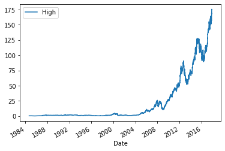
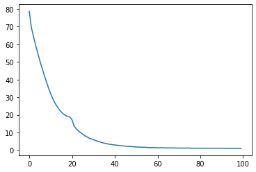
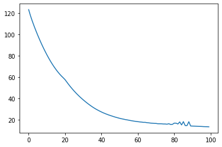
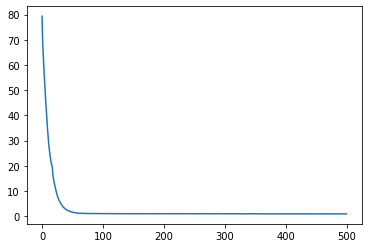
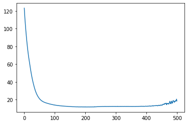
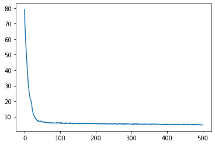

https://www.youtube.com/watch?v=LI94ZkjE_w4&t=1223s  
Александр Ершов


```python
import pandas as pd
from datetime import timedelta
import numpy as np
import tensorflow as tf
from sklearn.preprocessing import StandardScaler
from sklearn.metrics import mean_absolute_error
from matplotlib import pyplot as plt
from typing import List
```


```python
df = pd.read_csv("aapl.us.txt", parse_dates=["Date"])
```


```python
df.shape
```


    (8364, 7)


```python
df.head(5)
```


<div>
<style scoped>
    .dataframe tbody tr th:only-of-type {
        vertical-align: middle;
    }

    .dataframe tbody tr th {
        vertical-align: top;
    }

    .dataframe thead th {
        text-align: right;
    }
</style>
<table border="1" class="dataframe">
  <thead>
    <tr style="text-align: right;">
      <th></th>
      <th>Date</th>
      <th>Open</th>
      <th>High</th>
      <th>Low</th>
      <th>Close</th>
      <th>Volume</th>
      <th>OpenInt</th>
    </tr>
  </thead>
  <tbody>
    <tr>
      <th>0</th>
      <td>1984-09-07</td>
      <td>0.42388</td>
      <td>0.42902</td>
      <td>0.41874</td>
      <td>0.42388</td>
      <td>23220030</td>
      <td>0</td>
    </tr>
    <tr>
      <th>1</th>
      <td>1984-09-10</td>
      <td>0.42388</td>
      <td>0.42516</td>
      <td>0.41366</td>
      <td>0.42134</td>
      <td>18022532</td>
      <td>0</td>
    </tr>
    <tr>
      <th>2</th>
      <td>1984-09-11</td>
      <td>0.42516</td>
      <td>0.43668</td>
      <td>0.42516</td>
      <td>0.42902</td>
      <td>42498199</td>
      <td>0</td>
    </tr>
    <tr>
      <th>3</th>
      <td>1984-09-12</td>
      <td>0.42902</td>
      <td>0.43157</td>
      <td>0.41618</td>
      <td>0.41618</td>
      <td>37125801</td>
      <td>0</td>
    </tr>
    <tr>
      <th>4</th>
      <td>1984-09-13</td>
      <td>0.43927</td>
      <td>0.44052</td>
      <td>0.43927</td>
      <td>0.43927</td>
      <td>57822062</td>
      <td>0</td>
    </tr>
  </tbody>
</table>
</div>


```python
df["Date"].min(), df["Date"].max()
```


    (Timestamp('1984-09-07 00:00:00'), Timestamp('2017-11-10 00:00:00'))


```python
df.plot(x="Date", y="Open")
```


    <matplotlib.axes._subplots.AxesSubplot at 0x7f53f134fc50>


    

    


```python
df.plot(x="Date", y="High")
```


    <matplotlib.axes._subplots.AxesSubplot at 0x7f53f1130390>


    

    


```python
df[["Open", "Close", "Low", "High"]].corr()
```


<div>
<style scoped>
    .dataframe tbody tr th:only-of-type {
        vertical-align: middle;
    }

    .dataframe tbody tr th {
        vertical-align: top;
    }

    .dataframe thead th {
        text-align: right;
    }
</style>
<table border="1" class="dataframe">
  <thead>
    <tr style="text-align: right;">
      <th></th>
      <th>Open</th>
      <th>Close</th>
      <th>Low</th>
      <th>High</th>
    </tr>
  </thead>
  <tbody>
    <tr>
      <th>Open</th>
      <td>1.000000</td>
      <td>0.999902</td>
      <td>0.999942</td>
      <td>0.999956</td>
    </tr>
    <tr>
      <th>Close</th>
      <td>0.999902</td>
      <td>1.000000</td>
      <td>0.999955</td>
      <td>0.999953</td>
    </tr>
    <tr>
      <th>Low</th>
      <td>0.999942</td>
      <td>0.999955</td>
      <td>1.000000</td>
      <td>0.999928</td>
    </tr>
    <tr>
      <th>High</th>
      <td>0.999956</td>
      <td>0.999953</td>
      <td>0.999928</td>
      <td>1.000000</td>
    </tr>
  </tbody>
</table>
</div>


```python
df_6_yr = df[df["Date"] > df["Date"].max() - timedelta(days=365 * 6)]
```


```python
df_6_yr.shape
```


    (1509, 7)


```python
df_6_yr["Date"].min(), df_6_yr["Date"].max()
```


    (Timestamp('2011-11-14 00:00:00'), Timestamp('2017-11-10 00:00:00'))


```python
train_size = int(df_6_yr.shape[0] * 0.8)
train_df = df_6_yr.iloc[:train_size]
val_df = df_6_yr.iloc[train_size:]
```


```python
train_df.shape, val_df.shape
```


    ((1207, 7), (302, 7))


```python
train_df["Date"].min(), train_df["Date"].max(), val_df["Date"].min(), val_df["Date"].max()
```


    (Timestamp('2011-11-14 00:00:00'),
     Timestamp('2016-08-31 00:00:00'),
     Timestamp('2016-09-01 00:00:00'),
     Timestamp('2017-11-10 00:00:00'))


```python
scaler = StandardScaler()
scaler.fit(train_df[["Low"]])

def make_dataset(
    df,
     window_size, 
     batch_size,
     use_scaler=True,
     shuffle=True
     ):
  features = df[["Low"]].iloc[:-window_size]
  if use_scaler:
    features = scaler.transform(features)
  data = np.array(features, dtype=np.float32)
  ds = tf.keras.preprocessing.timeseries_dataset_from_array(
      data=data,
      targets=df["Low"].iloc[window_size:],
      sequence_length=window_size,
      sequence_stride=1,
      shuffle=shuffle,
      batch_size=batch_size)
  return ds
```


```python
example_ds = make_dataset(df=train_df, window_size=3, batch_size=2, use_scaler=False, shuffle=False)
```


```python
example_feature, example_label = next(example_ds.as_numpy_iterator())
```


```python
example_feature.shape

```


    (2, 3, 1)


```python
example_label.shape

```


    (2,)


```python
train_df["Low"].iloc[:6]
```


    6855    48.432
    6856    48.592
    6857    49.217
    6858    48.086
    6859    48.009
    6860    46.860
    Name: Low, dtype: float64


```python
print(example_feature[0])
print(example_label[0])
```

    [[48.432]
     [48.592]
     [49.217]]
    48.086000000000006
    


```python
print(example_feature[1])
print(example_label[1])
```

    [[48.592]
     [49.217]
     [48.086]]
    48.00899999999999
    


```python
window_size = 10
batch_size = 8
train_ds = make_dataset(df=train_df, window_size=window_size, batch_size=batch_size, use_scaler=True, shuffle=True)
val_ds = make_dataset(df=val_df, window_size=window_size, batch_size=batch_size, use_scaler=True, shuffle=True)
```


```python
lstm_model = tf.keras.models.Sequential([
    tf.keras.layers.LSTM(32, return_sequences=False),
    tf.keras.layers.Dense(1)
])
```


```python
def compile_and_fit(model, train_ds, val_ds, num_epochs: int = 20):
  model.compile(
        loss=tf.losses.MeanSquaredError(),
        optimizer=tf.optimizers.Adam(),
        metrics=[tf.metrics.MeanAbsoluteError()]
      )
  history = model.fit(
      train_ds, 
      epochs=num_epochs,
      validation_data=val_ds,
      verbose=0
      )
  return history
```


```python
history =  compile_and_fit(lstm_model, train_ds, val_ds, num_epochs=100)
```


```python
plt.plot(history.history['mean_absolute_error'])
```


    [<matplotlib.lines.Line2D at 0x7f53e8b24210>]


    

    


```python
plt.plot(history.history['val_mean_absolute_error'])
```


    [<matplotlib.lines.Line2D at 0x7f53e99cacd0>]


    

    


```python
lstm_model.evaluate(train_ds)
```

    149/149 [==============================] - 1s 3ms/step - loss: 2.3721 - mean_absolute_error: 1.0391
    


    [2.3721351623535156, 1.039076805114746]


```python
lstm_model.evaluate(val_ds)
```

    36/36 [==============================] - 0s 3ms/step - loss: 304.4482 - mean_absolute_error: 13.4067
    


    [304.4482116699219, 13.406721115112305]


```python
lstm_model = tf.keras.models.Sequential([
    tf.keras.layers.LSTM(32, return_sequences=False),
    tf.keras.layers.Dense(1)
])

history =  compile_and_fit(lstm_model, train_ds, val_ds, num_epochs=500)
```


```python
lstm_model.evaluate(train_ds)
```

    149/149 [==============================] - 1s 3ms/step - loss: 1.8558 - mean_absolute_error: 0.9408
    


    [1.8557802438735962, 0.9408129453659058]


```python
lstm_model.evaluate(val_ds)
```

    36/36 [==============================] - 0s 3ms/step - loss: 599.6119 - mean_absolute_error: 18.5874
    


    [599.6118774414062, 18.587438583374023]


```python
plt.plot(history.history['mean_absolute_error'])
```


    [<matplotlib.lines.Line2D at 0x7f53e93a2890>]


    

    


```python
plt.plot(history.history['val_mean_absolute_error'])
```


    [<matplotlib.lines.Line2D at 0x7f53eb9c0e90>]


    

    


```python
lstm_model = tf.keras.models.Sequential([
    tf.keras.layers.LSTM(32, return_sequences=False),
    tf.keras.layers.Dropout(0.2),
    tf.keras.layers.Dense(1)
])

history =  compile_and_fit(lstm_model, train_ds, val_ds, num_epochs=500)
```


```python
lstm_model.evaluate(train_ds)
```

    149/149 [==============================] - 1s 3ms/step - loss: 3.1646 - mean_absolute_error: 1.3531
    


    [3.164586067199707, 1.3531347513198853]


```python
lstm_model.evaluate(val_ds)
```

    36/36 [==============================] - 0s 3ms/step - loss: 64.5968 - mean_absolute_error: 6.4930
    


    [64.59683227539062, 6.493016242980957]


```python
plt.plot(history.history['mean_absolute_error'])
```


    [<matplotlib.lines.Line2D at 0x7f53ea014490>]


    

    


```python
plt.plot(history.history['val_mean_absolute_error'])
```


    [<matplotlib.lines.Line2D at 0x7f53ea019a10>]


    

    


```python

```
